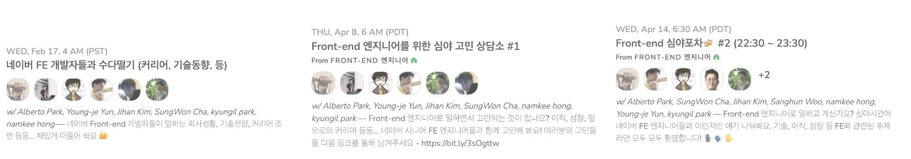
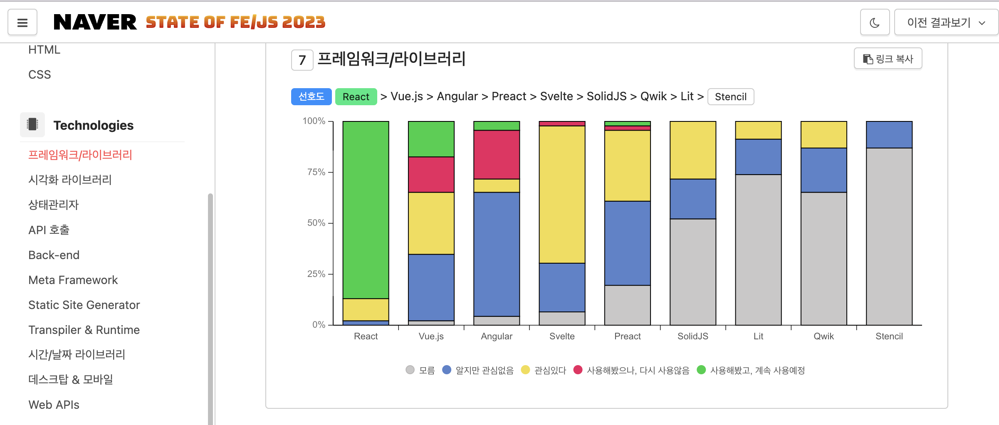
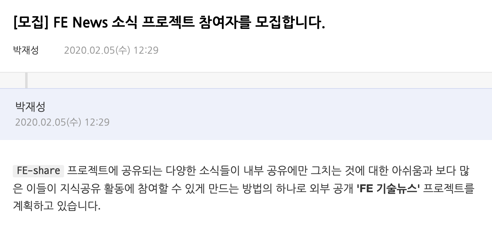
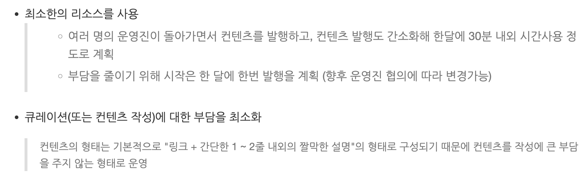

## 오늘 기술 워크샵의 목표

네이버 내에서 진행되는 밋업을 
최대한 유사성 있게 구성, 간접 경험을 전달하기

### 긍정적 "성장" 활동의 <!-- .element: class="m-0" -->
### 전염성 전파하기

----------

## 오늘의 발표는...

성장에 정답 🙅🏻‍♂️, 우리가 잘하고 있다를 전달하는 것도 🙅

- 네이버내에서 진행한 다양한 시도들과 경험을 공유

이러한 시도들이 '우리' 모두에게 도움이 되길 기대하고, 
여러분이 위치한 곳에서도 '시도'가 이뤄지길 바래봅니다.

----------

### 이븐한 성장문화를 위한,
# 3가지 <!-- .element: class="m-0" -->
## 시도들

----------

# 1.<!-- .element: class="m-0" -->
## FE Lounge

매주 카메라 끄고 오직 마이크/스피커만 켜고 자유롭게 공유, 
토론하고 네트워킹하기 위한 목적의 온라인 밋업

----------

## Motivation?
'21년 Clubhouse 인기 - 기술 교류 및 네트워킹 시도

사내 FE 엔지니어들과의 기술 교류 및 네트워킹 위해, 
운영측면의 행사 준비 부담되지 않고, 
청중들도 부담없이 참여할 수 있는 진행 형식 기획

----------

## 숫자로 보는 기록

진행 | 횟수 | 누적 참여자
:---: | :---: | :---:
21/3 ~ 23/6 | 66회 | 2.2k+ 

- 2년 3개월간 진행
- 평균 33명 참여

----------

## 인기 주제들

#### TOP 5
- 우리 퇴사 했어요
- 마크업 개발 이야기
- React의 차세대 상태관리, Jotai 👻
- FE News 22/4월호
- 개발자의 커뮤니케이션 스킬 특강!
 
#### 그외 인기 많았던 주제들 <!-- .element: style="margin-top:50px" -->
- IE 부검 이야기 
- 여러분들이 생각하는 Front-end 대세 기술은 무엇인가요!?
- 나는 어떻게 기술을 선택하나?
- 네이버 FE 개발자를 위한 캡틴판교 (w/FE 기성위) 고민 상담소
- 디자이너 초청 세션 "왜 안되나요?"
- 잘나가는 스타트업의 프로덕트 개발기와 개발자 성장 문화

----------

## 피드백 모음

자네 지금 뭐하는 건가(현타 극복) 
위안이 되는 따뜻한 라디오를 듣는 것 같았어요~! 좋은 발표 감사합니다 😃

FE News 22/9월호 
fe라운지에서 가장 좋아하는 시간입니다!! 
그냥 글을 접하는 것 보다 시니어분께서 한번 되짚어주시면 도움이 많이 되어요.

나는 어떻게 기술을 선택하나? 
새로운 기술을 도입하는 것이 생각보다 굉장히 복잡하고 
어려운 일이라는 사실을 깨닫게 되었습니다.

네이버에서 성장하는 FE 엔지니어란 무엇일까? 
"개발자로서 항상 성장"을 해야 한다는 압박감이 존재하는데요, 
성장을 해야 한다는 것 자체에는 이견이 없지만 어디까지 희생해야 하는 건지에 
항상 고민이 많습니다... 그래서 그 선이 항상 고민이 됩니다. 
그냥 성장이라는 주제로 이런저런 얘기 나누면 특별한 이야기가 오가지 않더라도 
생각이 정리되고 좋은 자리가 되는 것 같습니다.

----------

## 경험 & 배운것

- 제일 어려웠던 점 - 청중 '참여형'을 기획 <!-- .element: class="fragment" -->
  - 참여 독려는 쉽지 않다. 양방향 참여를 기대했지만, 스피커 중심 진행
  - "OOO에 대한 다른 의견을 말씀해 주실분?"라는 질문은 항상 고요함 가득
- 운영 스케줄링 <!-- .element: class="fragment" -->
    - 기간별 운영 담당자(3인)를 선정.
    - 하지만, 모두가 항상 참여하지 못하는 경우 발생 > 누군가 대신 해주어야 함
- 매주 진행 <!-- .element: class="fragment" -->
    - 지금은 다시 못할것 같아요...
- 들었다 놨다 - '피드백' <!-- .element: class="fragment" -->
    - 힘이 나기도 하지만, 힘을 빼기도 함
- 에피소드 <!-- .element: class="fragment" -->
    - 타사 분들 섭외하고 공지까지 했지만, 진행 당일 불참 통보

----------

# 2.<!-- .element: class="m-0" -->
## State of FE/JS <!-- .element: class="m-0" -->
## at Naver
"State of JavaScript"의 네이버(및 관계사) 버전

----------

## 2017~2023

개인 사내 프로젝트로 7년간 진행

### 목표

- 전사 환경 파악, 한해 어떤 영역 집중 필요한지 판단 지표로 활용
- 사내 개발자들의 FE/JS 환경 확인, 도구/환경 선택을 도와주는 역할

    

----------

## 경험 & 배운것

- 한해간 주요 영역에 대한 설문 항목 정리의 어려움 <!-- .element: class="fragment" -->
    - 글로벌 생태계와 국내 생태계는 차이가 존재
- 진행 프로세스 <!-- .element: class="fragment" -->
    - 설문 질문/항목 정리 > 사내 진행 공지 > 답변 정리 > 결과 사이트 제작
    - 설문 질문수 40개+. 참여 부담 > 낮은 응답률
- 얼만큼 유용한걸까? <!-- .element: class="fragment" -->
    - PV 수준만이 집계되기 때문에, 실제 활용도가 드러나지 않는 문제
    - 지속을 위한 동기부여 재료가 부족

🤔 '25년 국내 환경 설문 진행을 고려 
고려로 끝날 수도...

----------

# 3.<!-- .element: class="m-0" -->

https://github.com/naver/fe-news

----------

## 20/2월, 시작

시작은 소박하게

 

발행 5년차 국내 유일 FE 전문 기술뉴스레터

 24/11월 기준,

운영진 | 구독자 | PV
:---: | :---: | :---:
5명 | 5K | 82K (24년)

----------

## 운영 프로세스

- 선정된 월별 담당자의 시선으로 소식을 정리 <!-- .element: class="fragment" -->
  - 다른 운영진은, 몇개의 후보군 글들을 제안
  - 이유? 연차별, 경험적 관점에서     다양성 확보의 필요성
- 코드 리뷰와 같이 매월 '리뷰어'가 소식 PR에 대한 리뷰 <!-- .element: class="fragment" -->
  - 맞춤법/문법/통일된 단어사용 검수
      - ex. FrontEnd, Front-End, Frontend > `Front-end`
  - 표현상의 문제 등
      - ex. 문체는 `펑어체`, 주관적 의견/표현 배제 등
- 소식 발행 <!-- .element: class="fragment" -->
    - GitHub
    - Substack (메일 발송)

> 운영을 통해 누적된 노하우와 세부 가이드를 지속적으로 문서화 <!-- .element: class="fragment cyan" -->

----------

## Pain points

어떤 소식을 큐레이션 할지가 제일 중요 > 퀄리티

- 한달은 매우 짧더라. 6명 기준, 1년에 2회 정도 담당자로 활동 <!-- .element: class="fragment" -->
  - 하지만, 돌아오는 주기가 체감상 너무 빠르다.
- 운영진들의 이탈(퇴사, 업무이슈 등) 발생의 경우, 누군가 바로 대체해야함 <!-- .element: class="fragment" -->
   - 발행일이 지켜지는 것 또한 매체의 신뢰성과 직결된다고 생각
   - 신규 운영진을 합류 시키는 것은 매우 어려운 문제

----------

## 발행 비용?

처음엔 이랬지만... 

- 연속적인 시간으로 환산시 3일+? 수준 <!-- .element: class="fragment" -->
- 하지만, 큐레이션은 한달내내 지속 <!-- .element: class="fragment" -->
    > 무언가 보다가 괜찮아 보이면 킵해두기
- 괜찮은 글을 찾는 과정이 가장 어렵고, 그 다음은 소개글로 요약하는 것 <!-- .element: class="fragment" -->
    - 훑어봤을때 좋아보였는데, 막상 읽어보니 별로인 경우 > 시간 낭비

----------

## 지속 이유?

- 나의 성장을 위한 장치 <!-- .element: class="fragment" -->
    - 현재의 생태계 이슈를 계속 따라가며 성장
    - 오늘날 학습자료는 넘치지만, 집중해 학습하는 것은 너무나 어려운 도전
- 다른이의 성장 돕기 <!-- .element: class="fragment" -->
    - 누군가의 '성장'을 도울 수 있다는 것

> 우리의 노력이 긍정적 영향을 주고, <!-- .element: class="fragment yellow" -->
>  생태계를 위한 선순환 되기를 기대

----------

## 이븐한 성장 문화를 <!-- .element: class="m-0" -->
## 만들기 위해 배운것

운좋게 '네이버'라는 브랜드/테두리로 인해 다양한 시도를 할수 있었다고 생각

- 활동에 공감하는 사람들과 모여 만든 의미있는 결과물
    - 2023, "나는 네이버 프런트엔드 개발자 입니다."
    - 출간 여정기: https://d2.naver.com/helloworld/2275242

### 일단, 작은 것이라도 <!-- .element: class="m-0" style="color:#ecb45a" -->
3### 시작해 보신다면 어떨까요? <!-- .element: class="m-0" style="color:#ecb45a" -->

