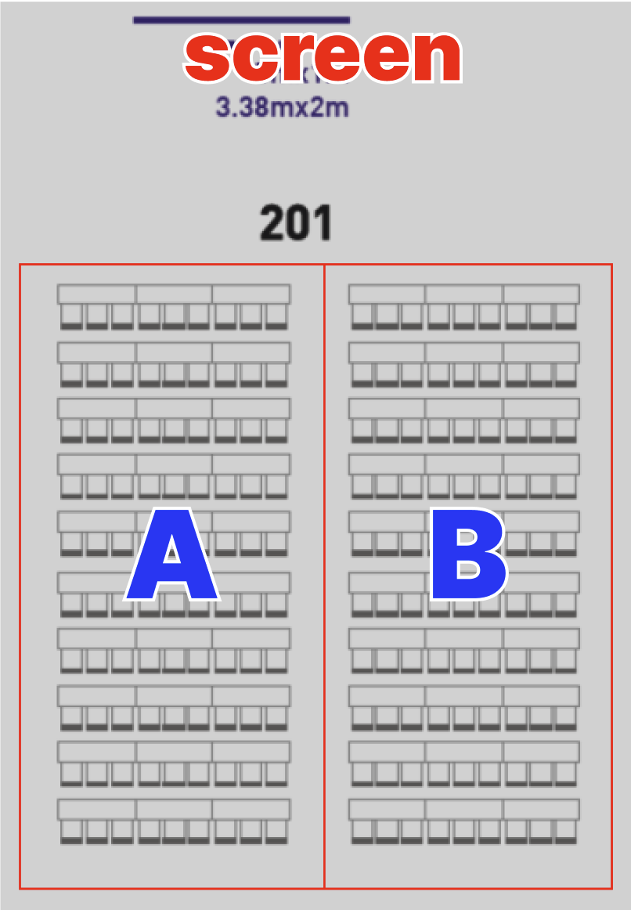

## Timetable

시간 | 주제 | 발표자
--- | --- | ---
15:00~15:20	| 이븐한 네이버 FE 성장문화 (feat. FE News) | 박재성
15:20~15:50	| JSON과 마크업을 연결하기 | 차성원
15:50~16:10	| FE 개발자의 알쓸잡 유니코드 이야기 | 김다현
16:10~16:25	| FE 개발자 vs. 서비스 개발자 | 윤영제
16:25~16:40	| 흑백 요리사로 돌아보는 코드 리뷰 원칙 | 장기효
16:40~17:00 | 패널토론 | 스피커 전원
17:00~17:30 | 네트워킹

    경품 후원사: 
     
     
    

----------

Session 1: 15:00~15:20
## 이븐한 네이버 FE 성장문화
#### feat. 

Do or do not. There is no try.

### 박재성

----------

Session 2: 15:20~15:50
## JSON과 마크업을 연결하기 

아빠는 개발자

### 차성원

----------

Session 3: 15:50~16:10
## FE 개발자의 알쓸잡 유니코드 이야기

세상은 잡부라하지만 
본인은 제너럴리스트라고 주장하는 평범한 시니어 개발자!

### 김다현

----------

Session 4: 16:10~16:25
## FE 개발자 vs. 서비스 개발자

여행과 맥주를 좋아하는 개발자

### 윤영제

----------

Session 5: 16:25~16:40
## 흑백 요리사로 돌아보는 코드 리뷰 원칙

이름은 캡틴판교지만 판교에서 살지는 못합니다. 
(a.k.a 캡틴판교)

### 장기효

----------

# 패널토론

----------

- 왜 Front-end를 선택해야 하는가? <!-- .element: class="fragment" -->
- 성장하는 개발자/일잘러 되기 <!-- .element: class="fragment" -->
- FE가 AI에게 대체될까? <!-- .element: class="fragment" -->
- 디자인시스템은 정말 유용한가? <!-- .element: class="fragment" -->
- FE는 이제 고인걸까? <!-- .element: class="fragment" -->
- React는 영원할까? <!-- .element: class="fragment" -->

----------

# 네트워킹

이야기를 나누고 싶은 섹션으로 이동해 주세요.

- A 섹션
    - 커리어(채용, 성장 등의 관점), 디자인 시스템
    - 🧑🏻‍💻 윤영제 & 장기효
- B 섹션
    - FE 역할(회사,팀별로 다른 FE 역할), 개발문화
    - 👨🏼‍💻 김다현, 차성원, 박재성
