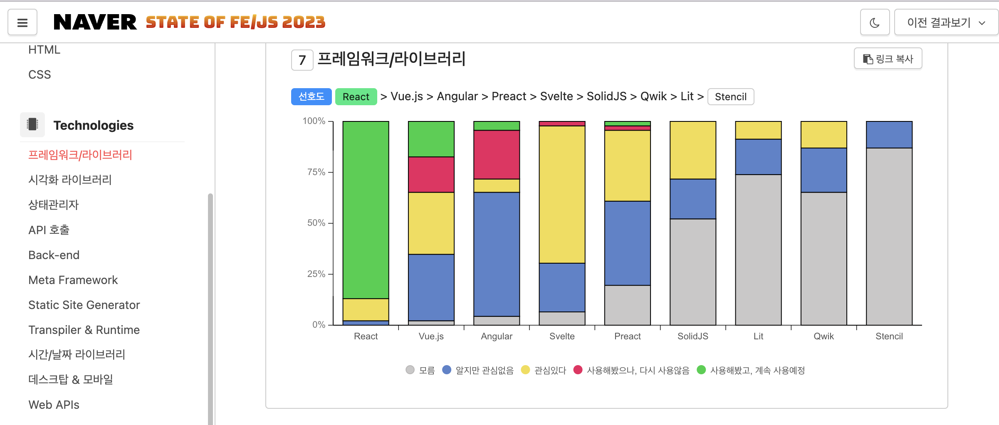
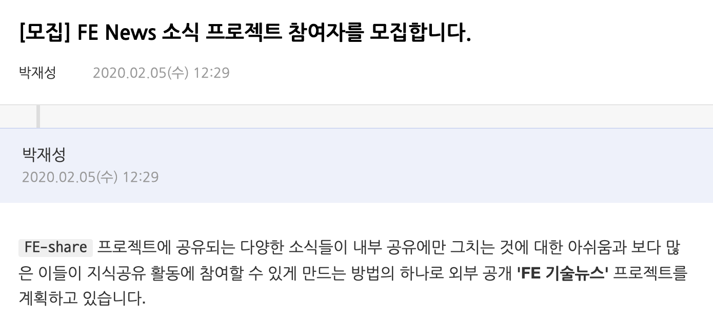

## 오늘의 발표는

성장에 정답은 없고, 이를 위한 기준점을 제시하는 것도 아님

다양한 시도들과 경험을 공유해 여러분들도 '시도'할 수 있도록
이러한 시도들이 '우리' 모두에게 도움이 되길 기대
여러분도 '시도' 할 수 있다는 것

----------

오늘 전체 세션의 목표는 

- 사내에서 진행되는 밋업을 최대한 유사하게 구성해 간접 경험을 전달
- 긍정적 "성장" 활동의 전염성 확산

----------

## 3가지의 시도들

----------

## FE Lounge

카메라 끄고 오직 마이크/스피커만 켜고 자유롭게 공유, 토론하고 네트워킹하기 위한 목적을 갖고 매주 진행되는 온라인 밋업

Clubhouse

진행: 21/3 ~ 23/6
총 66회 진행
누적 참여자: 2.2k

TOP 5 세션
- 우리 퇴사 했어요
- 마크업 개발 이야기
- React의 차세대 상태관리, Jotai 👻
- FE News 22/4월호
- 개발자의 커뮤니케이션 스킬 특강!
 
그외 주제들...
IE 부검 이야기 
여러분들이 생각하는 Front-end 대세 기술은 무엇인가요!?
 
나는 어떻게 기술을 선택하나?
네이버 FE 개발자를 위한 캡틴판교 (w/FE 기성위) 고민 상담소
디자이너 초청 세션 "왜 안되나요?"
잘나가는 스타트업의 프로덕트 개발기와 개발자 성장 문화

----------

## 경험 & 배운것

- 참여 독려는 쉽지 않다. 양방향 참여를 기대했지만, 스피커 중심 진행
- 

----------

State of FE/JS at Naver

2017~2023 

- 전사 환경 파악을 통해, 한해 어떤 영역에서 집중이 필요한지 판단 지표로 활용
- 사내 개발자들의 FE/JS 환경의 확인을 통해 도구/환경 등의 선택을 도와주는 역할

----------

- 한해간 주요 영역에 대한 설문 항목 정리의 어려움
- 설문 질문수가 40개 수준, 참여율 부담 --> 낮음
- 결과 공개만이 아닌 결과 정리와 별도 사이트 제작
- 지표 수집의 어려움ㄷ

----------

# FE News

----------

