## talk is about

지난 3년간의 billboard.js 오픈소스 개발 경험을 통해<br>
다음을 공유하고자 합니다.

- 지속 가능한 OSS 메인터넌스 방법을 찾기 위한 여정
- 범용적 라이브러리 개발시 고려할 부분들과<br>
  여러분의 프로젝트에서 사용할 수 있는 practice 소개
- 오픈소스 개발의 현실적 고려 사항들

----------

## ?

누구나 빠르고 쉽게 웹에서 데이터 시각화를 제공할 수 있게 한다.

- 2017/6 첫 공개된 D3.js 기반 SVG 웹 차트 라이브러리
- 2020 10월 기준, GitHub 4.4K stars
- 선언적 인터페이스 - 총 226개의 옵션과 API를 제공
- 코드 베이스: 13,700 LOC
- 코어 메인테이너: 1명

<p class="reference">
  <a href="https://deview.kr/2017/schedule/191">14일 만에 GitHub 스타 천 개 받은 차트 오픈소스 개발기</a> (2017)
</p>

----------

## 지속적인 성장세

- 20k npm downloads/month (누적 43만+)<br>
  <span class="bold green">8,941(2017)</span> &rarr; 82,147(2018) &rarr; 144,749(2019)<br>
  &rarr; <span class="bold red">20만+(2020)</span> (12월까지 25만+ 예상)
- 200k CDN hits/month


공개 후, 전세계적으로 [40명+ 컨트리뷰터들](https://github.com/naver/billboard.js/blob/master/AUTHORS.txt) 참여

<p class="reference">
  <a href="https://npm-stat.com/charts.html?package=billboard.js&from=2017-06-08">npm donwloads</a>
</p>

----------

## JavaScript Weekly

JS 대표 기술 뉴스레터에 수차례 소개


<p class="reference">
  Issues:
  <a href="https://javascriptweekly.com/issues/338">338</a>,
  <a href="https://javascriptweekly.com/issues/353">353</a>,
  <a href="https://javascriptweekly.com/issues/416">416</a>,
  <a href="https://javascriptweekly.com/issues/428">428</a>,
  <a href="https://javascriptweekly.com/issues/497">497</a>,
  <a href="https://javascriptweekly.com/issues/507">507</a>
</p>

----------

## Examples

<iframe src="https://naver.github.io/billboard.js/demo/" frameborder='no' allowtransparency='true' allowfullscreen='true'>
</iframe>

<p class="reference">
  <a href="https://naver.github.io/billboard.js/demo/">https://naver.github.io/billboard.js/demo/</a>
</p>

----------

### 오픈소스 프로젝트의
## 지속 가능한 메인테이넌스?

#### 방법을 찾기 위한 긴 여정

- 1) 사용자 확보: 누가 사용할까?
- 2) 운영부담 덜어내기: 자동화
- 3) 지속적 신규 기능 개발: 릴리스
- 4) 문서화: API, Wiki, 릴리스 노트

----------

<!-- .slide: data-background-image="./img/bg01.png" -->
### 1) 사용자 확보
# 누가 사용할까?

----------

## 사용자를 알고 싶은 이유?

결국 더 많은 사용자 확보와 프로젝트 발전을 위함

- 주요 검색엔진, 트위터 등을 통한 검색
- Dependents 확인: GitHub, npm

----------

## 전세계 사용자들

<a href="https://www.drupal.org/project/charts"></a>
<a href="https://help.liferay.com/hc/en-us/articles/360018170731-Billboard-js-npm-Portlet-"></a> <a href="https://github.com/layer5io/meshery/blob/master/CONTRIBUTING.md#ui-contribution-flow"></a>


<a href="https://blog.ludus.one/hey-its-been-a-long-time-buddy-bd70a34c7881">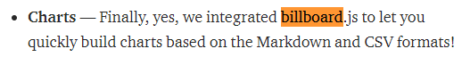</a>
<a href="https://www.reddit.com/r/Frontend/comments/ii1jbn/d3js_versus_chartjs/g3ghflp/">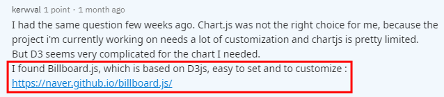</a>

하지만, 수동적인 방법은 한계가 뚜렷

<p class="reference">
  <a href="https://github.com/naver/billboard.js/wiki/Who's-using-billboard.js">Who's using billboard.js</a>
</p>

----------

## 지표를 수집해
### 명확한 사용자를 파악해 보자.

파일이 로딩되면, 호스트를 전송
- [feat(stats): Intent to ship stats](https://github.com/naver/billboard.js/pull/934)

```js
const sendStats = () => {
  if (navigator && localStorage) {
    const key = "$bb.stats";
    const url = `https://www.google-analytics.com/collect?...`;

    ...

    if (navigator.sendBeacon) {
      navigator.sendBeacon(url);
```

----------

## 그러나...

지표 전송 여부를 사용자가 선택(opt-in)하게 할수도 있지만,<br>
자발적인 옵션 활성화는 희박해, 결국 제거


<p class="reference">
  <a href="https://github.com/naver/billboard.js/issues/964">User tracking should be removed or disabled by default</a>
</p>

----------

<!-- .slide: data-background-image="./img/bg02.png" -->
### 2) 운영 부담 덜어내기
# 자동화

----------

## 다양한 릴리스 채널

-   nightly (커밋 기반 일간 릴리스) <!-- .element: style="width:500px" -->
-   latest (stable)
-   next (RC)

정기 릴리스는 매 3개월 주기로 진행

> 당연하지만, 채널이 많을수록<br>  <!-- .element: class="fragment" -->
> 관리 부담도 증가한다.

----------

### 한번의 정식 릴리스를 진행하려면...

1. master 브랜치 에서 x.x.x-rc 브랜치를 생성하고 이동 <!-- .element: class="fragment" -->
2. Package.json에서 차기 버전 정보를 변경 <!-- .element: class="fragment" -->
3. Regression 테스트 & linting 수행 <!-- .element: class="fragment" -->
4. 빌드 및 API doc을 생성 <!-- .element: class="fragment" -->
5. 직전 step에서 생성된 폴더와 변경사항을 commit <!-- .element: class="fragment" -->
6. Changelog를 생성 <!-- .element: class="fragment" -->
7. Tagging 및 upstream에 push <!-- .element: class="fragment" -->
8. GitHub "Draft a new release"를 통해 push된 tag를 새로운 릴리스로 등록 <!-- .element: class="fragment" -->
9. gh-pages에 빌드 파일과 API doc을 deploy <!-- .element: class="fragment" -->
10. 패키징 후, npm publish 수행 <!-- .element: class="fragment" -->

----------

## 릴리스 Workflow

<p class="size18">
  CI와 CD 사이 또는 CI/CD 직전에 사람의 작업(개입)을 필요
</p>


릴리스 작업은 부담과 스트레스를 수반<br>
그냥 커밋만 하면 알아서 릴리스 되었으면...

----------

## semantic-release

<p class="size18">
  패키지 릴리스 워크플로 대부분을 자동화해 주는 도구
</p>

<br>

- 커밋 로그 분석을 통해 자동으로 차기 버저닝 설정
- 커밋 로그 기반의 릴리스 노트 자동생성
- GitHub과 NPM에 자동 배포

<p class="reference">
  <a href="https://github.com/semantic-release">https://github.com/semantic-release</a>
</p>

----------

### Conventional Commits

- 차기 버저닝을 위한 커밋 타입 분석에 사용
- Changelog/release note 생성에 사용


<div style="width:50%;float:left">

```sh

&lt;type>[optional scope]: &lt;description>

[optional body]

[optional footer]


```

</div>
<div>
  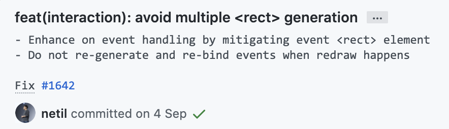
</div>


릴리스 자동화가 아니더라도, 커밋 로그 관리 측면에서 도입을 추천

<p class="reference">
  <a href="https://www.conventionalcommits.org/">https://www.conventionalcommits.org/</a>
</p>

----------

## 릴리스 Trigger

커밋 로그의 type에 따라 릴리스 타입 결정되며,<br>
해당 브랜치에 push 되면 릴리스 workflow가 자동으로 수행

```sh
fix(module): subject  # Patch
feat(module): subject # Minor

perf(module): subject # Major/Breaking

BREAKING CHANGE: The option has been removed.
```

----------

semantic-release는 커밋 로그에 기반해 릴리스 타입(버저닝)을 결정하므로
컨벤션에 따른 커밋 로그를 잘 작성하는게 관건

커밋 로그를 분석하고, 릴리스 타입을 설정


### [ 데모시연 ]

<p class="reference">
  <a href="https://travis-ci.org/naver/billboard.js/jobs/568700732">https://travis-ci.org/naver/billboard.js/jobs/568700732</a>
</p>

----------

## Nightly

Nightly 빌드는 Cron Job을 통해 매일 1회 수행되도록 처리


CI 설정 파일에서 특정 스크립트 수행하도록 구성

<p class="reference">
  <a href="https://docs.travis-ci.com/user/cron-jobs/">https://docs.travis-ci.com/user/cron-jobs/</a>
</p>

----------

### Build Configuration

```yaml
# .travis.yml (TravisCI 설정파일)
before_install:
  - npm install -g npm@latest
  - bash ./config/deploy-nightly.sh setup
...
before_script:
  - npm run lint
script:
  - npm run coverage
after_success:
  - bash ./config/deploy-nightly.sh build
```

```sh
# deploy-nightly.sh (빌드와 deploy 수행)
setup_git() {
    ...
    git checkout nightly

    git config --global merge.ours.driver true
    git merge --strategy-option theirs origin/master
}

build_nightly() {
    ./node_modules/.bin/cross-env NIGHTLY=$VERSION npm run build:production
    ...
}

build_and_commit() {
    build_nightly
    git add ./dist
    git commit -a -m "skip: $VERSION build [skip ci]"
}
```


<p class="reference">
  <a href="https://github.com/naver/billboard.js/blob/nightly/.travis.yml">.travis.yml</a>, 
  <a href="https://github.com/naver/billboard.js/blob/nightly/config/deploy-nightly.sh">deploy-nightly.sh</a>
</p>

----------

## Nightly build commit


<p class="reference">
  <a href="https://github.com/naver/billboard.js/commits/nightly">https://github.com/naver/billboard.js/commits/nightly</a>
</p>

----------

## 자동화 도입 후, 달라진점

릴리스 부담과 스트레스가 감소되었고,<br>
필요할때마다 릴리스를 빠르게 진행

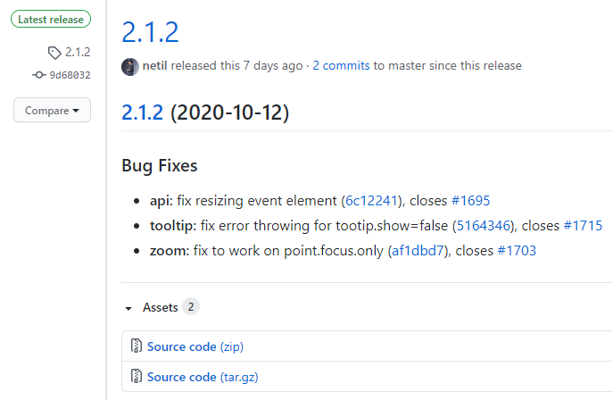

지금까지 총 <span class="size40 red">74번</span>의 릴리스 진행

<p class="reference">
  <a href="https://github.com/naver/billboard.js/releases">https://github.com/naver/billboard.js/releases</a>
</p>

----------

<!-- .slide: data-background-image="./img/bg03.png" -->
### 3) 지속적 기능 개선/발전
# v2 릴리스

프로젝트의 가치와 사용성은<br>
지속적이고 꾸준한 발전에 기반한다.

----------

## v2의 기술적 과제들

- 하위 호환성 유지
- 파일 구조와 아키텍처 개선
- 기존 JS 코드 베이스의 TS 전환
- 더 나은 성능: 실행속도 개선 & 빌드 크기 감소

<p class="reference">
  <a href="https://github.com/naver/billboard.js/wiki/CHANGELOG-v2">https://github.com/naver/billboard.js/wiki/CHANGELOG-v2</a>
</p>

----------

## 성능 개선 #1
#### 불필요 노드 생성을 제어

- [Look for possibility to decrease node generation](https://github.com/naver/billboard.js/issues/36)
- [Too bloated DOM with empty/hidden SVG elements](https://github.com/naver/billboard.js/issues/1288)

ex) Pie 유형 차트를 렌더링할 때,<br>
사용되지 않는 축 관련 노드들도 생성되는 등

<h1 class="fragment">
  <a href="https://github.com/naver/billboard.js/wiki/CHANGELOG-v2#reduced-node-generation">4 ~ 53%</a> 감소
</h1>

----------

## 필요한 노드만을 생성


<p class="reference">
  <a href="https://naver.github.io/billboard.js/demo/benchmark/">Benchmark</a>
</p>

----------

## 성능 개선 #2
#### 모듈화를 통한 번들 크기 감소

<p class="size25">
  모듈화 고민: 모든 차트 생성에 모든 타입의 유형을 사용하지 않기 때문
</p>

- [Full modularization by its functionality](https://github.com/naver/billboard.js/issues/756)

최신 번들러들은 Tree-shaking을 통해 사용되지 않는<br>
코드들은 번들링에서 제외 기능을 제공한다.

<h1 class="fragment">
  <a href="https://github.com/naver/billboard.js/wiki/CHANGELOG-v2#example-of-size-reduction-by-types">10 ~ 43%</a> 감소
</h1>

----------

### 그러나,
## 모듈화는 간단치 않았다.

- 코드 구조 개선의 필요
- 하위 호환성을 해치지 않아야 한다.
- ESM 빌드가 제공되어야 한다.

----------

# 모듈화 고민

<p class="size25">
  기존 구조는 모든 모듈들이 prototype으로 확장되는 형태
</p>

```js
Chart.prototype.resize = function(size) { ... }
```

<p class="size25">
완전한 모듈화를 위해서는 prototype 확장 형태를 변경해야 하나,<br>
하위 호환성 문제와 테스트 등 너무 많은 시간 소요의 문제
</p>

- 기능적/유형별 코드를 그룹핑하고 분리 <!-- .element: class="fragment" -->
- ESM와 UMD 빌드에서 모두 사용할 수 있는 resolver <!-- .element: class="fragment" -->

----------

# Resolver

UMD와 ESM 모두에서 사용 가능한 resolver 작성

```js
import shapeArea from "../../ChartInternal/shape/area";

// extend 수행시 Chart.prototype로 확장
let area = (): string => (
    extend(ChartInternal.prototype, shapeArea),
    (area = () => TYPE.AREA)()
);

export {area, ... }
```

<br>

<div class="fragment" style="width:50%;float:left">

#### UMD
```js
import * as shape from "./config/resolver/shape";

// extends shape modules
Object.keys(shape).forEach(v => shape[v]());
```

</div>
<div class="fragment" style="width:50%;float:left">

#### ESM
```js
// shape module
export bb, {
  area, areaLineRange, bar, pie, radar, ...
} from "./config/resolver/shape";
```


</div>

----------

# 하위 호환성 유지

<ul style="font-size:25px;margin-bottom:25px">
  <li>기존 인터페이스를 해치지 않아야 한다.</li>
  <li>해치는 경우, 마이그레이션 작업은 최소화 되어야 한다.</li>
</ul>

<div style="width:50%;float:left">

#### v1
```js
import bb from "billboard.js";

bb.generate({
  data: {
    type: "line"
  }
});
```

</div>
<div class="fragment fade-up" style="width:50%;float:left">

#### v2
```js
import bb, {line, bar, pie} from "billboard.js";

bb.generate({
  data: {
    type: line()
  }
});
```

</div>

----------

## 빌드 제공

v1.x는 Webpack을 사용해 UMD 빌드를 제공 했으나,<br>
ESM 빌드를 할수 없는 문제

> 2개의 번들러를 사용하는 전략 채택

- UMD: 
- ESM:  Rollup.js

```js
// package.json
scripts: {
  "build:esm": "rollup -c ./config/rollup/esm.js",
  "build:production": "cross-env NODE_ENV=production webpack --output-reporter",
}
```

<p class="reference">
    <a href="https://github.com/naver/billboard.js/tree/master/config/rollup">Rollup 설정</a> / 
    <a href="https://github.com/naver/billboard.js/tree/master/config/webpack">Webpack 설정</a>
</p>

----------

## 성능 개선 #3
#### 실행 성능 개선

이벤트 처리를 위한 노드들을 단일 노드로 변경해<br>
이벤트 바인딩과 차트 크기 변경에 따른 오버헤드 제거

- [Reduce event "&lt;rect>" element generation](https://github.com/naver/billboard.js/issues/1642)

----------

## 이벤트 처리

기존은 x축에 상대적인 다중 `<rect>` 노드를 생성해, 이벤트 바인딩

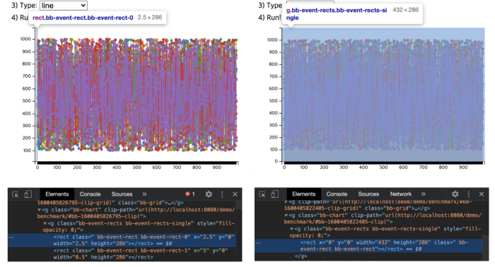

개선된 방식은 단일 이벤트 처리 노드를 생성,<br>
마우스 위치 좌표를 통해 이벤트 처리

----------

## 단일 노드 이벤트 처리


<p class="reference">
  <a href="https://naver.github.io/billboard.js/demo/benchmark/">Benchmark</a>
</p>

----------

<h2 style="margin:0 0 -30px 0">모두의</h2>
<h1>Harmony</h1>

총 <span class="size40 red">226개</span>의 옵션, APIs 및 속성 들이 존재<br>
차트 유형과 옵션들간 조합에 따라 다르게 동작될 수 있다.

> 모든 옵션들이 조화롭게 안정적이면서, 올바른 동작을 유지하게 만드는 것은 매우 도전적인 일

<p class="reference">
  <a href="https://naver.github.io/billboard.js/release/latest/doc/">API doc</a>
</p>

----------

모든 케이스들에 대한 테스트만이 안정성 확보의 유일한 방법

## 테스트, 테스트 그리고 테스트


- 모든 PR에 테스트 코드는 반드시 포함
- 누적된 테스트 == <span class="green fragment fade-up">완성도 & 안정성</span>

<p class="reference">
    <a href="https://travis-ci.org/github/naver/billboard.js/jobs/725432665">https://travis-ci.org/github/naver/billboard.js/jobs/725432665</a><br>
    <a href="https://coveralls.io/github/naver/billboard.js">https://coveralls.io/github/naver/billboard.js</a>
<p>

----------

<!-- .slide: data-background-image="./img/bg01.png" -->
### 4) 문서화
# 예제, API, Wiki,<br>릴리스 노트

기능들을 잘 사용할수 있게 만들고,
새로운 기능들을 홍보한다.

----------

## 예제: REPL

<span class="bold cyan">211</span> 예제를 제공, 직접 코드를 수정하고 실행할 수 있는 REPL

<iframe src="https://naver.github.io/billboard.js/demo/" frameborder="no" allowtransparency="true" allowfullscreen="true">
</iframe>


----------

## API Docs

문서화는 지나침을 강조해도 모자르다.<br>
얼마나 자세히, 정확히, 그리고 세부적으로 작성하는지가 중요

<span class="size18">
  <a href="https://jsdoc.app/">JSDoc</a> 기반의 API 문서 생성
  (<a href="https://github.com/clenemt/docdash">docdash</a> template theme 사용)
</span>

<div style="width:50%;float:left">

```js
	/**
	 * Set color for each data.
	 * @name data․colors
	 * @memberof Options
	 * @type {object}
	 * @default {}
	 * @example
	 * data: {
	 *   colors: {
	 *     data1: "#ff0000",
	 *     data2: function(d) {
	 *        return "#000";
	 *     }
	 *     ...
	 *   }
	 * }
	 */
```

</div>
<div style="width:50%;float:left">
    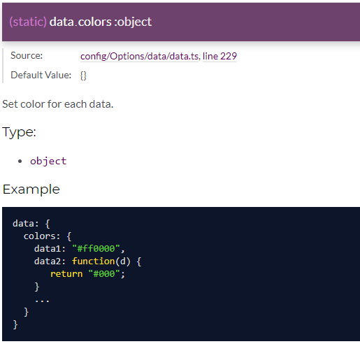
</div>

----------

# Wiki

[Wiki](https://github.com/naver/billboard.js/wiki)를 통해 프로젝트 관련된 다양한 내용을 기술

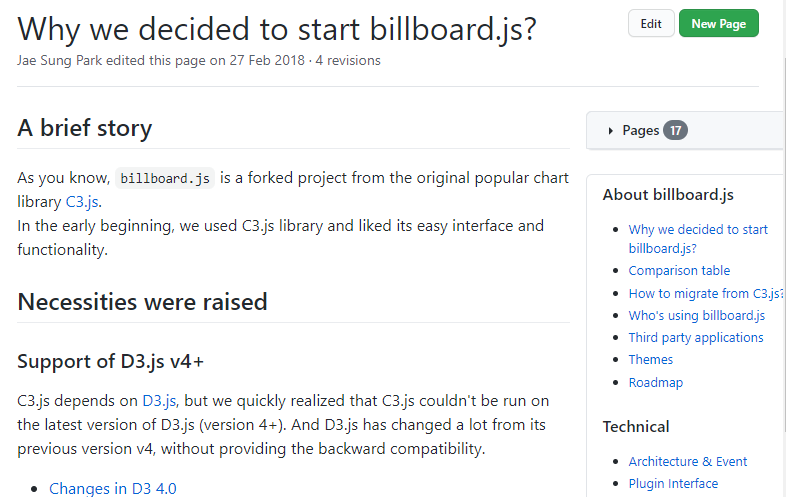


----------

## 릴리스 노트
(부제: 영어 작문 실력의 향상(?))

OSS 생태계의 주요 언어는 영어

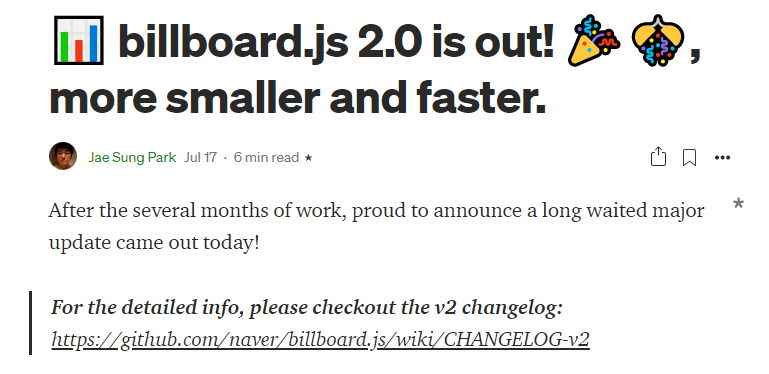

이슈 등록과 답변, 커밋 로그 작성, 릴리스 노트 작성 등
릴리스시 마다 세부적인 기능 추가에 대한 medium글 작성

<p class="reference">
    <a href="https://medium.com/@alberto.park/billboard-js-2-0-is-out-15e84b52ab11">📊 billboard.js 2.0 is out! 🎉🎊, more smaller and faster.</a>
<p>


----------

## 기여를 통한 발전

billboard.js의 많은 기능들은 외부 컨트리뷰션을 통해 이뤄졌다.

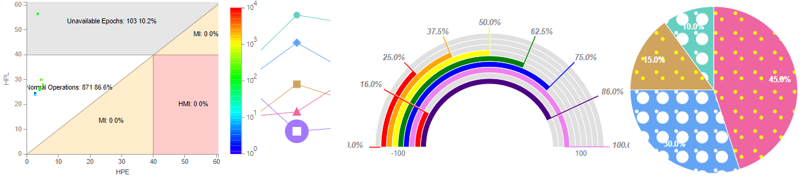

  - 릴리스 자동화: 
    [Semantic-release integration](https://github.com/naver/billboard.js/issues/893)
  - TS definition: 
    [TypeScript support](https://github.com/naver/billboard.js/issues/629)
  - custom 데이터 포인트:<br>
    [Implement alternate markers feature](https://github.com/naver/billboard.js/pull/208)
  - 신규 차트 유형: 
    - [add Multi-Arc-Gauge as gauge type 'multi'](https://github.com/naver/billboard.js/pull/1163)
    - [Stanford Diagrams](https://github.com/naver/billboard.js/pull/829)
  - and more...


----------

# 오픈소스 개발의
# 현실적 고려

(리처드 스)톨먼이형!, 오픈소스 개발은 왜 이래?

[[SOSCON 2018] 오픈소스 개발: Behind the Scenes](http://netil.github.io/slides/oss-behind/)

----------

<!-- .slide: data-background-image="./img/bg02.png" -->
### 참여자 관점에 따라 다른
# '오픈소스'

- 사용자의 입장에서 <!-- .element: class="fragment" -->
- 내가 필요한 것을 얻기 위한 컨트리뷰터의 입장 <!-- .element: class="fragment" -->
- 커미터의 입장 <!-- .element: class="fragment" -->
- 프로젝트 메인테이너의 입장 <!-- .element: class="fragment" -->

> 여러분은 어떤 관점에서 OSS를 바라보시나요? <!-- .element: class="fragment" -->

----------

2020년은

<div class="fragment fade-left">

## Free Software <!-- .element: style="margin:0 0 -10px 0" -->

리처드 스톨먼의 GNU 발표(1983/9)로 부터<br>
<span class="size40 red bold">37</span>년째

</div>
<div class="fragment fade-left">

## Open Source <!-- .element: style="margin:0 0 -10px 0" -->

Open Source(1998) 용어가 정의된 후,<br>
<span class="size40 cyan bold">32</span>년째

</div>

<p class="reference">
  <a href="http://netil.github.io/slides/oss-behind/#/4">오픈소스는 어디에서 왔나?</a>
</p>

----------

## The Good


OSS has taken over the field of software to an astonishing degree.<br>

No programmer or user can avoid touching it. <!-- .element: class="fragment" -->

[Bruce Perens](https://en.wikipedia.org/wiki/Bruce_Perens)

<p class="reference">
  <a href="https://youtu.be/vTsc1m78BUk?list=WL&t=101">What Comes After Open Source</a>
</p>

----------

## The Bad

Open Source has a <span class="bold red">"Begging Problem"</span>

OSS developers write the software that keeps the entire technical world running, but
OSS developers are supplicants. They have to beg.

[Bruce Perens](https://en.wikipedia.org/wiki/Bruce_Perens)

<p class="reference">
  <a href="https://youtu.be/vTsc1m78BUk?list=WL&t=308">What Comes After Open Source</a>
</p>

----------

## The Ugly

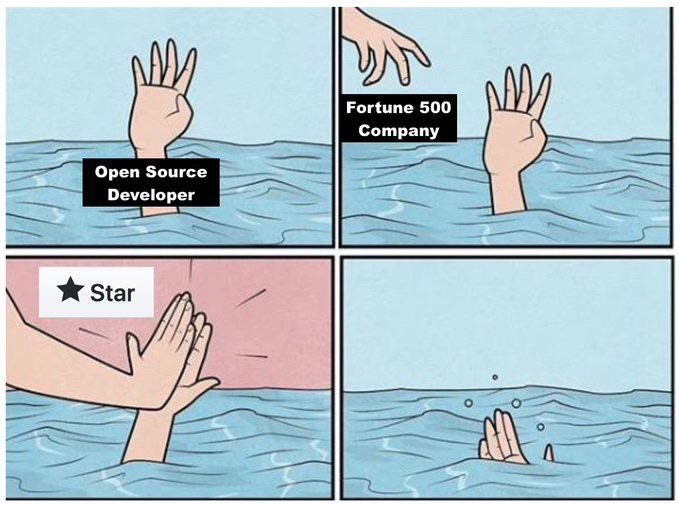

https://twitter.com/JoaoM_23/status/1317166762480328704 <!-- .element: class="size18" -->

----------

## 사례 #1

Amazon에서 OSS를 포크 후, 자사 서비스인<br>
[CloudWatch Synthetics Recorder](https://aws.amazon.com/about-aws/whats-new/2020/10/amazon-cloudwatch-synthetics-launches-recorder-to-generate-user-flow-scripts-for-canaries/)로 공개<br>


https://twitter.com/tim_nolet/status/1317061818574082050 <!-- .element: class="size18" -->

하지만, 아무런 대가나 포크에 대한 아무런 언급하지 않음<br>
트윗 후, credit으로 언급

----------

## 사례 #2

<a href="https://www.oreilly.com/radar/the-business-of-open-source/">The Business of Open Source</a>

<div style="width:50%;float:left">

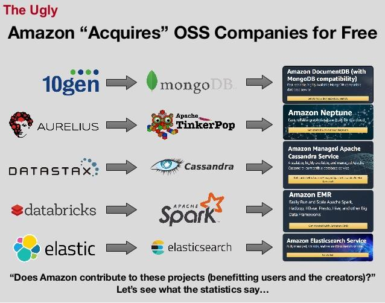
<p class="reference">
  <a href="https://www.slideshare.net/slidarko/mmadt-a-virtual-machinean-economic-machine">mm-ADT: A Virtual Machine/An Economic Machine</a>
</p>

</div>
<div style="padding-top:50px">
  cloud providers have taken the free software without paying (after all, it’s free, that’s the point),
  and offer it in their commercial cloud products “as a service.”
</div>

----------

## Salvatore Sanfilippo

<span class="size25">NoSQL in memory 데이터베이스인 [Redis](https://redis.io/) 개발</span>


<p class="fragment size25">
  Maintaining an open source project is also a lot of joy and fun...<br>
  before of the Redis experience I never worked<br>every week day of my life<br><br>
  Certain people are total assholes...
  in one way or the other you’ll have to confront with these people.
</p>

<p class="reference">
  <a href="http://antirez.com/news/129">The struggles of an open source maintainer</a>
</p>

----------

## Conduct

본인이 해결해야 하는 문제들에 대한 해결책을 요구하며
상용 제품의 고객지원과 같이 당연스럽게 생각하는 경우가 존재

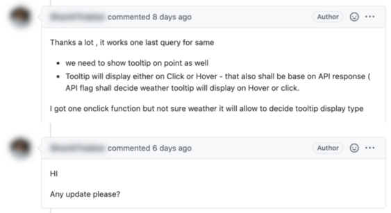

----------

## Alex Ellis

<span class="size25">[OpenFaaS](https://github.com/openfaas/faas) 쿠버네티스에 코드/함수 배포를 도와주는 도구를 개발</span>


<p class="fragment size25">
  It can be extremely lonely as an open source maintainer<br>
  because at the end of the day, there’s only one person<br>
  who’s got their neck on the line, and that’s me.
</p>

<p class="reference">
  <a href="https://github.com/readme/alex-ellis">Balancing open source sacrifice and success</a>
</p>

----------

## TJ Holowaychuk

<span class="size25">Node.js 버전 관리자인 [n](https://github.com/tj/n), [Express.js](https://github.com/expressjs/express/releases/tag/0.0.1)를 개발</span>


<p class="fragment">
  In the end open-source doesn’t pay the bills<br>
  so it’s best to focus on other things if you can.
</p>

<p class="reference">
    <a href="https://qr.ae/pNCP1m">Has TJ Holowaychuk been as prolific in the Golang community as he was in the Node.js community?</a>
</p>

----------

## 메인테이너로써 <!-- .element: style="margin:0 0 -10px 0" -->
## 사용자에게 바라는 것

<ul>
  <li class="fragment fade-up">
    <span class="yellow bold">오픈소스 생태계의 주 언어는 영어</span><br>
    영어가 주로 사용되는 프로젝트에서는 어렵더라도 영어로 이슈를 작성하라.
  </li>
  <li class="fragment fade-up" style="margin:20px 0">
    <span class="green bold">모든 것을 다 해야하는 메인터너는 바쁘다.</span><br>
    단순한 문제 해결까지 요청하기 보단, 기본적 사용방법 문서와 이전 이슈 검색을 하고 없다면 질문
  </li>
  <li class="fragment fade-up">
    <span class="cyan bold">프로젝트가 더 나아질 수 있도록 기여에 적극참여</span><br>
    버그 리포팅, 새로운 기능에 대한 아이디어, PR 등을 통해 본인만이 아닌 다수의 사용자들이 혜택을 볼수 있게 하라.
  </li>
</ul>

----------

## 오픈소스 참여를 통해 <!-- .element: style="margin-bottom:-10px" -->
# 무엇을 얻나?

<ul>
  <li class="fragment fade-up">
    다른이의 코드를 통해 <span class="bold green size40">배우고 성장</span>할 수 있다.
  </li>
  <li class="fragment fade-up">
    다른 세계의 개발자와 협업을 경험할 수 있다.
  </li>
  <li class="fragment fade-up">
    더 나은 세상을 만들 수 있도록 다른 이들을 도울 수 있다.
  </li>
</ul>

----------

## 오픈소스로 부터 혜택을 <!-- .element: style="margin-bottom:-10px" -->
### 받지 않은 개발자는 아무도 없다.

지금까지 여러분의 프로젝트에서 '오픈소스'를<br>
사용하지 않고 개발할 수 있었던 경험이 있으신가요?

----------

### 내가 받았던 도움을 다시 되돌려 주는
# OSS 컨트리뷰션을 시작해 보는것은 어떨까요?
