<!-- .slide: data-background="linear-gradient(90deg, #2acefd 33%, 0, #f87070 67%, #1f77b4 0)" -->
<h1 class="ml1">
  <span class="text-wrapper">
    <span class="line line1"></span>
    <span class="letters">차트란 무엇인가?</span>
    <span class="line line2"></span>
  </span>
</h1>

----------

# 훗 차트, 너란녀석

- 1) 데이터의 시각화 <!-- .element: class="fragment" style="list-style: none" -->
- 2) 차트 라이브러리? 1)의 구현을 위한 도구 <!-- .element: class="fragment" style="list-style:none" -->

> <p class="fragment">그러나 차트의 적용은 무엇일까?<br><span class="size40">결국, 시각화가 기본이다.</span></p>

<div class="fragment">
    <h3><span class="red" style="text-decoration:underline">UI(디자인) + 인터렉션</span><br>구현(적용)이 관건</h3>
</div>

----------

# Charts
## are everywhere

<p style="position:relative;width:700px;height:300px">
    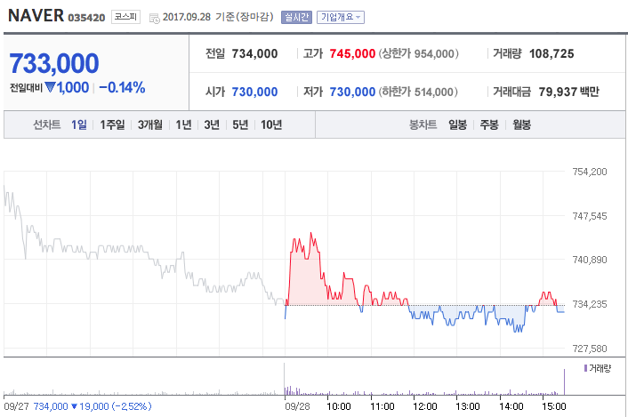
    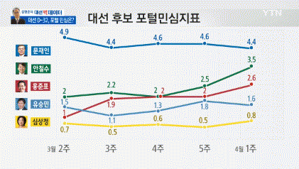
    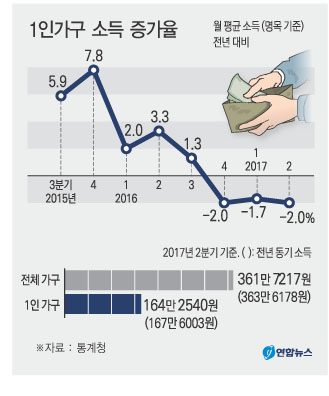
    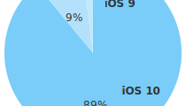
</p>

----------

# 차트 같은걸 끼얹나?

- 차트는 자주 접하지만, 개발은 그렇지 않다.

- 한번 개발(또는 경험)되더라도 지속적인<br>개선 요인이 별로 없어 경험 향상이 어렵다.

----------

## You, 차트 개발 해야함

### 몇 가지의 선택지들 <!-- .element: class="fragment" style="color:#f9dc08" -->
- 직접 개발한다. <!-- .element: class="fragment" -->

- 외부 라이브러리를 사용한다.<br> <!-- .element: class="fragment" -->
  &rarr; 상용 or 오픈소스 <!-- .element: style="list-style: none;text-indent: 10px;" -->

- 어떤 기술을 사용할 것인가?<br> <!-- .element: class="fragment" -->
  &rarr; Vector(SVG) or Bitmap(Canvas) <!-- .element: style="list-style: none;text-indent: 10px;" -->

----------

# 그래, 직접 개발!

Good Luck! 진심으로 행운을 빕니다. <!-- .element: class="fragment"  -->

<p style="font-size:12px" class="fragment">
    <br>
    https://giphy.com/gifs/starwars-star-wars-force-3ohuPdEqZR8tDeuN3O/
</p>

----------

# 역시, 외부 라이브러리!

상용 or 오픈소스?

- 상용 &rarr; 결국 비용의 문제<br> <!-- .element: class="fragment"  -->
  라이센스 비용 부담 (ex. Highcharts 10 developer $3,320)

- 오픈소스 &rarr; 어떤 라이브러를 사용할 것인가?<br> <!-- .element: class="fragment"  -->
  결정의 어려움 (많은 고려요소 필요)

----------

# 다양한 차트 라이브러리

어떤 것을 선택할 것인가?<br>

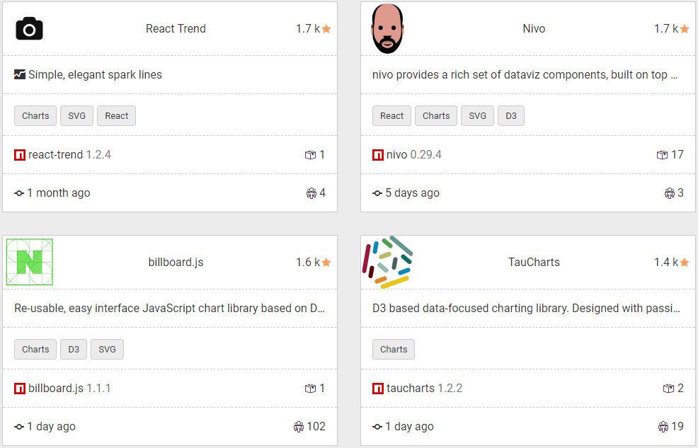

<p class="reference">
    https://bestof.js.org/tags/chart
</p>

----------

# 기술 선택 가이드

- 성능 중요(빠른 대용량 데이터 처리),<br> <!-- .element: class="fragment"  -->
  상대적으로 디자인은 덜 중요한 경우 &rarr; <span class="red">Canvas (비트맵)</span> 

- 디자인 및 요소별 커스터마이징,<br> <!-- .element: class="fragment"  -->
  다양한 해상도(Zoom) 중요 &rarr;  <span class="yellow">SVG (벡터)</span>

<div class="fragment" style="margin-top:-10px">
    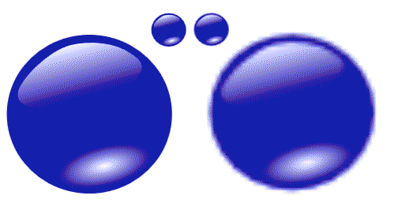
    <p class="reference">
        <a href="https://msdn.microsoft.com/ko-kr/library/gg193983(v=vs.85).aspx">SVG 대 캔버스: 선택 방법</a>
    </p>
</div>

----------

## 영역별 다른 관점,
### 디자인 보단 실시간 변화 표현 중요

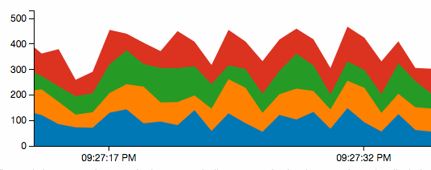

- 대용량 트래픽의 실시간(realtime) 변화 확인 <!-- .element: class="fragment"  -->
- 수치의 변화가 중요. 기본 디자인 사용에 문제 없음 <!-- .element: class="fragment"  -->
- 관리도구 등에 적합. 소수의 참여자(admin) <!-- .element: class="fragment"  -->

----------

## 영역별 다른 관점,
### 엔드 유저대상, 다양한 디자인/UX 중요

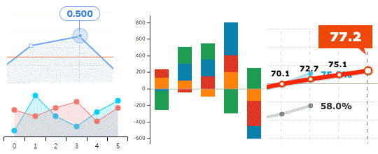

- 주로 정적인 데이터의 시각화 <!-- .element: class="fragment"  -->
- 디자인과 UX 적용의 유연성 필요 <!-- .element: class="fragment"  -->
- 대규모의 불특정 사용자(엔드유저)를 대상 <!-- .element: class="fragment"  -->

----------

# 그간 네이버에서의 차트

#### 서비스들마다 다른 라이브러리를 사용 <!-- .element: class="fragment"  -->
### 그리고 그로 인한 다양한 문제 <!-- .element: class="fragment"  -->

----------

# 문제들

- 기술적 know-how 축적 안됨 <!-- .element: class="fragment"  -->

- 상용 라이브러리 사용시 비용 문제 <!-- .element: class="fragment"  -->

- 경험이 누적되지 않아 차트 적용(디자인/개발)시,<br>매번 반복되는 리소스의 낭비 <!-- .element: class="fragment"  -->

----------

## 물론, 처음엔 자체 개발

### 그러나, 성공적이진 못했다.

- 서비스 적용 이후, 메인터넌스 잘 안됨 <!-- .element: class="fragment"  -->

- 개발 주체의 부재상황(이직 등)<br>또는 다른 서비스 개발 등으로 인한 지원 어려움 <!-- .element: class="fragment"  -->

- 타 라이브러리 대비 범용성 부족 <!-- .element: class="fragment" -->

----------

### 그렇다면
## 오픈소스 사용은 어떨까?

- 지속적 업데이트, 기술적 트렌드 반영, 안정성 등을<br>기대할 수 있으니 합리적이지 않을까? <!-- .element: class="fragment" -->

- 향후 오픈소스 업데이트 지속되지 않을 경우,<br>fork를 통한 유지 고려도 가능 <!-- .element: class="fragment" -->

- 공통된 라이브러리를 사용하면, 각각 다른 라이브러리 사용으로 인한 관리 및 기술경험 누적되지 않는 이슈 해결 기대 <!-- .element: class="fragment" -->

<p class="reference fragment" style="margin-top:30px">
    그간 사용되었던 다양한 차트 라이브러리들:<br>
    [NVD3](http://nvd3.org/), [C3.js](http://c3js.org/), [Chart.js](http://www.chartjs.org/), [Highcharts](https://www.highcharts.com/), [echarts](https://ecomfe.github.io/echarts-doc/public/en/), etc.
</p>

----------

#### 직접 개발도 해봤고,
#### 외부(상용/오픈)의 것도 사용해 봤으니
## 간접적인 형태로 접근해 보자 <!-- .element: class="fragment" -->

- 라이브러리의 발전은 생태계에 맡기자. <!-- .element: class="fragment" -->

- 필요한 기능은 PR을 통해 해결 <!-- .element: class="fragment" -->

- 오픈소스는 일정 수준 검증 되었다. <!-- .element: class="fragment" -->

- 다양한 문서, practice가 존재한다. <!-- .element: class="fragment" -->

----------

# 그래서, 만들다.
### C3.js 확장 라이브러리 개발 <!-- .element: style="color:#50ec50" -->

----------

# C3.js 선정이유

- 가장 인기있는 D3.js 기반 한정 <!-- .element: class="fragment" -->

- Popularity 비교:<br>&rarr; GitHub star, 써드파티 앱, StackOverflow 질문 수, etc. <!-- .element: class="fragment" -->

- 간결한 인터페이스 <!-- .element: class="fragment" -->

- 풍부한 문서, 예제 등<br>&rarr; 구글검색 결과: C3.js(22만) Vs. NVD3(6만4천) <!-- .element: class="fragment" -->

- 네이버 서비스들에서 이미 다수에서 사용 <!-- .element: class="fragment" -->

- 엔드 유저 대상이므로, 디자인/기능 커스터마이징 용이성 중요 <!-- .element: class="fragment" -->

----------

<!-- .slide: data-background="linear-gradient(90deg, #2acefd 33%, 0, #f87070 67%, #1f77b4 0)" -->
<h2 class="ml1">
  <span class="text-wrapper">
    <span class="line line1"></span>
    <span class="letters">차트 개발, 어려운 문제들</span>
    <span class="line line2"></span>
  </span>
</h2>
<h4>고난의 시작</h4>

----------

### 개발시,
## 보편적으로 겪게 되는 문제들

- 커뮤니케이션

- 디자인 & 인터렉션 커스터마이징

그리고 또 그리고 수많은...

----------

# 커뮤니케이션

나의 이름은 무엇 인가요?<br>
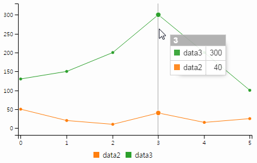

<div class="fragment redbox" style="width:90px;height:70px;top:264px;left:550px;"></div>
<div class="fragment redbox" style="width:30px;height:235px;top:207px;left:259px"></div>
<div class="fragment redbox" style="width:15px;height:15px;top:390px;left:519px;"></div>
<div class="fragment redbox" style="width:30px;height:20px;top:435px;left:355px;"></div>
<div class="fragment redbox" style="width:115px;height:20px;top:460px;left:408px;"></div>

<span class="size25">차트 개발 경험이 많이 없는 경우, 부르는 명칭도 제각각</span>

----------

### 이제, 디자인을 적용해 보자.
# 디자인 가이드

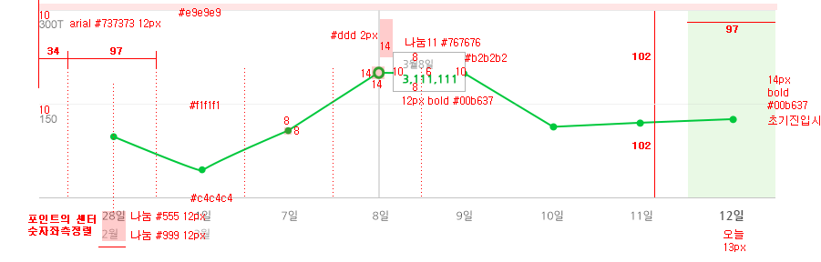

#### 각 요소들의 크기와 위치를 가이드에 맞춰주세요.


----------

# OMG! SVG Text

<svg xmlns="http://www.w3.org/2000/svg" height="100">
  <text x="10" y="50"
        style="font-family: Times New Roman;
               font-size: 50px;
               stroke: #00ff00;
               fill: #0000ff;">
    I'm SVG text
  </text>
</svg>

- 텍스트 스타일링은 가능 <!-- .element: class="fragment" -->

- &lt;br> 같은거 안됨. 줄바꿈은 새로운 노드로 <!-- .element: class="fragment" -->

- 위치(via attributes) 여백 등의 조정이 어려움<br> <!-- .element: class="fragment" -->
  &rarr; transform:translate 또는 &lt;tspan> 사용

----------

## 모바일 환경

C3.js는 모바일 환경 미지원

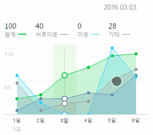

Swipe 제스처를 통한 데이터 확인 UX 필요

----------

## 환경별 다른 이벤트 발생
#### 터치하고 바로 떼었을 때

- iOS 11 (iPhone 7)
  - touchstart &rarr; touchend &rarr; mouseover &rarr; mousemove &rarr; mouseout (포커스 이동되면 발생) <!-- .element: class="fragment" style="list-style:none;font-size:.8em" -->

- Android 7 (Galaxy S8)
  - touchstart &rarr; touchend &rarr; mouseover &rarr; mousemove &rarr; mousedown &rarr; mouseup &rarr; click &rarr; mouseout (포커스 이동되면 발생) <!-- .element: class="fragment" style="list-style:none;font-size:.8em" -->


http://jsbin.com/xiyara

----------

# 최소값

y축 기반 값에 따른 up/down 표현

<iframe src="demo/demo01.html" style="width:44%;min-height:350px" scrolling="no"></iframe>
<iframe src="demo/demo02.html" style="width:44%;min-height:350px" scrolling="no"></iframe>

<p class="size25 no-margin">위의 차트는 모두 동일한 값을 표현하고 있습니다.</p>

----------

### 데이터는 없지만,
## 데이터는 표현해야 한다?

데이터가 0인 경우,<br>
표현이 되어야 할까? 안되어야 할까? <!-- .element: class="fragment" -->
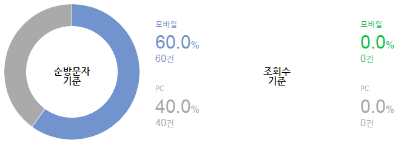 <!-- .element: class="fragment" -->

----------

<!-- .slide: data-background="linear-gradient(90deg, #2acefd 33%, 0, #f87070 67%, #1f77b4 0)" -->
<h1 class="ml1">
  <span class="text-wrapper">
    <span class="line line1"></span>
    <span class="letters">C3+</span>
    <span class="line line2"></span>
  </span>
</h1>
<h4>C3.js 확장 라이브러리</h4>

----------

<div class="title-animate">
    <div><h1>C3+?</h1></div>
    <div><p>
        C3.js를 확장한 테마 형태의 디자인 차트 생성
    </p></div>
</div>

### C3.js: 확장 + 기능 보완 + 테마 <!-- .element: class="fragment" -->

- 커스텀 축 지원 <!-- .element: class="fragment" -->
- 범례 템플릿 <!-- .element: class="fragment" -->
- 모바일 지원 <!-- .element: class="fragment" -->
- 테마를 통한 차트 생성 <!-- .element: class="fragment" -->
- 확장 옵션 <!-- .element: class="fragment" -->

----------

# 블로그/포스트 통계 적용

- [[네이버 블로그] 블로그 통계가 새로워졌습니다!](http://blogpeople.blog.me/220730678589)
- [[네이버 포스트] 훨씬 좋아진 통계, 지금 제공합니다!](http://post.naver.com/viewer/postView.nhn?volumeNo=4423938)

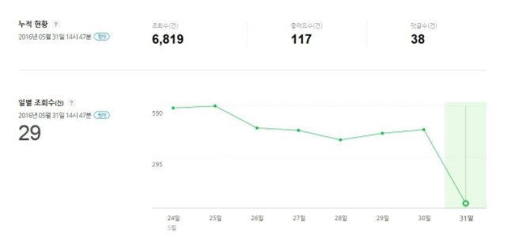

----------

<!-- .slide: data-background="#daa655" -->
<div class="title-animate">
    <div><h1>C3+ Goal</h1></div>
</div>

- 매번 다른 기술/라이브러리를 다루는<br>반복적인 비용 제거 <!-- .element: class="fragment" -->

- 기본적 디자인(테마)을 활용해<br>커스터마이징(디자인)에 따른 비용 제거 <!-- .element: class="fragment" -->

- 기술적 경험 축적: SVG, D3, C3.js <!-- .element: class="fragment" -->

----------

## but, 현실적 문제직면

장기적 관점에서, C3+ 발전을 위해 외부 공개 목표

## 하지만,

- 래퍼/애드온 형태의 지속적 발전과 효용성 의문 <!-- .element: class="fragment" -->

- 기반 라이브러리인 C3.js 지속성 의문 <!-- .element: class="fragment" -->

<p class="fragment" style="font-size:30px;border-top: solid 2px;border-bottom: solid 2px;padding: 15px 0;">
    오픈소스의 발전에 기댈 수 있을 것이란 기대는<br>
    <span class="size40 red">C3.js의 더딘 발전(또는 중단?)으로 위기 직면</span>
</p>

----------


<p class="size40">
    Re-usable, easy interface JavaScript chart library based on D3 v4+
</p>

----------

# 차트를 만들어 봅시다.

----------

## Step 1
# 파일을 로딩 합니다.

<pre><code class="xml">&lt;!-- D3.js를 로딩 -->
&lt;script src="https://d3js.org/d3.v4.min.js">&lt;/script>

&lt;!-- billboard.js와 기본 스타일을 로딩 -->
&lt;script src="billboard.js">&lt;/script>
&lt;link rel="stylesheet" href="billboard.css">
</code></pre>

----------

## Step 2
## 차트가 노출될<br>
## 영역을 설정합니다.

```html
<div id="chart"></div>
```

----------

### Step 3
### 옵션과 함께 차트를 생성합니다.

Declarative API

<pre><code class="javascript" style="font-size:1em;line-height:1.2;">bb.generate({
    bindto: "#chart",
    data: {
        columns: [
            ["data1", 30, 200, 100, 400, 150, 250],
            ["data2", 100, 80, 130, 240, 350, 90],
            ["data3", 150, 120, 58, 135, 258, 159]
        ],
        type: "bar",
        colors: {
            data1: "#2acefd",
            data2: "#f87070",
            data3: "#1f77b4"
        },
        labels: true
    }
});</code></pre>

----------

# 짠!

<iframe src="demo/demo03.html" style="width:80%;min-height:500px" scrolling="no"></iframe>

----------

# 커스터마이징의 용이성

<ul>
    <li>
        150개 이상의 [다양한 옵션](https://naver.github.io/billboard.js/release/latest/doc/Options.html) 제공
    </li>
    <li>
        SVG 노드: 필요한 경우, 직접 핸들링 가능<br>
        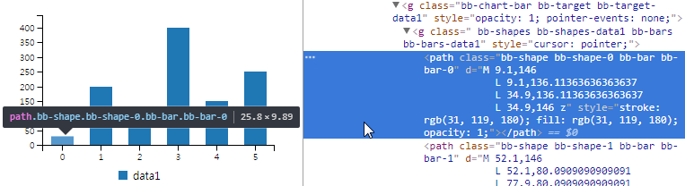
    </li> 
    <li>
        CSS로 스타일링 가능<br>
        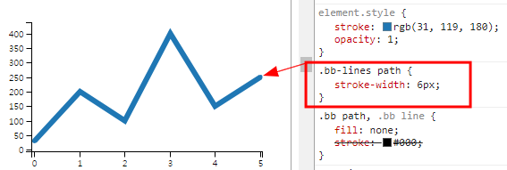
    </li>
</ul> 

----------

<!-- .slide: data-background="linear-gradient(90deg, #2acefd 33%, 0, #f87070 67%, #1f77b4 0)" -->
<h2 class="ml1">
  <span class="text-wrapper">
    <span class="line line1"></span>
    <span class="letters">The unknown way to</span>
    <span class="line line2"></span>
  </span>
</h2>
<h4>fork에서 공개까지</h4>

----------

# C3.js 프로젝트 참여 시도

원 개발자 및 커미터에게 메일을 통한 문의
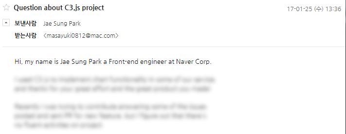

----------

# 일단 활동하자

PR도 보내고 이슈들에 대한 답변도 하고

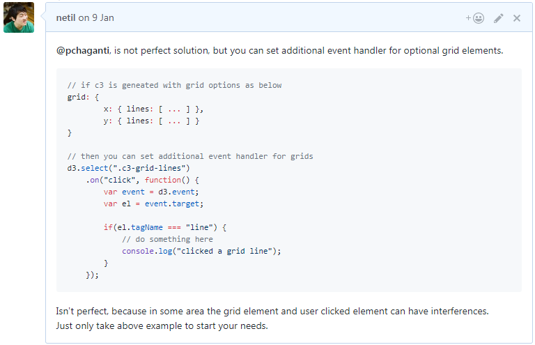

<p class="reference">
    https://github.com/c3js/c3/issues/1924#issuecomment-271224192
</p>

----------

## 그렇게 몇 주가 흘렀지만
### 메일 회신도 없고, <!-- .element: class="fragment" -->
#### 프로젝트 activity도 딱히 없는 상태... <!-- .element: class="fragment" -->

----------

# 공개적 문의

issue를 등록해 공개적으로 프로젝트 유지 문의

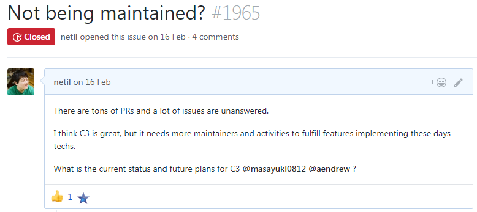

<p class="reference">
    https://github.com/c3js/c3/issues/1965
</p>

----------

## 그리고, 그 다음날

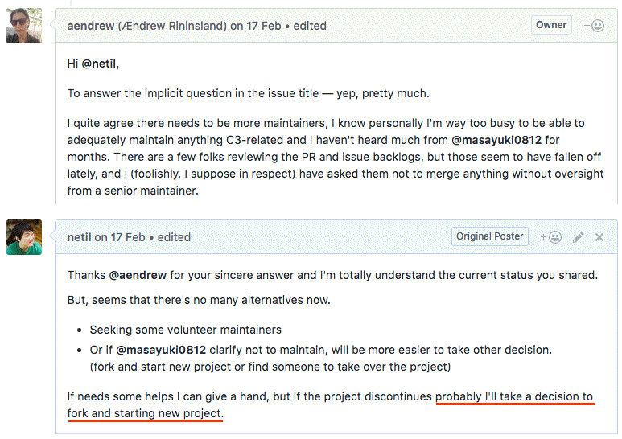

----------

# 그래, Fork 하자

<p class="fragment">
    '<span class="yellow">향후 오픈소스의 업데이트 지속 안될 경우,<br>fork를 통한 유지</span>'의 명제
</p>

당면한 C3.js의 미해결 과제들: <!-- .element: class="fragment" style="text-decoration:underline" -->
 
- D3 최신버전 v4+ 미지원 <!-- .element: class="fragment" -->
- 모바일 환경에 대한 지원 부족 <!-- .element: class="fragment" -->
- 오래된 개발 스타일 코드 (ES3) <!-- .element: class="fragment" -->
- SVG polyfill 제거 <!-- .element: class="fragment" -->
- 등등... <!-- .element: class="fragment" -->

----------

# 합리성, 당위성 & 신뢰

- Fork 한다고 해서 사용자가 오진 않는다. <!-- .element: class="fragment" -->

- 기존 커뮤니티에 당위성이 제시 필요 <!-- .element: class="fragment" -->

- 과연 이 사람(개발자)이 믿을만 한가? <!-- .element: class="fragment" -->

----------

<!-- .slide: data-background="linear-gradient(90deg, #2acefd 33%, 0, #f87070 67%, #1f77b4 0)" -->
<h1 class="ml1">
  <span class="text-wrapper">
    <span class="line line1"></span>
    <span class="letters">The journey</span>
    <span class="line line2"></span>
  </span>
</h1>
<h4>Going from D3 v3 to v4<br>within two months</h4>

----------

# Oops~, D3 v4

- v3 &rarr; v4: Breaking Changes<br>
공식 문서([Changes in D3 4.0](https://github.com/d3/d3/blob/master/CHANGES.md)) 있으나,<br>
마이그레이션 가이드 없고 만들지 않을거임.
  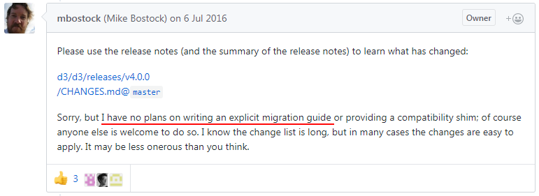

<p class="reference" style="margin-top:10px">
    https://github.com/d3/d3/issues/2893<br>
    [D3 V4 - What's new?](https://iros.github.io/d3-v4-whats-new/)
</p>

----------

# D3 v4로 업그레이드

변경된 모듈에 대한 목록을 모두 작성<br>
  
| v3 | v4 |
| --- | --- |
| d3.time.scale | d3.scaleTime |
| d3.svg.line() | d3.line |
| d3.behavior.drag | d3.drag |

<p style="margin:-10px 0 20px">...</p>
  
- 모듈의 behavior 변경되어, 기존과 유사한 것도 있지만<br>다르게 처리되는 것들이 대다수

- 이전 버전과 변경된 문서를 읽고 비교하고, 테스트 하고...

----------

# 그외 작업들

- 차트 생성 흐름에 따른 오류들의 순차적 해결/변환

- ES3 &rarr; ES6로 전환 병행 및 개발 환경 변경

- API 문서화 ([JSDoc](http://usejsdoc.org/))

- 테스트 코드 업데이트(d3 v4 호환) 및 커버리지 개선

----------

# Release 3주전
### Yay~!, 이제 끝이 보인다.

----------

# 어느 날, 갑자기 두둥~

<div class="fragment" style="margin-top:50px">
    갑작스러운 C3.js 차기 릴리즈 계획과 새로운 커미터 추가
  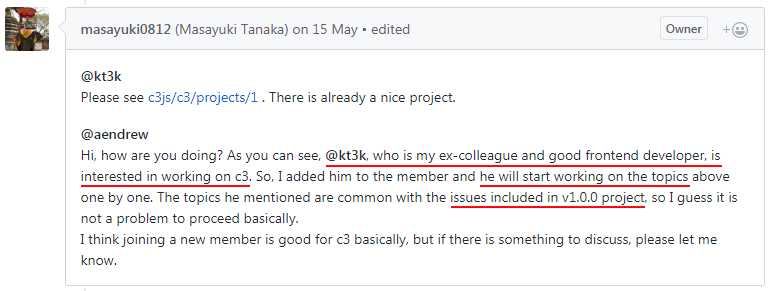

    <p class="reference">
        https://github.com/c3js/c3/issues/2033
    </p>
</div>

----------

# 고민

### 이미 많은 진전을 통해 릴리즈를 앞둔상황

- 계획만을 통한 발전에 대한 의문 <!-- .element: class="fragment" -->

- 커미터 추가 후에도 활발한 활동 없어,<br>빠른 시일 내 D3 v4 지원 어렵다는 판단 <!-- .element: class="fragment" -->

<p class="fragment" style="width:90%;padding-left:10%">
    
    <span style="color:#2acefd;margin-top:5px;font-size:2em;text-shadow: 1px 1px 2px black, 0 0 1em blue, 0 0 0.2em blue;">계획대로<br>릴리즈 하자.</span>
</p>

----------

# 오픈소스 네이밍

원래는 C3+ 2.0으로 계획, 그러나 C3.js 연관성의 부정적 의견

<div>
    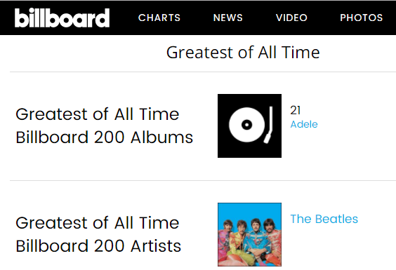
    <ul style="margin-top:70px">
        <li>'billboard'는 음악 차트</li>
        <li>의미는 다르지만 '차트'를 연관</li>
        <li>오랫동안 친숙한 이름</li>
    </ul>
</div>

<div class="c_both fragment">
    <br>FE 프로젝트에서는 기 등록된 npm 모듈명 확인 필요
    <p class="reference" style="padding-top:20px">
        [Open Source Project Name Checker](http://ivantomic.com/projects/ospnc/)
    </p>
</div>

----------

# Release!

2017년 6월8일, v1.0.0 공개

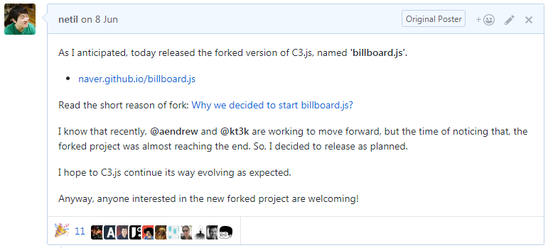

----------

#### 그러나, 공개한다고 갑자기
### 관심과 사용자가 몰려오진 않는다.

# 홍보전략 필요 <!-- .element: class="fragment" -->

----------

# 직접 발로뛰기

### 다수의 'echo' 사이트에 등록하기

- [JavaScript Live](https://jslive.com/)
- [Echo JS](http://www.echojs.com/)
- [Hacker News](https://news.ycombinator.com/)

<p class="size25">
    많은 곳에서 해당 사이트에 등록된 정보를 활용, 재전파 한다.
</p>

----------

# 뉴스레터 소개 요청하기

[JavaScript Weekly](http://javascriptweekly.com/)<br>
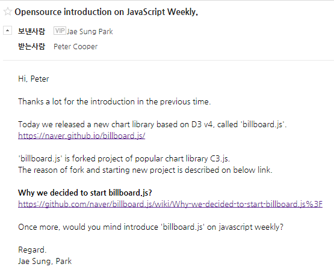

<p class="reference">
    FE 관련 뉴스레터는 사실, 한 곳에서 발행<br>
    https://cooperpress.com/
</p>

----------

# 유력 매체 소개

- [JavaScript Weekly 소개](http://javascriptweekly.com/issues/338)
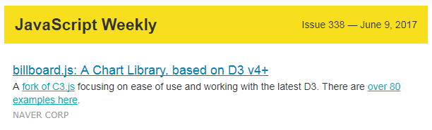

- [JavaScript Daily 소개](https://twitter.com/JavaScriptDaily/status/874264565802053634)
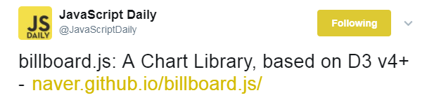

----------

# GitHub Trending!

JavaScript 언어부문 3위 기록

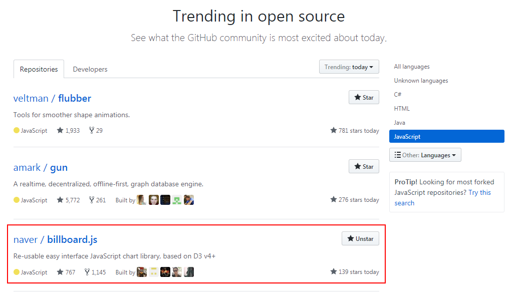

<p class="reference">
    https://github.com/trending/javascript
</p>

----------

# GitHub Star


- 공개 후, 첫 6일간 700개 <!-- .element: class="fragment" -->
- <p class="fragment">14일 후, <span style="color:red;font-size:80px;text-decoration:underline;">1,000개</span> 도달!</p>

<p class="fragment">
    Star의 가치는?<br>
    <ul style="font-size:.7em" class="fragment">
        <li>[cdnjs 등록은 최소 200개 요구됨](https://github.com/cdnjs/cdnjs/blob/master/CONTRIBUTING.md#b-request-a-new-library)</li>
        <li>[Vuejs도 첫 6일간 615개](http://blog.evanyou.me/2014/02/11/first-week-of-launching-an-oss-project/)</li>
        <li>[How I Got From 0 to 1 000 Stars on GitHub in Three Months](https://medium.com/@ondrejmirtes/how-i-got-from-0-to-1-000-stars-on-github-in-three-months-with-my-open-source-side-project-8ffe4725146)</li>
    </ul>
</div>

----------

# Third-party Apps!

Angular, React, R, Web Components 등의<br>
자발적인 프로젝트들의 등장 

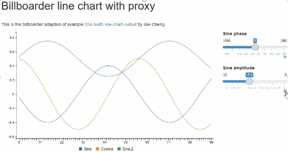

<p class="reference">
    https://github.com/naver/billboard.js/wiki/Third-party-applications
</p>

----------

# 지속적 성장

| 월 | npm 다운로드 수 |
| --- | --- |
| June | 370 |
| July | 479 |
| Aug | 862 |
| Sep | 1,124 |

<p style="margin:0">
    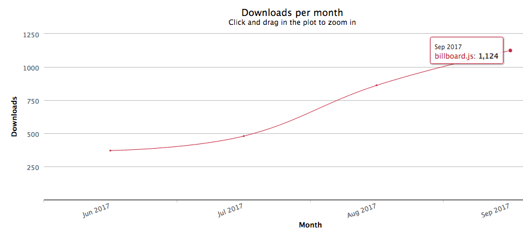
</p>

<p class="reference">
    [npm-stat: billboard.js, 2017.6.8 ~ 9.30](https://npm-stat.com/charts.html?package=billboard.js&from=2017-06-08&to=2017-09-30)
</p>

----------

# 충실한 문서

문서 작성은 아주, 아주 중요하다.

- [C3.js에서 마이그레이션 하기 가이드](https://github.com/naver/billboard.js/wiki/How-to-migrate-from-C3.js%3F)
- [잘 작성된 API 문서](http://naver.github.io/billboard.js/release/latest/doc/)
- [왜 Fork 하게 되었나?](https://github.com/naver/billboard.js/wiki/Why-we-decided-to-start-billboard.js%3F)
- [Readme](https://github.com/naver/billboard.js/blob/master/README.md)
- 대표 사이트: https://naver.github.io/billboard.js/

----------

# 80여개의 풍부한 예제

많은 예제는 '무엇'이 가능 또는 할수 있는지 보여줄 수 있다.
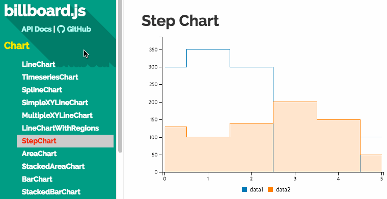

https://naver.github.io/billboard.js/demo/

----------

# 이제 부터가 시작

- Star의 수는 보다 발전할 수 있도록 도와주는 역할

- 이슈에 대한 빠른 대응 필요

- 신규 기능과 버그에 대한 처리

- [Roadmap](https://github.com/naver/billboard.js/wiki/Roadmap)을 통해 향후 방향에 대한 정보제공

----------

## 사용자를 위한
# 지속적 기능 추가

----------

# Playground

온라인에서 바로 옵션들을 수정하고 확인
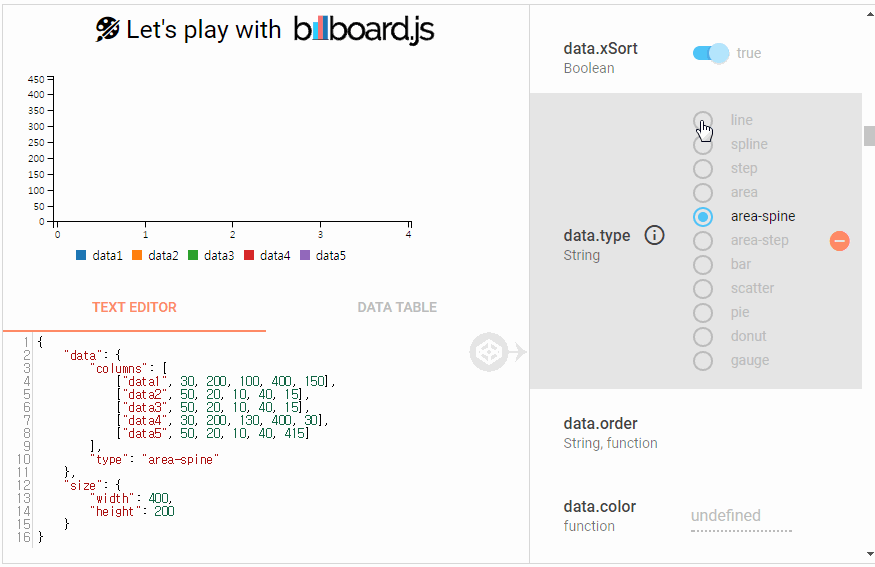  

<p class="reference">
    https://naver.github.io/billboard.js/playground/
</p>

----------

# 신규 옵션들과 문서

- C3+ 경험들을 통한 신규 옵션<br>
  <a href="https://medium.com/@alberto.park/billboard-js-1-1-0-release-bb3a5314413a">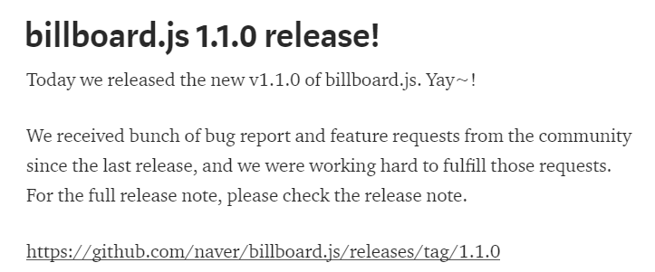</a>

- 꾸준한 문서 업데이트
  - API는 한번 작성되면 끝이 아니다.
  - 정확한 의미와 동작을 기술 그리고 지속적 업데이트

----------

## 오픈소스의 중요한 요소들

안정성, 충분한 문서 그리고 책임감

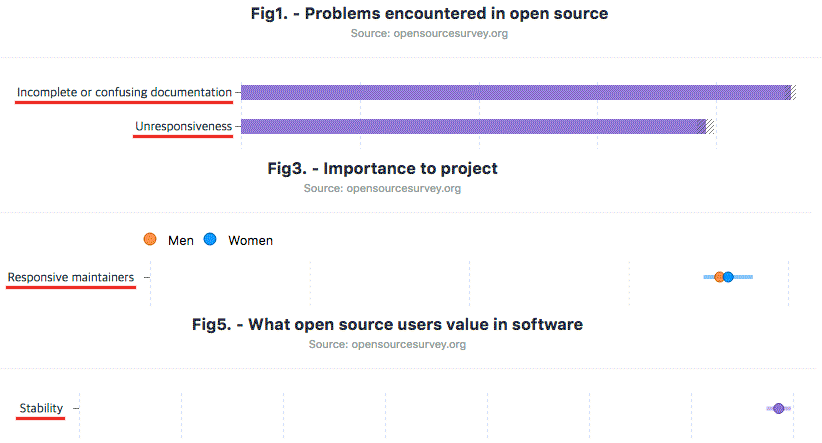

<p class="reference">
    http://opensourcesurvey.org/2017/
</p>

----------

# 오픈소스의 어려움

누군가의 노력이 대가없이 제공되는 것.<br>
그러나, 쉽게 비난 받기도 한다.

<p class="fragment">
    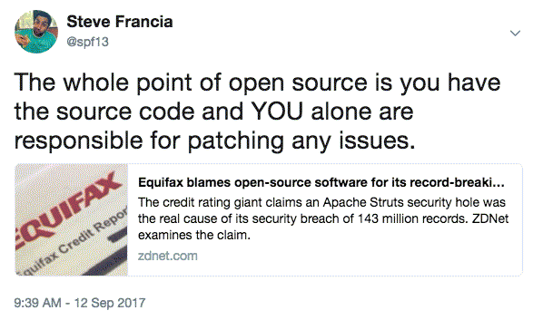<br>
    <span class="size18">https://twitter.com/spf13/status/907403135592878080</span>
</p>

----------

# 의연하게 대처하기

> You shouldn’t let strangers on the internet negatively affect your mood or your drive<br>...<br><br> <!-- .element: style="font-size:.8em" class="fragment" -->
> The trolls feed on your<br>annoyance and discourse.<br>
> &mdash; Sindre Sorhus

<p class="reference">
    [Between the Wires: An interview with open source developer Sindre Sorhus](https://medium.freecodecamp.org/sindre-sorhus-8426c0ed785d)<br>
    [1,139 npm Packages](https://www.npmjs.com/~sindresorhus)
</p>

----------

## Why do
# open source?

> 세상에서 내가 도움 받은 것에 대해<br> <!-- .element: class="fragment" -->
> 다시 기여하는 의미있고 가치있는 행동

<p class="reference">
    [네이버 오픈소스 가이드](https://naver.github.io/OpenSourceGuide/book/index.html)<br>
    [GitHub Open Source Guides](https://opensource.guide/)
</p>

----------

# Special Thanks

#### Masayuki Tanaka and all of the C3.js contributors,<br>
### for your great efforts and works to the community!