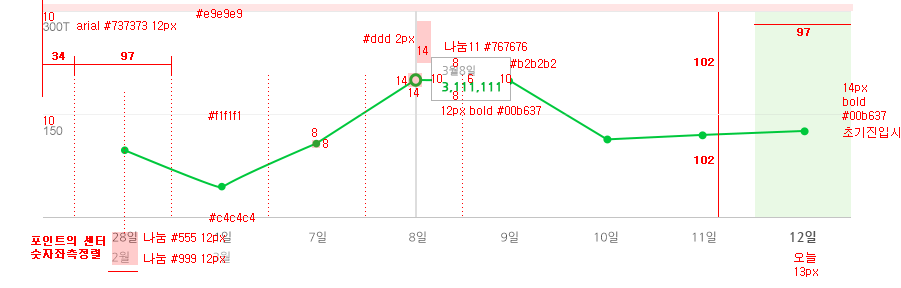

# 무엇을 다루나?

<span class="fragment">1) 네이버 공통 통계 개발 <span style="text-decoration:line-through">  삽질기 </span> 경험기</span><br>
<span class="fragment">2) 공통 차트 라이브러리 'C3+'</span>

----------

<!-- .slide: data-background="#e74c3c" -->
<div class="title-animate">
    <div><h1>Prologue</h1></div>
    <!-- <div><p>P0 project</p></div> -->
</div>

----------

## 차트 개발 작업이 assign 되었다면?

<div class="fragment" style="font-family:궁서체; background-color:#fff;color:#000; width:30%;height:200px;float:left">
    <div style="margin-top:2em">차트를 <span style="text-decoration:line-through">살려야</span><br>적용해야 한다.</div>
</div>

### Probably you might ... <!-- .element: class="fragment" style="color:#f9dc08" -->
- 직접 개발한다. <!-- .element: class="fragment" -->
- 외부 라이브러리를 사용한다. <!-- .element: class="fragment" -->
- 상용 or 오픈소스 <!-- .element: class="fragment" style="list-style: none;text-indent: 10px;" -->
- 어떤 기술을 사용할 것인가? <!-- .element: class="fragment" -->
- SVG or Canvas <!-- .element: class="fragment" style="list-style: none;text-indent: 10px;" -->

----------

# 오픈소스를 사용하자.

- 이미 자체 개발에 대한 시도가 이미 있었으나 성공적이지 않았음
- 지속적 업데이트, 기술적 트렌드 반영, 안정성 등을 기대할 수 있는 오픈소스 활용이 합리적일 것으로 기대
- 상용의 경우, 라이센스 비용 부담 (ex. Highcharts 10 developer $3,320)
- 서비스 마다 다른 라이브러리 사용에 의한 관리 및 기술경험 누적되지 않는 이슈<br>
  (NVD3, c3.js, highcharts, amcharts, fusioncharts, Nwagon, nChart, echarts, ...)


http://yobi.navercorp.com/Front-End/chart/post/19

----------

<div class="title-animate">
    <div><h1>C3.js</h1></div>
</div>

- 벡터 그래픽 라이브러리들 중, almost de facto standard 로 사용되는 D3.js 기반 라이브러리로 한정
- D3.js 기반의 차트 라이브러리들의 popularity 비교
- 간결한 인터페이스
- 풍부한 문서(예제 등) - 구글검색 결과: C3.js(22,400,000) Vs. NVD3(64,700)
- 네이버 서비스 레퍼런스 중, 다수에 적용

----------

<!-- .slide: data-background="#e74c3c" -->
<div class="title-animate">
    <div><h1>개발 시작</h1></div>
    <div><p>고난의 시작</p></div>
</div>

----------

# 커뮤니케이션

나의 이름은 무엇 인가요?

----------

# 디자인 가이드



- 각각의 요소들은 분리되고, 배치되어야 하는 상황<br>
- 세밀한 위치 조정 필요

----------

# OMG! SVG Text

<svg xmlns="http://www.w3.org/2000/svg" height="100">
  <text x="10" y="50"
        style="font-family: Times New Roman;
               font-size: 50px;
               stroke: #00ff00;
               fill: #0000ff;">
    I'm SVG text
  </text>
</svg><br>

- 텍스트 스타일링은 어느정도 가능하지만,
- 위치 여백 등의 조정이 어려움

----------

# 1차 시도

```html
<text y="9" x="0" transform="" style="text-anchor: middle; display: block;">
	<tspan x="0" dy=".71em" dx="0">11월15년</tspan>
</text>

```

'월'을 기준으로 텍스트를 분리하고, &lt;tspan> 요소를 추가해 보자

<h1 class="fragment" style="color:red;">FAIL</h1>

- 세밀한 위치 조정의 어려움 (속성값 변경 필요) <!-- .element: class="fragment" -->
- resize시 원래대로 복귀 (C3.js 내부처리) <!-- .element: class="fragment" -->

----------

# 도넛 제목 줄바꿈

----------

# ClipPath

----------

# Mobile Support

----------


<!-- .slide: data-background="#e74c3c" -->
<div class="title-animate">
    <div><h1>C3+</h1></div>
    <div><p>easily theming chart library</p></div>
</div>

----------

# C3+?

C3+는 SVG 기반의 차트 라이브러리인 C3.js를 확장해<br>
테마 형태의 디자인된 차트를 손쉽게 생성할 수 있도록 도와주는 라이브러리

## C3.js: 확장 + 기능 보완 + 테마

- 커스텀 축 지원
- 범례 템플릿
- 모바일 지원
- 테마를 통한 차트 생성
- 확장 옵션

----------

# 범례

마크업 템플릿을 옵션으로 설정

----------

# 데이터는 없지만, 데이터는 표현해야 한다.

donut 유형에서 데이터가 0인 경우, 데이터가 없는 것을 표현

----------

##

- jQuery로 SVG 요소 manipulation은 불명확 하다.
- SVG 요소의 dimension을 구할땐
  ```js
  d3.select(this).node().getBBox();
  ```


----------

# Demo #1

<iframe src="http://jsbin.com/lidove/1/embed?js,output" style="border:1px solid rgb(170, 170, 170);width:100%;min-height:500px;height:30px;"></iframe>

----------

# Demo #2

<iframe src="http://jsbin.com/lidove/2/embed?js,output" style="border:1px solid rgb(170, 170, 170);width:100%;min-height:400px;height:30px;"></iframe>

----------

<!-- .slide: data-background="#639ddc" -->

<div class="title-animate">
    <div><h1>What's Next?</h1></div>
</div>

- 온라인 wizard <!-- .element: class="fragment" -->
- more themes! <!-- .element: class="fragment" -->


<div class="fragment">
    <h3 class="red" style="margin:30px 0 0 0">Your <span class="red" style="text-decoration:underline">help</span> is needed!</h3>
    https://oss.navercorp.com/chart/c3p
</div>

