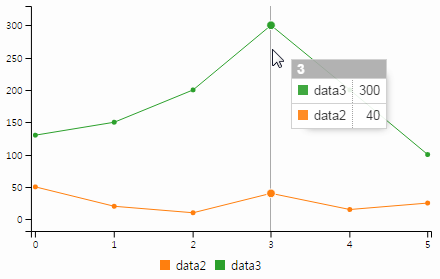
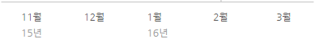
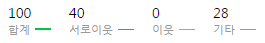
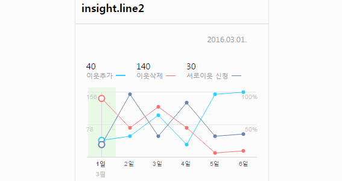
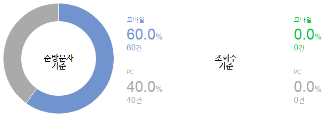

# 무엇을 다루나?

<p class="fragment" style="margin-top:40px;font-size:40px">1) 네이버 공통 통계 개발 <span style="text-decoration:line-through">  삽질기 </span> 경험기</p>
<p class="fragment" style="font-size:40px">2) 공통 차트 라이브러리 'C3+'</p>

----------

<!-- .slide: data-background="#e74c3c" -->
<div class="title-animate">
    <div><h1>Prologue</h1></div>
    <!-- <div><p>P0 project</p></div> -->
</div>

----------

# 차트란 무엇인가?

- 1) 데이터의 시각화 <!-- .element: class="fragment" style="list-style: none" -->
- 2) 차트 라이브러리? 1)의 구현을 위한 도구 <!-- .element: class="fragment" style="list-style:none" -->

<p class="fragment">그러나 차트의 적용은? 시각화는 기본이다.</p>

<div class="fragment">
    <h3><span class="red" style="text-decoration:underline">UI(디자인) + 인터렉션</span> 구현(적용)이 관건</h3>
</div>

----------

## 차트 개발 작업이 assign 되었다면?

<div class="fragment" style="font-family:궁서체,HYgsrB; background-color:#fff;color:#000; width:30%;height:200px;float:left">
    <div style="margin-top:2em">차트를 <span style="text-decoration:line-through">살려야</span><br>적용해야 한다.</div>
</div>

### Probably you might ... <!-- .element: class="fragment" style="color:#f9dc08" -->
- 직접 개발한다. <!-- .element: class="fragment" -->
- 외부 라이브러리를 사용한다. <!-- .element: class="fragment" -->
- 상용 or 오픈소스 <!-- .element: class="fragment" style="list-style: none;text-indent: 10px;" -->
- 어떤 기술을 사용할 것인가? <!-- .element: class="fragment" -->
- SVG or Canvas <!-- .element: class="fragment" style="list-style: none;text-indent: 10px;" -->

----------

# 오픈소스를 사용하자.

- 이미 자체 개발에 대한 시도가 이미 있었으나 성공적이지 않았음 <!-- .element: class="fragment" -->
- 지속적 업데이트, 기술적 트렌드 반영, 안정성 등을 기대할 수 있는 오픈소스 활용이 합리적일 것으로 기대 <!-- .element: class="fragment" -->
- 상용의 경우, 라이센스 비용 부담 (ex. Highcharts 10 developer $3,320) <!-- .element: class="fragment" -->
- 서비스 마다 다른 라이브러리 사용에 의한 관리 및 기술경험 누적되지 않는 이슈<br> <!-- .element: class="fragment" -->
  (NVD3, c3.js, highcharts, amcharts, fusioncharts, Nwagon, nChart, echarts, ...)


http://yobi.navercorp.com/Front-End/chart/post/19 <!-- .element: class="fragment" -->

----------

<div class="title-animate" style="margin-bottom:50px">
    <div><h1>C3.js</h1></div>
    <div><p>(Comfortable, Customizable, Controllable)</p></div>
</div>

- 그래픽 라이브러리 중 가장 인기있는 D3.js 기반 라이브러리로 한정
- D3.js 기반의 차트 라이브러리들의 popularity 비교
- 간결한 인터페이스
- 풍부한 문서(예제 등) - 구글검색 결과: C3.js(22,400,000) Vs. NVD3(64,700)
- 네이버 서비스 레퍼런스 중, 다수에 적용

----------

<!-- .slide: data-background="#e74c3c" -->
<div class="title-animate">
    <div><h1>개발 시작</h1></div>
    <div><p>고난의 시작</p></div>
</div>

----------

# 커뮤니케이션

나의 이름은 무엇 인가요?<br>


<div class="fragment redbox" style="width:90px;height:70px;top:284px;left:550px;"></div>
<div class="fragment redbox" style="width:30px;height:235px;top:227px;left:259px"></div>
<div class="fragment redbox" style="width:15px;height:15px;top:410px;left:519px;"></div>
<div class="fragment redbox" style="width:30px;height:20px;top:455px;left:355px;"></div>
<div class="fragment redbox" style="width:115px;height:20px;top:480px;left:408px;"></div>

https://pages.oss.navercorp.com/chart/c3p/guide_term.html

----------

# 디자인 가이드


- 각각의 요소들은 분리되어 세밀한 크기와 위치 조정 필요 <!-- .element: class="fragment" -->
- 커스터마이징이 어느 정도까지 가능한지 모르는데 답변을 해줘야 하는 상황 <!-- .element: class="fragment" -->

----------

# OMG! SVG Text

<svg xmlns="http://www.w3.org/2000/svg" height="100">
  <text x="10" y="50"
        style="font-family: Times New Roman;
               font-size: 50px;
               stroke: #00ff00;
               fill: #0000ff;">
    I'm SVG text
  </text>
</svg><br>

- 텍스트 스타일링은 가능 <!-- .element: class="fragment" -->
- 위치(via attributes) 여백 등의 조정은 어려움 <!-- .element: class="fragment" -->
- transform:translate 또는 &lt;tspan>으로 처리 필요 <!-- .element: class="fragment" -->

----------

# 1차 시도

x축 텍스트의 날짜 값 표현 
```html
<text y="9" x="0" transform="" style="text-anchor: middle; display: block;">
	<tspan x="0" dy=".71em" dx="0">11월15년</tspan>
</text>

```

'월'을 기준으로 텍스트를 분리하고, &lt;tspan> 요소를 추가해 보자

<h1 class="fragment" style="color:red;">FAIL</h1>

- resize시 원래대로 복귀 (C3.js 내부처리) <!-- .element: class="fragment" -->

----------

# 2차 시도

tick multiline 옵션을 이용해 줄바꿈 해보자
```js
axis: {
    x: {
        tick: {
            width: 30,
            multiline: true
        }
    }
}
```
```html
<text y="9" x="0" transform="" style="text-anchor: middle; display: block;">
    <tspan x="0" dy=".71em" dx="0">11월</tspan>
    <tspan x="0" dy="11.5" dx="0">15년</tspan>
</text>
```

<h1 class="fragment" style="color:red;margin:0;position: absolute;top: 45%;left: 37%;">FAIL</h1>

- 텍스트에 따른 너비값이 고정적이지 않기 때문에 width 옵션 사용불가 <!-- .element: class="fragment" -->
- 세밀한 위치 조정 어려움 (속성값 변경 필요) <!-- .element: class="fragment" -->

----------

## x축 tick 레이블 처리

<iframe src="http://jsbin.com/lidove/8/embed?js,output" style="border:1px solid rgb(170, 170, 170);width:100%;min-height:400px;height:30px;"></iframe>

----------

# ClipPath

유형에 따라 차트 영역에 한정해 출력되도록 지정 영역만큼 잘라서 출력<br>
시작점에 위치하는 데이터의 표현은 경우에 따라 포인트가 잘리는 문제

<iframe src="http://jsbin.com/xijubi/embed?js,output" style="border:1px solid rgb(170, 170, 170);width:100%;min-height:400px;height:30px;"></iframe>

----------

## 모바일 지원

- C3.js 이벤트 바인딩: over/out/move/click/resize (차트 redraw시 재 바인딩)
- 모바일 환경에선 의도치 않은 사이드 이펙트 발생

터치하고 바로 떼었을 때: <!-- .element: class="fragment" -->
> iOS 9:<br> <!-- .element: class="fragment" -->
> touchstart -> touchend -> mouseover -> mousemove -> mouseout (포커스가 이동되면 발생)

> Android 5.1.1 (Galaxy S6 Edge):<br> <!-- .element: class="fragment" -->
> touchstart -> touchend -> mouseover -> mousemove -> mousedown -> mouseup -> click -> mouseout (포커스가 이동되면 발생)

*C3.js는 데스크탑에 최적화 되어 있음 <!-- .element: class="fragment" -->

----------

# 최소값 재설정

데이터 범위에 따라 up/down이 제대로 표현되지 않을 수 있다.<br>
(기본적으로 데이터의 시작점은 0에 기반하기 때문)

<iframe src="http://jsbin.com/lidove/7/embed?js,output" style="border:1px solid rgb(170, 170, 170);width:100%;min-height:330px;height:30px;"></iframe>

----------

<!-- .slide: data-background="#e74c3c" -->
<div class="title-animate">
    <div><h1>C3+</h1></div>
    <div><p>새로운 시작</p></div>
</div>

----------

<div class="title-animate">
    <div><h1>C3+?</h1></div>
    <div><p>
        C3+는 SVG 기반의 차트 라이브러리인 C3.js를 확장해<br>
        테마 형태의 디자인된 차트를 손쉽게 생성할 수 있도록 도와주는 라이브러리
    </p></div>
</div>

## C3.js: 확장 + 기능 보완 + 테마 <!-- .element: class="fragment" -->

- 커스텀 축 지원 <!-- .element: class="fragment" -->
- 범례 템플릿 <!-- .element: class="fragment" -->
- 모바일 지원 <!-- .element: class="fragment" -->
- 테마를 통한 차트 생성 <!-- .element: class="fragment" -->
- 확장 옵션 <!-- .element: class="fragment" -->

----------

# 커스텀 축

별도의 축 DOM을 생성해 스타일링이 가능하도록 구현

```html
<!-- x Axis -->
<div class="c3p-axis-x" style="position: absolute; top: 200px;">
	<ul class="c3p-axis-list" style="display:table;table-layout:fixed;width:100%">
		<li class="c3p-axis-item" style="display:table-cell"> ... </li>
		...
	</ul>
</div>

<!-- y Axis -->
<div class="c3p-axis-y" style="position: absolute; top: 0px; height: 189px; width: 70px;">
	<span class="c3p-axis-item" style="position: absolute; top: 0px; height: auto;">1.05M</span>
	<span class="c3p-axis-item" style="position: absolute; top: 79px; height: auto;">1.02M</span>
</div>
```
- 균등한 크기를 위해 display:table로 처리 <!-- .element: class="fragment" -->
- 처음 tick의 너비는 100/data.length와 같이 처리<br>그러나 일부 Android 단말기에서 균등하게 나눠지지 않음  <!-- .element: class="fragment" style="list-style: none" -->
- y축의 경우, tick 옵션 등의 가변성이 있어, display:absolute로 처리 <!-- .element: class="fragment" -->

----------

# 범례

마크업 템플릿을 옵션으로 설정



```js
legend: {
	template: {
		html: [ '<li class="u_ni_legend_item {=TEMPLATE-CLASS}">',
			'<span class="u_ni_legend_count"><span class="_value">{=VALUE}</span>{=UNIT}</span>',
			'<span class="u_ni_legend_name">{=NAME}</span>',
			'<span class="u_ni_legend_tile" style="background-color:{=COLOR}"></span>',
			'</li>' ].join(""),
		classes: [ "", "u_ni_legend_thin", "u_ni_legend_thin", "u_ni_legend_thin" ],
		unit: [ "%", "", "%", "" ]
	}
}
```
https://pages.oss.navercorp.com/chart/c3p/use_extension.html

----------

# 모바일 지원

C3.js 마우스, resize 이벤트 unbind 및 터치 인터렉션 구현

터치를 통한 데이터 선택<br> <!-- .element: class="f_left fragment" -->


rotation & resizing <!-- .element: class="fragment" -->


----------

## 데이터는 없지만, 데이터는 표현해야 한다?

donut 유형에서 데이터가 0인 경우, 데이터가 없는 것을 표현


----------

# 테마 지원

- 기본적인 가이던스(js/css 파일)를 제공
- 실적용 서비스 작업을 기반

```js
c3p.generate("#line_chart", "insight.bar2", { ... });
```
현재는 네이버 블로그/포스트 테마 'insight'만 제공
https://pages.oss.navercorp.com/chart/c3p/theme_insight.html

----------

# Some caveats

- jQuery로 SVG 요소의 manipulation은 불명확
- SVG 요소의 dimension을 구할땐 SVG의 .getBBox() 메서드를 사용
https://docs.webplatform.org/wiki/svg/methods/getBBox
  ```js
  d3.select(this).node().getBBox();
  ```

----------

# Demo #1

<iframe src="http://jsbin.com/lidove/1/embed?js,output" style="border:1px solid rgb(170, 170, 170);width:100%;min-height:500px;height:30px;"></iframe>

----------

# Demo #2

<iframe src="http://jsbin.com/lidove/2/embed?js,output" style="border:1px solid rgb(170, 170, 170);width:100%;min-height:400px;height:30px;"></iframe>

----------

<!-- .slide: data-background="#daa655" -->
<div class="title-animate">
    <div><h1>C3+ Goal</h1></div>
</div>

- 매번 다른 기술/라이브러리를 다루는 반복적인 비용을 제거해 보자 <!-- .element: class="fragment" -->
- 기본적 디자인(테마)을 활용해 커스터마이징(디자인)에 따른 비용 제거해 보자 <!-- .element: class="fragment" -->
- 기술적 경험 축적: SVG, D3, C3.js <!-- .element: class="fragment" -->

----------

<!-- .slide: data-background="#639ddc" -->

<div class="title-animate">
    <div><h1>What's Next?</h1></div>
</div>

- chart generator (website feature) <!-- .element: class="fragment" -->
- more themes! <!-- .element: class="fragment" -->

<div class="fragment">
    <h3 class="red" style="margin:30px 0 0 0">Your <span class="red" style="text-decoration:underline">help</span> is needed!</h3>
    <!-- .element: style="transform:scale(2);margin-top:50px" --><br>
    https://oss.navercorp.com/chart/c3p
</div>