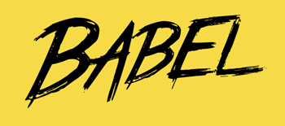

# 어떤 것을 배워야 할까?
# 시간 투자 필요

----------

## 그러나 해당 기술이 뜨지 못하면? 
## 많은 기술들 속에서 어떤 것을 '선택' 할지가 점점 중요

----------

## JavaScript

지속적인 자바스크립트 인기

StackOverflow 2013~2016 가장 인기있는 기술로 응답

http://stackoverflow.com/research/developer-survey-2016#technology-most-popular-technologies

----------

## 뜨거웠던 2016

HackerNews와 Reddit:
[How it feels to learn JavaScript in 2016](https://hackernoon.com/how-it-feels-to-learn-javascript-in-2016-d3a717dd577f#.78qn4410c)
[한글번역] http://www.looah.com/article/view/2054

----------

# 몇가지 키워드

- Server-side Rendering
- Component (Module)
- Isomorphic JavaScript
- Virtual DOM

----------

## Server-side rendering

    http://tomdale.net/2015/02/youre-missing-the-point-of-server-side-rendered-javascript-apps/

----------

## Reason?

- SEO 문제
  - Ajax API로 구성되는 페이지의 경우 초기 화면은 blank로 구성되고 SEO에서 올바른 처리가 되지 못하는 문제

- 초기 로딩속도
  - 정적 자원을 로딩한 후, 다시 컨텐츠를 구성하기 위해 Ajax API를 호출하는 처리시간의 소요

- JavaScript 사용이 제한된 환경
  - 이 경우 클라이언트 렌더링은 무용지물 상태가 된다.

클라이언트 영역에서 처리하는 것이 좋다고 했었다가 지금은 서버 렌더링을 얘기한다

----------

# Virtual DOM

JavaScript로 표현된 DOM 구조 (VTree)

[React’s diff algorithm](http://calendar.perfplanet.com/2013/diff/)
[Virtual DOM and diffing algorithm](https://gist.github.com/Raynos/8414846)

https://www.youtube.com/watch?v=z5e7kWSHWTg

----------

## Reason?

DOM 노드 핸들링은 비용이 많이 든다.

단방향 데이터 흐름

- 변경에 대한 업데이트는?
- 1) Dirty checking
  - Angular1
  - React (setState 호출시 마킹)
- 2) Observable (Anguar2)

https://medium.com/tony-freed-consulting/what-is-virtual-dom-c0ec6d6a925c#.pxlx9kxwi

----------

# Isomorphic JavaScript

- 서버와 클리언트 영역 모두에서 실행
- 백엔드와 프론트엔드가 같은 코드 공유

http://isomorphic.net/

- Isomorphic JS: 페이지를 생성하기 위해 클라이언트와 서버를 활용하는 테크닉
- Universal JS: 모든 환경에서 실행되는 자바스크립트

http://www.2ality.com/2015/08/isomorphic-javascript.html

----------

# ES6(ECMAScript 2015)

2가지 질문:
- 현재 사용 가능한가?
- 사용해야 하나?

----------

# Transpiler

다른 언어로 변환해주는 도구

<iframe src="http://jsbin.com/rodebep/embed?js,output" style="border:1px solid rgb(170, 170, 170);width:100%;min-height:400px;height:30px;"></iframe>

----------

# 지원율

- 브라우저: 97%
- Node.js 6.5 & 7: 97%
- Babel: 71%

----------

Module

- CommonJS
- RequireJS (AMD)
- ES6 Module (표준)

모듈/구조화에 대한 니즈
ES6 > CommonJS > RequireJS

----------

Package Manger

- npm (yarn)
- Bower?

----------

다양한 옵션을 제공하는 것도 좋지만, 그렇다고 결졍적 이유도 존재하지 않음

https://twitter.com/tomdale/status/667389972794724352

----------

## Bundlers vs Build tools

----------

## Bundler
- webpack
- Browserify

다양한 자원들을 묶어 하나의 파일로 번들링 해주는 도구

----------

## Build tool
- Grunt
- Gulp

정의된 작업들을 수행하는 도구

----------

http://stateofjs.com/2016/buildtools/

Bundler가 기존 build 도구들이 수행하던 작업들을 일부 대체해 경계의 모호함
ex. loaders 등을 통한 transpiling

----------

Frameworks

----------

- jQuery
- AngularJS
- React
- Vue
- Polymer

관심도:

https://www.google.com/trends/explore?cat=13&date=today%2012-m&q=angularjs,react,vuejs,polymer

----------

jQuery?

- 프레임워크 등장 이전까진 de-facto standard 위치
- 브라우저의 표준 지원률 향상으로 VanillaJS만으로도 점점 충분
- 웹앱이 아닌 웹사이트에선 아직도 적합

[Is jQuery Still Relevant?](http://developer.telerik.com/featured/is-jquery-still-relevant/)

----------

# AngularJS

- AtScript -> TypeScript
- Google: GWT -> Dart -> TypeScript?

http://www.codelord.net/2016/10/09/angular-2-is-out-should-you-start-using-it/

구글의 메인 서비스들에서의 사용?

YouTube는 표준 웹컴포넌트 기반 Polymer 기반으로 새로 개발예정
- [YouTube is being rebuilt with Web Components & Polymer](http://react-etc.net/entry/youtube-is-being-rebuilt-on-web-components-and-polymer)

----------

# React

- JSX (JavaScript XML)
- 예전엔 html에 비즈니스 로직이 포함되는 것에 대한 비판
- 지금은 로직(자바스크립트)안에 html이 포함

(간단한 React 코드 예제 추가)

----------

# Vue

----------

# Polymer

표준 Web Component에 기반한 프레임워크
크롬 브라우저 UI에서 사용

Web Component 표준 스펙의 브라우저 지원이 걸림돌
Safari는 HTML Import를 제외하고 모두 지원

----------

'최신'에 대한 Myth

- Angular1 사례: 성능 이슈 어려움

- Angular2?
Angular 2 Is Out: Should You Start Using It?
http://www.codelord.net/2016/10/09/angular-2-is-out-should-you-start-using-it/

----------

# 새로운 영역

----------

Node.js

V8 기반의 서버 런타임

한때 느린 개발 속도에 대한 반발(io.js)
꾸준한 성
LTS(Long-Term Support plan for Node.js releases)를 만들어 연 1회의 릴리스와 릴리스에 대한 18개월간 지원 계획

----------

Hybrid App/JavaScript Native

- Cordova
- React Native
- Fuse

Titanium은 점점 잊혀져가는

----------

매력적이나, 프레임워크별 API
어쨌든 Native App 개발과는 다르다.
새로 등장한 도구들이 많아 문서에 대한 부족

----------

# Desktop Application

- Electron (GitHub)
- NW.js (Node-Webkit) (Intel)

----------

# 요인

단일 개발 모델을 통한 멀티 패러다임 소프트웨어 개발 요구
플랫폼별 대응 개발 비용의 문제
일반적으로 Web, iOS, Android 개발 필요한데, 동일 기능을 3가지 환경에 맞추어 개발필요

----------

# Browsers

점점 더 빨라진 업데이트 주기
브라우저 벤더들의 표준 implementation 관련
- Safari Technology Preview
- Chrome: Android에서도 canary/beta 채널 제공 시작
- Edge?
- FireFox: 최근 Quantum(Server 기반) 엔진 변경 발표
- Samsung Internet?

----------

## What about standard?

- ServiceWorker (offline cache)
- Web Component
- Module
- ES6(or 7)

----------

# JS Foundation

jQuery Foundation의 새로운 이름

https://js.foundation/

[자바스크립트 생태계 통합될까](http://www.zdnet.co.kr/news/news_view.asp?artice_id=20161019140745)

----------

# 2017?

- 현재와 같은 빠른 변화의 기조가 유지될 것
- 복잡도의 증가
- 생태계의 너무 빠른 변화
- 그러나 올바른 방향으로 발전중

http://stateofjs.com/2016/opinions/
