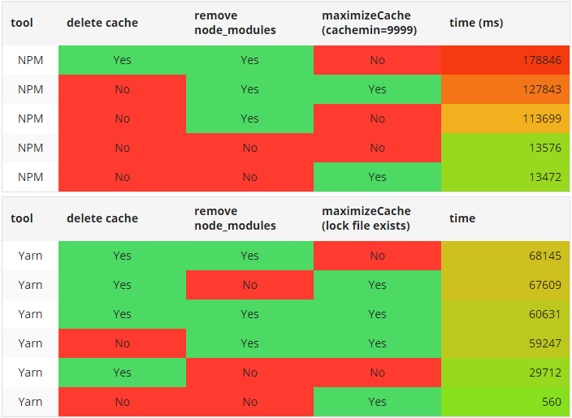
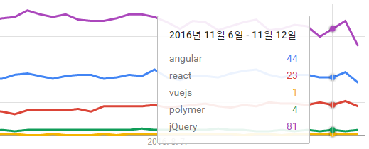

# 어떤 것을 배워야 할까?
# 시간 투자 필요 <!-- .element: class="fragment" -->

----------

# 그러나 해당 기술이<br>'뜨지' 못하면?

<p style="border:dotted 1px #fff;margin: 50px auto;padding:10px;width:700px;font-size:50px">
    <span>많은 기술들 속에서<br>어떤 것을 '선택' 할지가 점점 중요</span>
</p>

----------

# JavaScript

<p>
    지속적인 자바스크립트 인기<br>
    StackOverflow 2013~2016 가장 인기있는 기술로 응답
</p>


<p class="reference">
    [StackOverflow 2016 survey](http://stackoverflow.com/research/developer-survey-2016#technology-most-popular-technologies)
</p>

----------

### 그러나, <!-- .element: style="margin:0" -->
# [WebAssembly](http://webassembly.org/)

- 새로운 웹용 바이너리 표준
- 브라우저가 가상 머신처럼 동작해 컴파일된 중간 코드를 실행
- 네이티브 애플리케이션과 같이 빠른 실행을 목표

> JavaScript 대신 C, C++ 등의 언어로<br>
> 브라우저 실행 프로그램 개발가능

<p class="reference">
    [Reached the Browser Preview milestone](http://webassembly.org/roadmap/)
</p>

----------

# 뜨거웠던 2016


<p class="reference">
    HackerNews와 Reddit에서의 토론:<br>
    [How it feels to learn JavaScript in 2016](https://hackernoon.com/how-it-feels-to-learn-javascript-in-2016-d3a717dd577f#.78qn4410c) ([한글번역](http://www.looah.com/article/view/2054))
</p>

----------

# 몇가지 키워드

- Server-side Rendering <!-- .element: class="fragment" -->
- Component (Module) <!-- .element: class="fragment" -->
- Isomorphic JavaScript <!-- .element: class="fragment" -->
- Virtual DOM <!-- .element: class="fragment" -->

----------

## Server-side rendering


<p class="reference">
    [You’re Missing the Point of Server-Side Rendered JavaScript Apps](http://tomdale.net/2015/02/youre-missing-the-point-of-server-side-rendered-javascript-apps/)
</p>

----------

# Reason?

- SEO 문제
  - Ajax API로 구성 페이지 초기 화면이 blank로 구성되면 SEO 문제

- 초기 로딩속도
  - 정적 자원 로딩 후, 컨텐츠 구성위한 추가 Ajax API 호출 시간소요

- JavaScript 사용이 제한된 환경
  - 클라이언트 렌더링은 무용지물

> 하지만, 클라이언트 영역에서 처리가 빠르다고<br>
> 했었다가 지금은 서버 렌더링 말한다.

----------

# Virtual DOM

JavaScript로 표현된 DOM 구조 (VTree)


<span style="display:inline-block" class="size9">[Source] http://teropa.info/blog/2015/03/02/change-and-its-detection-in-javascript-frameworks.html</span>

<ul class="size18">
    <li>[React’s diff algorithm](http://calendar.perfplanet.com/2013/diff/)</li>
    <li>[Virtual DOM and diffing algorithm](https://gist.github.com/Raynos/8414846)</li>
    <li>[YouTube: React.js Conf 2015 - Hype!](https://www.youtube.com/watch?v=z5e7kWSHWTg)</li>
</ul>

----------

# Reason?

- DOM 노드 핸들링은 비용이 많이 든다.
- Diff 알고리즘을 통해 효율적 변경

- 변경에 대한 업데이트는?
 - 1) Dirty checking
   - Angular1은 VDOM은 없지만, Digest cycle내에서의 변경 watch
   - React (setState 호출시 마킹)
 - 2) Observable (Anguar2)

<p class="reference">
    [What is Virtual Dom](https://medium.com/tony-freed-consulting/what-is-virtual-dom-c0ec6d6a925c#.pxlx9kxwi)
</p>

----------

# Isomorphic JavaScript

- 서버와 클라이언트 영역 모두에서 실행
- 백엔드와 프론트엔드가 같은 코드 공유

http://isomorphic.net/

- Isomorphic JS: 페이지를 생성하기 위해 클라이언트와 서버를 활용하는 테크닉
- Universal JS: 모든 환경에서 실행되는 자바스크립트

http://www.2ality.com/2015/08/isomorphic-javascript.html

----------

# ES6
### (ECMAScript 2015)

2가지 질문
## 1) 사용해야 하나? <!-- .element: class="fragment" -->
## 2) 현재 사용 가능한가? <!-- .element: class="fragment" -->

----------

# Transpiler

다른 언어로 변환해주는 도구


<iframe src="http://jsbin.com/rodebep/embed?js,output" style="border:1px solid rgb(170, 170, 170);width:100%;min-height:350px;height:30px;"></iframe>

----------

# ES6 지원율

| 영역 | 지원율 |
| --- | --- |
| Modern Browsers | 97% |
| Node.js 6.5/7 | 97% |
| Babel | 71% |

http://kangax.github.io/compat-table/es6/

----------

# Module System

모듈/구조화에 대한 니즈<br>

| Name | Type | Syntax | Execution from | Module Unit per |
| --- | --- | --- | --- | --- | --- |
| [CommonJS](http://www.commonjs.org/) | Synchronous | module.export<br>require | return | file |
| [RequireJS](http://requirejs.org/) | Asynchronous | define<br>require | callback | definition |
| [ES6 Module](https://hacks.mozilla.org/2015/08/es6-in-depth-modules/) | Sync/Async | export<br>import | return | definition |

<p class="reference">
    [JavaScript Module Systems Showdown: CommonJS vs AMD vs ES2015](https://auth0.com/blog/javascript-module-systems-showdown/)
</p>

ES6 > CommonJS > RequireJS

----------

# Package Manger

 


| Name | Target | Config | Install Path |
| --- | --- | --- | --- |
| [npm](https://www.npmjs.com/) | Node.js | package.json | node_modules |
| [Bower](https://bower.io/) | Front-end | bower.json | bower_components |

<p class="reference">
    [Front-End Package Manager Comparison](https://github.com/wilmoore/frontend-packagers)
</p>

----------

# Module Counts


http://www.modulecounts.com/

----------

# npm or Bower?

다양한 옵션을 제공하는 것도 좋지만, 그렇다고 결정적 이유도 존재하지 않음


https://twitter.com/tomdale/status/667389972794724352

----------


- 페이스북에서 개발한 새로운 패키지 매니저 클라이언트
- npm 레지스트리와 호환
- 병렬처리를 통해 npm 보다 향상된 처리성능
- package.json을 통해 간단하게 전환가능
```bash
## yarn.lock 설정파일 없으면 생성
## 설정 파일 있으면 package 설치
 $ yarn
 yarn install v0.16.1
 info No lockfile found.
 [1/4] Resolving packages...
 ...
 success Saved lockfile.
 Done in 34.60s.
```

<p style="margin:0">
    https://yarnpkg.com/
</p>

<p class="reference">
    [Yarn: A new package manager for JavaScript](https://code.facebook.com/posts/1840075619545360)
</p>

----------

## npm vs Yarn



<p class="reference">
    [NPM VERSUS YARN - THE EPIC FIGHT FOR SPEED IN CONTINUOUS INTEGRATION](https://stapp.space/npm-versus-yarn-the-epic-fight-for-speed-in-continuous-integration/)
</p>

----------

# Bundlers<br>
## vs.<br>
# Build tools

----------

## Bundler

다양한 자원들을 묶어 하나의 파일로 번들링 해주는 도구

 webpack
 Browserify


webpack > Browserify

<p class="reference">
    https://npmcompare.com/compare/browserify,webpack
</p>

----------

# Build tool

 Grunt
 Gulp

정의된 작업(Task) 들을<br>
수행(Runner) 하는 도구

Gulp > Grunt

<p class="reference">
    https://npmcompare.com/compare/grunt,gulp
</p>

----------


http://stateofjs.com/2016/buildtools/

- Bundler가 기존 build 도구들이 수행하던 작업들을 일부 대체해 경계의 모호함
- ex. loaders 등을 통한 transpiling

----------

# Frameworks

----------

# Interests

jQuery / Angular / React / Vue.js / Polymer

<br>
<span class="size18">(1st week, Nov. 2016)</span>

jQuery > React > Angular > Polymer > Vue.js

<p class="reference">
    [Google Trends](https://www.google.com/trends/explore?cat=13&date=today%2012-m&q=angular,react,vuejs,polymer,jQuery)
</p>

----------


<br>

- 프레임워크 등장 이전까진 de-facto standard 위치
- 브라우저의 표준 지원률 향상으로 VanillaJS만으로도 점점 충분
- 웹앱이 아닌 웹사이트에선 아직도 적합

<p class="reference">
    [Is jQuery Still Relevant?](http://developer.telerik.com/featured/is-jquery-still-relevant/)
</p>

----------


- Angular1 != Angular2
- AtScript &rarr; TypeScript (JS 또는 Dart도 사용가능)
 - [Microsoft And Google Collaborate On Angular 2 Framework, TypeScript Language](https://techcrunch.com/2015/03/05/microsoft-and-google-collaborate-on-typescript-hell-has-not-frozen-over-yet/) <!-- .element: class="size18" -->

- Google: GWT &rarr; Dart &rarr; TypeScript?
- 2 way data binding &rarr; 1 way

----------

# for Production?

- 아직 너무 잦은 변화
 - 2.0.0 (16/9/15)
 - 2.2.0 (16/11/02)
- 꼭 TypeScript을 사용하지 않아도 되지만...
 - 대다수의 문서가 TypeScript 기반

- 구글 서비스 적용은?

YouTube는 표준 웹컴포넌트 기반인 Polymer로 새로 개발예정

<p class="reference">
    <br>[Angular 2 Is Out: Should You Start Using It?](http://www.codelord.net/2016/10/09/angular-2-is-out-should-you-start-using-it/)<br>
    [YouTube is being rebuilt with Web Components & Polymer](http://react-etc.net/entry/youtube-is-being-rebuilt-on-web-components-and-polymer)
</p>

----------

#  React

- 페이스북에서 개발한 MV* 구조에서 View 영역에 대한 구현체
- 데이터의 흐름이나 구조 등을 다루지 않음 (Flux 아키텍처 구현체 [Redux](http://dobbit.github.io/redux/)와 사용)
- Virtual DOM, one-way data flow(one-way binding) 
- 페이스북 대표 서비스들(FB, Instagram)에서 사용

## 하지만, <!-- .element: style="margin-top:30px" -->

- 예전엔 html에 비즈니스 로직 포함에 대한 비판
- React 로직(자바스크립트)안에 html이 포함
 - [JSX](https://facebook.github.io/jsx/) (JavaScript XML) - [JSXTransformer](https://babeljs.io/docs/plugins/transform-react-jsx/)를 통한 변환 필요

----------

## 간단한 React 예제

<iframe src="http://jsbin.com/wonehox/4/embed?js,output" style="border:1px solid rgb(170, 170, 170);width:100%;min-height:400px;height:30px;"></iframe>

----------

#  Vue.js

- Progressive framework for building user interfaces
- View layer에 집중
- [MVVM](https://en.wikipedia.org/wiki/Model%E2%80%93view%E2%80%93viewmodel)(Model-View-ViewModel)
 - MVC 패턴의 Controller와 같이 데이터 관리 및 액션 처리
- AngularJS와 유사성 (heavily influenced by Angular)
 - 그러나, Angular에 비해 light

<p class="reference">
    <br>[GitLab: Why We Chose Vue.js](https://about.gitlab.com/2016/10/20/why-we-chose-vue/)<br>
    [자바스크립트 프레임워크 소개 3 - Vue.js](http://meetup.toast.com/posts/99)
</p>

----------

## 간단한 Vue.js 예제

<iframe src="http://jsbin.com/vayuhi/embed?js,output" style="border:1px solid rgb(170, 170, 170);width:100%;min-height:400px;height:30px;"></iframe>

----------

#  Polymer

- 표준 Web Component 기반한 프레임워크
 - Custom element, HTML import, Template, Shadow DOM
 - 웹 컴포넌트 미지원 브라우저에 Polyfill 제공도 목적<br>
   <span class="size18">[참고] [Web Components & Polymer](http://netil.github.io/slides/webcomponent/)</span>
- 그동안 Web Component 표준 스펙 브라우저 지원이 걸림돌

 <a href="http://webcomponents.org/" target="_new" title="http://webcomponents.org/"></a>


----------

## 간단한 Web Components 예제

<pre><code style='font-size:23px;line-height:1.2;padding:20px'>&lt;!-- Import polyfill -->
&lt;script src="../webcomponentsjs/webcomponents-lite.min.js">&lt;/script>

<!-- Import custom elements -->
&lt;link rel="import" href="hello-world.html">

&lt;!-- Run custom elements -->
&lt;hello-world who="Unicorn">&lt;/hello-world>
</code></pre>

<p class="size18">
    http://webcomponents.org/hello-world-polymer/bower_components/hello-world-polymer/
</p>

----------

## JS web frameworks benchmark


| Name | Duration (ms) |
| --- | --- |
| Angular v2.0.0-rc5 | 1.85 |
| React v15.3.1 | 1.82 |
| Vue v2.0.0-beta1 | 1.37 |
| VanillaJS | 1.00 |

VanillaJS > Vue > React > Angular2

<p class="size18">
http://stefankrause.net/js-frameworks-benchmark4/webdriver-ts/table.html
</p>

----------

# '최신'은 항상 좋은가?

- Angular case: 
 - v1: 성능 이슈 어려움
 - v2?  
- UI 컴포넌트 기반 개발 니즈
 - React, Angular, Vue 모두 관련 기능 제공
 - 표준에 일부 기반하기도 하지만...
- 프레임워크는 잘다루지만 JavaScript는 모르는 상황이 올수도

----------

# Being aware of biases

- 매몰 비용 오류
- 특정 기술/도구 투자 비용이 증가시, 자신의 선택 합리화를 위해 노력
- 합리적인 시각을 갖기 어렵게 함

----------


# 새로운 영역

----------

# 

- V8 기반의 서버 런타임 ([굳이 언급할 필요 없을 만큼의 사용률](https://github.com/nodejs/node/wiki/Projects,-Applications,-and-Companies-Using-Node))
- 한때 느린 개발 속도에 대한 반발 ([io.js fork 후 merge](http://www.linuxfoundation.org/news-media/announcements/2015/06/nodejs-foundation-advances-community-collaboration-announces-new))
- [LTS(Long-Term Support plan for Node.js releases)](https://github.com/nodejs/LTS)
 - 연 1회의 릴리스와 릴리스에 대한 18개월간 지원 계획


----------

## JavaScript Native


- [Cordova](https://cordova.apache.org/) ([PhoneGap](http://phonegap.com/))
- [NativeScript](https://www.nativescript.org/)
- [React Native](https://github.com/facebook/react-native)
- [Fuse](https://www.fusetools.com/)
- [tabris.js](https://tabrisjs.com/)
- [Ionic](http://ionicframework.com/)

[Titanium](http://www.appcelerator.com/mobile-app-development-products/)은 점점 잊혀져가는...

----------

# 하지만,

- 매력적이나, 프레임워크별 다른 API <!-- .element: class="fragment" -->
- 어쨌든 Native App 개발과는 다르다. <!-- .element: class="fragment" -->
- 등장한지 얼마되지 않아 문서와 예제 부족 <!-- .element: class="fragment" -->

----------

## Desktop Application


- [Electron](http://electron.atom.io/) (GitHub)
 - 2015/4 발표 - 처음 웹 기반 텍스트 편집기인 Atom의 데스크톱 셸로 개발
- [NW.js](http://nwjs.io/) (Node-Webkit) (Intel)
 - 2011 발표 - WebKit(Node-Webkit)에서 Chromium으로 변경

----------

# 다양한 시도들의 요인

- 단일 개발 모델을 통한 멀티 패러다임 소프트웨어 개발 요구
- 플랫폼별 대응 개발 비용의 문제
- 일반적으로 Web, iOS, Android 개발 필요한데, 동일 기능을 3가지 환경에 맞추어 개발필요

----------

# Browsers

점점 더 빨라진 업데이트 주기<br>
브라우저 벤더들의 표준 implementation은 확산 포인트
- [Safari Technology Preview](https://developer.apple.com/safari/technology-preview/release-notes/)
 - 매 2주마다 배포, 추가될 새로운 웹 기술을 미리 사용
- Chrome: Android에서도 [canary/beta 채널](https://blog.chromium.org/2016/10/canary-channel-for-chrome-on-android.html) 제공 시작
 - [매 2개월](https://www.chromium.org/developers/calendar)마다 정식 릴리즈
- [Edge](https://dev.windows.com/en-us/microsoft-edge/platform/status/)? - Evegreen 이라고 하지만, 윈도우 업데이트를 통해
- FireFox: 최근 [Quantum](https://medium.com/mozilla-tech/a-quantum-leap-for-the-web-a3b7174b3c12)(Server 기반) 엔진 변경 발표
- [Samsung Internet](https://medium.com/samsung-internet-dev/introducing-samsung-internet-for-developers-6c3a3be42f72)? - 2015/8월 부터 별도 배포

----------

# What about standard?

- Progressive Web Applications (PWAs)
 - [ServiceWorker](https://www.w3.org/TR/service-workers/) - offline cache<br>
    <span class="size18">[참고] [현실적 PWA](http://netil.github.io/slides/pwa/)</span> 
- [Web Components](http://webcomponents.org/)
- [Web Payments API](https://www.w3.org/TR/webpayments-overview/)
- [WebVR](https://webvr.info/)

----------


[jQuery Foundation](https://jquery.org/) 의 새로운 이름

https://js.foundation/

<p class="reference">
    [자바스크립트 생태계 통합될까](http://www.zdnet.co.kr/news/news_view.asp?artice_id=20161019140745)
</p>

----------

# 우리의 자세는?


[A Study Plan To Cure JavaScript Fatigue](https://medium.freecodecamp.com/a-study-plan-to-cure-javascript-fatigue-8ad3a54f2eb1)

----------

# 2017?

- 현재와 같은 빠른 변화의 기조가 유지될 것
- 복잡도의 증가
- 생태계의 너무 빠른 변화
- 그러나 올바른 방향으로 발전중

http://stateofjs.com/2016/opinions/

----------

# 성공 가능성 요인들

- 표준 영역 내 포함 여부가 중요
- 기술이 좋다고 성공하진 않는다.
- 확실한 사용 레퍼런스 필요 (React 경우처럼)
- 활발한 자발적인 커뮤니티 필요
- 풍부한 문서와 예제
- 3rd 파티 플러그인

