## 오늘날의 JS 개발은?

<div class="fragment" style="margin-top:30px;width:70%;margin:40px auto">
    <h3 style="color:#78ff00;background-color:#403f3f;border-radius:15px;padding-top:10px;">프레임워크 + 개발도구</h3>
</div>

<div class="fragment" >
    <h3 style="color:cyan;margin-top:30px;font-size:45px">대다수 '기능'들은</h4>
    <h2 style="color:red">npm 패키지를 사용, '조립'</h2>
</div>

----------

# Vanilla is
## not common

- Vanilla 개발은 더이상 일반적이지 않음
- Framework + toolchains(transpiler, bundling)

실작업 코드는 브라우저에서 직접적인 실행 어려움<br>
최종적 결과물은 transpiler를 통해 JS로 변환

----------

### 개발 방식의 진화
## Library &rarr; Framework

- 직접적인 DOM 핸들링 필요성 감소
- DOM API native 지원향상 <span class="size25">(ex. CSS selector 엔진 불필요)</span>
- 컴포넌트 단위의 기능에 집중, DOM은 프레임워크에 맡김<br>
  &rarr; 프레임워크에 따라 보다 효율적인 DOM(Virtual DOM 등) 처리제공     
  
<p class="reference">
    [Removing jQuery from GitHub.com frontend](https://githubengineering.com/removing-jquery-from-github-frontend/)
</p>

----------

## Transpiling Era

From non/pure-JavaScript code<br>
Compiles/Generates to JavaScript

<a href="http://www.gwtproject.org/" target="_new"></a> 
<a href="https://coffeescript.org/" target="_new"></a> 
<a href="https://www.dartlang.org/" target="_new"></a> 
<a href="http://elm-lang.org/" target="_new"> elm</a><br>

<a href="https://www.typescriptlang.org/" target="_new"></a>
<a href="https://www.typescriptlang.org/" target="_new"></a>
<a href="https://www.typescriptlang.org/" target="_new"></a>

오래전 부터 JS로 컴파일 되는 도구/언어들의 시도는 지속

----------

 (2014) 
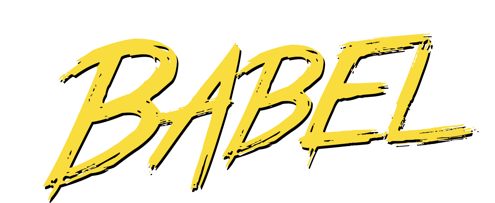

새로운 syntax를 즉시 사용할 수 있게 됨<br>
ES6+ 코드를 이전 브라우저 호환 코드로 컴파일

```js
 // ES6 arrow function code
 var sum = (num1, num2) => num1 + num2;

 // transpiled to ES5
 var sum = function(num1, num2) {
    return num1 + num2;
 }
```

<p class="size25">
    브라우저가 새 문법을 지원하지 않더라도 사용가능.<br>
    브라우저 native 지원 시, 필요하지 않은 영역
</p>

<p class="reference">
  [6to5](hhttps://github.com/babel/babel/commit/c97696c224d718d96848df9e1577f337b45464be)(ES6 &rarr; ES5) (2014/09), become 'Babel' 2015/02 ([Not Born to Die](https://babeljs.io/blog/2015/02/15/not-born-to-die))<br>
  [Sebastian McKenzie: JavaScript Transformation | JSConf US 2015](https://www.youtube.com/watch?v=rKuNbEwoQfQ) 
</p>

<!--
  JS만 아니라 CSS도 (preprocessor)
  [SASS](https://sass-lang.com/), [LESS](http://lesscss.org/) - CSS languages
  
  [Solar System Of JS](http://shaunlebron.github.io/solar-system-of-js/)
-->

----------

<!-- .slide: data-background-color="#65CFC2" -->
<h1 style="text-shadow:none;">2018년 동향</h1>

----------

#### 2018년 동향
# 언어적 관점

<p class="reference">
    [2018년과 이후 JavaScript의 동향 - JavaScript(ECMAScript)](https://d2.naver.com/helloworld/7495331)
</p>

----------

## 버전 구분 중요성 감소

### ES20xx/ESx

- Annual release로 인해 해마다 릴리스
 - 새로운 명세의 릴리스까지 너무 오래 소요
 - 단일 릴리스 모델의 한계
- Transpiler(Babel)는 최신 스펙 사용 이슈 해결
- 과거와 같이 버저닝에 큰 변화가 아닌 feature 단위
- [Evergreen 브라우저](https://tomdale.net/2013/05/evergreen-browsers/)는 스펙을 빠르게 구현

<p class="reference">
    [JavaScript — WTF is ES6, ES8, ES 2017, ECMAScript… ?](https://codeburst.io/javascript-wtf-is-es6-es8-es-2017-ecmascript-dca859e4821c)
</p>

----------

## What's Coming?

ES2017/ES8
  - [Async/Await](https://github.com/tc39/ecmascript-asyncawait)

```js
 async function getAPI() {
     let data = await some-async-call();  // 비동기 호출
     console.log(data);
 }
```

  - [Shared Memory and Atomics](https://github.com/tc39/ecmascript_sharedmem)

```js
 var sab = new SharedArrayBuffer(1024); // 버퍼 생성
 worker.postMessage(sab); // worker를 통해 데이터 공유

 var int32 = new Int32Array(sab);  // shared typedArray 객체 생성
 Atomics.wait(int32, 0, 0);  // typedArray 값을 테스트, true면 sleep

 console.log(int32[0]); // 쓰기 스레드가 새로운 값을 저장시 깨어나 값을 반환
```

----------

## ES2018/ES9
  - RegExp improvement
  - [Promise.prototype.finally](https://developer.mozilla.org/en-US/docs/Web/JavaScript/Reference/Global_Objects/Promise/finally)
  - [Async Iterators](https://github.com/tc39/proposal-async-iteration)

```js
 async function main() {
    for await (const x of ['c', 'd']) {
        console.log(x);
    }
 }
```

  - [Rest/Spread Properties](https://github.com/tc39/proposal-object-rest-spread)

```js
 // Rest Properties
 let {a, ...z} = { a: 1, b: 2, c: 3};  // z: {b, c}
 // Spread Properties
 let val = {a, ...z};  // val: {a, b, c}
```

----------

## ES2019/ES10
  - [Optional catch binding](https://github.com/tc39/proposal-optional-catch-binding) <span class="size25">catch 파라미터 생략 가능</span>

```js
  // 사용되지 않는 catch paramter
 try { ... } catch (unused) { ... }

 // allowing the omission of a catch binding
 try { ... } catch { ... }
```

  - [JSON Superset](https://github.com/tc39/proposal-json-superset) <span class="size25">extend ECMA-262 syntax into a superset of JSON</span>
    - <span class="size25">ECMAScript는 JSON.parse에서 JSON이 subset 임을 명시하나</span>
    - <span class="size25">JSON에는 unescaped U+2028(LINE SEPARATOR)와 U+2029 (PARAGRAPH SEPARATOR) 포함될 수 있지만 ECMAScript String에는 포함되지 않는 문법적 오류 해결을 위한 스펙</span>


<p class="reference">
    [TC39: Finished Proposals](https://github.com/tc39/proposals/blob/master/finished-proposals.md)
</p> 

----------


프로그래밍 언어(지금은 C와 C++)를 컴파일해,<br>
어느 브라우저에서나 빠르게 실행되는<br>
바이너리(low-level language)로 바꾸는 기술

<h3>주요 브라우저 및 Node.js 모두 지원!</h3>

<p class="reference">
 Support on [Chrome](https://www.chromestatus.com/features/5453022515691520), [FF](https://platform-status.mozilla.org/#wasm), [Safari](https://webkit.org/status/?#specification-webassembly) and [Edge](https://developer.microsoft.com/en-us/microsoft-edge/platform/status/webassemblymvp/)<br>
 [Node.js v8 support!](https://www.youtube.com/watch?v=hYrg3GNn1As)<br>
 [Webpack v4: WASM example](https://github.com/webpack/webpack/tree/master/examples/wasm-simple)
</p>

----------

# 정적 타입 시스템

JavaScript의 부족한 영역(loose typing)을 채워줌

- 버그감소 ([15% 감소](http://earlbarr.com/publications/typestudy.pdf) 연구결과)
- 효율적 코드작성 (Code Assist) - [TS definition(.d.ts)](https://github.com/Microsoft/dts-gen)
- as Languages: [TypeScript](https://www.typescriptlang.org/), [ReasonML](https://reasonml.github.io/), [PureScript](http://www.purescript.org/)
- as Tools: [Flow](https://flow.org/)

> TypeScript의 지속적인 영향력 확대<br>
> Angular, Vue.js, Polymer, ...

----------

#### 2018년 동향
# 라이브러리/프레임워크

<p class="reference">
    [2018년과 이후 JavaScript의 동향 - 라이브러리와 프레임워크](https://d2.naver.com/helloworld/3259111)
</p>

----------

## Job Trends

총 FE Developer 포지션 - [24,220](https://www.indeed.com/jobs?q=Front+End+Developer)

<iframe src="demo/demo01.html" style="marign-top:40px;width:600px;height:320px;min-height:320px" scrolling="no"></iframe>

<p class="reference">
    indeed.com (미국 / 2018.11.14 기준)<br>
    [React](https://www.indeed.com/jobs?q=react) / 
    [Angular](https://www.indeed.com/jobs?q=angular) / 
    [Vue.js](https://www.indeed.com/jobs?q=vue.js)
</p>

----------

<h2 style="margin:0"> React</h2>

- 2017 라이선스 이슈 <span class="size25">([BSD + Patents](https://wptavern.com/react-users-petition-facebook-to-re-license-react-js-after-apache-software-foundation-bans-bsdpatents-license-in-dependencies) &rarr; [Re-licensed to MIT](https://code.fb.com/web/relicensing-react-jest-flow-and-immutable-js/))</span>

- Features
    - [Improved Fragments](https://reactjs.org/blog/2017/11/28/react-v16.2.0-fragment-support.html): <span class="size25">Child node 추가 개선</span>
    - [New ContextAPI](https://medium.com/dailyjs/reacts-%EF%B8%8F-new-context-api-70c9fe01596b): <span class="size25">[prop drilling](https://www.reddit.com/r/reactjs/comments/4v3mcb/passing_down_too_many_props_to_child_components/) 이슈 해결 (이전 API는 16.x까지만 동작)</span>
    - Upcoming [Rendering Improvements](https://reactjs.org/blog/2018/03/01/sneak-peek-beyond-react-16.html)<br>
      <span class="size25">&rarr; Time Slicing(컴퓨터 성능 UX), Suspense(네트워크 성능 UX)</span>
   <!-- - [Profiler API](https://github.com/reactjs/rfcs/pull/51): <span class="size25">Collect timing information</span> / [React RFC](https://reactjs.org/blog/2017/12/07/introducing-the-react-rfc-process.html): <span class="size25">신규 제안 프로세스</span> -->
    - [create-react-app](https://twitter.com/i/web/status/955513652261482496) <span class="size25">인큐베이션 졸업, [v2 release](https://reactjs.org/blog/2018/10/01/create-react-app-v2.html) (2018.10.1)
    - [New Component Lifecycle](https://reactjs.org/blog/2018/03/29/react-v-16-3.html#component-lifecycle-changes) (v16.3):
      <span class="size25">componentWillMount, componentWillReceiveProps & componentWillUpdate [v17에서 제거예정](https://reactjs.org/blog/2018/03/27/update-on-async-rendering.html#gradual-migration-path)</span>

<p class="reference">
    [React v16.0](https://reactjs.org/blog/2017/09/26/react-v16.0.html)
</p>

----------

### React Hook (Proposal)

- 클래스를 작성하지 않고 state와 다른 React 기능을 손쉽게 사용
- React v16.7.0-alpha를 통해 사용 가능
- 'use' prefix를 갖으며, 커스텀 hook을 만드는 것도 가능

```js
import { useState } from 'react';

function Example() {
  // 상태 변수와 setter 선언
  const [count, setCount] = useState(0);

  return (
      <button onClick={() => setCount(count + 1)}>
        You clicked {count} times
      </button>
  );
}
```

<p class="reference">
    [React Conf 2018: React Today and Tomorrow and 90% Cleaner React With Hooks](https://www.youtube.com/watch?v=dpw9EHDh2bM)<br>
    [Introducing Hooks](https://reactjs.org/hooks)
</p>

----------

##  Vue.js

- Impressive 2017 - [40K GitHub Stars](https://risingstars.js.org/2017/en/#section-framework)
- Ecosystem is growing - [Nuxt.js](https://nuxtjs.org/), [Vuetify](https://vuetifyjs.com/)
- 네이티브 앱 개발 - [NativeScript-Vue](https://nativescript-vue.org/)

- Features
    - [drop IE support](https://hashnode.com/ama/with-vuejs-team-cj7itlrki03ae62wuv2r2005s)
    - [vue-cli](https://github.com/vuejs/vue-cli) v3: <span class="size25">[Build Targets](https://cli.vuejs.org/guide/build-targets.html) - Zero configuration (2018/8/13)<br>
      &rarr; app, lib or webcomponent(wc/wc-async)</span>

----------

## Vue.js 3.0 <span class="size40">(likely 2019)</span>

- Transpile 필요없는 native 클래스기반 컴포넌트
- 3.x 코드 베이스는 TypeScript로 작성 예정
- Proxy-based observer: <span class="size25">v2.0의 Object.defineProperty 기반 제한 제거</span>
- Lazy observation by default: <span class="size25">startup data oberserve 오버헤드 제거</span>
- Tree-shaking 친화적: <span class="size25">빌트인 컴포넌트&디렉티브 런타임 헬퍼 온디멘드 임포트</span>
- new Virtual DOM implementation
- 2.0보다 100% 이상 빠른 성능향상
- 별도 빌드 버전을 통한 IE11 지원

<p class="reference">
    Evan You - [Plans for the Next Iteration of Vue.js](https://medium.com/the-vue-point/plans-for-the-next-iteration-of-vue-js-777ffea6fabf) (2018/9/30)
</p>

----------

##  Angular

[Ivy Renderer](https://github.com/angular/angular/issues/21706): 
Next generation rendering pipeline<br>
<span class="size25">새로운 렌더러, 작고 빠른 컴파일 (v7에 포함되지 않음)</span>

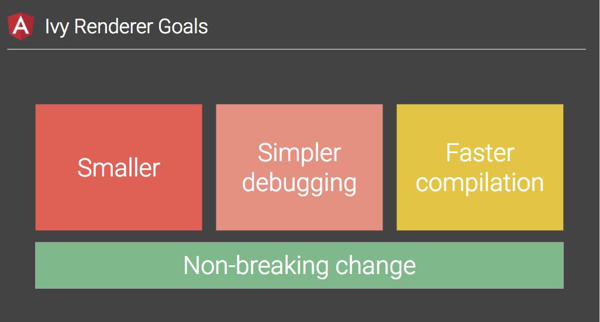


<p class="reference">
    Ivy Renderer: [ng-conf: Day 1 Keynote - Brad Green, Miško Hevery, Kara Erickson](https://www.youtube.com/watch?v=dIxknqPOWms&t=1360)
</p>

----------

## 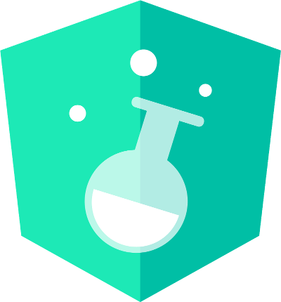 Angular Labs

- Angular Labs <span class="size25">(안정성 유지, 신규 연구결과 균형 조절 및 전달)</span>
  - <span class="size25">Schematics: 코드를 변환, 생성하는 도구</span>
  - <span class="size25">Component Dev Kit: 다양한 확장 도구</span>
  - <span class="size25">ABC(Angular + Bazel + Closure): Angular 애플리케이션 빌드도구</span>

- [Angular Elements](https://www.youtube.com/watch?v=vHI5C-9vH-E): <span class="size25">Angular 컴포넌트 &rarr; Custom Element</span>

<p class="reference">
    [Release Schedule](https://angular.io/guide/releases#release-schedule)
</p>

----------

### v7.0 (2018/10/18)
#### Material Design: CDK (Component Dev Kit)


<ul style="width:500px;font-size:1em">
    <li>
        <span class="yellow">Virtual Scrolling</span><br>
        &lt;cdk-virtual-scroll-viewport>  태그를 통해 뷰포트에 보여지는 내용만 출력
사용자가 스크롤시, load/unload
    </li>
    <li>
        <span class="yellow">Drag and Drop</span><br>
        다양한 드래그&드롭 기능 지원
    </li>
</ul>

<p class="reference" style="margin-top:50px">
    [Version 7 of Angular — CLI Prompts, Virtual Scroll, Drag and Drop and more](https://blog.angular.io/version-7-of-angular-cli-prompts-virtual-scroll-drag-and-drop-and-more-c594e22e7b8c)
</p>

----------

## Angular CLI

```bash
# update to v7
$ ng update @angular/cli @angular/core
```
- Built-In prompt: routing, CSS processor (ex.SASS)
- Bundle budget (2MB warn, 5MB error)

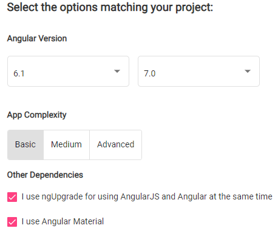

<p class="reference" style="margin-top:20px">
    [Angular Update Guide](https://update.angular.io/)
</p>

----------

<h3 style="margin:0"> Web Components</h3>

- All major browsers support<br>
  <span class="size25">&rarr; Edge w/Polyfill, [ShadowDOM](https://developer.microsoft.com/en-us/microsoft-edge/platform/status/shadowdom/?q=shadow%20dom) & [Custom Elements](https://developer.microsoft.com/en-us/microsoft-edge/platform/status/customelements/) in development</span>
- HTML imports &rarr; ESM 전환

<p class="size25" style="background-color:rgba(66,65,65,0.5);color:cyan;padding:20px;border-radius:10px;">
    Angular(Angular Element), Vue.js &rarr; 웹컴포넌트로 컴파일 가능
</p>

----------

<h3 style="margin:30px 0 5px 0"> Polymer</h3>

- Factory 메서드 통한 요소정의<br>
  &rarr; <span class="size25">표준 ES6 클래스/커스텀 엘리먼트 활용</span>
- [lit-html](https://github.com/Polymer/lit-html): <span class="size25">HTML 템플릿팅 라이브러리</span>
  - <span class="size25">DOM 렌더링 집중 like JSX &rarr; 표준기술(Tagged Template)이므로 빌드 과정 필요없음</span>
  - <span class="size25">VDOM과 유사하게 업데이트된 영역만 렌더링 하지만, diffing 작업없어 효율적</span>
  
```js
import {html, render} from 'lit-html';

// A lit-html template uses the `html` template tag:
let sayHello = name => html`<h1>Hello ${name}</h1>`;

// It's rendered with the `render()` function:
render(sayHello('World'), document.body);
```

----------

#### 2018년 동향
# 브라우저 밖의 영역

<p class="reference">
    [2018년과 이후 JavaScript의 동향 - 브라우저 밖의 JavaScript](https://d2.naver.com/helloworld/5644368)
</p>

----------

# 

- 2017년, 2억5천만 다운로드
- 다양한 영역의 기업들 사용증가
- 주로 Back-end 영역의 사용
- [N-API (Node.js API)](https://nodejs.org/api/n-api.html#n_api_n_api) <span class="size25">런타임 엔진과 Node.js 간의 추상화 레이어<br>
  &rarr; Replacing NAN(Native Abstractions for Node.js)</span>
- 실험적 [Node-ChakraCore](https://github.com/nodejs/node-chakracore)
- [WebAssembly and Node.JS](https://www.youtube.com/watch?v=hYrg3GNn1As)

<p class="reference">
    [10 Things I Regret About Node.js - Ryan Dahl - JSConf EU 2018](https://www.youtube.com/watch?v=M3BM9TB-8yA)
</p>

----------

#### 패키지 관리자: 

[Do not use Bower](https://bower.io/blog/2017/how-to-drop-bower-support/)<br>

- 전세계 가장 큰 레지스트리로 성장 <span class="size25">(2018/10 기준, 80만개)</span>
- [npx, package runner](https://medium.com/@maybekatz/introducing-npx-an-npm-package-runner-55f7d4bd282b)
- repo 변경: <span class="size25">https://github.com/npm/npm &rarr; https://github.com/npm/cli</span>
- GitHub issue &rarr; [npm.community](https://blog.npmjs.org/post/175587538995/announcing-npmcommunity) 포럼 전환 (2018/7)
- <a href="https://en.wikipedia.org/wiki/Npm_(software)#Notable_breakages">npm의 사고들</a> <span class="size25">([Linux 파일시스템 권한 변경](https://github.com/npm/npm/issues/19883), [eslint-scope](https://www.npmjs.com/package/eslint-scope))</span>

----------

#### 패키지 관리자: 

[50만개 프로젝트](https://github.com/search?utf8=%E2%9C%93&q=filename%3Ayarn.lock+path%3A%2F&type=Code)에서 사용
- [workspaces](https://yarnpkg.com/blog/2017/08/02/introducing-workspaces/): 
  <span class="size25">다중 패키지의 monorepo 구조에서의 효율적 패키지 관리</span>
- [resolution](https://yarnpkg.com/lang/en/docs/selective-version-resolutions/): 
  <span class="size25">의존성 서브 패키지의 버전 관리</span><br><br>

#### 얼만큼 사용되나? <span class="size25">(yarn을 통한 패키지 다운로드)</span>
- 2018.10/13 ~ 11/10: <span class="red" style="font-weight:bold;text-decoration:underline;font-size:50px">6백9십만</span> 다운로드 발생<br>
  &rarr; <span class="size25">전체 npm 다운로드의 0.03%</span>
  
<p class="reference">
  https://stats.yarnpkg.com/
</p>

----------

# npm vs yarn

초기 yarn의 장점(속도) 점점 퇴색

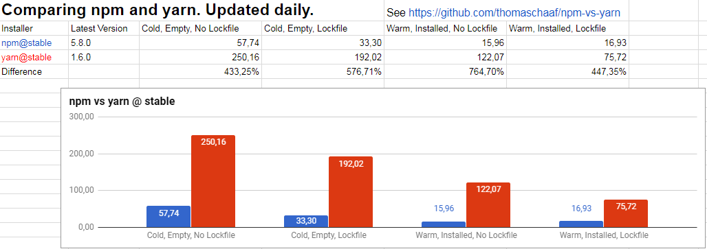

<p class="reference">
    https://github.com/thomaschaaf/npm-vs-yarn
</p>

----------

# 번들러/빌드 도구

  [v4](https://medium.com/webpack/webpack-4-released-today-6cdb994702d4) (2018/02)
- 향상된 빌드 시간: 60~98% 감소
- [mode property](https://webpack.js.org/concepts/mode/) (0CJS)<br>
  &rarr; development | production | none
- split cli: [webpack-cli](https://webpack.js.org/api/cli/)

> 생태계는 메이저 업데이트에<br> <!-- .element: class="fragment" --> 
> 준비되지 않았을 수 있다.

----------

# 0CJS
#### Zero Configuration JS

<p class="fragment">
    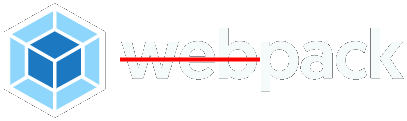
    <blockquote class="fragment">Configuration Headache</blockquote>
</p>

<p class="fragment">
     <br>
    
    [Parcel](https://medium.com/@devongovett/announcing-parcel-a-blazing-fast-zero-configuration-web-application-bundler-feac43aac0f1)과 같은 도구는 무설정 번들링 지향
</p>

----------

# 모바일 애플리케이션

- webview를 래핑하는 형태의 hybrid-app은 죽어감
- JS to Native 형태의 네이티브 개발이 자리잡은 상태

----------


- Angular friendly
- [NativeScript UI](https://www.nativescript.org/ui-for-nativescript): UI 컴포넌트(차트, 캘린더, 등) 무료제공
- [NativeScript-Vue](https://nativescript-vue.org/)를 통한 Vue.js 지원
- AR및 TV 플랫폼 지원 확산

<p class="reference">
    [Roadmap & Release Notes](https://www.nativescript.org/roadmap-and-releases)
</p>

----------

### NativeScript: Code Sharing

[nativescript-schematics](https://github.com/nativescript/nativescript-schematics)을 통해<br>
웹과 모바일 앱을 단일 프로젝트에서 개발할 수 있다.

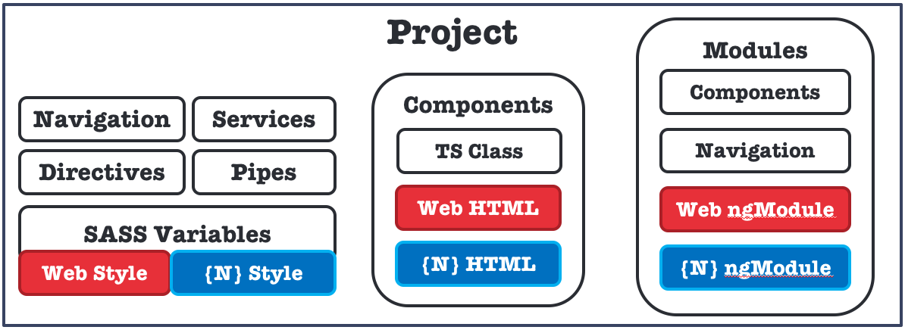

```bash
$ npm i -g @nativescript/schematics
$ ng new --collection=@nativescript/schematics my-mobile-app
```

<p class="reference">
    [Code Sharing](https://docs.nativescript.org/code-sharing/intro)<br>
    @angular/cli: 6.1+ 이상에서 사용가능
</p>

----------

#  React Native

- React 인기에 더불어 인기상승
- [create-react-native-app](https://github.com/react-community/create-react-native-app) 발표 (July 24, 2017)<br>
  <span class="size25">&rarr; [has been merged with Expo CLI](https://github.com/react-community/create-react-native-app/blob/master/CHANGELOG.md#201-september-21-2018) (September 21, 2018)</span>

- [TV 플랫폼(Android/Apple) 지원](https://facebook.github.io/react-native/docs/building-for-apple-tv.html)
- 다양한 생태계/도구체인 - ex. [Expo](https://github.com/expo/xde/)

----------

# 데스크톱 애플리케이션

> 모두 Chromium 기반

<br>
세밀한 제어 기능 제공<br>
<span class="size25">&rarr; [Windows95](https://github.com/felixrieseberg/windows95) 같은 프로젝트 등장</span>

<h3 style="margin:30px 0 10px 0"> NW.js</h3>
웹앱을 빠르게 데스크톱앱으로 전환시 장점

----------

# 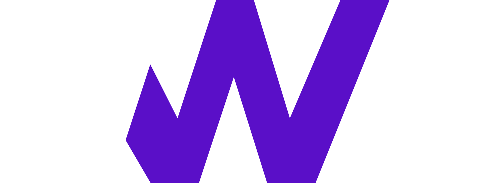

[Safari](https://twitter.com/rmondello/status/979470498714103808)와 [Edge](https://docs.microsoft.com/en-us/microsoft-edge/dev-guide#progressive-web-apps) 지원 추가로 드디어 기본 사용환경 갖춤  
- [is ServiceWorker ready?](https://jakearchibald.github.io/isserviceworkerready/)

본격적인 분위기는 아직 무르익지 않았지만,<br>
계속해서 사용 증가할 것으로 예측

다양한 도구의 등장
- [Workbox](https://developers.google.com/web/tools/workbox/), [HNPWA](https://hnpwa.com/), [PWA Starter Kit](https://github.com/Polymer/pwa-starter-kit), [pwa-helpers](https://github.com/Polymer/pwa-helpers)

----------

## Chrome Audit

크롬 개발자 도구 성능 측정 도구에서 PWA 항목 평가 제공
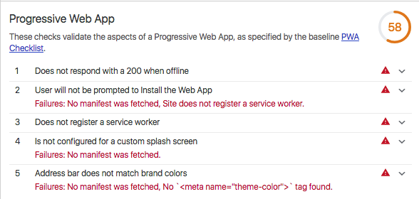

----------

## WebXR Device API

- WebVR refactoring 필요성 제기<br>
  - <span class="size25">WebVR API &rarr; WebXR Device API</span>
- [Immersive Web](https://github.com/immersive-web): <span class="size25">웹에서 몰입 환경 구현 위한 신기술 모음</span>

<p style="padding:3px;background-color:#fff;width:650px;margin:10px auto">
    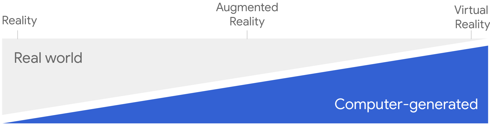
</p>

> 아직 성숙 단계는 아니기 때문에,<br>
> 가능성을 확인하는 형태로의 접근

<p class="reference">
    [Welcome to the immersive web](https://developers.google.com/web/updates/2018/05/welcome-to-immersive) / 
    [WebXR Samples](https://immersive-web.github.io/webxr-samples/)
</p>

----------

### Chrome에서 활성화

chrome://flags/#webxr

```js
 navigator.xr.requestDevice().then(device => {
    device.supportSession({ exclusive: true })
        .then(() => {
            // enabled VR
        }).catch(err => {
            console.error(`VR not found!: ${err}`);
        });
 });
```
<p class="reference">
    [The future of the web is immersive (Google I/O '18)](https://www.youtube.com/watch?v=1t1gBVykneA)
</p>

----------

<!-- .slide: data-background-color="#D0A45F" -->
<h3 style="text-shadow:none;">JavaScript는</h2>
<h1 style="text-shadow:none;">어디로 가고 있나?</h1>

----------

## 흐릿해지는 경계
#### (Backend/Frontend)

FE와 BE 구분없이, 하나의 코드셋으로 모든 곳에서 실행<br>
[Universal JavaScript](https://cdb.reacttraining.com/universal-javascript-4761051b7ae9)

<div>
    <a href="https://nodejs.org/" title="Node.js"></a>
    <a href="https://zeit.co/blog/next" title="Next.js"></a> 
    <a href="https://koajs.com/" title="koa"></a> 
    <a href="https://nuxtjs.org/" title="Nuxt.js"></a><br>
    <a href="https://sailsjs.com/" title="sails.js"></a>
    <a href="https://hapijs.com/" title="hapi">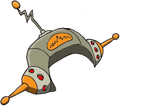</a> 
    <a href="https://expressjs.com/" title="express.js"></a>
    <a href="https://www.meteor.com/" title="meteor"></a>
</div>

<p class="reference">
    Node.js는 Back-end에서 주로 사용<br>
    [Node.js:2017 User Survey Executive Summary](https://foundation.nodejs.org/wp-content/uploads/sites/50/2017/11/Nodejs_2017_User_Survey_Exec_Sum.pdf)
</p>

----------

#### Intent to merge
### Node.js + JS Foundation

JS의 역할과 다양한 환경으로의 확장에 따른 환경변화

<p>
    지속적이고 견실한 성장을 위한<br>
    생태계 협업의 필요성이 어느 때보다도 중요
</p>

<a href="https://foundation.nodejs.org/" target="_new"></a>
<a href="https://js.foundation/" target="_new"></a>

<p class="reference">
    [Node.js Foundation and JS Foundation Announce Intent to Create Joint Organization](https://www.linuxfoundation.org/news/2018/10/node-js-foundation-and-js-foundation-announce-intent-to-create-joint-organization-to-support-the-broad-node-js-and-javascript-communities/) (2018.10.4)
</p>

----------

<!-- .slide: data-background-color="#64A4F5" -->
<h3 style="text-shadow:none;">JavaScript로부터</h3>
<h1 style="text-shadow:none;">생존하기</h1>

----------

## JavaScript Fatigue

많은 가이드들은 몇가지만 설치/설정하면<br>
쉽다([out of the box](https://en.wikipedia.org/wiki/Out_of_the_box_(feature))...고 말한다.

수많은 플러그인과 설정 등을 접하다보면<br>
## 쉬운거 맞어? <!-- .element: class="fragment" -->

우리는 <!-- .element: class="fragment" -->
- 무엇을 알아야 할까? <!-- .element: class="fragment" -->
- 얼만큼 알아야 할까? <!-- .element: class="fragment" -->

----------

<h4 style="display:inline-block">How to stay:</h4> <h3 style="display:inline-block">Up-to-date?</h3>

#### 1) Trends
- [GitHub Trending](https://github.com/trending): 새로운/떠오르는 프로젝트 확인
- [FE Tech Mailings](https://medium.com/@sapegin/development-mail-lists-bc55cf894b1e): 최신 소식 업데이트
<br><br>

#### 2) Browsers Update

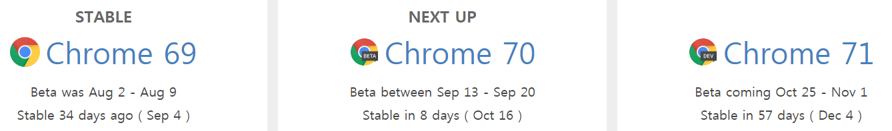

[Chrome](https://www.chromestatus.com/features/schedule) / [WebKit](https://webkit.org/status/) / 
[MS Edge](https://developer.microsoft.com/en-us/microsoft-edge/platform/status/) / [Firefox](https://platform-status.mozilla.org/)

----------

## Keep eyes on

다른 사람들은 어떻게 생각하나?

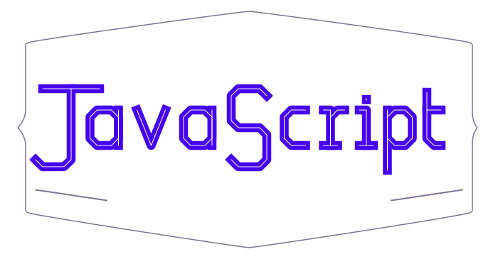
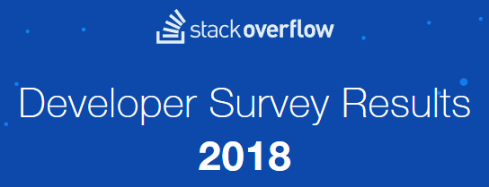


- [State Of JS](https://stateofjs.com/)
- [Stack Overflow Annual Developer Survey](https://insights.stackoverflow.com/survey/)
- [Medium's javascript posts](https://medium.com/tag/javascript)

<p class="reference">
    [Frontend Roadmap](https://github.com/kamranahmedse/developer-roadmap#-frontend-roadmap)<br>
    [Frontend Path & Courses for Learning Front End](https://codeburst.io/the-2018-web-developer-roadmap-826b1b806e8d#3284)
</p>

----------

# 컨퍼런스

많은 컨퍼런스들이 행사 종료 후, 세션 비디오를 공개<br>
> 스케줄을 살펴보는 것만으로도<br>
> 현재의 흐름을 파악할수 있다.

- [JSConf](https://www.youtube.com/channel/UCzoVCacndDCfGDf41P-z0iA)
- [Fluent](https://www.safaribooksonline.com/library/view/fluent-conference-/9781492026037/)
- [dotJS](https://www.youtube.com/playlist?list=PLMW8Xq7bXrG4gs_BDyI7q009IVDUMQRXB)
- [JS Kongress](https://www.youtube.com/channel/UCe2uw4y9oTxfq-Z61ODWRhg)
- [Netflix JavaScript Talks](https://www.youtube.com/playlist?list=PLfXiENmg6yyU5kEHyo1kYkq7HEzBOoiTT)

<p class="reference">
    https://github.com/frontendfront/front-end-conferences
<p>

----------

### 무엇이 옳은 선택인가?
#### 매몰비용 오류의 함정

특정 도구에 투자한 노력이 많아지면, 나의 선택(도구)이 합리적이었다는 것을 자신이나 다른 사람들에게 설득하기 위해 노력

> AngularJS 등장 &rarr; 모든 것을 AngularJS로!

현재는?
> React, React and React 

----------

### Magpie  Developer
### syndrome

대체로 개발자들은<br>
기존에 문제없이 사용하던 기술들을 뒤로하고,<br>

<h2 class="fragment">'새롭고  반짝'</h2>

이는 것들에 너무 쉽게 관심을 빼앗긴다.

<p class="reference">
    [The Magpie Developer](https://blog.codinghorror.com/the-magpie-developer/)<br>
    Magpie logo from, [Magpie Brewing Co.](http://www.magpiebrewing.com/)
</p>

----------

#### 무엇을 사용하던간에
### 결국 JavaScript 아닌가?

Transpiling: 결국 실행되는 JS 코드 생성 필요

> [TS adds sweetness, but at a price.](https://plus.google.com/+DouglasCrockfordEsq/posts/MgzNUSTwjRt)<br>
> &dash; Douglas Crockford


<p class="reference">
    [JavaScript vs. TypeScript vs. ReasonML](http://2ality.com/2018/03/javascript-typescript-reasonml.html)<br>
    [Here is why you might NOT want to use TypeScript](https://medium.jonasbandi.net/here-is-why-you-might-not-want-to-use-typescript-50ab0d225bdd)
</p>

----------

## 지속적 복잡도 증가

이미 필수적인 도구들도 넘쳐나는 상황에서<br>
무언가를 하나 추가할 때마다 비례하는 도구들의 증가

> xxx-loader-xxx, xxx-plugin-xxx, ...

2018/11 기준, 플러그인 수: 
- webpack
  - plugin: [3,534](https://www.npmjs.com/search?q=webpack%20plugin)개
  - loader [3,650](https://www.npmjs.com/search?q=webpack%20loader)개
- babel [3,315](https://www.npmjs.com/search?q=babel%20plugin)개

----------

## 최신 업데이트
### 항상 정답인가?

도구들의 업데이트에 따라 코드 수정이 필요한 모순적 상황<br>
이러한 작업은 때에 따라 많은 리소스 수반

메이저 업데이트 후, 수많은 플러그인들은<br>
대비되지 않거나 대체제가 없기도

<p class="reference">
    Babel 7: [Major Breaking Changes](https://babeljs.io/blog/2018/08/27/7.0.0#major-breaking-changes)<br>
    Webpack 4: [Breaking changes for plugins/loaders](https://github.com/webpack/webpack/wiki/Changelog-WIP#breaking-changes-for-pluginsloaders)
</p>

----------

## Webpack's case

webpack-dev-server: 'maintenace mode'로 전환발표<br>
이제, 다시 개발 진행한다고 함

> webpack-dev-server &rarr; webpack-serve<br>
> &rarr; 다시 webpack-dev-server

[webpack-cli](https://github.com/webpack/webpack-cli)도 동일 &rarr; [webpack-command](https://github.com/webpack-contrib/webpack-command) (now deprecated)

<p class="fragment yellow">
    Why deprecated webpack-command?<br>
    webpack-cli is very stable and have more features
</p>

<p class="reference">
[Remove obsolete maintenance note](https://github.com/webpack/webpack-dev-server/commit/6c1d8d8ea1c06831a4360cdb661cc58bb52d77ec#diff-04c6e90faac2675aa89e2176d2eec7d8)<br>
[Clarify relationship with webpack-serve](https://github.com/webpack/webpack-dev-server/issues/1493)
</p>

----------

#### 각자의 사정은 모두 다르다.
## '무엇'이 정답이라 할수 없다.

과거 jQuery, AngularJS가 답처럼 여겨졌지만,<br>
지금 React가 대세적인 흐름의 상태에서<br>
Angular가 정답이라고 할수 있을까?

> 그때는 맞고, 지금은 틀리다. <!-- .element: class="fragment" style="color:cyan;font-size:50px" -->

----------

## 모든 것을 다 알아야 할까?

<p>
누군가는 '특정'영역에 보다 관심을 쏟을 수 있고,<br>
더 '많이' 알고 있을 수도 있다.<br>
</p>

> 그것이 모범적인 '답변'일까? <!-- .element: class="fragment" style="color:cyan;font-size:50px" -->

----------

## 모든 것을 알수 있을까?

Linus Torvalds가 모든 Linux의 모든 생태계의 변화들을,<br>
Brendan Eich가 모든 JS 생태계의 변화들을

> # 알고 있을거라고 생각하시나요? <!-- .element: class="fragment" -->

----------

## 우리의 자세는?

> [Everything is amazing<br> and nobody is happy](https://www.youtube.com/watch?v=q8LaT5Iiwo4)

- "Expert"로써 모든 플랫폼의 모든 것을 알아야 한다는 생각 <!-- .element: class="fragment" -->
- 모든 것을 배우는 것이 해결책인가? <!-- .element: class="fragment" -->
- 단순하게 현재 작업에 필요한 것, 또는 끌리는 것에 집중 <!-- .element: class="fragment" -->

<p class="reference" style="margin-top:50px">
    <br>[Why I’m Thankful for JS Fatigue](https://medium.com/javascript-scene/why-im-thankful-for-js-fatigue-i-know-you-re-sick-of-those-words-but-this-is-different-296fae0c888f)<br>
    [A Study Plan To Cure JavaScript Fatigue](https://medium.freecodecamp.com/a-study-plan-to-cure-javascript-fatigue-8ad3a54f2eb1)
</p>

----------

## 결국은 적당한 밸런스

너무 많은 것을 알려고 하지 않아도 된다.<br>
그러나, 적당한 '호기심'과 '지속적'인 꾸준함은 필요

<hr width=150 style="margin:50px auto">

## JavaScript
### is a Journey!
