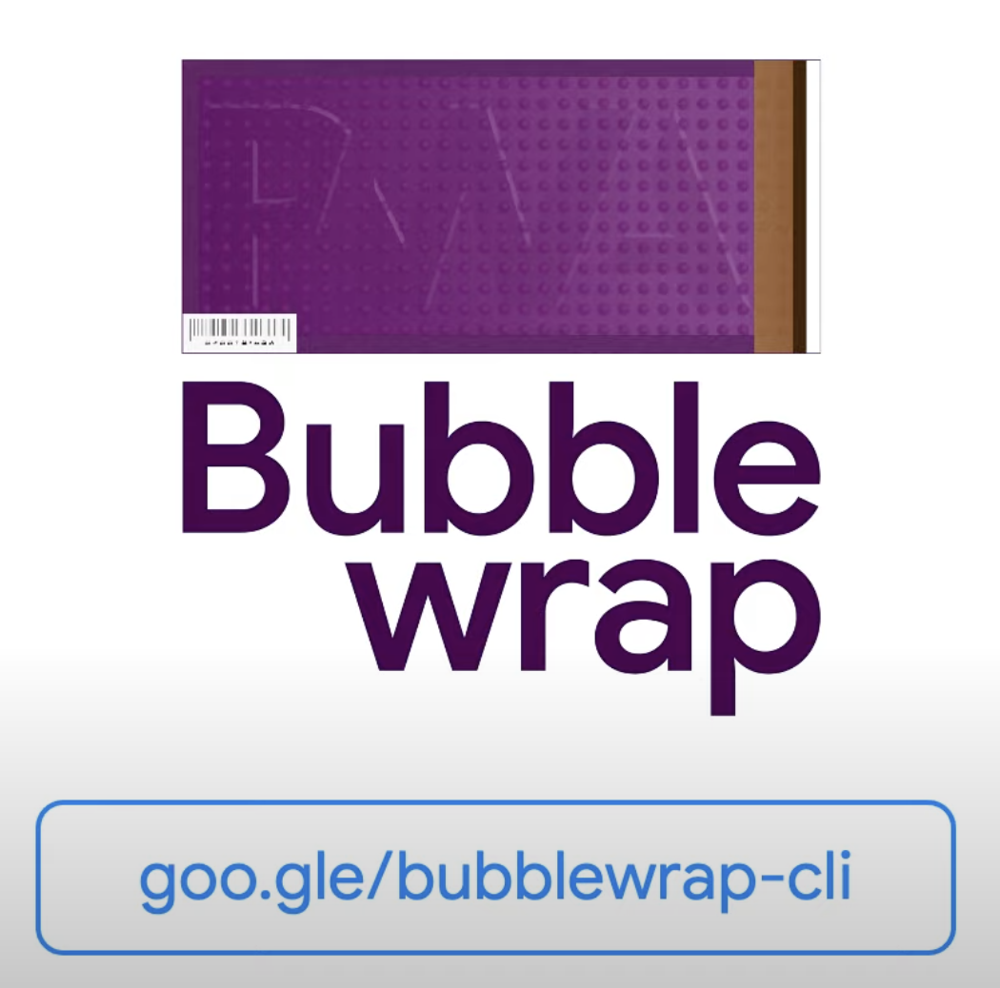

## talk is about

빠르게 변하는 JS/FE의 2021년 생태계의<br>
변화들을 이야기합니다.

<p class="size18" style="margin-top:150px;opacity:0.5">
  💡 발표 자료는 <span class="underline cyan">2021/10월 기준</span>으로 작성되었습니다.<br><br>
  생태계의 방대함과 시간적 제약으로 인해, 세부 내용까지 다루지는 않습니다.<br>
  보다 자세한 내용은 각 장표에 포함된 참고 링크를 통해 확인 바랍니다.
</p>

----------

#### 네이버 기술 블로그: D2 HelloWorld <!-- .element: class="m-0" -->
## JavaScript 동향 시리즈

연도 | 문서
--- | ---
2016 | [2016년과 이후 JavaScript의 동향](http://d2.naver.com/helloworld/3618177)
2017 | [JavaScript(ECMAScript)](http://d2.naver.com/helloworld/2809766)<br>[라이브러리와 프레임워크](http://d2.naver.com/helloworld/7229119)<br>[브라우저 밖의 JavaScript](http://d2.naver.com/helloworld/0473039)
2018 | [JavaScript(ECMAScript)](http://d2.naver.com/helloworld/7495331)<br>[라이브러리와 프레임워크](https://d2.naver.com/helloworld/3259111)<br>[브라우저 밖의 JavaScript](https://d2.naver.com/helloworld/5644368)
2019 | [JavaScript(ECMAScript)](https://d2.naver.com/helloworld/4007447)<br>[WebAssembly](https://d2.naver.com/helloworld/8786166)<br>라이브러리와 프레임워크 ([#1](https://d2.naver.com/helloworld/0145894), [#2](https://d2.naver.com/helloworld/2108442))<br>브라우저 밖의 JavaScript ([#1](https://d2.naver.com/helloworld/7700312), [#2](https://d2.naver.com/helloworld/7975004))
2020 | [JavaScript(ECMAScript)](https://d2.naver.com/helloworld/4268738)<br>[WebAssembly](https://d2.naver.com/helloworld/8257914)<br>라이브러리와 프레임워크 ([#1](https://d2.naver.com/helloworld/7226235), [#2](https://d2.naver.com/helloworld/6951656))

----------

<!-- .slide: data-background-image="./img/bg02.png" -->

<h1 class="index"><span>1</span></h1>

## JavaScript  <!-- .element: class="m-0" -->
### (ECMAScript)

<br>


----------

## ECMAScript 2021/ES12

명세 | 설명
--- | ---
[String.prototype.replaceAll](https://github.com/tc39/proposal-string-replaceall) | 정규식 `g` 플래그와 특수문자<br>escape 처리 불편함을 제거<br><pre><code>'xxx'.replace(/(?:)/g, '-'); // '-x-x-x-'</code></pre><pre><code>'xxx'.replaceAll('', '-'); // '-x-x-x-'</code></pre>
[Promise.any](https://github.com/tc39/proposal-promise-any) | 여러 개의 Promise 모음 중, 첫 번째로 이행(fulfilled)되고,<br>처리(resolved)된 Promise를 반환
[WeakRefs](https://github.com/tc39/proposal-weakrefs) | 약한 참조(weak reference)를 갖는 객체를 저장해,<br>참조되지 않지만 GC에 포함되지 않는 상황을 예방
[Logical Assignment Operators](https://github.com/tc39/proposal-logical-assignment) | `&&= \|\|= ??=`<br>논리 연산자와 할당 표현식의 혼합 사용
[Numeric Separators](https://github.com/tc39/proposal-numeric-separator) | 긴 숫자 값에 대한 가독성을 위해<br>`_`(underscore)를 구분자로 사용<br>ex) `1000000000 --> 1_000_000_000`

----------

## ECMAScript 2022/ES13

public, private, static 사용에 대한 명세

- [Private methods and getter/setters for JavaScript classes](https://github.com/tc39/proposal-private-methods)
- [Class field declarations for JavaScript](https://github.com/tc39/proposal-class-fields)
- [Static class features](https://github.com/tc39/proposal-static-class-features)

<div style="font-size:22px;width:70%;margin:0 auto">

```js [3-4,8,13-14,17-19]
// Field Declaration
class Counter extends HTMLElement {
  x = 0; // public field
  static red = "#ff0000";  // static public field

  constructor() {
    super();
    // this.x = 0; <-- 이렇게 생성자에서 하지 않고, 상위 선언 가능
  }

// Private Fields
class Counter extends HTMLElement {
  #x = 0; // private field
  static #red = "#ff0000"; // static private field

  clicked() {
    this.#x++;

	static #some() { // static private method
  ```

</div>

----------

명세 | 설명
--- | ---
[RegExp Match Indices](https://github.com/tc39/proposal-regexp-match-indices) | 새로운 `d` 플래그를 통해 매칭 문자열의<br>시작과 종료 index를 반환
[Top-level await](https://github.com/tc39/proposal-top-level-await) | async 함수 없이,<br>상위 레벨에서 `await` 사용
[Ergonomic brand checks for Private Fields](https://github.com/tc39/proposal-private-fields-in-in) | private 필드값의 존재 유무 판단하고<br>없다면, fallback 제공
[Accessible Object.prototype.hasOwnProperty](https://github.com/tc39/proposal-accessible-object-hasownproperty) | `Object.prototype.hasOwnProperty`<br>➡ Object.hasOwn()로 접근성 개선
[Class Static Block](https://github.com/tc39/proposal-class-static-block) | 클래스 정의시에 추가적인<br>static 초기화 방법을 제공

----------


## What's coming?

- [Import Assertions](https://github.com/tc39/proposal-import-assertions) (Stage 3)<br>
  서버가 잘못된 MIME 타입을 잘못 처리해<br>
  발생될 수 있는 보안이슈를 제거하기 위함

- [JSON Modules](https://github.com/tc39/proposal-json-modules) (Stage 3)<br>
  JSON을 보편적 방식의 모듈로 import 한다.<br>
  Import Assertions 명세의 일부였으나, [20/7월 명세를 분리](https://github.com/tc39/notes/blob/master/meetings/2020-07/july-21.md#import-conditions-for-stage-3)
  <div style="font-size:1.05em;width:600px">

  ```js []
  import json from "./foo.json" assert { type: "json" };
  import("foo.json", { assert: { type: "json" } });
  ```
  </div>

----------

- [Error Cause](https://github.com/tc39/proposal-error-cause) (Stage 3)<br>
  오류 객체 초기화시 추가 옵션 객체 필드 `cause` 추가

<div style="font-size:1em;width:65%;margin:-10px auto">

  ```js [4,12]
  async function doJob() {
    const rawResource = await fetch('//domain/resource-a')
      .catch(err => {
        throw new Error('Download raw resource failed', { cause: err });
      });
  }

  try {
    await doJob();
  } catch (e) {
    console.log(e);
    console.log('Caused by', e.cause);
  }
  // Error: Upload job result failed
  // Caused by TypeError: Failed to fetch
  ```
</div>

- [Temporal](https://github.com/tc39/proposal-temporal) (Stage 3)<br>
  모던한 날짜/시간 API를 제공해 기존 Date 객체를 개선

  <p style="text-align:center" class="m-0">
    
  </p>

[ECMAScript proposals: Stage 3](https://github.com/tc39/proposals#stage-3) <!-- .element: class="reference" -->

----------

<!-- 
is possible most run JavaScript?


https://youtu.be/krB0enBeSiE?t=5450

-->

<!-- .slide: data-background-image="./img/bg03.png" -->
<h1 class="index"><span>2</span></h1>

<br>

----------

## 웹에서의 wasm

많은 이들은 현재 웹 개발을 위해 사용하고,<br>
미래에도 웹에 커다란 영향을 줄것이라 생각하고 있다.

<!-- <div class="grid" style="grid-template-columns:50% 50%">
  
  
</div> -->

<br>
  

[The State of WebAssembly 2021](https://blog.scottlogic.com/2021/06/21/state-of-wasm.html)  <!-- .element: class="reference" -->

----------

## wasm 개발에 사용하는 언어?

[Rust](https://www.rust-lang.org/)(26%) > [C++](https://isocpp.org/) > [AssemblyScript](https://www.assemblyscript.org/) > [Blazor](https://dotnet.microsoft.com/apps/aspnet/web-apps/blazor) 순

<br>

[Languages for wasm](https://blog.scottlogic.com/2021/06/21/state-of-wasm.html#language) <!-- .element: class="reference" -->

----------

## Universal Runtime(VM)? <!-- .element: class="m-0" -->

wasm의 사용은 웹으로만 국한될까?<!-- .element: class="m-0" -->

> <!-- .element: class="fragment fade-right" -->
> WASM + WASI가 2008년에 존재했었더라면, Docker를 만들<br>
> 필요성이 없었을 것이다...서버에서 wasm은 컴퓨팅의 미래다.<br>
> 🔖 Solomon Hykes (Docker 공동 창업자)<br>
> <span class="size18">https://twitter.com/solomonstre/status/1111004913222324225</span>


> <!-- .element: class="fragment fade-left" -->
> 범용 VM 아이디어 실현은 https://webassembly.org 이다.<br>
> 🔖 Brendan Eich<br>
> <span class="size18">https://twitter.com/BrendanEich/status/1001307081725562882</span>

----------

친숙한 도구와 언어로 개발하고 wasm으로 컴파일<br>
모든 OS에서 실행되거나 다른 언어에 임베드해서 사용 가능

<br>

<a href="https://wasmer.io/"></a>
  - [12여개 언어 임베딩](https://github.com/wasmerio/wasmer#-language-integrations) 지원

[`wasmtime`](https://github.com/bytecodealliance/wasmtime)
 - [6개 언어 임베딩](https://github.com/bytecodealliance/wasmtime#language-support) 지원

----------

## 

클라우드 네이티브, [edge](https://ko.wikipedia.org/wiki/%EC%97%90%EC%A7%80_%EC%BB%B4%ED%93%A8%ED%8C%85), 분산화 환경<br>
애플리케이션을 위한 wasm 런타임이며,<br>
가장 [빠른 성능](https://github.com/WasmEdge/WasmEdge#performance)을 보유하고 있다.

[Second State](https://www.secondstate.io/)에서 [SSVM](https://github.com/WasmEdge/WasmEdge/tree/0.1.0)(Second State Wasm VM) 이름으로<br>
19/6월 [개발을 시작](https://github.com/WasmEdge/WasmEdge/commit/33b28d4f236318d63f50f0ede1d26202d9a8e895)했고,<br>
[0.8 릴리스](https://github.com/WasmEdge/WasmEdge/releases/tag/0.8.0)에 현재의 프로젝트명으로 변경했다.

[CNCF 샌드박스 프로젝트](https://www.cncf.io/sandbox-projects/)로 [21/6월 승인](https://www.secondstate.io/articles/wasmedge-joins-cncf/)되었다.


C/C++, Rust, Swift, AssemblyScript, Kotlin 코드로 작성된<br>
wasm 바이트코드 프로그램 실행과 임베드된 [QuickJS](https://github.com/second-state/wasmedge-quickjs) 엔진을 통해<br>
[wasm 내에서 JavaScript 코드도 실행](https://github.com/WasmEdge/WasmEdge/blob/master/docs/run_javascript.md)할 수 있다.


https://github.com/WasmEdge/WasmEdge <!-- .element: class="reference" -->

----------

> wasmtime + Lucet = wasmtime  <!-- .element: class="green" -->

[Lucet](https://github.com/bytecodealliance/lucet) ([Fastly](https://www.fastly.com/blog/announcing-lucet-fastly-native-webassembly-compiler-runtime))과 [Wasmtime](https://wasmtime.dev/)(Mozilla)은 각각 개발사들이<br>
Bytecode Alliance에 참여한 후, 프로젝트가<br>
모두 <a href="https://bytecodealliance.org/"></a> 저장소로 이동했었다.

2020년 중반, Lucet 팀은 Wasmtime 프로젝트에 노력을 집중하기로 결정하고,<br>
Lucet는 메인터넌스 모드로 전환되었다.

Bytecode Alliance 산하의 또 다른 프로젝트인<br>
[WAMR(WebAssembly Micro Runtime)](https://github.com/bytecodealliance/wasm-micro-runtime)도 개발되고 있으며,<br>
wasm 인터프리터, AoT, JIT 컴필레이션을 지원한다.

----------

## [QuickJS](https://bellard.org/quickjs/)

QuickJS는 C로 작성된 임베딩 JavaScript 엔진(JIT 지원없는 인터프리터) 이다.

WasmEdge은 별도의 포팅 버전 [wasmedge-quickjs](https://github.com/second-state/wasmedge-quickjs)이 제공되며,<br>
또다른 런타임인 [Wasmer](https://wasmer.io/)에서도 [qjs.wasm](https://wapm.io/package/quickjs) 모듈을 통해 사용할 수 있다.

<div style="width:67%;margin:0 auto;font-size:2em">

```sh [1,3-4]
$ wasmer qjs.wasm
QuickJS - Type "\h" for help
qjs > const i = 1 + 2;
qjs > console.log("hello " + i);
hello 3
```

</div>

wasm 모듈로 제공되므로,<br>
사실상 모든 wasm 런타임에서 사용할 수 있다.

----------

### WebAssembly Roadmap


<!--
명세 | 설명
--- | ---
[Import/Export of Mutable Globals](https://github.com/WebAssembly/mutable-global) |
[Non-trapping float-to-int conversions](https://github.com/WebAssembly/nontrapping-float-to-int-conversions) |
[Sign-extension operators](https://github.com/WebAssembly/sign-extension-ops) |
[Multi-value](https://github.com/WebAssembly/multi-value) |
[JavaScript BigInt to WebAssembly i64 integration](https://github.com/WebAssembly/JS-BigInt-integration) |
[Reference Types](https://github.com/WebAssembly/reference-types) |
[Bulk memory operations](https://github.com/WebAssembly/bulk-memory-operations) |
-->


<p class="reference">
  <a href="https://webassembly.org/roadmap/">Roadmap</a><br>
  <a href="https://github.com/WebAssembly/proposals">WebAssembly proposals</a>
</p>

----------

## WebAssembly W3C 프로세스  <!-- .element: class="m-0" -->

<div style="width:90%;font-size:0.85em;margin:0 auto">

Phase | 단계 | 설명 & 필수요건
--- | --- | ---
0 | Pre-Proposal<br>[Individual Contributor] | 초기 제안단계로,<br>[design](https://github.com/WebAssembly/design/issues) repo를 통해 제안
1 | Feature Proposal<br>[Community Group] | 초기 제안 진행여부 투표 통과
2 | Proposed Spec Text Available<br>[Community + Working Group] | 영문 텍스트 제안서 제공
3 | Implementation Phase<br>[Community + Working Group] | 구현과 테스트 세트
4 | Standardize the Feature [Working Group] | 2개 이상의 Web VM, 1개 이상의 툴체인에서의 구현과 커뮤니티 그룹의 승인
5 | The Feature is Standardized [Working Group] | 완료. 기능적 완료에 대한 워킹 그룹<br>구성원들간의 공감대 형성

</div>

[WebAssembly W3C Process](https://github.com/WebAssembly/meetings/blob/main/process/phases.md) <!-- .element: class="reference" -->

----------

<!-- .slide: data-background-image="./img/bg01.png" -->
<h1 class="index"><span>3</span></h1>

## Frameworks
Another day, another new JavaScript Framework

----------

##  React

### Server Components <!-- .element: class="m-0" -->
새로운 유형의 컴포넌트 제안 <!-- .element: class="m-0" -->

<div class="size25 grid" style="margin-top:20px">


- 클라이언트와 서버 통신은 결과적으로 느리다.
- 컴포넌트를 서버로 이동, 데이터 처리는<br>서버에서 이뤄지도록 한다.
- 서버 컴포넌트는 번들(webpack으로 번들)에<br>포함하지 않고 필요한 코드만 로딩되게 한다.
- 개발 진행을 통해 `18 ~ 29%` 번들 크기 감소
- SSR을 대체하는 것이 아님
</div>

----------

컴포넌트 | 확장자 | 의미
--- | --- | ---
Server | `.server.js` |  BE 리소스(DB, 파일시스템 등)에 직접 접근
Client | `.client.js` | 현재의 일반적 클라이언트 컴포넌트를 의미<br>BE 리소스 접근되지 않는다.
Shared | `.js` | 데이터 변환 처리 로직만을 포함, BE 리소스의<br>상태/영향을 사용하지 않아 어디서든 사용가능하다.

<p class="reference">
  <a href="https://reactjs.org/blog/2020/12/21/data-fetching-with-react-server-components.html">Introducing Zero-Bundle-Size React Server Components</a>
</p>

----------

## v18 Plan

21/6월 차기 버전에 대한 내용을 공개

- [New Root API](https://github.com/reactwg/react-18/discussions/5)
- [SSR support for Suspense](https://github.com/reactwg/react-18/discussions/22)

### Concurrent features <!-- .element: style="margin:40px auto 5px auto" -->
- [startTransition](https://github.com/reactwg/react-18/discussions/41)<br>
	특정 상태 전환 업데이트에 대해 "transition"으로 처리해, 응답성을 유지
- [useDeferredValue](https://reactjs.org/docs/concurrent-mode-reference.html#usedeferredvalue)<br>
	화면에서 덜 중요한 영역의 업데이트를 지연해, 중요한 영역이 우선되게
- [`<SuspenseList>`](https://reactjs.org/docs/concurrent-mode-reference.html#suspenselist) ([데모](https://codesandbox.io/s/black-wind-byilt))<br>
	하위 트리에 있는 `<Suspense>`의 공개와 로딩 인디케이터 노출 순서를 조율
- [Streaming SSR with selective hydrations](https://github.com/reactwg/react-18/discussions/37)<br>
	앱 로드 및 인터랙티브 속도 향상

[The Plan for React 18](https://ko.reactjs.org/blog/2021/06/08/the-plan-for-react-18.html) <!-- .element: class="reference" style="margin-top:20px" -->

----------

- [Automatic Batching](https://github.com/reactwg/react-18/discussions/21)<br>
  <span class="size18">💡 `Batch?` 성능을 위해, 다중 상태 업데이트를 단일 재렌더링으로 수행</span><br>
  React 이벤트 핸들러내 작업만 배칭에서, Promise, setTimeout 등으로 확장
- [react-devtools](https://github.com/facebook/react/tree/main/packages/react-devtools)
- [React Working Group](https://github.com/reactwg/react-18/discussions)<br>
  GitHub의 discussion을 사용한 워킹그룹으로<br>
  생태계의 v18 점진적 채택을 위한 준비<br>
  [React Labs: React 18 Working Group Q&A [Audio]](https://www.youtube.com/watch?v=F4YjkMqTgao) <!-- .element: class="reference" -->

21/5월, [첫 번째 alpha](https://github.com/reactwg/react-18/discussions/9) 공개했고, `@alpha` tag를 통해 다운로드 가능

> npm install react@alpha react-dom@alpha

v18 릴리스 일정: <!-- .element: class="cyan underline" -->
- 공개 베타: 최소 수개월 뒤
- RC: 공개베타 이후 수주 뒤
- GA: RC 이후 수주 뒤 공개

[Installing React 18 Alpha](https://github.com/reactwg/react-18/discussions/9) <!-- .element: class="reference" -->

----------

##  Vue.js
### IE11 지원중단

Vue.js 3에 대한 IE11 빌드 제공에 대한 계획을 밝혔었지만,<br>
최종적으론 지원 중단을 발표

그 이유로는

<div class="grid" style="grid">


- MS 스스로도 IE 사용하지 않도록 권고 및<br>
자사 서비스들의 지원중단 선언
- IE11 지원은 많은 비용 필요
- 꼭 필요한 경우라면, Vue 2를 사용할 것을 권고<br>
  Vue 3의 중요한 기능들이 Vue 2.7에 구현될 예정

</div>

<p class="reference">
  <a href="https://github.com/vuejs/rfcs/blob/ie11/active-rfcs/0038-vue3-ie11-support.md">vue3-ie11-support</a><br>
  <a href="https://github.com/vuejs/rfcs/discussions/296">Proposal for dropping ie11 support in Vue 3</a>
</p>

----------

## DX 개선 <!-- .element: class="m-0" -->
#### Developer eXperience <!-- .element: class="m-0" -->

<div style="font-size:21px">

- Authoring experience
  - [`<script setup>`](https://github.com/vuejs/rfcs/blob/master/active-rfcs/0040-script-setup.md)<br>
  	SFC의 새로운 스크립트 타입으로, 최상위 바인딩을 템플릿에 노출
  - [`<style vars="{some}">` 변수 주입](https://github.com/vuejs/rfcs/blob/sfc-improvements/active-rfcs/0000-sfc-style-variables.md)<br>
	SFC 스타일에 컴포넌트 상태 CSS 변수 주입
  - [Ref sugar](https://github.com/vuejs/rfcs/discussions/369)<br>
  	반응형 변수 `$()` 사용을 위한  컴파일러 매크로 집합

- [Vue Devtools](https://github.com/vuejs/devtools) 6.0 beta
  - Vue 2, 3 듀얼버전 지원
  - Vuex 통합 예정
  - 타임라인 뷰, 성능 프로파일링

- Better IDE/TS 지원
  - [Vetur](https://github.com/vuejs/vetur) Vue tooling for VS Code
  - [VueDX](https://github.com/vuedx/languagetools) A set of tools for better DX for Vue

</div>

----------

## 생태계: [Volar](https://github.com/johnsoncodehk/volar)


- Vue의 언어적 지원을 위한 VSCode IDE 플러그인
- VSCode 익스텐션과 CLI 타입검사 도구를 제공
- [SFC(Single File Component)](https://v3.vuejs.org/api/sfc-spec.html)를 위한 TSX 같은 IDE 경험을 제공

<h3 style="margin:30px 0 0 0"><a href="https://youtu.be/G-UBEjYyqjo?t=810">Plan</a></h3>

- 새로운 VSCode 공식 익스텐션은 Volar를 기반 예정
- [@vue/cli](https://cli.vuejs.org/) 타임검사 도구는 volar의 [vue-tsc](https://github.com/johnsoncodehk/volar/tree/master/packages/vue-tsc) 기반

----------

## v3.2 (21/8월) <!-- .element: class="m-0" -->

<div class="size18">

- 새로운 SFC 기능들: [`<script setup>`](https://v3.vuejs.org/api/sfc-spec.html#script-setup),<br>
  [`<style> v-bind`](https://v3.vuejs.org/api/sfc-style.html#state-driven-dynamic-css): 컴포넌트 상태값 바인딩
- Reactivity 시스템과 템플릿 컴파일러 성능 개선
- SSR 개선: [`@vue/server-renderer`](https://github.com/vuejs/vue-next/tree/master/packages/server-renderer#streaming-api) 패키지<br>
	Node.js 빌트인과 디커플링된 ESM 빌드 제공,<br>
	비 Node.js 런타임에서 사용되도록 번들링 가능<br>
	<a href="https://ssr.vuejs.org/" class="reference" style="display:inline-block;margin-top:5px;font-size:15px">Vue.js Server-Side Rendering Guide</a>
- 웹컴포넌트 요소인 [Custom Elements](https://developer.mozilla.org/en-US/docs/Web/Web_Components/Using_custom_elements) 생성을 도와주는<br>
	새로운 [defineCustomElement](https://v3.vuejs.org/guide/web-components.html#definecustomelement) 메서드
  <div style="font-size:1.1em;width:110%;margin:-10px 0">

	```js []
	import { defineCustomElement } from 'vue'

	const MyVueElement = defineCustomElement({
	// normal Vue component options here
	})

	// Register the custom element.
	// After registration, all `<my-vue-element>` tags
	// on the page will be upgraded.
	customElements.define('my-vue-element', MyVueElement)
	```
  </div>

<p class="quote fragment fade-up" style="margin:0 auto">
  2021/2Q 에 npm 배포 태그(latest)가 3으로 전환될 것이라고 밝혔지만,<br>
  현시점(21/10)까지도 v3은 `next` 태그에서 배포 중
</p>

</div>

<p class="reference">
	<a href="https://blog.vuejs.org/posts/vue-3.2.html">Vue 3.2 Released!</a>
</p>

----------

## [`@vue/compat`](https://github.com/vuejs/vue-next/tree/master/packages/vue-compat)

Vue 3 기반의 특별한 빌드로, Vue 2 앱이 3에서 Vue 2 모드로 실행될 수 있게 한다.<br>
Vue 2 애플리케이션을 3로 업그레이드하거나<br>
라이브러리들이 3를 지원하는데 사용될 수 있다.

<div style="font-size:1.5em;width:60%;margin:0 auto">

```diff []
// package.json
"dependencies": {
-  "vue": "^2.6.12",
+  "vue": "^3.1.0",
+  "@vue/compat": "^3.1.0"
   ...
},
"devDependencies": {
-  "vue-template-compiler": "^2.6.12"
+  "@vue/compiler-sfc": "^3.1.0"
}
```

</div>

기존 Vue 2 앱에, Vue 2를 제거하고 Vue 3와 compat를 설치하고,<br>
앱의 실행시 오류와 경고 메세지에 따른 항목들을<br>
수정한 후, compat 패키지를 제거하는 것으로 마이그레이션을 수행

[Migration Build](https://v3.vuejs.org/guide/migration/migration-build.html) <!-- .element: class="reference" -->

----------

<h2 class="m-0"> Angular</h2>

### v12 (21/5월)

- `enableIvy:false` 설정은 더이상 View Engine을<br>
  사용한 애플리케이션 개발은 지원되지 않는다.<br>
  v12로 작성된 애플리케이션은 모두 Ivy를 사용하게 된다.
- Tooling은 Webpack 5를 사용하며, Webpack 4 지원과 사용은 제거
- [새로운 빌드 옵션 `inlineStyleLanguage`](https://github.com/angular/angular-cli/pull/20514): 스타일의 인라인 컴포넌트 스타일 정의
  - CSS(기본값), Sass, SCSS, LESS 지원
- [Critical CSS 인라이닝은 기본 설정](https://github.com/angular/angular-cli/pull/20096)되며,<br>
  해제하려면 `inlineCritical:false`를 설정해야 한다.
- `ng build`는 [기본값으로 production 빌드를 생성](https://github.com/angular/angular-cli/pull/20128)
- 템플릿에서 Nullish Coaslescing(`??`) 지원

<div style="width:70%;margin: 0 auto">

```js []
// 기존 템플릿 조건식
{{age !== null && age !== undefined ? age : calculateAge() }}

// Nullish Coalescing을 통해 단순화된 조건식
{{ age ?? calculateAge() }}
```

</div>

[Angular v12 is now available](https://blog.angular.io/angular-v12-is-now-available-32ed51fbfd49) <!-- .element: class="reference" -->

----------

## v13 (21/11월 예정) & Roadmap

- [IE11 지원 중단](https://github.com/angular/angular/issues/41840), [View Engine](https://angular.io/guide/roadmap#remove-legacy-view-engine)은 제거 예정
- [Modern Angular Package Format](https://github.com/angular/angular/issues/38366) (APF) 제안
  - npm에 배포되는 `Ivy-native` 라이브러리 포맷으로,<br>기존 ViewEngine 라이브러리 배포 포맷을 대체
  - APF는 UMD 번들 제거, ES2020 output
- 빌드 경험 개선 `ng build`<br>
  - [CLI: JS optimizer로 `esbuild` + `terser` 도입](https://github.com/angular/angular-cli/blob/master/CHANGELOG.md#v1220-next1-2021-07-01)
  <br>
  전체 빌드 파이프라인 개선과<br>
  `build optimizer ➡ Babel Transform` 전환을 통해 빌드 속도 `20%+` 향상 

<p class="reference" style="margin-top:50px">
  <a href="https://youtu.be/b8mcnjK_kq4?t=1182">State of Angular | October 2021</a><br>
  <a href="https://angular.io/guide/roadmap">Angular Roadmap</a>
</p>

----------

## 

e2e 테스트 프레임워크 [Protractor](https://www.protractortest.org/) 미래 논의<br>

<div class="fragment fade-right">

> 2022년말 개발 중단 계획 <!-- .element: class="cyan" -->

</div>


- 2013년 처음 개발당시와 현재 환경 발전의 차이로 인해<br>
  테스트 재작성 없이 새로운 기술을 활용할 수 없는 문제
- 신규 프로젝트에 포함시키지 않고 선택사항으로 변경.<br>
  CLI를 통해 다른 서드파티 포함 옵션 추가 계획<br>
  [Cypress](https://www.cypress.io/), [WebbdriverIO](https://webdriver.io/), [TestCafe](https://testcafe.io/)와 협업 진행중

[Future of Angular E2E & Plans for Protractor](https://github.com/angular/protractor/issues/5502) <!-- .element: class="reference" -->

----------

## 

<div class="grid" style="grid-template-columns:45% 55%">
  
  
  - Stackoverflow 설문조사에서 개발자들이<br>
    가장 관심(loved)갖는 프레임워크로 답변
  - 전에도 그리고 앞으로 사용여부 질문엔<br>
    5위를 기록 (1위는 React)
</div>

[stackoverflow 2021 Developer Survey: Web frameworks](https://insights.stackoverflow.com/survey/2021#most-loved-dreaded-and-wanted-webframe-love-dread) <!-- .element: class="reference" -->

----------

## 

[Sapper](https://sapper.svelte.dev/)를 계승하는 애플리케이션 프레임워크<br>
Next.js의 Svelte 버전이라고 생각하면 된다.

모던 기술 프랙티스를 활용해 Svelte 앱을<br>
쉽게 개발할 수 있으며 파일 기반 라우팅을 제공한다.


- [Snowpack ➡ Vite 전환](https://svelte.dev/blog/sveltekit-beta#From_Snowpack_to_Vite)
- SvelteKit SSR 향상을 위한 신규 패키지 [`svelte/ssr`](https://github.com/sveltejs/svelte/pull/6416)
- [21/3월 public bata](https://svelte.dev/blog/sveltekit-beta) 및 1.0까지 작업 중으로, 마일스톤 상으론 84% 완료


https://kit.svelte.dev/ <!-- .element: class="reference" -->

----------

## 

Solid는 사용자 인터페이스를 만들 수 있는 선언적이며,<br>
유연한 라이브러리 VDOM 사용하지 않고,<br>
템플릿을 통해 실제 DOM으로 컴파일

<div class="grid" style="grid-template-columns:60% 40%;justify-items:left;width:90%;margin:0 auto;">


- 2016년 개발 시작,<br>
	5년만에 1.0 릴리스
- JSX 문법 사용

</div>

React의 철학과 유사하게 단방향 데이터 흐름, 읽기/쓰기 분리,<br>
불변성 인터페이스 원리를 따르지만<br>
VDOM을 사용하지 않고 완전히 다르게 구현


[Official results for js web frameworks benchmark](https://krausest.github.io/js-framework-benchmark/index.html) <!-- .element: class="reference" -->

----------

## Example

1초 인터벌마다 상탯값이 증가하는 카운터 예제 <!-- .element: class="m-0" -->

<div class="grid code" style="grid-gap:0;grid-template-columns:38% 62%;">

<div class="fragment fade-up" style="font-size:22px">

main.tsx

```js []
import {render} from "solid-js/web";
import {onCleanup, createSignal} from "solid-js";

const CountingComponent = () => {
  const [count, setCount] = createSignal(0);
  const interval = setInterval(() => 
      setCount(count => count + 1)
    , 1000);

  onCleanup(() => clearInterval(interval));

  return <div>Count value is {count()}</div>;
};

render(() => <CountingComponent />,
    document.getElementById("app"));
```

</div>

<div class="size18 fragment fade-up" style="font-size:0.9em">

Compiled output

```js [4, 15-18]
import {template, render, createComponent, insert} from 'solid-js/web';
import {createSignal, onCleanup} from 'solid-js';

const _tmpl$ = template(`<div>Count value is </div>`, 2);

const CountingComponent = () => {
  const [count, setCount] = createSignal(0);
  const interval = setInterval(() =>
    setCount(count => count + 1)
  , 1000);

  onCleanup(() => clearInterval(interval));
  
  return (() => {
    const _el$ = _tmpl$.cloneNode(true);
          _el$.firstChild;

    insert(_el$, count, null);

    return _el$;
  })();
};

render(() => createComponent(CountingComponent, {}),
    document.getElementById("app"));
```

</div>
</div>

[Example: Counter](https://www.solidjs.com/examples/counter) <!-- .element: class="reference" -->

----------

<!-- .slide: data-background-image="./img/bg02.png" -->
<h1 class="index"><span>4</span></h1>

## Runtime

----------

##  

<div class="grid">


- N-API ➡ [Node-API](https://nodejs.org/api/n-api.html#n_api_node_api)로 [이름 변경](https://nodejs.medium.com/renaming-n-api-to-node-api-27aa8ca30ed8)<br>
  Node-API는 [네이티브 Node 애드온](https://nodejs.org/api/addons.html#addons_node_api) 개발에<br>사용되며, 종종 "NAPI"로 발음되었다.<br>
  그러나, [경멸적 용어](https://www.npr.org/sections/codeswitch/2019/08/09/412886884/the-racial-roots-behind-the-term-nappy)로 오인될 소지가 있어, 이름을 변경
- [WASI(WebAssembly System Interface) 지원](https://nodejs.org/dist/latest-v16.x/docs/api/wasi.html)<br>
  실험적 WASI API를 제공한다. WASI는 샌드박스된<br>
  wasm 애플리케이션에 OS의 POSIX 유사함수에<br>접근할 수 있게 한다.
- [next-10](https://github.com/nodejs/next-10)<br>
  성공적이었던 지난 10년을 기반으로, 향후 10년에 대한<br>
  전략적 방향성 논의를 위한 기록 저장소

</div>

[Release schedule](https://github.com/nodejs/Release) <!-- .element: class="reference" -->

----------

##  Corepack

Node.js 16.9에 기본 포함된 실험적 스크립트 도구<br>
Node와 패키지 매니저(Yarn, Pnpm 같은)간 브릿지처럼 동작

npm 외의 서드파티 패키지 관리자를<br>
<span class="cyan">전역에 설치하지 않고</span> 사용할 수 있게 한다.

많은 경우 npm 사용이 문제 없지만, 필요에 따라<br>
다른 패키지 관리자(현재 Yarn과 pnpm 지원)를 사용해야 하는 경우를 위해 제공

<div class="grid code" style="width:90%">

```sh []
# corepack 사용을 활성화
$ corepack enable

# 프로젝트에 yarn을 설치하고 사용을 활성화 한다.
$ corepack prepare yarn@1.22.11 --activate

# 특정 패키지 매니저를 활성화 하는 경우
$ corepack enable yarn

# yarn을 사용해 axio를 설치
$ corepack yarn add axios

# 비활성화 하는 경우
$ corepack disable
```

```json []
// https://nodejs.org/api/packages.html#packages_packagemanager
// package.json
{
	"packageManager": "yarn@1.22.11",
	...
}
 ```

 </div>

<p class="reference">
	<a href="https://github.com/nodejs/corepack">https://github.com/nodejs/corepack</a><br>
	<a href="https://javascript.plainenglish.io/what-is-corepack-in-node-js-d26dfc2cae43">What is Corepack in Node.js?</a>
</p>


----------

## Pure ESM

<div class="grid code" style="width:80%;margin:0 auto;grid-template-columns:20% 80%;grid-gap:0;text-align:left">

```json


 // package.json
 {
   "type": "module",
   ...
 }
```

가장 가까운 부모의 pakcage.json에<br>
`"type":"module"` 설정된 경우, `.js` 확장자는<br>
ESM으로 로딩된다.

</div>

즉, 프로젝트 의존성 패키지가 `"type":"module"` 설정되었다면,<br>
자신도 `"type":"module"` 설정필요

이 경우, `.js`는 ESM으로 처리되고, CJS는 `.cjs` 확장자를 가져야 한다.

그렇지 않을 경우

<div style="width:80%;margin:0 auto" class="fragment fade-up">

```sh
Error [ERR_REQUIRE_ESM]: Must use import to load ES Module: ...
require() of ES modules is not supported.
require() of ... from ... is an ES module file as it is a .js file whose nearest parent package.json
contains "type": "module" which defines all .js files in that package scope as ES modules.
Instead rename index.js to end in .cjs, change the requiring code to use import(), or
remove "type": "module" from .../package.json.
...
    at Object.Module._extensions..js (internal/modules/cjs/loader.js:1080:13)
    at Module.load (internal/modules/cjs/loader.js:928:32)
	...
```

</div>

<p class="reference">
  <a href="https://gist.github.com/sindresorhus/a39789f98801d908bbc7ff3ecc99d99c">Pure ESM packages</a>
</p>

----------

### 사용자 측면
- CJS를 ESM으로 전환하고, package.json에 `"type":"module"` 설정
- 비동기 문맥에서는 `await import(...)`를 적용
- ESM 이동이 준비되지 않았다면, 현재 상태(의존성 패키지 버전 포함)를 유지

### 라이브러리 측면 <!-- .element: style="margin:50px 0 0 0" -->
## Dual CJS/ESM
아직 생태계는 준비되지 않았으므로,<br>
<span class="cyan">Dual CJS/ESM 패키지</span>를 제공하는 것 필요

<div style="font-size:1.2em;width:50%;margin:0 auto">

```json []
// package.json
{
  "type": "module",
  "exports": {
    "import": "./main-module.js",
    "require": "./main-require.cjs"
  },
}
```

</div>

<p class="reference">
  <a href="https://nodejs.org/api/packages.html#packages_dual_commonjs_es_module_packages">Dual CommonJS/ES module packages</a>
</p>

----------

##  Deno

20/5월, [1.0 릴리스](https://deno.com/blog/v1/) 이후,<br>
<span class="cyan">사용 가능성과 확장성</span>을 위한 작업들을 진행

- [Deno Company](https://deno.com/blog/the-deno-company/) 설립<br>
	초기 투자에 Next.js의 Guillermo Rauch([Rauch Capital](https://angel.co/v/back/rauch-capital)),<br>
  Mozilla 주식회사 등이 참여
- [Deno Deploy](https://deno.com/deploy/) 발표<br>
  - Deno CLI를 통해 배포할 수 있는 분산 시스템 환경<br>
  - 21/10 현재, [Beta 2](https://deno.com/blog/deploy-beta2/) 상태로, 무료로 제공되나 이후 유료 전환예정<br>
  - [전세계 25개 리전](https://deno.com/deploy/docs/regions/)을 통해 배포
- [deno.land/x](https://deno.land/x) - 패키지 레지스트리
- deno 번들러: <a href="https://github.com/kt3k/packup"></a> 개발중<br>
- [MDN 호환성 테이블에 Deno 항목 노출되기 시작](https://deno.com/blog/deno-on-mdn/)

----------

<!-- .slide: data-background-image="./img/bg03.png" -->
<h1 class="index"><span>5</span></h1>

## Package Manager

----------

##  

GitHub의 [npm 인수 (20/3월)](https://github.blog/2020-03-16-npm-is-joining-github/) 후,<br>
주요 소식은 GitHub 블로그를 통해 공유

<div class="size18">

### npm v7 (20/10월)  <!-- .element: style="margin:50px 0 0 0" -->
- [Workspaces](https://github.com/npm/rfcs/blob/latest/implemented/0026-workspaces.md)<br>
  단일 최상위 레벨(root 패키지) 내에서 여러 패키지를 관리 지원 제공

- [Peer dependency  자동설치](https://github.com/npm/rfcs/blob/latest/implemented/0025-install-peer-deps.md)<br>
  v7 이전엔 개발자들이 직접 peer dependency 설치 필요했지만,<br>
  새로운 알고리즘은 `node_modules` 트리에서 일치하는 패키지가 발견되도록 보장

- [새로운 package-lock 포맷 v2, 그리고 yarn.lock 지원](https://blog.npmjs.org/post/621733939456933888/npm-v7-series-why-keep-package-lockjson)<br>
  - 새로운 포맷은 재현 가능한 빌드 구성과,<br>
  	패키지 트리 구축에 필요한 모든 정보를 포함
  - v7 전에는 무시되었던 `yarn.lock`은<br>
  	패키지 구성과 가이던스 소스로 활용 가능

</div>

[Presenting v7.0.0 of the npm CLI](https://github.blog/2020-10-13-presenting-v7-0-0-of-the-npm-cli/) <!--- .element: class="reference" -->

----------

## npm v8 (21/10월)

v8이 1년여 만에 새로 릴리스 되었고,<br>
Node.js의 LTS 생명주기에 맞추기 위한 목적

- 이에 따라 `node<12` 지원 중단
- 지원되는 Node.js 버전이 아닌경우, 설치되지 않도록 변경<br>
  `npm@6`가 `node@8` 환경에서 `npm@7` 설치가 가능해 발생했던 이슈를 제거

<p class="reference" style="margin-top:50px">
	<a href="https://github.blog/changelog/2021-10-07-npm-cli-upgraded-to-version-8/">npm CLI upgraded to version 8</a><br>
	<a href="https://github.com/npm/rfcs/issues/445">[RRFC] Breaking changes for npm@8</a>
</p>

----------

##  

- 참여 확대: 메인터너들 중, Facebook 소속은 이제 없다. 
- v3 작업 시작
  - Node 10 지원중단
  - Node corepack 지원
  - esbuild 지원
    - esbuild를 사용해 Yarn 번들을 생성
    - [@yarnpkg/esbuild-plugin-pnp](https://github.com/yarnpkg/berry/tree/master/packages/esbuild-plugin-pnp)<br>
      ➡ Yarn과 esbuild를 사용할 수 있도록 해준다.
  - [PnP](https://yarnpkg.com/features/pnp) 모드에서 ESM 지원

현재 RC 단계로, 다음과 같이 설치할 수 있다.

<div style="width:60%;margin:0 auto">

```sh
$ npm install -g yarn    # update the global yarn to latest v1
$ yarn set version berry # enable v2
$ yarn set version 3.x   # update to v3
```

</div>

<p class="reference">
  <a href="https://dev.to/arcanis/yarn-3-0-performances-esbuild-better-patches-e07">Yarn 3.0 🚀🤖 Performances, ESBuild, Better Patches, ...</a><br>
  <a href="https://github.com/yarnpkg/berry/blob/master/CHANGELOG.md#300">Yarn 3.0 Changelog</a>
</p>

----------

##  pnpm

 2016년 처음 발표되었던, pnpm(Performant npm)의<br>
 가장 큰 특징은 '<span class="underline cyan">효율적 디스크 사용</span>'

어떻게 동작하나?<br>
단일 공간에 패키지를 저장하고, 심볼릭 링크를 통해 공유


https://pnpm.io/ <!-- .element: class="reference" -->

----------

npm은 모든 패키지들이 모듈 디렉토리 루트(`node_modules`)에<br>
플랫하게 위치(hoist)하며, 동일 패키지들이 각 프로젝트별 설치된다.

플랫하게 만드는 이유는 소스 코드들이 프로젝트 의존성으로<br>
추가되지 않는 경우라도 접근이 가능하게 하기 위함

pnpm은 여러 프로젝트들에서 의존성을 갖는 동일 패키지를 <span class="green underline">한 번만 설치</span>하고,<br>
심볼릭 링크로 연결해 디스크를 효율적으로 사용한다.

<div class="grid code" style="width:90%;margin: 0 auto;justify-items:none">

```sh
$ npm install express

/node_modules/
	.bin/
	accepts/
	array-flatten/
	body-parser/
	bytes/
	content-disposition/
	cookie-signature/
	...
	# 총 48개 디렉토리 생성
```

```sh
$ pnpm add express

/node_modules/
	.pnpm/   # virtual store directory
	.modules.yaml
	express # Symbolic Link	

  # express 심볼릭 링크엔 다음과 같은 내용이 포함된다.
  # .pnpm/express@4.17.1/node_modules/express
```

</div>

https://github.com/zkochan/comparing-node-modules <!-- .element: class="reference" -->

----------

<!-- .slide: data-background-image="./img/bg01.png" -->
<h1 class="index"><span>6</span></h1>
도구의 전성시대

## Tools <!-- .element: style="margin:30px 0 0" -->
### Bundler/Build

----------

## 새로운 트렌드? <!-- .element: class="m-0" -->


- 비 JavaScript 언어를 JavaScript 도구에 사용
  - Rust: [Deno](https://deno.land/), [swc](https://github.com/swc-project/swc), [Rome](https://github.com/rome/tools), [dprint](https://github.com/dprint/dprint), [Volta](https://github.com/volta-cli/volta), [fnm](https://github.com/Schniz/fnm)
  - Go: [esbuld](https://github.com/evanw/esbuild)
  - OCaml: [Flow](https://github.com/facebook/flow)
- 개발 시점에선 unbundled 방식의 접근 <!-- .element: style="margin-top:20px" -->
- 빌드 도구들이 다른 빌드/번들 도구에 의존
- 스캐폴딩 + 빌드/번들러 형태로의 확장

<!-- <p style="position:absolute;top:10px;left:610px;"></p>
<p style="position:absolute;top:340px;left:610px;"></p>

<div style="position:absolute;line-height:0.5;top:40px;left:220px;font-weight:800">
    esbuild<br>
    
</div>

<div style="position:absolute;line-height:0.5;top:380px;left:220px;font-weight:800">
    esbuild<br>
    
</div>

 -->

----------

##  esbuild

Go로 작성된 번들러로, [20/1월](https://github.com/evanw/esbuild/commit/23c40b1b6a76a8626f1d160f89677ed2c73b6090) [Evan Wallace](https://github.com/evanw)에 의해 개발되었다.

빌드 도구의 성능에 새로운 시대를 여는 것을 목표하며,<br>
TS/JSX 등 모던 번들러가 제공하는 기능들이 기본 제공된다.


esbuild를 사용하는 도구들:
- Yarn
- Angular CLI
- Vite ➡ SvelteKit
- Packup

https://esbuild.github.io <!-- .element: class="reference" -->

----------

##  Vite

quick을 뜻하는 프랑스어 "Vite"(`/vit/`, "veet"로 발음)는<br>
Evan You가 개발([20/4월 개발시작](https://github.com/vitejs/vite/commit/820c2cfbefd376b7be2d0ba5ad1fd39d3e45347e#diff-7ae45ad102eab3b6d7e7896acd08c427a9b25b346470d7bc6507b6481575d519))한 빌드 도구다.

- 개발시 번들링 수행않고, ESM으로 로딩
- prebundling(CJS/UMD ➡ ESM 변환)은 esbuild, 배포 버전은 Rollup 사용.
- Rollup 플러그인 호환

<div class="grid" style="width:90%;margin: 0 auto">


기존 vue-cli와 vite는 일단 공존하나,<br>
장기적으론, 2개 도구의 통합 필요<br>
➡ Vite(스피드) + vue-cli(포괄적인 지원성)

</div>

https://vitejs.dev/ <!-- .element: class="reference" -->

----------

##  

[6to5](https://github.com/babel/babel/commit/c97696c224d718d96848df9e1577f337b45464be)(Babel)를 개발했던 [Sebastian McKenzie](https://twitter.com/sebmck)의<br>
프로젝트로, 20/8월 첫 베타 릴리스


Babel, ESLint, Webpack, Prettier, Jest 등<br>
오늘날 모던 웹 애플리케이션 개발을 위해 필요한<br>
툴 체인들을 단일 도구로 대체하기 위한 목적

https://rome.tools/ <!-- .element: class="reference" -->

----------

기본 아이디어는 <span class="underline green">단일 [AST](https://en.wikipedia.org/wiki/Abstract_syntax_tree) 생성을 재사용</span> 하는것.
<br>
[Do all roads lead to Rome?](https://aralroca.com/blog/do-all-roads-lead-to-rome) <!-- .element: class="reference" -->

- [20/5월 Rome Tools Inc 설립](https://rome.tools/blog/announcing-rome-tools-inc/)<br>
  초기 투자에 GitHub 공동창업자인 Tom-Preston Werner도 참여
- 21/9월, [Rust로 재작성 계획 발표](https://rome.tools/blog/2021/09/21/rome-will-be-rewritten-in-rust)<br>
  Rome 내부에서 타이트하게 모든 코드들을 관리해 성능,<br>
  메모리 사용량 그리고 정확성(correctness)과<br>
  타입 안정성을 제공하기 위해서 필요


----------

##  

2019년에 시작되었던 v2 작업은 오랜 시간 끝에 21/10월 릴리스

- <a href="https://swc.rs"></a> 를 컴파일러로 사용<br>
  Babel AST 기반 컴파일러 ➡ swc 기반 Rust로 작성
- Tree shaking 기본 활성화, 자동 코드분할(code splitting)
- Automatic differential bundling<br>
  모던 브라우저를 위한 네이티브 ESM과 레거시 브라우저를 위한<br>
  fallback 2가지 버전 제공
- 향상된 JSX 지원
  React 17의 JSX 런타임 지원

[Announcing Parcel v2!](https://parceljs.org/blog/v2/)  <!-- .element: class="reference" -->

----------

##  WMR

Preact 개발자인 Jason Miller가 개발<br>
의존성 없는 단일 파일 통합 개발도구

> The tiny all-in-one development tool for modern web apps <!-- .element: class="size18 cyan" -->

- 엔트리 포인트 없이 스크립트 로딩만을 통해 실행<br>
`<script type="module" src="/index.js">`
- 스캐폴딩을 위한 [`create-wmr`](https://npm.im/create-wmr) 제공
- npm 패키지의 설치없이 import
- HMR: Preact 컴포넌트와 CSS
- 빌트인 TS 및 JSX 브라우저 디버깅 기능
- 정적 자원들에 대한 hot reloading
- Rollup 플러그인 지원 (Rollup 사용되지 않는 경우에도)

https://wmr.dev/ <!-- .element: class="reference" -->

----------

##  Snowpack

[@pika/web](https://d2.naver.com/helloworld/7975004#pikaweb) (2019) ➡ Snowpack (2020)

<div class="grid">

Unbundle 개발 철학<br>


- 개발 모드에선 번들링 하지 않고, 각 파일은<br>
  빌드 후 캐싱 개별 파일들은 네이티브 ESM으로 로딩
- <!-- .element: style="margin-top:20px" -->
  npm의 CJS 모듈은 어떻게 로딩할까?<br>
  브라우저 실행을 위해 snowpack은 이들을<br>
  단일 파일로 번들링하고 네이티브 ESM으로<br>
  사용될 수 있게 한다.

</div>

💡 SvelteKit에서 채택되었지만, [Vite에 밀려났다](https://svelte.dev/blog/sveltekit-beta#From_Snowpack_to_Vite).

<p class="reference">
  <a href="https://www.snowpack.dev/">https://www.snowpack.dev/</a><br>
  <a href="https://www.pika.dev/blog/pika-web-a-future-without-webpack">A Future Without Webpack</a>
</p>

----------

<!-- .slide: data-background-image="./img/bg02.png" -->
<h1 class="index"><span>7</span></h1>

### Progressive Web Apps
<br>

----------

## 브라우저 벤더들의 <!-- .element: class="m-0" -->
### 서로 다른 방향성 <!-- .element: class="m-0" -->

<div class="fragment fade-down">

### Google, MS, Samsung 진영 <!-- .element: style="margin-top:50px" -->
"<span class="cyan">가능성/능력</span>"(capability)에 대한 고려를 통해,<br>
웹 플랫폼에서 더 많은 것을 수행할 수 있는 가능성/능력에 적극성을 띈다.

</div>
<div class="fragment fade-up">

### Apple, Mozilla 진영 <!-- .element: style="margin-top:70px" -->
"<span class="red">개인정보 보호</span>"(Privacy) 이슈를 가장 최우선으로 고려하기 때문에<br>
웹에서의 새로운 가능성을 제공하는 기능들에 부정적 입장을 취한다.

</div>

----------

##  Fugu 프로젝트  <!-- .element: class="m-0" -->
### Web Capabilities

2019년 주요 벤더들(Google, MS, Intel, 삼성)이<br>
네이티브(모바일/데스크톱) 앱에서 가능한 것들을<br>
웹앱에서도 가능하게 만들기 위해 시작한 프로젝트

> <!-- .element: class="red fragment fade-right" -->
> We believe web apps should be able<br>
> to do anything native apps can.

네이티브 기능들이 웹에 노출되더라도, 사용자 보안, 신뢰 및<br>
개인정보 보호 같은 핵심적 원칙은 유지되어야 한다

<p class="quote size18" style="width:70%">
"Fugu"는 복어(<span style="font-family:Arial">ふぐ</span>)를 뜻하는 일본어로, 복어 요리는 특성상<br>
 잘 준비되면 맛있는 요리지만, 독이 제거되지 못하면 치명적
</p>

----------


- 웹에 필요한 네이티브 API를 평가하고, Web API로 노출
- Web API는 OS 네이티브 API와 애플리케이션간 추가적 레이어로 동작

<div class="grid" style="width:70%;margin: 0 auto">


[Fugu API Tracker](https://fugu-tracker.web.app/)<br><br>
현재 진행되고 있는 Fugu API들의<br>
구현 및 진행 상태 확인

</div>

<p class="reference">
  <a href="https://web.dev/fugu-status/">New capabilities status</a><br>
  <a href="https://www.chromium.org/teams/web-capabilities-fugu">Web Capabilities (Project Fugu 🐡)</a>
</p>

----------

## Richer Install UI

<div class="size25 grid">

  <div>
    <br>
    <a href="https://youtu.be/55whfvePXBA?t=115" class="reference m-9" style="font-size:12px">PWA Richer install UI on Mobile</a>
  </div>

- M91, Dev/Canary 버전에서<br>
`#mobile-pwa-install-use-bottom-sheet`<br>플래그 활성화시 사용가능
- manifest.json에 `screenshots`과<br>`description` 필드 추가하면 끝.
</div>

<p class="reference">
  <a href="https://developer.chrome.com/blog/richer-pwa-installation/">Richer PWA installation UI</a><br>
  <a href="https://www.youtube.com/watch?v=gCC6gpdZnWk">PWA Summit 2021: Make your PWAs look and launch beautifully</a>
</p>


----------

##  WebKit

WebKit 팀은 블로그를 통해 보안 및 개인정보 보호 우려에 따라<br>
다음의 Web APIs 구현하지 않는다고 발표

<div class="quote" style="font-size:13px">

- Web Bluetooth
- Web MIDI API
- Magnetometer API
- Web NFC API
- Device Memory API
- Network Information API
- Battery Status API (Firefox도 구현했다가 [제거](https://bugzilla.mozilla.org/show_bug.cgi?id=1313580))
- Web Bluetooth Scanning
- Ambient Light Sensor
- HDCP Policy Check extension for EME
- Proximity Sensor
- WebHID
- Serial API
- Web USB
- Geolocation Sensor (background geolocation)
- User Idle Detection

</div>

[Tracking Prevention in WebKit](https://webkit.org/tracking-prevention/) <!-- .element: class="reference" -->


----------

## 
### PWA 방향성 전환?

데스크톱 지원을 위한 실험적 기능인<br>
SSB(Site Specific Browser)를 제거하고,<br>
[PWA 지원 계획 없다고 코멘트](https://bugzilla.mozilla.org/show_bug.cgi?id=1682593#c8)


----------

## Store 배포 <!-- .element: class="m-0" -->

가장 간단한 방법은 MS/Google이 개발에 참여하고 있는<br>
 를 사용하는 것이다.<br>

<div class="grid" style="grid-template-columns:60% 40%">


PWABuilder는 기본 코어로<br>
구글의 [Bubblewrap](https://github.com/GoogleChromeLabs/bubblewrap)을 활용<br>


</div>

AppStore는 정책 변경에 따라 지원이 중단되었다.<br>
[Where is the iOS target?](https://github.com/pwa-builder/PWABuilder/issues/799)

 <p class="reference">
  <a href="https://www.pwabuilder.com/">PWA Builder</a><br>
  <a href="https://www.youtube.com/watch?v=XBStJqajO9M">PWA Summit 2021: Bringing your PWA to the app store</a> (<a href="https://tinyurl.com/pwa-app-stores">발표 슬라이드</a>)
</p>

----------

## Android/MS

### Android

[Trusted Web Activity](https://developer.chrome.com/docs/android/trusted-web-activity/)(TWA) 사용<br>
Android 앱에서 Custom Tabs 기반 프로토콜을 사용, 웹앱 콘텐츠를 여는 방법


<div class="quote" style="margin:20px auto 50px auto">
  <h4>💡 <a href="https://developers.google.com/web/fundamentals/integration/webapks">WebAPK</a>?</h4>
	<p style="font-size:15px" class="m-0">
		PWA 앱을 '홈 화면에 추가'를 통해 설치시,<br>
		크롬에서 자동 생성해 설치하는 특별한 APK(Android Application Package)로<br>
		이를 통해 PWA앱이 네이티브 앱처럼, 앱런처나 Android 설정 등에 노출되게 만든다.
	</p>
</div>

### MS

<div class="size18">

- [Easily distribute your PWAs and get more exposure](https://developer.microsoft.com/en-us/microsoft-store/pwa/)
- [Microsoft Store에 PWA 제출](https://docs.microsoft.com/ko-kr/windows/uwp/publish/pwa/overview)<br>
- [MS - Welcoming Progressive Web Apps to Microsoft Edge and Windows 10](https://blogs.windows.com/msedgedev/2018/02/06/welcoming-progressive-web-apps-edge-windows-10/)

</div>

----------

## Apple App Store

iOS/iPad 14, Big Sur를 통해 추가된 "[App-Bound Domains](https://webkit.org/blog/10882/app-bound-domains/)"를 통해 가능하다.

<a class="reference" href="https://developer.apple.com/videos/play/wwdc2020-10188/?time=1606">WWDC 2020: App-bound domains</a>

이 기능은 웹뷰의 네비게이션을 작은 규모의 origins 셋으로 제한하도록 만든다.<br>
이는 네이티브 코드의 웹 콘텐츠 상호작용을 줄이고,<br>
웹뷰에서 API 강요성을 높인다.

App-Bound Domain이 활성화 된 경우,<br>
PWA의 핵심적 API인 ServiceWorkers를 사용할 수 있게된다.

<!--
패키징 및 단계별 과정:
- XCode를 사용해 런처를 생성
- App-Bound Domains 설정
- macOS 패키지 생성
- AppStore에 배포
-->

<p class="reference" style="margin-top:50px">
  <a href="https://app.pluralsight.com/library/courses/publishing-progressive-web-apps/">Publishing Progressive Web Apps</a> (Pluralsight: 유료강의)
</p>


----------

<!-- .slide: data-background-image="./img/bg02.png" -->
<h1 class="index"><span>8</span></h1>
네이티브로의 이동

----------

## ES6 지원율

- 주요 브라우저와 런타임에서 98~100% 도달
- 주요 프레임워크들([Vue 3](https://github.com/vuejs/rfcs/blob/ie11/active-rfcs/0038-vue3-ie11-support.md), [Angular 13](https://github.com/angular/angular/issues/41840))과 도구([Wordpress](https://make.wordpress.org/core/2021/03/25/discussion-summary-dropping-support-for-ie11/))들의 IE11 지원중단


우리들은 계속 ES5(또는 레거시 브라우저)를 위해<br>
코드를 Transpile할 필요성이 있을까?

[ECMAScript 6 compatibility table](http://kangax.github.io/compat-table/es6/)  <!-- .element: class="reference" -->

----------

## 트랜스파일링, <!-- .element: class="m-0" -->
### 번들링은 계속 필요한가? <!-- .element: class="m-0" -->

- MS의 IE11 지원, 2022년 6월15일 종료 [발표](https://blogs.windows.com/windowsexperience/2021/05/19/the-future-of-internet-explorer-on-windows-10-is-in-microsoft-edge/)


- Node.js Test Runner인 [AVA](https://github.com/avajs/ava)는 [Babel 트랜스파일링을 3.0 부터 제거](https://github.com/avajs/ava/releases/tag/v3.0.0)
- 그러나 번들러는 import/export 구문을 정적 분석,<br>
  사용되지 않는 export를 제거 최적화 제공 측면에선 아직 유용<br>


<p class="reference" style="margin-top:20px">
	<a href="https://docs.google.com/document/d/1ovo4PurT_1K4WFwN2MYmmgbLcr7v6DRQN67ESVA-wq0/pub">ES Moduling loading</a><br>
	<a href="https://world.hey.com/dhh/modern-web-apps-without-javascript-bundling-or-transpiling-a20f2755">Modern web apps without JavaScript bundling or transpiling</a>
</p>

----------

### HTTP/2 Multiplexing

HTTP/2는 Multiplexing을 통해,<br>
단일 TCP 연결을 통해 다중 요청/응답을 처리한다.<br>


<!-- 출처: https://blog.sessionstack.com/how-javascript-works-deep-dive-into-websockets-and-http-2-with-sse-how-to-pick-the-right-path-584e6b8e3bf7 -->


더는 `HTTP Request 감소`를 위한 다음같은 성능적 접근 유효성은 감소
- 여러개의 파일을 단일 파일로 번들링
- CSS Sprite

[Request and Response Multiplexing](https://hpbn.co/http2/#request-and-response-multiplexing) <!-- .element: class="reference" -->

----------

### HTTP/2 점유율

2021/9 기준, 전세계 요청 중 67% 차지.


[HTTP/2 Requests](https://httparchive.org/reports/state-of-the-web#h2) <!-- .element: class="reference" -->

----------

## 네이티브 전환의 걸림돌

- JSX, TypeScript에 대한 트랜스파일링
- Tree-shaking과 같은 최적화 작업의 수행

만약, 도구 사용이 필요 없게 된다면? <!-- .element: class="cyan" -->
-  👏 골치아픈 복잡한 설정에서 해방 <!-- .element: class="fragment fade-up" -->
-  <!-- .element: class="fragment fade-up" --> 
   🚀 개발 환경의 최적화와 성능 향상:  Vite,  Snowpack
-  <!-- .element: class="fragment fade-up" -->
  🙆 작성된 코드가 트랜스파일러를 통해 변환되지 않으므로,<br>
  배포된 코드와 작성된 코드간 차이없어 디버깅 경험 개선

----------

<!-- .slide: data-background-image="./img/bg03.png" -->
<h1 class="index"><span>9</span></h1>

### Wrap Up

----------

### 2021년의 <!-- .element: class="m-0" -->
## JavaScript & FE 생태계?

- WebAssembly 실사용 확산은 더디지만, 미래의 얼굴  <!-- .element: class="fragment fade-left" -->
- <!-- .element: class="fragment fade-right" -->
  프레임워크는 여전히  React 강세<br>
  Who's Next?:  Vue.js? ?  ?
- <!-- .element: class="fragment fade-left" -->
  [`TypeScript`](https://www.typescriptlang.org/), [`JSX`](https://facebook.github.io/jsx/) 는 점점 de-facto
- IE11은 이제 그만  <!-- .element: class="fragment fade-right" -->
- BFF 또는 BE 영역의 FE 기술사용은 확장되며, 가속화  <!-- .element: class="fragment fade-left" -->
- PureESM: CJS ➡ ESM 전환  <!-- .element: class="fragment fade-right" -->
- Toolchain: non JavaScript for JavaScript  <!-- .element: class="fragment fade-left" -->
- PWA의 메인 스트림으로의 성장은 더디고 요원<br>  <!-- .element: class="fragment fade-right" -->
  ➡ 결국, WebKit의 향방에 따라
  
