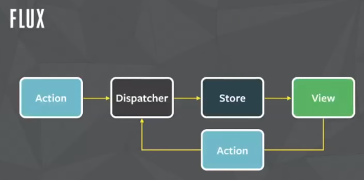

<span class="fragment">내가 JS 프레임워크 생활을 2013년 시작했다.</span><br>
<span class="fragment">그 때 시작한 프레임워크가 백개다 치면은..</span><br>
<span class="fragment">지금 나만큼 사는 프레임워크는 나 혼자 뿐이야.</span><br>

<h3 class="fragment">나는 어떻게 여기까지 왔느냐?</h3>
<h3 class="fragment">잘난  제끼고.<br>못난  보내고...</h3>

<p class="fragment">
     <span style="font-family:-apple-system,BlinkMacSystemFont,Segoe UI,Roboto,Oxygen,Ubuntu,Cantarell,'Fira Sans','Droid Sans','Helvetica Neue',sans-serif;font-weight:700;">React</span>
</p>

----------

# 오늘의 목표

프레임워크가 사용하는 기술적 요소들에 대한
## "A-ha moment"
를 발견하는 것.

----------

<h5 style="margin:0">
    <span class="size40 bold yellow">Q.</span>
    야, 내가 새로운 프로젝트를 받았는데, 한동안 FE 개발을<br>
    안했더니 뭐가 어떻게 달라졌는지 잘 모르겠어.<br>
    요즘 FE 트렌드 좀 알고 있지?
</h5>

<p class="size25 fragment" style="margin:0">
    <span class="size40 bold cyan" style="font-family:'BinggraeII Bold'">A.</span>
    일단, 프레임워크를 선택해야 하는데, VDOM 지원되는 걸 써야지.<br>
    뭐 React나 Vue.js면 될꺼야.<br><br>
    초기 로딩 성능을 높이려면 CSR보단 SSR은 기본이야.<br>
    그리고 Code-splitting을 해서 로딩 파일 크기 줄여야 하는거 알지?<br>
    번들링할 때 Tree-shaking 하는거 잊지 말고.<br>
    근데, 이거 다 일일이 환경 구성하기 힘드니까<br>
    일단, CRA 같은 CLI를 사용해. 모바일 앱도 만들꺼면<br>
    RN이나 NativeScript를 사용하면 되고.<br><br>
    참, 요새 타입이 기본인거 알지? TS 구성은<br>
    Babel + preset-typescript로 하면 돼.<br>
    그리고 Hooks이 핫한거 알지? 이제 컴포넌트는 클래스가<br>
    아닌 함수형으로 작성해야 돼. Hooks은 함수형에서만 사용할 수 있거든<br>
    ...
</p>

<p class="reference">
    [How it feels to learn JavaScript in 2016](https://medium.com/hackernoon/how-it-feels-to-learn-javascript-in-2016-d3a717dd577f#.758uh588b) ([한글번역](http://www.looah.com/article/view/2054))
</p>

----------

<!-- .slide: data-background-image="./img/bg.png" -->
# Framework
# Fatigue

<div style="color:#383d86">
    2019년 프레임워크를 배우는 기분은,<br>
    피로감의 심화 그리고
    <h3 style="color:#53f570">"남들이 하는대로 따라하기"</h3>
    전략이 최고의 전략이 되어버림.
</div>

----------

## 넘쳐나는 프레임워크들

GitHub에는 JavaScript로 작성된 "framework"<br>
주제를 갖는 프로젝트는 약 7K개 이상


<p class="reference">
    https://github.com/topics/framework?l=javascript
</p>

----------

### 2019년 사용해야/배워야 하는
## xxx 프레임워크

- 2019 Top/Best Framework...
- The 2019 Roadmap To...
- Most interesting to Learn in 2019
- Top trending Frameworks in 2019
...

> 아마도? 2020년에도 반복해서 보게될 것

----------

## XXX Vs. OOO 프레임워크


<p class="reference">
    [I created the exact same app in React and Vue. Here are the differences](https://medium.com/javascript-in-plain-english/i-created-the-exact-same-app-in-react-and-vue-here-are-the-differences-2019-edition-42ba2cab9e56)<br>
    [Angular vs React vs Vue: Which is the Best Choice for 2019?](https://hackernoon.com/angular-vs-react-vs-vue-which-is-the-best-choice-for-2019-16ce0deb3847)
</p>

----------

## 프레임워크 선택의 기준은?

성능?
기능?
생태계?

단순하게 어떤 '요소'만을 기준한 비교는 어렵다.

<h3 class="quote" style="background-color:rgba(0, 165, 104, 0.5)">
    모든 것은 "trade-off"가 있기 때문.
</h3>

<p class="reference">
    [JS Frameworks Benchmark](https://stefankrause.net/js-frameworks-benchmark8/table.html)<br>
    [RealWorld example apps](httpsre://github.com/gothinkster/realworld)
</p>

----------

얼마 만큼의 작업 영역을 프레임워크가 처리하나?
# Small vs. Large
## Scope

<p class="reference">
    [Evan You on Vue.js: Seeking the Balance in Framework Design | JSConf.Asia 2019](https://youtu.be/ANtSWq-zI0s?t=526)
</p>

----------

## Small Scope: 

<div class="fragment">
    <h3 style="margin:0 auto">장점</h3>
    <ul style="font-size:28px">
        <li>
            단순한 컨셉과 유연성 &rarr; active한 생태계
        </li>
        <li>
            작은 메인터넌스 영역 &rarr; 개발팀은 새로운 아이디어 구현에 보다 집중
        </li>
    </ul>
</div>

<div class="fragment" style="margin-top:30px">
    <h3 style="margin:0 auto">단점</h3>
    <ul style="font-size:28px">
        <li>단순한 컨셉은 오히려 복잡한 문제 해결에 많은 작업 필요</li>
        <li>
            패턴들(추상화된), 아키텍처들은 시간 지남에 따라 'semi-required' 형태가 됨<br>
            ex) [Redux](https://redux.js.org/), [HOC](https://reactjs.org/docs/higher-order-components.html), [CSS-in-JS](https://reactjs.org/docs/faq-styling.html#what-is-css-in-js), etc.
        <li>생태계가 너무 빠르게 발전해 파편화를 발생시킬 수 있다.</li>
    </ul>
</div>

----------

<div style="font-size:80px">
     <span style="font-family:Arial">Flux</span> <h4 style="display:inline-block">사례</h4>
</div>

[2014년 발표](https://youtu.be/nYkdrAPrdcw?t=706)된 단방향 데이터 흐름을 갖는 아키텍처



매일 새로운 아이디어를 구현한 도구들이 등장

<p class="reference">
    [Flux Comparison by Example](https://github.com/voronianski/flux-comparison)<br>
    [We Compared 13 Top Flux Implementations — You Won’t Believe Who Came Out On Top!](https://medium.com/social-tables-tech/we-compared-13-top-flux-implementations-you-won-t-believe-who-came-out-on-top-1063db32fe73)
</p>

----------

## Large Scope: 

<div class="fragment">
    <h3 style="margin:0 auto">장점</h3>
    <ul style="font-size:28px">
        <li>일반적인 문제들은 빌트인을 통해 해결</li>
        <li>'중앙 집중화식 디자인'은 일관성(생태계) 유지하게 함</li>
    </ul>
</div>

<div class="fragment" style="margin-top:30px">
    <h3 style="margin:0 auto">단점</h3>
    <ul style="font-size:28px">
        <li>높은 학습비용</li>
        <li>빌트인 해결책이 사용자 상황과 맞지 않는 경우에 대한 비유연성</li>
        <li>새로운 'fundamental' 아이디어의 도입 비용이 높아진다.</li>
    </ul>
</div>

----------

## Frameworks are not tools for organising your code,
## they are tools for
<h2 class="fragment" style="color:#f9dc02;text-decoration:underline;">organising your mind.</h2>

<p class="reference">
    [Rich Harris - Rethinking reactivity](https://youtu.be/AdNJ3fydeao?t=432)
</p>

----------

### 오늘날의 기본적 접근 방법

# Reactivity
#### 그리고
# Observability

<p class="reference">
    [Evan You on Vue.js: Seeking the Balance in Framework Design](https://www.youtube.com/watch?v=ANtSWq-zI0s&t=1816s)<br>
    [Rethinking reactivity](https://youtu.be/AdNJ3fydeao) ([Slide](https://rethinking-reactivity.surge.sh/))
</p>

----------

## (Functional) Reactive?

<div class="fragment" style="margin:0;font-size:30px">
    The basic idea behind reactive programming is that<br>
    there are certain datatypes that represent a value "over time".
    <span style="display:inline-block" class="size18">[Source] [What is (functional) reactive programming?](https://stackoverflow.com/questions/1028250/what-is-functional-reactive-programming#answer-1028642)</span>
</div>

<div  class="fragment" style="margin:45px 0;font-size:30px">
    사용자가 해당 소프트웨어를 사용하기 위해서<br>
    어떤 입력을 발생 시켰을 때 꾸물거리지 않고<br>
    최대한 빠른 시간 내에 응답을 한다는 의미다. - 임백준<br>

    <span style="display:inline-block" class="size18">[Source] [리액티브 개발 패러다임에 담긴 메시지](http://www.zdnet.co.kr/view/?no=20161010104628)</span>
</div>

<div  class="fragment" style="margin:0 0 25px;font-size:30px">
    The essence of FRP is to specify the dynamic behavior<br>
    of a value completely at the time of delcaration.<br>

    <span style="display:inline-block" class="size18">
        [Source] [Heinrich Apfelmus](https://apfelmus.nfshost.com/blog/2011/03/28-essence-frp.html)
    </span>
</div>

<p class="reference">
    [What is Reactive Programming?](http://paulstovell.com/blog/reactive-programming)
</p>

----------

## Observable <!-- .element: style="margin:0" -->

<p class="size25 quote">
Functions like a spreadsheet, where cells (like formulas)<br>
run automatically whenever their referenced values change.
</p>

<iframe src="demo/spreadsheet.html" class="fragment" style="width:530px;min-height:200px" scrolling="no"></iframe><br>

<p style="margin:0">
    
</p>

<p style="font-size:17px;margin:5px 0 20px 0">
    [LANPAR](http://www.renepardo.com/articles/spreadsheet.pdf)(LANguage for Programming Arrays at Random) (1969)<br>
    [VisiCalc](https://en.wikipedia.org/wiki/VisiCalc) (1979) / [Lotus 1-2-3](https://en.wikipedia.org/wiki/Lotus_1-2-3) (1983) /
    [Quattro Pro](https://en.wikipedia.org/wiki/Quattro_Pro) (1988) /
    [MS Excel](https://en.wikipedia.org/wiki/Microsoft_Excel) (1985)
</p>

<p class="reference">
    [How Observable Runs](https://observablehq.com/@observablehq/how-observable-runs)<br>
    [스프레드시트 탄생과 엑셀의 미래](http://techm.kr/bbs/board.php?bo_table=article&wr_id=4553)
</p>

----------


### Two-Way Data Binding <!-- .element: style="margin:0" -->


<pre><code class="html" style="font-size:23px;height:245px"><div>
    <!-- 'name'은 모델명 -->
    <input type='text' ng-model='name' />

    <!-- 템플릿 표현 식 -->
    <h2>{{name}}</h2>
</div>
</code></pre>

<iframe scrolling='no' src='./demo/angularjs.html' frameborder='no' style='width:90%;height:200px;overflow:hidden;'></iframe>

----------

 React

```js
this.setState({ name: "John Doe" });
```
<p class="quote size25">
enqueues changes to the component state and tells React that this component<br>
and its children need to be  re-rendered with the updated state.
</p>

 Vue.js
```js
var vm = new Vue({ data: { a: 1 } });
// 'vm.a' is now reactive
```
<p class="quote size25">
When you pass a plain JavaScript object ... as its data option, will walk through all<br>
of its properties and convert them to getter/setters using Object.defineProperty.
</p>

<p class="reference">
    [React: setState()](https://reactjs.org/docs/react-component.html#setstate),
    [Vue.js: Reactivity in Depth](https://vuejs.org/v2/guide/reactivity.html)<br>
    [Updating UIs: value comparison VS mutation tracking](https://itnext.io/updating-uis-value-comparison-vs-mutation-tracking-9f6fe912dd9a)
</p>

----------

#### 이젠 React, Vue.js 그리고 Angular  중 하나. <!-- .element: style="margin:0" -->
#### (어쩌면 Svelte도?)

## 현실은? <!-- .element: style="margin:0" -->

<div class="fragment">
    
    <!--
        
        https://youtu.be/vWMCCZEkrKg?t=2845
    -->
    <div style="font-size:15px">[Source] [[이육대 1부] 번개맨, 뿡뿡이, 펭수까지 EBS 인기 스타 총출동!](https://youtu.be/keD7fmrRwZE?t=220)</div>
</div>

----------

<!-- .slide: data-background-image="./img/bg.png" -->
## 같은듯 다른 듯한
# 기술적 접근 방법들

----------

# 더 빠르게 빠르게
### Loading/Build


Key Point: 필요한 것만 로딩

----------

## Code splitting

초기 번들 사이즈를 줄이고, 분할(모듈 or 라우팅 기준)된<br>
파일(chunk)의 점진적 로딩 전략

<p style="margin:0">
    <br>
    <span style="display:inline-block" class="size9">[Source] https://developers.google.com/web/fundamentals/performance/webpack</span>
</p>


<p class="reference">
    [Reduce JavaScript Payloads with Code Splitting](https://developers.google.com/web/fundamentals/performance/optimizing-javascript/code-splitting)
</p>

----------

## 분리 기준 전략

- Vendor: 벤더(lodash, React) 기준으로 분리
- Entry Point: 번들러의 초기 진입 파일 기준으로 분리
- Dynamic: 동적 [import()](https://github.com/tc39/proposal-dynamic-import) 사용 기준으로 분리

```js
async getModule() {
    const {default: _} = await import(
        /* webpackChunkName: "lodash" */ 'lodash'
    );
}
```
- Routing: 페이지의 routing 기준으로 분리

<p class="reference">
    [webpack: Code Splitting](https://webpack.js.org/guides/code-splitting/)<br>
    [next.js: Automatic code splitting](https://github.com/zeit/next.js/#automatic-code-splitting)
</p>

----------

## Tree Shaking <!-- .element: style="margin:0" -->
#### (Dead code elimination) <!-- .element: style="margin:0" -->

실제 사용되는 코드만 번들링하고, 불필요한 코드는 제거

<p style="margin:0">
    <br>
    <span style="display:inline-block" class="size9">[Source] https://developers.google.com/web/fundamentals/performance/webpack</span>
</p>

<p class="reference">
    <a href="https://rollupjs.org/guide/en/#tree-shaking"> rollup.js</a>에서 처음 도입한 기능
</p>

----------

코드의 정적 분석을 통해<br>
index.js에서 사용되지 않는 'module.inner.b'는 제거

```js
// inner.js
export const a = 1;
export const b = 2;

// module.js
import * as inner from "./inner";
export { inner }

// index.js
import * as module from "./module";
console.log(module.inner.a);
```

> 그러나, 적용은 아주 '간단'하지만은 않다. <!-- .element: style="margin:0" -->

<p class="reference">
    [Reduce JavaScript Payloads with Tree Shaking
](https://developers.google.com/web/fundamentals/performance/optimizing-javascript/tree-shaking)<br>
    [Webpack 4의 Tree Shaking에 대한 이해](https://huns.me/development/2265)
</p>

----------

## Differential Loading

2개의 빌드를 생성하고, 모던/레거시로 나누는 전략<br>
레거시에는 Polyfill 등을 포함


```html
<script type="module" src="esm.build.js">
<script nomodule src="legacy.build.js">
```

<p class="reference">
[Angular: Differential Loading](https://angular.io/guide/deployment#differential-loading)
</p>

----------

# Rendering

Key Point:
- 렌더링 시점을 앞당기자
- 렌더링 비용을 줄이자

----------

## SSR <!-- .element: style="margin:0" -->
#### (Server Side Rendering)

초기 화면 구성에 필요한 코드를<br>
서버에서 구성(렌더링)해 전달하는 전략

```js
renderer.renderToString(vm); // Vue.js
ReactDOMServer.renderToString(element); // React
```

<p class="reference">
    [ReactDOMServer](https://reactjs.org/docs/react-dom-server.html)<br>
    [Vue.js SSR Guide](https://ssr.vuejs.org/)<br>
    [Server-side Rendering (SSR): An intro to Angular Universal](https://angular.io/guide/universal)
</p>

----------

## SSR vs CSR


<p class="reference">
    [Next.js (SSR) vs. Create React App (CSR)](https://codeburst.io/next-js-ssr-vs-create-react-app-csr-7452f71599f6)<br>
    [The Benefits of Server Side Rendering Over Client Side Rendering](https://medium.com/walmartlabs/the-benefits-of-server-side-rendering-over-client-side-rendering-5d07ff2cefe8)<br>
    [Why it's tricky to measure Server-side Rendering performance](https://davidea.st/articles/measuring-server-side-rendering-performance-is-tricky)
</p>

----------

###  vs. 


----------

## 다양한 렌더링 기법

<p class="quote size25" style="width:70%;margin:0 auto 7px auto">
    SSR, Static SSR, SSR with (Re)hydration,<br>
    CSR with Prerendering, Full CSR
</p>

<!--
SSR로 구성된 DOM 트리와 데이터를 재활용해<br>
JavaScript 뷰 구성을 더 빠르게 하는 기법 -->

<p style="margin:0 0 10px 0">
    
    <span style="display:block" class="size9">[Source] https://developers.google.com/web/updates/2019/02/rendering-on-the-web</span>
</p>

<p class="reference">
    [The Cost Of Client-side Rehydration](https://addyosmani.com/blog/rehydration/)<br>
    [Rendering on the Web: Performance Implications of Application Architecture (Google I/O ’19)](https://www.youtube.com/watch?v=k-A2VfuUROg)
</p>

----------

### VDOM (Virtual DOM)

<p class="size25">
    VDOM은 프로그래밍 컨셉으로<br>
    JavaScript 객체로 표현된 DOM(UI 표현식) 구조<br>

    <br>
    <span style="display:inline-block" class="size9">[Source] http://teropa.info/blog/2015/03/02/change-and-its-detection-in-javascript-frameworks.html</span>
</p>
<p class="size25">
    모델(데이터) 변경시 실제 DOM 트리와 비교해<br>
    업데이트가 필요한 부분만 렌더링하는 기법
</p>

<p class="reference">
    [React’s diff algorithm](https://calendar.perfplanet.com/2013/diff/)<br>
    [Virtual DOM and diffing algorithm](https://gist.github.com/Raynos/8414846)
</p>

----------

## VNode 표현 객체

<div class="code-compare">
    <pre><code class="html" style="font-size:23px">
&lt;div class='holder'>
  &lt;button class='blue'>&lt;/button>
  &lt;button class='red'>&lt;/button>
&lt;/div></code></pre>
<pre style="width:49%;float:right"><code class="javascript" style="font-size:23px">// Simplified React's VNode shape
{
  type: 'div',
  props: {
    children: [{
      type: 'button',
      props: {className: 'blue'}
    }, {
      type: 'button',
      props: {className: 'red'}
    }],
    className: 'holder'
  }
}</code></pre>
</div>

<p class="reference">
[React: createElement()](https://github.com/facebook/react/blob/f6b8d31a76cbbcbbeb2f1d59074dfe72e0c82806/packages/react/src/ReactElement.js#L312)<br>
[Vue.js: createElement()](https://github.com/vuejs/vue/blob/d7d8ff06b70cf1a2345e3839c503fdb08d75ba49/src/core/vdom/create-element.js#L28)
</p>

----------

## 필요한 영역만 업데이트

<iframe src="demo/react-stopwatch.html" style="width:530px;min-height:230px" scrolling="no"></iframe>
```js
 render() {
   return (
     <label>
       {lapse.toLocaleString()}ms
     </label>
   );
 }
```

----------

## Reconciliation?
### VDOM diff

The algorithm React uses to diff one tree with another to determine which parts need to be changed.

<p class="reference">
    [React Docs: Reconciliation](https://reactjs.org/docs/reconciliation.html)<br>
    [React Fiber Architectur: What is reconciliation?](https://github.com/acdlite/react-fiber-architecture#what-is-reconciliation)
</p>

----------

## VDOM의 diffing 비용

상태가 변경되면 매번 diff 프로세스 수행을 거친다.


<p class="quote size25 fragment" style="margin: 0 auto;width:80%;padding:15px 0;background-color:#bb0000">
    diffing 비용은 실제 변경되는 노드 개수가 아닌 뷰의 크기에 비례
</p>

<p class="reference">
Seeking the Balance in Framework Design: [VDOM inherently expensive](https://youtu.be/ANtSWq-zI0s?t=1410)<br>
Rethinking reactivity: [How Virtual DOM library works](https://youtu.be/AdNJ3fydeao?t=261)
</p>

----------

### Diffing 비용 개선에 대한
## React의 접근방법

## "Perceived performance" <!-- .element: style="color:#ff3939;text-decoration:underline" -->

----------

## Time Slicing

<p class="size25 quote" style="margin:5px auto">
    The period of time for which a process is<br>
    allowed to run in a preemptive multitasking system.
</p>

- Scheduling
  - Prioritization
  - Concurrency


<p class="size25">
특정 작업 실행이 전체 앱을 블럭하지 않도록 작업들을 잘게 나누어 처리하는 기법
</p>

<p class="reference">
    <a href="https://en.wikipedia.org/wiki/Preemption_(computing)#Time_slice">Preemption_(computing) - Time Slice</a><br>
    [Vue 3.0 Updates - Evan You | VueConfTO 2018](https://youtu.be/XkOMOeEAFQI?t=2144)
</p>

----------

<p class="size25">
JavaScript는 [single-thread](https://developer.mozilla.org/en-US/docs/Learn/JavaScript/Asynchronous/Concepts#JavaScript_is_single_threaded)(main thread)에서 작업이 수행되기 때문에,<br>
작업이 진행 중이라면 새로운 작업은 현재의 작업이 완료될 때까지<br>
실행이 차단(block)된다.
</p>

<p class="quote size25" style="background-color:rgba(247, 228, 5, 0.3);width:70%;margin:0 auto">
one thread = one call stack = one thing at a time
</p>

<pre><code style="text-align:center">|--------------- 40 ----------------| frame
|-- 10 --|-- 10 --|-- 10 --|-- 10 --| frame
</code></pre>

하나의 작업이 길게 수행되어<br>
다른 작업의 실행이 차단되지 않도록
> 작업을 작은 조각(slice)으로 나누어

다른 작업이 수행될 틈새를 만들어 주는 것.

----------

## Scheduling
#### Push vs. Pull

<p class="quote size25">
    React controls 'how' and 'when' to update UI.
</p>
<p class="size25">
    setState() 호출시 즉시 실행되는 것은 아니며, 판단하기에<br>
    가장 이상적인 시점에 UI를 업데이트 하라고 전달하는 것
</p>

#### Push based <!-- .element: style="margin:0" -->
App(programmer) decide when to perform. <!-- .element: style="margin:0 auto 30px" -->

#### Pull based <!-- .element: style="margin:0" -->
Framework(React) make scheduling decision for you. <!-- .element: style="margin:0 auto 20px" -->

<p class="reference">
    [Andrew Clark: What's Next for React — ReactNext 2016](https://youtu.be/aV1271hd9ew?t=437)
</p>

----------

## Prioritization

Scheduling은 다른 유형의 작업들간의<br>
우선순위를 정할 수 있게 한다.<br>

어떤 작업이 먼저 처리되어야 할까?

<p class="quote">
이벤트 처리 vs. 데이터 구독(Redux) vs. 애니메이션
</p>

<p class="fragment">
사용자 경험을 해칠 수([Jank](http://jankfree.org/)) 있기 때문에<br>
'애니메이션'을 우선 순위를 높여 처리해야 한다.
</p>

----------

# Concurrency

우선순위가 낮은 작업이 아직 진행중 일때,<br>
높은 순위 작업을 처리해야 하는 상황이라면?

<ul style="font-size:27px;list-style-type:none">
    <li class="fragment">
        <span class="red bold">1) 낮은 순위의 현재 작업을 일시 중지</span><br>
        - 현재 렌더링 stack을 일시 중지<br>
        - 현재 call stack을 "Stash"
    </li>
    <li style="margin: 20px 0" class="fragment">
        <span class="cyan bold">2) 높은 순위 작업을 처리</span><br>
        - 별도의 call stack을 갖는 높은 순위 작업을 실행
    </li>
    <li class="fragment">
        <span class="green bold">3) 중단되었던 작업의 해당 지점부터 다시 실행</span><br>
        - 원래의 call stack으로 돌아가 실행을 재개
    </li>
</ul>

----------

### 렌더링 컴포넌트를 어떻게
## 중지시킬 수 있을까?

개념적으로 컴포넌트는 함수에<br>
데이터를 전달하고 그 결과를 받는 과정

## v = f(d)

<p class="quote fragment" style="width:70%;margin: 0 auto;padding: 10px 0">
    중지 한다는 의미는?<br>
    결국, 함수 호출을 일시 중지 한다는 의미
</p>

----------

## Virtual Stack Frame

<p class="size25">
    React는 v16(코드명 Fiber)에서 가상의 stack 프레임을<br>
    통해 stack을 재구현해 동시성 문제를 해결했다.
</p>

<div>
    

| Stack Frame | Fiber |
| --- | --- |
| subroutine(function) | component type |
| body (nested function calls) | children |
| return address | parent component |
| arguments | props |
| return value | DOM elements |
<div>

<p class="reference" style="clear:both">
    [Andrew Clark: What's Next for React — ReactNext 2016](https://youtu.be/aV1271hd9ew?t=1390)<br>
    [React Fiber Architecture](https://github.com/acdlite/react-fiber-architecture)<br>
    [Eevent loop: Runtime concepts](https://developer.mozilla.org/en-US/docs/Web/JavaScript/EventLoop)<br>
    [Jake Archibald: In The Loop - JSConf.Asia](https://www.youtube.com/watch?v=cCOL7MC4Pl0)<br>
    [Loupe: visualisation of JavaScript's call stack/event loop/callback queue](http://latentflip.com/loupe/)
</p>

----------

<iframe src="demo/timeslicing/index.html" style="width:65%;min-height:630px;background:transparent" scrolling="no"></iframe>

<p class="reference">
    [CPU async rendering demo](http://timeslicing-unstable-demo.surge.sh/) ([Source code](https://github.com/facebook/react/tree/master/fixtures/unstable-async/time-slicing))
</p>

----------

<pre style="margin:0 auto;"><code class="javascript" style="font-size:20px">// Synchronous
this.setState({value});

// Asynchronous
unstable_scheduleCallback(() => {
  this.setState({value});
});
</code></pre>
<pre style="margin:5px auto;"><code class="javascript" style="font-size:17px">// scheduler/src/Scheduler.js
function unstable_scheduleCallback(priorityLevel, callback, options) {
  timeout = timeoutForPriorityLevel(priorityLevel);
  ...
  requestHostCallback(flushWork);
}

// scheduler/src/forks/SchedulerHostConfig.default.js
requestHostCallback = function(cb) {
  ...
  // in a non-DOM environment
  if (typeof window === 'undefined' || typeof MessageChannel !== 'function') {
     setTimeout(requestHostCallback, 0, cb);
  } else {
    requestAnimationFrame(rAFTime => {
       onAnimationFrame(rAFTime);
    };
};
</code></pre>

<p class="reference">
    [SchedulerHostConfig.default.js#L58](https://github.com/facebook/react/blob/f6b8d31a76cbbcbbeb2f1d59074dfe72e0c82806/packages/scheduler/src/forks/SchedulerHostConfig.default.js#L58), [#342](https://github.com/facebook/react/blob/f6b8d31a76cbbcbbeb2f1d59074dfe72e0c82806/packages/scheduler/src/forks/SchedulerHostConfig.default.js#L342)
</p>

----------

<iframe src="demo/timeslicing.html" style="margin:0 auto;width:65%;min-height:200px;background:transparent" scrolling="no"></iframe>

<pre><code class="javascript" style="font-size:17px">const sleep = (ms, job = 1) => {
    const taskMs = job === 1 ? ms : ms / job;
    const cb = () => {
        const start = +new Date();

        while (true) {
            if (+new Date() - start >= taskMs) break;
        }
    };

    for (let i = 0; i < job; i++) {
        job.length === 1 ? cb() : setTimeout(cb, 0);
    }
}

document.querySelector("input[type=text]").addEventListener("keydown", e => {
    sleep(300, type === "sync" ? 1 : 50);
});
</code></pre>

----------

# Template
# Compilation

스케줄링과 같은 코드가 포함될 필요 없으므로,<br>
가벼운 런타임을 제공할 수 있다.

----------

<p style="margin:0">
    
</p>

<p style="font-size:25px;margin:0 0 10px 0">
컴파일러가 '훌륭한 사용자 경험 코드를 생성'할 수 있다는 가설 증명을 위해 시작<br>
효율적 명령(imperative) 코드로 변환, DOM을 업데이트
</p>

<div class="code-compare" style="height:350px">
    <pre><code class="html" style="font-size:23px;height:300px;"><!-- 작성 코드 -->
&lt;script>
let count = 0;
function handleClick() {
  count += 1;
}
&lt;/script>
&lt;button on:click={handleClick}>
  Clicks: {count}
&lt;/button></code></pre>
<pre style="width:49%;float:right"><code class="javascript" style="font-size:22px;height:300px">// 컴파일된 코드
function handleClick() {
  count += 1;
  // 이전 값 무효화
  $$invalidate('count', count);
}

if (changed.count) {
  // t6 => &lt;text> node
  set_data(t6, ctx.count);
}
</code></pre>
</div>

<p class="quote size25 fragment" style="margin: 0 auto;width:80%;padding:15px 0;background-color:#9200bb">
    VDOM의 diffing과 인지적 성능개선 처리가 필요없다.
</p>

<p class="reference">
    [A simple Svelte component](https://rethinking-reactivity.surge.sh/#slide=16)<br>
    [Compilers are the New Frameworks](https://tomdale.net/2017/09/compilers-are-the-new-frameworks/)
</p>

----------

## 효율적 코드 작성
### Hooks

<br>
<span style="display:inline-block" class="size9">[Source] https://tenor.com/view/sakanaction-fishing-gif-5557678</span>

<p class="size25">
특정 위치의 코드(place in code) 실행을 낚아채(Hooking)<br>
기본 동작(또는 특정 조건에만 반응)을 다른 동작을 하도록 만든다.
</p>

----------

### 's Special event hook

<pre style="font-size:12px">
<code class="javascript">$("#myButton").on("click", function(e) { ... });  // click 이벤트 바인딩
</code></pre>

<pre style="font-size:12px">
<code class="javascript">// Special event hook
jQuery.event.special["click"] = {
    add: function(handleObj) { ... }, // 이벤트를 .on()으로 바인딩할 때마다 실행
    remove: function(handleObj) { ... }, // 이벤트를 .off()로 제거할 때마다 실행
    ...
}
</code></pre>

<pre style="font-size:12px">
<code class="javascript">jQuery.event = {
    add: function( elem, types, handler, data, selector ) {
        ...
        special = jQuery.event.special[ type ] || {};

        while ( t-- ) {
            ...
            if ( special.add ) {
                special.add.call( elem, handleObj );
            }
            ...
            handlers.push( handleObj );
        }
</code></pre>

<p class="reference">
    [jQuery는 이벤트를 어떻게 처리하는가?](https://d2.naver.com/helloworld/1855209)<br>
    https://github.com/jquery/jquery/blob/2.2.0/src/event.js#L189
</p>

----------

## React Hooks

<p class="quote">
    "hook into" React <span class="red underline">state</span> and <span class="green underline">lifecycle</span> features<br>
    from function components.
</p>

<p style="margin:7px auto 30px auto;">
    컴포넌트의 기존 구조를 변경하지 않고<br>
    <span class="cyan">상태를 갖는 로직의 재사용</span>과 <span class="yellow">작은 함수로 분리</span>해<br>
    단순화 한다.
</p>

<p class="reference">
    Vue.js는?<br>
    [vue-hooks](https://github.com/yyx990803/vue-hooks) &rarr;
    [Composition API RFC](https://vue-composition-api-rfc.netlify.com/)
</p>

----------

### Class vs. Function Component

<div class="code-compare">
    <pre><code class="javascript">// Class component (stackblitz.com/edit/react-t8mb19)
import React, {Component} from "react";
&nbsp;
export class Greeting extends Component {
  constructor(props) {
    super(props);
    this.state = {name: "Mary"};
    this.handler = this.handler.bind(this);
  }
&nbsp;
  handler(e) {
    this.setState({name: e.target.value});
  }
&nbsp;
  render() {
    return &lt;section>
      &lt;input value={this.state.name} onChange={this.handler} />
      &lt;h1>{this.state.name}&lt;/h1>
    &lt;/section>;
  }
}
</code></pre>
    <pre style="width:49%;float:right"><code class="javascript">// Function component w/useState Hook
// stackblitz.com/edit/react-nbkstu
import React, {useState} from "react";
&nbsp;
export function Greeting(props) {
  const [name, setName] = useState("Mary");
&nbsp;
  function handler(e) {
    setName(e.target.value);
  }
&nbsp;
  return &lt;section>
      &lt;input value={name} onChange={handler} />
      &lt;h1>{name}&lt;/h1>
  &lt;/section>;
}
</code></pre>
</div>

<p class="reference">
    [React: Introducing Hooks](https://reactjs.org/docs/hooks-intro.html)
</p>

----------

### useState() vs. setState()

<!-- <iframe src="demo/react01.html" style="width:530px;min-height:230px" scrolling="no"></iframe> -->

<pre style="font-size:12px">
<code class="javascript">const [name, setName] = useState("Mary"); // service call

function mountState&lt;S>(initialState:(() => S) | S):[S, Dispatch&lt;BasicStateAction&lt;S>>] {
	...
  return [hook.memoizedState, dispatch];
}

// dispatch: setName()
function dispatchAction&lt;S, A>(fiber: Fiber, queue: UpdateQueue&lt;S, A>,action: A) {
    ...
    scheduleWork(fiber, expirationTime);
}
</code></pre>

<p style="font-size:14px">
[react-reconciler/src/ReactFiberHooks.js#L823](https://github.com/facebook/react/blob/f6b8d31a76cbbcbbeb2f1d59074dfe72e0c82806/packages/react-reconciler/src/ReactFiberHooks.js#L823),
[ReactFiberHooks.js#L1121](https://github.com/facebook/react/blob/f6b8d31a76cbbcbbeb2f1d59074dfe72e0c82806/packages/react-reconciler/src/ReactFiberHooks.js#L1221)
</p>

<pre style="font-size:12px">
<code class="javascript">this.setState({name: "Mary"}); // service call

const classComponentUpdater = {
	enqueueSetState(inst, payload, callback) {
        ...
        enqueueUpdate(fiber, update);
        scheduleWork(fiber, expirationTime);
    }
}
</code></pre>

<p style="font-size:15px">
[react-reconciler/src/ReactFiberClassComponent.js#L182](https://github.com/facebook/react/blob/f6b8d31a76cbbcbbeb2f1d59074dfe72e0c82806/packages/react-reconciler/src/ReactFiberClassComponent.js#L182)
</p>

----------

## CLI는 이제 기본

<p class="quote" style="width:60%;margin:0 auto">create-xxx-app</p>

CLI도 JavaScript로 작성된 코드
(ex. [crate-react-app](https://github.com/facebook/create-react-app/blob/master/packages/create-react-app/createReactApp.js))

```sh
$ npx create-react-app my-app
```

<pre style="font-size:15px">
<code class="javascript">// createReactApp.js
const commander = require('commander');
...
function createApp(name, verbose, version, ...) {
  const root = path.resolve(name);
  const appName = path.basename(root);

  checkAppName(appName);
  ...
</code></pre>

또는 직접 만들수 있는 도구들도 존재: [Commander.js](https://github.com/tj/commander.js), [yargs](http://yargs.js.org/)

----------

<div class="fragment">
    <h3>[Create React App](https://create-react-app.dev/)</h3>
    <p class="quote" style="margin-bottom:50px">Set up a modern web app by running one command.</p>
</div>

<div class="fragment">
    <h3>ng new ([Angular CLI](https://cli.angular.io/))</h3>
    <p class="quote" style="margin-bottom:50px">The Angular CLI makes it easy to create an application that already works, right out of the box.</p>
</div>

<div class="fragment">
    <h3>[Vue CLI](https://cli.vuejs.org/)</h3>
    <p class="quote">Vue CLI is a full system for rapid Vue.js development.</p>
</div>

----------

##### 그런데, CLI가 불편해서 <!-- .element: style="margin:0" -->
### GUI가 등장한 것 아니었나? <!-- .element: style="margin:0" -->

<blockquote style="width:90%;font-size:20px;margin: 5px 0 7px 0;">
아무리 좋은 것이라도 끝이 있게 마련이다. 이제 명령 프롬프트는 과거의 것이다.<br>
"MS-DOS여,... 너는 분명 PC 혁명의 시작에 한몫을 했다. 결코 잊혀지지 않을 것이다."<br>
- [굿바이 프롬프트··· 마침내 떠나는 DOS에게](http://www.ciokorea.com/tags/637/%EC%9A%B4%EC%98%81%EC%B2%B4%EC%A0%9C/32282) (2016.12.07)
</blockquote>

<div style="margin:0;font-size:30px" class="fragment">
    <br>
    <span style="display:block;font-size:12px;margin-top:5px">[Source] [Windows 3.1 - Startup](https://www.youtube.com/watch?v=6dAGP_j6Vmc)</span>
</div>

----------

<!-- .slide: data-background-image="./img/bg.png" -->
# 컴포넌트와 타입

----------

## 컴포넌트 구조 기반의 설계

모던 프레임워크의 '성공'은 컴포넌트 기반에 기인

```js
const Compo01 = <h1>Title</h1>;
const Compo02 = <div><h2>Sub Title</h2></div>;

ReactDOM.render(<>
	<Compo01 />
	<Compo02 />
	...
</>, document.getElementById("root"));
```

- [React.Component](https://reactjs.org/docs/react-component.html)
- [Vue.js Component](https://vuejs.org/v2/guide/components.html)
- Polymer: [lit-html](https://lit-html.polymer-project.org/), [litElement](https://lit-element.polymer-project.org/)

----------

#### CBD(Component Based Development)

<p class="quote" style="font-size:23px;">
기존의 시스템 및 소프트웨어를 구성하고 있는 컴포넌트를 조립해서 하나의 새로운<br>
애플리케이션을 만드는 소프트웨어 개발 방법론 - [IT용어사전](https://terms.naver.com/entry.nhn?docId=859992&cid=50371&categoryId=50371) (한국정보통신기술협회)
</p>

<br>
<span style="display:inline-block" class="size18">[Source] [컴퓨터인터넷IT용어대사전](https://terms.naver.com/entry.nhn?docId=817327&cid=42344&categoryId=42344) (2011)</span>

<p class="size25">
[WebComponents](https://www.webcomponents.org/) 표준화를 통해 시도되었지만,<br>
낮은 브라우저 커버리지로 주도권을<br>
모던 프레임워크들의 <span class="red" style="font-size:50px">'컴포넌트'</span>에 넘겨준 상황
</p>

----------

## 보편화된 정적 타입 시스템

JavaScript에서 타입은 이제 보편화 되었다.

```js
const add = (x: number, y: number) =>  x + y;
```

<br>
Vue.js, Angular, [create-react-app TS지원](https://twitter.com/sulco/status/1057222100128329729),<br>
lit-html, LitElement, etc.<br>
<br>
React, ~~Yarn~~

----------


FB 프로젝트인 Yarn도 이제 TS 진영으로...


Flow는 문제 없지만, 컨트리뷰션 장벽을<br>
낮추기 위해 TS로 전환

<p class="reference">
    https://twitter.com/arcanis/status/1088450974404927491
</p>

----------

#  성장비결

CoffeeScript와 Dart처럼 JavaScript로 컴파일되는<br>
정적 타입 언어가 존재했지만 성공하지 못했다.

### 몇가지 이유?

<ul>
    <li class="fragment">학습비용: TS는 JS 슈퍼셋으로 문법적 차이가 거의 없음</li>
    <li class="fragment">타입의 옵트인 정의: 사용자가 타입 사용을 결정</li>
    <li class="fragment">강력한 도구와 생태계: [VS Code](https://code.visualstudio.com/), [DefinitelyTyped](https://github.com/DefinitelyTyped/DefinitelyTyped) 등의 지원</li>
</ul>

<p class="reference" style="margin:40px 0">
    [List of languages that compile to JS](https://github.com/jashkenas/coffeescript/wiki/List-of-languages-that-compile-to-JS)<br>

</p>

----------

<!-- .slide: data-background-image="./img/bg.png" -->
# 혼자서는 어렵다.
### 강력한 생태계 기반 성장

----------

### 오늘날의 <!-- .element: style="margin:0" -->
## 모던 프레임워크 구성셋

프레임워크라면 기본적으로 갖춰야할 생태계

- CLI (Command Line Interface)
- 상태 관리자
- 라우터
- SSR/정적 사이트 개발 도구
- Universal Framework
- 네이티브앱(desktop/mobile) 개발 도구

----------

## Universal Framework

> /n[eu][sx]t\.js/i

<a href="https://nextjs.org/" target="_new"></a>
<a href="https://nuxtjs.org/" target="_new"></a><br>
<a href="https://github.com/nestjs/ng-universal" target="_new"></a>

----------

## '종합선물 세트'

- SSR
- Routing
- Static file serving
- Automatic code splitting<br>
   각 페이지들의 import 항목들은 페이지별 번들링 된다.
- Built-in CSS
  - CSS-in-JS
  - [styled-jsx](https://github.com/zeit/styled-jsx): isolated scoped CSS

----------

# RFC <!-- .element: style="margin:0" -->
#### (Request For Comments)
### 프로세스 도입

자유롭고 투명한 기능 제안과 토론

향후 프레임워크의 개발 방향성을 미리 엿볼 수 있다. <!-- .element: class="quote" -->

- [React RFCs](https://github.com/reactjs/rfcs)
- [Vue.js RFCs](https://github.com/vuejs/rfcs)
- [Node.js package-maintenance](https://github.com/nodejs/package-maintenance/)

----------

## 개선 노력

RN의 경우, 불만을 듣고 개선에 대한 계획을 공개


<p class="reference">
    [Reply from Facebook about "What do you dislike about React Native?](https://github.com/react-native-community/discussions-and-proposals/issues/104)
</p>

----------

# There is nothing new under the sun.
### (하늘 아래 새로운 것은 없다.)

----------

# SSR?

웹의 등장때 부터 계속해 오던 것.
<p class="quote size25" style="width:85%;margin: 0 auto;padding:5px 0;background-color:rgba(255, 1, 1, 0.55)">
    Response는 기본적으로 초기 화면을 구성하는 마크업 및 자원들로 구성
</p>
<p>
    <a href="https://www.php.net/" target="_new"></a>
    <a href="https://docs.oracle.com/javaee/5/tutorial/doc/bnagy.html" target="_new"></a>
    <a href="https://docs.microsoft.com/en-us/previous-versions/iis/6.0-sdk/ms526064(v%3Dvs.90)" target="_new"></a>
</p>

```html
<div>
  <?php
     $name = "<h1 style='color:cyan'>Pengsoo</h1>";
  ?>
  Hello, <?=$name>!.
</div>
```

----------

# 성능 향상 기법

Minimize HTTP Requests

<p class="quote">
Combined files are a way to reduce the number of HTTP requests by <span class="red underline">combining all scripts into a single script</span>, and similarly combining all CSS into a single stylesheet.
</p>

<div class="fragment">
    <h3>현재는?
    Code-Splitting</h3>
</div>

<p class="reference">
    [Yahoo Best Practices for Speeding Up Your Web Site](https://developer.yahoo.com/performance/rules.html)
</p>

----------

# 인라인 이벤트 바인딩

```html
<button onclick="bgChange()">Press me</button>
```

인라인 이벤트 바인딩은 DOM과의 커플링으로 인한
비유연성(Presentation과 logic의 결합)은 좋지 않은 패턴

<p class="quote fragment">
Inline event handlers — don't use these.<br>
- [MDN: Introduction to events](https://developer.mozilla.org/en-US/docs/Learn/JavaScript/Building_blocks/Events#Inline_event_handlers_%E2%80%94_dont_use_these)
</p>

----------

## 현재는?

물론, 프레임워크 내의 이벤트 바인딩 처리를 통한<br>
효율적 처리 적용으로 이전의 처리 방식과는 다르다.

```js
<button onClick={handleClick}> // React
<button @click.prevent="follow()"> // Vue.js
<button (click)="toggleFollowing()"> // Angular
```

하지만, 패턴으로만 본다면 DOM과 JS(또한 CSS: CCS-in-JS)는<br>
보다 결합된 형태로 작성되고 있다.

----------

### 서로 닮아가는 (Inspired by)

<div class="fragment">
    <p style="margin:0">
        
        <a href="https://twitter.com/dan_abramov/status/829123053842006016" target="_new"></a>
    </p>
    <p class="size18" style="margin:5px 0">
        [XHP: A New Way to Write PHP](https://www.facebook.com/notes/facebook-engineering/xhp-a-new-way-to-write-php/294003943919/)
    </p>
</div>

<div class="fragment">
    
    <p class="quote size25">
    ... just extract the part that I really liked about Angular<br>
    and build something really lightweight.<br>
    [Between the Wires: An interview with Vue.js creator Evan You](https://www.freecodecamp.org/news/between-the-wires-an-interview-with-vue-js-creator-evan-you-e383cbf57cc4/)
    </p>
</div>

<div class="fragment">
    
    <p class="quote size25">
    ... is an attempt to recreate<br>
    the core value proposition of React<br>
    https://www.npmjs.com/package/preact/v/1.2.0
    </p>
</div>

----------

## 사실은 항상 하던 것.

새로운 '정의', '용어', '기술' 들이 계속해서 등장하지만,<br>
그러나 알고보면...

<div class="quote fragment">
    Every 10 years we give<br>
    <h3 style="display:inline-block;letter-spacing:-2px;color:#ff5252" class="underline fragment">new name to what we always do</h3><br>
    and <h3 style="display:inline-block;letter-spacing:-2px;color:cyan" class="underline fragment">get excited</h3> about it.
</div>

<p class="reference">
    [Anonymous speaker: Java 9 Functional and Reactive programming paradigms](https://medium.com/@madhupathy/learn-functional-and-reactive-programming-paradigms-with-java-9-d8454f1dab3e)
</p>

----------

미래 언젠가는 다시금 이런 말을 하게 될수도 있겠죠?

<div class="fragment">
    <h2>Oh my god no, no one uses <span class="cyan">React</span> anymore.</h2>
    <h2>You should try learning <span class="yellow">OOO</span>, it’s 20xx.</h2>
</div>
