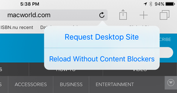

## Force Touch Events

### Force Touch Trackpads

Force Touch를 지원하는 트랙패드에서 누름 강도에 따른 처리를 위한 새로운 API. 마우스 이벤트의 webkitForce 속성을 통해 접근할 수 있다.
- 참고 : [Responding to Force Touch Events](https://developer.apple.com/library/mac/documentation/AppleApplications/Conceptual/SafariJSProgTopics/RespondingtoForceTouchEventsfromJavaScript.html#//apple_ref/doc/uid/TP40016162)

```js
element.addEventListener("webkitmouseforcewillbegin", function(event) {
	event.webkitForce;  // 누름의 강도에 대한 값(number)을 반환

	// Constants :
	// represents the amount of force required for a regular and force click, respectively.
	event.WEBKIT_FORCE_AT_MOUSE_DOWN;
	event.WEBKIT_FORCE_AT_FORCE_MOUSE_DOW;
}, false);
```
----------

| Event | 발생시점 |
| --- | --- |
| webkitmouseforcewillbegin | mousedown 직전에 발생 |
| webkitmouseforcedown | Force click인 경우, mousedown 이벤트 이후에 발생 |
| webkitmouseforceup | Force click인 경우, mousedown 이벤트 이후 버튼을 뗀 후 발생 |
| webkitmouseforcechanged | Force click 이벤트내에서 변경이 발생될 때 |

----------

== 

== 

----------


### TouchEvent.force

터치 이벤트 발생시, 터치의 누름 강도를 값으로 반환
- 참고 : [Touch.force](https://developer.mozilla.org/en-US/docs/Web/API/Touch/force)

```js
element.addEventListener("touchstart", function(event) {
	event.touches[0].force;  // 누름 강도에 따라, 0.0 ~ 1.0 사이의 값을 반환
}, false);
```

- 데모
  - [3D Touch](http://freinbichler.me/apps/3dtouch)
  - [ForceTouch demo](http://uupaa.github.io/Examples/demo/ForceTouch/index.html)

----------

## iPad Pro 
- 기존 iPad들의 뷰포트 width(device-width)는 <span class="green">768px</span>
- iPad Pro(12.9 인치 - 2015/11 출시)의 뷰포트 width는 <span class="red">1024px</span>
  <small>iPad Pro는 3D Touch 미지원. 대신 Apple Pen을 지원 (Apple Pen과 관련된 별도 API는 없음)</small>

- [iOS9 and Responsive Web Design](http://www.mobilexweb.com/wp-content/uploads/2015/09/ios9rwd.png)
- [iPad browser WIDTH & HEIGHT standard](http://stackoverflow.com/questions/3375706/ipad-browser-width-height-standard#answer-9049670)

----------

## Multitasking
iOS9가 설치된 iPad에서는 새로운 멀티태스킹 기능들이 추가 되었다.

----------

### a) Slide Over
가로모드 상태에서 우측 3/1 영역을 사용, 현재 앱을 벗어나지 않고 다른 앱을 실행<br>
2개의 앱이 동시에 온전히 실행되는 것이 아니며, 완전한 멀티태스킹이라고 하긴 어려움


- 지원 기기 : iPad mini 2, iPad mini 3, iPad Air, iPad Air 2, iPad Pro

----------

<iframe width="800" height="500" src="https://www.youtube.com/embed/vlOwFQ90pes?start=5" frameborder="0" allowfullscreen></iframe>

----------

### b) Split View
Split View를 지원하는 앱에서 사용 가능하며,<br>
Slide Over 상태에서 2개의 앱을 화면 분할해 동시에 2개 앱을 실행


- 지원 기기 : iPad Air 2, iPad Pro

----------

분할 크기에 따라 뷰포트 width 값은 다음과 같다.

| 분할된 화면크기 | iPad (non iPad Pro) | iPad Pro |
| --- | --- | --- |
| 1/3 | 320px | 375px |
| 1/2 | 507px | 678px |
| 2/3 | 694px | 981px |

----------


<iframe width="800" height="500" src="https://www.youtube.com/embed/cVD75j4BEDw?start=4" frameborder="0" allowfullscreen></iframe>

----------

### c) Picture-in-Picture
다른 앱을 실행하는 동안에도, 동영상을 볼수 있는 기능이다.


- 지원 기기 : iPad mini 2, iPad mini 3, iPad Air, iPad Air 2, iPad Pro

----------

PiP를 지원하는 앱의 경우 비디오 하단의 PiP 모드 전환버튼을 통해 실행한다.


다음은 PiP 모드를 지원하는 경우 확인과, PiP로 전환하는 샘플예제
```js
if (video.webkitSupportsPresentationMode &&
    typeof video.webkitSetPresentationMode === "function") {
    
    // Toggle PiP when the user clicks the button.
    pipButtonElement.addEventListener("click", function(event) {
        video.webkitSetPresentationMode(
            video.webkitPresentationMode === "picture-in-picture" ?
                "inline" : "picture-in-picture");
    });
} else {
    pipButtonElement.disabled = true;
}
```

----------

<iframe width="800" height="500" src="https://www.youtube.com/embed/Sz4L4R9aCjE?start=76" frameborder="0" allowfullscreen></iframe>

- [How to Use iOS 9 Picture in Picture Mode](http://www.gottabemobile.com/2015/09/24/how-to-use-ios-9-picture-in-picture-mode/)

----------


## Safari View Controller
웹 컨텐츠에 대한 처리를 웹뷰가 아닌 사파리에 위임하는 형태로 동작<br>
앱과 별도의 프로세스로 동작


----------


- full 페이지로 동작 <small>(앱에서 link tap시 열리고, done을 누르면 창이 닫히는 형태)</small>
- 주소창의 주소는 readonly 이며, 변경할 수 없음
- 쿠키와 웹사이트 데이터를 사파리와 공유.
  <small>- ex. 로그인된 상태라면 Safari View Controller에서도 동일하게 로그인된 상태가 됨, form에 대한 데이터의 autofill 처리, 등</small>


- [Introducing Safari View Controller - Apple WWDC 2015](https://www.youtube.com/watch?v=lY2_QwZPZZM)
- [iOS 9 and Safari View Controller: The Future of Web Views](http://www.macstories.net/stories/ios-9-and-safari-view-controller-the-future-of-web-views/)

----------

## Safari Content Blockers
App extension(유료)을 설치하면 사파리에서<br>
광고, 트래커, 커스텀 폰트, 큰 이미지, JS 파일 등을 차단<br>
<small>*App extension은 사파리에 JSON 포맷의 rules 배열정보를 제공하며, 사파리는 이 정보를 바이트코드로 변환해 사용</small>


<p style="float:left">사파리 설정에서 Content Blocker 앱을 설정하는 형태로 사용</p>

- 지원 기기 :
  - iPhone 5s ~ 6s
  - iPad mini 2~4 / Air(2) / Pro
  - iPod touch 6세대

----------

### Content Blockers App :
-   [1Blocker](https://itunes.apple.com/us/app/1blocker-block-ads-tracking/id1025729002) (무료)
-  [Crystal](https://itunes.apple.com/app/id1022177308) (유료)
-  [Purify](https://itunes.apple.com/us/app/id1030156203) - [실행 데모 동영상](https://www.youtube.com/watch?v=VzJfyB6LrJs) (유료)

----------

[Crystal 자체 벤치마크](http://murphyapps.co/blog/2015/8/22/crystal-benchmarks) : 3.9x 빠르고, 53% 더 적은 bandwidth를 사용 


<font size="5px">이는 당연한 결과이기도 한데, 일부 리소스들이 차단되어 로딩되지 않으므로 로딩이 빨라질 수밖에 없다.<br>
그러나 어떤 리소스들이 차단되는지에 대한 불명확한 점 때문에 논란의 여지가 있다.</font>

----------

사용자는 새로고침을 길게 눌러 content blocker 없이 로딩하도록 할수 있다.


- 참고 : [Content Blocking Safari Extensions](https://developer.apple.com/library/mac/releasenotes/General/WhatsNewInSafari/Articles/Safari_9.html#//apple_ref/doc/uid/TP40014305-CH9-SW8)


----------

## WKWebView 
- UIWebView는 공식적으로 <span class="red">폐지(deprecated) 예정</span>
- Swift or Objective-C 에서 [WKWebsiteDataStore](https://developer.apple.com/library/prerelease/ios/documentation/WebKit/Reference/WKWebsiteDataStore_Class_Ref/index.html)를 통해 웹뷰의 로컬스토리지를 핸들링 할수도 있음
- 별도 파일을 URL로 로딩가능
- 커스텀 UserAgent 지정가능

----------

## Universal Links

<p style="text-align:left">
네이티브 앱으로의 deep linking<br>
앱과 연관된 URL이 전달되면 네이티브 앱이 설치된 경우, 사파리에서 리다이렉션을 통하지 않고, 네이티브 앱에서 바로 실행<br><br>

앱이 처리할 URL에 대한 데이터를 apple-app-site-association JSON  파일로 https 웹서버에 업로드 <small>Amazon: https://www.amazon.com/apple-app-site-association</small>
</p>

- [ios9 정책 변경에 따른 앱 실행 flow 변경(안)](http://yobi.navercorp.com/engineering/discuss/issue/84)<br>
- [How to Set Up Universal Links to Deep Link on Apple iOS 9](https://blog.branch.io/how-to-setup-universal-links-to-deep-link-on-apple-ios-9)

== 

== 

----------


## App Search
Spotlight 검색 또는 Siri를 통해 앱의 컨텐츠 또는 웹을 검색<br>


<p style="text-align:left">
[App Search API Validation Tool](https://search.developer.apple.com/appsearch-validation-tool/)로 App Search 최적화(SEO) 여부 검사<br>
앱내 컨텐츠 인덱싱은 [CoreSpotlight](https://developer.apple.com/library/prerelease/ios/documentation/CoreSpotlight/Reference/CoreSpotlight_Framework/index.html#//apple_ref/doc/uid/TP40016250)를 사용, 앱내 컨텐츠 검색 가능
</p>


- [Search for Developers](https://developer.apple.com/ios/search/)
- [Apple's Siri, Spotlight extend Google-like search inside iOS 9 apps](http://appleinsider.com/articles/15/06/16/apples-siri-spotlight-extend-google-like-search-inside-ios-9-apps-without-tracking-users)

----------


## CloudKit JS
CloudKit JS를 통해 iCloud 데이터에 액세스 할수 있다.

- [CloudKit JS Reference](https://developer.apple.com/library/prerelease/mac/documentation/CloudKitJS/Reference/CloudKitJavaScriptReference/index.html)


----------

## Back button
커스텀 URI 또는 Universal Link를 통해 네이티브 앱으로 이동된 경우, 앱 좌측 상단에 되돌아가기 버튼이 생성되며 버튼을 누르면 이전 화면으로 되돌아 갈수 있다.


----------


## 새로운 OS (tvOS, watchOS)


- tvOS: 브라우저 및 웹뷰 없음. 그러나 JavaScript, XHR 그리고 DOM은 XML 기반의 TVML 마크업을 통해 실행
  - [About TVML](https://developer.apple.com/library/prerelease/tvos/documentation/LanguagesUtilities/Conceptual/ATV_Template_Guide/)
- watchOS: 브라우저 및 웹뷰 없음


----------

# API 지원

----------

## Navigation Timing API
웹사이트의 성능측정 데이터를 제공하는 Navigation Timing API가 iOS 8.0에 추가되었다가 8.1에서 제거되었는데, iOS9에 다시 추가

- 참고 : [Navigation Timing](http://www.w3.org/TR/navigation-timing/)

----------

## Backdrop CSS
요소가 아닌 배경에 필터를 지정할 수 있는 backdrop 필터지원


== <video src="https://v.cdn.vine.co/r/videos/A44431A0F71179224496406986752_28dc713cdfd.5.1.15900121724377662582.mp4?versionId=FW.6zXLaRfmZzzdtdjWYO3VfBLorjaE9" width="300" height="300" autoplay loop muted></video>
<small>[demo](http://jsbin.com/fibokagifo/1/edit?output)</small>

- [Filter Effects Module Level 2](https://drafts.fxtf.org/filters-2/) 
- [Introducing Backdrop Filters](https://www.webkit.org/blog/3632/introducing-backdrop-filters/)

----------


## CSS Scroll Snap Points

지정된 픽셀만큼 이동을 고정시킬 수 있다. (플리킹과 같은 UX)

```html
<style>
#left-snap {
	width: 300px;
	overflow-x: auto;
	overflow-y: hidden;
	-webkit-scroll-snap-type: mandatory;
	-webkit-scroll-snap-points-x: repeat(300px);
}
</style>
<div id="left-snap">
	
	
	
	...
</div>
```
- [Scroll Snapping with CSS Snap Points](https://www.webkit.org/blog/4017/scroll-snapping-with-css-snap-points/)


----------


== <video src="https://www.webkit.org/blog-files/scroll-snap/snap-repeat-100.mp4" controls="controls" width="300px" autoplay loop style="float:left"></video>


- [Internet Explorer Samples: snap-points](http://samples.msdn.microsoft.com/iedevcenter/ZoomAndPan/scenario2.html)
- [CSS Scroll Snap Galleries demo](http://blog.gospodarets.com/demos/scroll-snap-galleries/)

----------


## CSS Conditional Rules
CSS 속성 지원여부를 확인할 수 있는 CSS 지시자인 <span class="red">@supports</span>와<br>
JavaScript API인 <span class="red">CSS.supports</span> 지원이 추가

- [CSS Conditional Rules Module Level 3](https://drafts.csswg.org/css-conditional-3/)

----------


## @supports
특정 css 속성을 브라우저가 지원하는지 또는 하지 않는지에 따라 특정 스타일을 적용 

```css
@supports (box-shadow: 0 0 10px rgba(0,0,0,0.1)) {  /* CSS code */ }  
==> box-shadow 속성을 지원하는 경우 적용

@supports not (animation-duration: 1s) {   /* CSS code */  }
==> animation-duration 속성이 지원되지 않는 경우 적용
```

and, or 연산자를 사용한 조건식을 사용

```css
@supports ((border-radius:4px) and (transition-duration: 1s)) or (transform-origin: 5% 5%) {
	 /* CSS code */
}
```

@supports를 활용하면 특정 속성이 지원되는 브라우저의 경우,<br>
별도의 css 파일을 로딩하도록 처리

```css
@supports (box-shadow: 0 0 10px rgba(0,0,0,0.1)) {
    @import url('box-shadow.css');
}

@supports(-webkit-scroll-snap-type: mandatory) { ... }
```


----------

## CSS.supports() API

특정 CSS 속성이 지원되는지 여부는 다음과 같이 확인

```js
// -webkit-scroll-snap-type 속성과 그 값으로 mandatory가 지원되는지 여부 확인
if (window.CSS && CSS.supports("-webkit-scroll-snap-type", "mandatory")) {
    ...
}
```


----------

## ES6 지원 추가항목
<span>[ECMA-262 6th Edition, ECMAScript 2015](http://www.ecma-international.org/ecma-262/6.0/ECMA-262.pdf)</span>

- [Classes](http://exploringjs.com/es6/ch_classes.html#ch_classes)
- [Computed Properties](https://developer.mozilla.org/ko/docs/Web/JavaScript/Reference/Operators/Object_initializer#Computed_property_names)
- [Weak Set](https://developer.mozilla.org/ko/docs/Web/JavaScript/Reference/Global_Objects/WeakSet)
- [Number Object](http://exploringjs.com/es6/ch_numbers.html)
- [Octal and Binary Literals](http://es6-features.org/#BinaryOctalLiteral)
- [Symbol Objects](http://exploringjs.com/es6/ch_symbols.html)
- [Template Literals](http://exploringjs.com/es6/ch_template-literals.html#leanpub-auto-template-literals)

----------


## CSS4 pseudo-selectors 지원
<span>가상 선택자</span>

- [:not](https://developer.mozilla.org/en-US/docs/Web/CSS/%3Anot)
- [:any-link](http://www.w3.org/TR/selectors4/#the-any-link-pseudo)
- [:placeholder-shown](http://css4-selectors.com/selector/css4/placeholder-pseudo-class/)
- [:read-write](https://developer.mozilla.org/en-US/docs/Web/CSS/%3Aread-write)
- [:read-only](https://developer.mozilla.org/en-US/docs/Web/CSS/:read-only)
- [:matches](http://css4-selectors.com/selector/css4/matches-any-pseudo-class/)


```js
/* old style */
.default .def, .default .bracket, .default .operator, .default .variable {
	color: red;
}

/* using :matches */
.default :matches(.def, .bracket, .operator, .variable) {
	color: red;
}
```

----------

## 기타
- `-webkit-` prefix를 붙여 사용하던 CSS 속성들 일부에 대해 prefix 제거 ([목록](https://developer.apple.com/library/prerelease/ios/releasenotes/General/WhatsNewInSafari/Articles/Safari_9.html#//apple_ref/doc/uid/TP40014305-CH9-DontLinkElementID_6))
- <span class="red">&lt;input type=file></span>에서 iCloud 드라이브 또는 써드파티 앱의 파일 등 선택가능
- https 프로토콜을 사용하는 페이지에서는 http와 https를 혼용해 리소스들을 로딩할 수 없음
- 네이티브 앱에서 확장기능을 통해, 사파리의 공유된 링크(shared links)에 데이터를 추가할 수 있음
- [Document.scrollingElement](https://developer.mozilla.org/ko/docs/Web/API/document/scrollingElement) 지원


----------

## References
- [iOS 9, Safari and the Web: 3D Touch, new Responsive Web Design, Native integration and HTML5 APIs](http://www.mobilexweb.com/blog/ios9-safari-for-web-developers)
- [What's new in Safari 9](http://www.johanbrook.com/writings/what-s-new-in-safari-9/)
- [What's New in Safari : Safari 9.0](https://developer.apple.com/library/prerelease/ios/releasenotes/General/WhatsNewInSafari/Articles/Safari_9.html#//apple_ref/doc/uid/TP40014305-CH9-DontLinkElementID_6)

----------

# 고맙습니다.