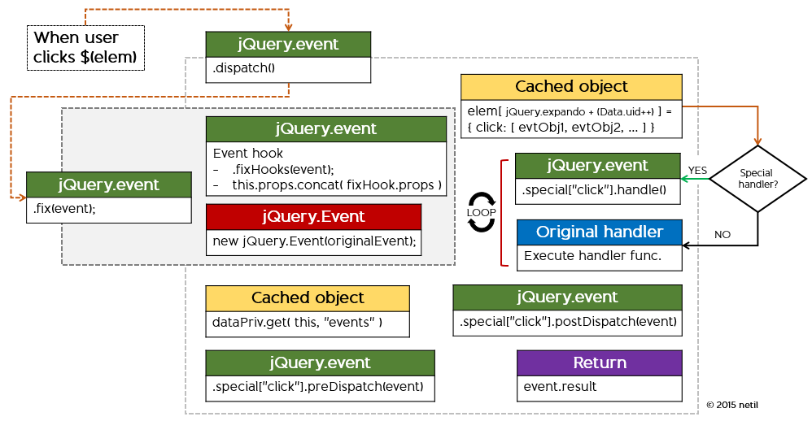
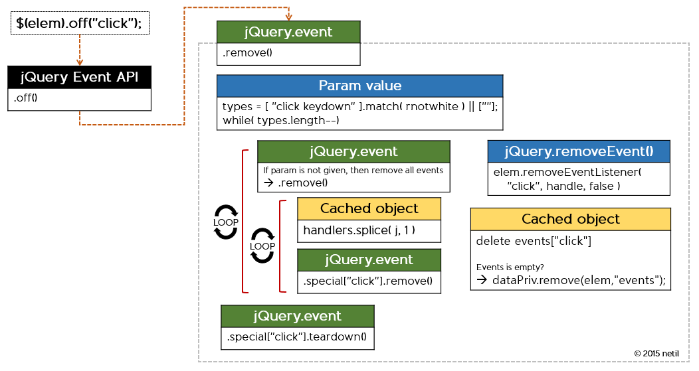

## jQuery event basic

- **namespace 사용**
```js
	$(elem).on("click.yournamespace", function(e) { ... });
```

- **동일 핸들러에 여러 개의 이벤트 바인딩**
```js
	$(elem).on("click focus keydown", function(e) { ... });
```
https://learn.jquery.com/events/event-basics/

----------


- <span class="yellow bold">.trigger("event")</span>
  - elem.trigger("click")은 실제 이벤트를 발생시키는 것이 아니라, 해당 요소에 바인딩된 이벤트 핸들러만을 실행
  - 즉, 요소가 &lt;a>라면 href를 탐색하지 않음

- <span class="yellow bold"><span class=red>'this'</span> on event handler</span> 
  - 이벤트 핸들러 내에서의 this는 raw element를 가리킨다.
  - jQuery로 래핑하고자 한다면 $(this)와 같이 처리필요

```js
$("#some").on("click", function(e) {
	this;  // <== jQuery로 래핑되지 않은 <div id="some">
	$(this);  // <== jQuery로 래핑
});
```

----------


## File structure

### <span class="yellow">event.js</span>

- <span class="red bold">jQuery Event API</span>: public 이벤트 메서드

    ```js
    jQuery.fn.extend({
        on: function(){},
        one: function(){},
        off: function(){},
        trigger: function(){},
        triggerHandler: function(){}
    });
```
- <span class="red bold">jQuery.event</span>: helper functions & properties

    ```js
    jQuery.event = { ... };
    ```

- <span class="red bold">jQuery.Event</span>: 이벤트 객체<br>
    <span class=size18>jQuery.Event 객체는 [DOM3 이벤트](http://www.w3.org/TR/2003/WD-DOM-Level-3-Events-20030331/ecma-script-binding.html)를 기반으로 한다.</span>
    ```js
    jQuery.Event = function( src, props ) { ... }
    jQuery.Event.prototype = { ... };
    ```
  

----------

## Alias
이벤트명 메서드를 통해 편리하게 사용할 수 있는 메서드 alias 처리

- <span class="yellow bold">/event/alias.js</span>

  아래의 이벤트들은 <span class=red>jQuery.fn[event_name]</span> 로 확장되며, 파라미터 없이 호출되는 경우 <span class=green>jQuery.trigger()</span>, 그 반대는 <span class=green>jQuery.on()</span>를 호출한다.

        blur focus focusin focusout load resize scroll unload click dblclick 
        mousedown mouseup mousemove mouseover mouseout mouseenter mouseleave 
        change select submit keydown keypress keyup error contextmenu
        hover bind unbind delegate undelegate

- <span class="yellow bold">/event/ajax.js</span>: Ajax 이벤트

        ajaxStart ajaxStop ajaxComplete ajaxError ajaxSuccess ajaxSend

----------

## Event object

- 이벤트가 바인딩된 요소에 대한 이벤트 객체를 내부 데이터 객체에 캐싱<br>
<span class=size18>(* 내부 private 변수인 <span class="red bold">dataPriv</span>, jQuery.data() 에서 사용하는 캐시 데이터는 <span class="red bold">dataUser</span>)</span>

    ```js
    // dataPriv에 저장된 캐시를 얻어올 수 있다.
    jQuery._data(element);
    
    // dataPrive에 저장된 캐시를 제거할 수 있다.
    // 그러나 이벤트 바인딩은 남아있고, 처리하는 핸들러에 대한 내용만 삭제된다.
    jQuery._removeData(element);
    ```

- Data 추가시 마다 Data.uid++ 증가<br>
  핸들러 추가시 마다 handler.guid = jQuery.guid++ 증가

    ```js
    // Unique for each copy of jQuery on the page
    // expando? A property added to an object at run-time
    jQuery.expando = "jQuery" + ( version + Math.random() ).replace( /\D/g, "" );
    
    // Data 객체가 생성될 때마다 unique한 key 값을 설정해 사용
    function Data() {
        ...
        this.expando = jQuery.expando + Data.uid++;
    }
    ```
----------

## Event object structure

```js
// key: element[ dataPriv.expando ] = Data.uid++
dataPriv.cache[ key ] = {
	events: {
		focus: [{
			data: Variant,  // 사용자가 이벤트에 전달하고자 하는 데이터
			guid: 1,  // handler unique key (jQuery.guid++)
			handler: USER_BIND_FUNCTION,  // 사용자가 정의한 핸들러
			namespace: String,
			needsContext: Boolean,
			origType: "click",
			selector: String,
			type: "click"	
		}, {
			guid: 2,
			...
		}],
		keydown: [{ 
			guid: 3,
			...
		},
		{
			guid: 4,
			...
		}]
	},
	// native addEventLIsteners에 실제 바인딩되는 공통함수
	// 모든 이벤트에는 아래의 함수가 바인딩된다.
	handle: function(e) {
		// Discard the second event of a jQuery.event.trigger() and
		// when an event is called after a page has unloaded
		return typeof jQuery !== "undefined" && jQuery.event.triggered !== e.type ?
			jQuery.event.dispatch.apply( elem, arguments ) : undefined;
	}
};
```

----------

## Some points handling event 

<ul>
	<li class=fragment>
동일한 이벤트를 여러번 바인딩하더라도, 실제로는 제일 처음의 이벤트만 DOM에 실질적으로 
  바인딩하고, 이후 바인딩되는 이벤트들은 내부 이벤트 객체 배열에 추가
	</li>
	<li class=fragment>
이벤트가 발생하면, 이벤트 객체 캐시의 handler 속성에 저장된 함수가 수행되며 이때 native event 객체를 <span class=red>jQuery.Event</span>로 래핑해 파라미터로 전달
	</li>
	<li class=fragment>
<span class=red>jQuery.event.global</span>을 통해 <span class=yellow>.on()</span>으로 바인딩된 이벤트 종류를 확인 가능
<pre><code>// 페이지내에서 click과 keydown 이벤트가 바인딩 되었다면
jQuery.event.global;  // { click: true, keydown: true }
</code></pre>
	</li>
	<li class=fragment>
		이벤트명이 실제 존재하지 않는 이벤트라고 해도 addEventListener()를 통해 등록
	</li>
</ul>

----------

# jQuery Event Extensions
https://learn.jquery.com/events/event-extensions/

----------

## jQuery.event.props
이벤트 핸들러에 전달되는 이벤트 객체에 추가되는 속성 목록<br>
<span class=size18>(* .trigger()를 통해 발생되는 경우는 제외)</span>

```js
jQuery.event.props = ( "altKey bubbles cancelable ctrlKey currentTarget detail eventPhase " +
		"metaKey relatedTarget shiftKey target timeStamp view which" ).split(" ");

// 모든 event 객체에 some을 추가하고자 한다면, 단순히 배열에 추가
jQuery.event.props.push("some");

elem.on("event", function(event) {
	// 핸들러로 전달되는 event 객체에 some 속성을 사용. 실제 구현은 event hook을 통해 처리
	event.some;
});
```

----------

## jQuery event hook

특정 이벤트에 대한 속성을 확장(제어)할 수 있다.<br>
Hook은 이벤트가 발생해 처리되는 시점에 수행된다.

```js
// extend or normalize the event object
jQuery.event.fixHooks["이벤트명"] = {
	// 브라우저 이벤트 객체에서 jQuery 이벤트 객체로 복사되어야 하는 속성명
	props: [],
	
	// 이벤트 객체를 생성한 후 실행되는 함수로, 이벤트 객체에 전달되는 속성을 핸들링할 수 있다.
	filter: function(event, originalEvent) {}
};
```

```js
// ex. drop 이벤트에 dataTransfer 속성을 추가하고자 하는 경우
jQuery.event.fixHooks.drop = {
    props: [ "dataTransfer" ],
    filter: function(event, originalEvent) { ... }
};
```

----------

## key & mouse hooks

jQuery는 기본적으로 키보드와 마우스 이벤트에 대한 hook이 설정되어 있다.

- <span class="yellow bold">jQuery.event.keyHooks</span><br>
  다음의 속성 값을 키보드 이벤트 객체에 추가<br>
  <span class=green>char charCode key keyCode</span>

- <span class="yellow bold">jQuery.event.mouseHooks</span><br>
  다음의 속성 값을 마우스 이벤트 객체에 추가<br>
  <span class=green>button buttons clientX clientY offsetX offsetY pageX pageY screenX screenY toElement</span>  

----------

## jQuery.event.simulate
이벤트를 시뮬레이션 하기위한 메서드로,<br>
A 이벤트가 B 이벤트와 같이 동작하도록 해야할때 사용될 수 있다.<br>
<span class=size18>(ex. focus 이벤트를 focusin 이벤트로 동작)</span>

```js
jQuery.event.simulate: function( type, elem, event, bubble ) {
	var e = jQuery.extend(new jQuery.Event(), event, {
			type: type,
			isSimulated: true,  // simulate 여부 값 속성 추가
			originalEvent: {}  // native 이벤트는 빈 객체로 설정 
		}
	);

	// 버블링 여부에 따라 .trigger() 또는 .dispatch()를 호출
	if ( bubble ) {
		jQuery.event.trigger( e, null, elem );
	} else {
		jQuery.event.dispatch.call( elem, e );
	}
	...
}
```

----------

## Special event hooks

이벤트의 동작을 특정 시점에 제어하기 위해 사용되며,<br>
제어할 이벤트에 대해 속성과 함수를 설정해 사용한다.<br>
<span class="size18">(* load, focus, blur, click, beforeunload 에 대한 special hook은 기본 정의되어 있다.)</span>

```js
jQuery.event.special["EVENT_NAME"] = {
	// trigger()로 실행되었을 때 버블링 여부. (default false)
	noBubble : Boolean,

	// 해당 이벤트가 지정된 이벤트(일반적으로 DOM 이벤트) 와 같이 처리되도록 한다.
	// "click"이라고 지정한 경우, 해당 이벤트는 click 이벤트와 같이 처리
	bindType: String,
	delegateType: String,

	// 이벤트가 바인딩될 때 실행
	// 요소에 이벤트를 native(addEventListener) 바인딩 되게 하려면 return false; 필수
	setup: function( data: Object, namespaces, eventHandle: function ) { ... },

	// 이벤트가 제거(동일 이벤트가 여러개 등록된 경우, 마지막 이벤트)될 때 실행
	// 이벤트가 제거되게 하려면 return false; 필수.
	teardown: function() { ... },

	// 이벤트를 바인딩할 때마다 실행
	// .on()을 통해 등록될 때 마다 실행됨
	add: function( handleObj ) { ... },

	// 이벤트를 제거할 때마다 실행
	// .off()를 통해 제거하는 경우 실행됨
	remove: function( handleObj ) { ... },

	// .trigger() 또는 .triggerHandler()를 통해 이벤트가 발생되는 경우 실행
	// 이벤트 객체가 생성된 후, 이벤트 핸들러가 실행되기 전 시점에 호출되며,
	// return false 면 원래의 핸들러를 실행하지 않는다.
	trigger: function( event: jQuery.Event, data: Object ) { ... },

	// jQuery.trigger()를 통해 실행되었을 때, 바운더리 내의 모든 버블링
	// 이벤트 핸들러가 실행된 후 실행
	// to create a default action for any custom event.
	_default: function( event: jQuery.Event, data: Object ) { ... },

	// 존재하는 경우, 기 등록된 핸들러 대신 실행
	handle: function( event: jQuery.Event, data: Object ) { ... }
}
```

http://benalman.com/news/2010/03/jquery-special-events/

----------

## How jQuery event flows


----------

# Event flows

----------

## 이벤트 바인딩 시 flow

<span class="yellow bold">$(elem).on("event", handler);</span>

<ul style="width:90%">
	<li class=fragment>
		1) jQuery.event.add() 호출
                       
	   <pre><code>return this.each( function() {
		   jQuery.event.add( this, types, fn, data, selector );
	   });
	   </code></pre>
	</li>
	<li class=fragment>2) jQuery.event.add() 실행</li>
	<li class=fragment>
		2-1) Get cached data :
		<pre><code>dataPriv.get( elem );</code></pre>
	</li>
	<li class=fragment>
		2-2) 해당 요소에서 처리할 공통 이벤트 핸들러 설정 (최초 바인딩 시에만)
		 <pre><code>elemData.handle = function(e) {
			 jQuery.event.dispatch.apply()
		 };</code></pre>
	</li>
</ul>

----------

<ul style="width:90%">
	<li class=fragment>
		2-3) 이벤트 객체 구성         
		
<pre><code>	// 이벤트에 대한 정보 객체를 생성 후, 이벤트 객체의 "이벤트명" 키 값의 배열에 추가
	// handleObj is passed to all event handlers
	handleObj = jQuery.extend({
		type: type,
		origType: origType,
		data: data,
		handler: handler,
		guid: handler.guid,  // jQuery.guid++ 증가해 handler에 유니크 값 부여
		selector: selector,
		needsContext: selector && jQuery.expr.match.needsContext.test( selector ),
		namespace: namespaces.join(".")
	}, handleObjIn );
	</code></pre>
	</li>
	<li class=fragment>
		2-4) 최초 바인딩 시에만 실행되는 task:<br>
		   - special["event"].setup() hook 실행<br>
		   - 요소에 이벤트를 native bind   
		<pre><code>if ( elem.addEventListener ) {
				elem.addEventListener( type, eventHandle, false );
}</code></pre>
	</li>
</ul>

----------

<ul style="width:90%">
	<li class=fragment>
		2-5) special["event"].add() hook 실행
	</li>
	<li class=fragment>
		2-6) 핸들러 배열에 추가<br>
	<span class=size18>(handlers는 요소에 대한 내부 캐시 데이터 dataPriv를 가리킴)</span><br>
	<pre><code>handlers.push( handleObj );</code></pre>
	</li>
	<li class=fragment>
		2-7) 어떤 이벤트가 사용되었는지 확인을 위해 이벤트 종류를 저장<br>
	
	<pre><code>// Keep track of which events have ever been used, for event optimization
jQuery.event.global[ type ] = true;
	</code></pre>
	</li>
</ul>

----------

## Flow diagram: .on()


----------

## 이벤트 발생 시 flow

<span class="yellow bold">User clicks an element</span>

<ul style="width:90%">
	<li class=fragment>
		1) jQuery.event.dispatch() 실행<br>
		   모든 jQuery 이벤트 바인딩 핸들러로는 jQuery 정의 함수가 설정된다.
		
		<code><pre>eventHandle = elemData.handle = function( e ) {
			// Discard the second event of a jQuery.event.trigger() and
			// when an event is called after a page has unloaded
			return typeof jQuery !== "undefined" && jQuery.event.triggered !== e.type ?
				jQuery.event.dispatch.apply( elem, arguments ) : undefined;
		};
		</code></pre>
	</li>
	<li class=fragment>
		2) jQuery.event.dispatch() 구성
	</li>
	<li class=fragment>
		2-1) jQuery.event.fix( event )<br>
		이벤트에 따른 hook 처리 및 native 이벤트를 jQuery로 래핑

        <pre><code>event = new jQuery.Event( originalEvent );</code></pre>
	</li>
</ul>

----------

<ul style="width:90%">
	<li class=fragment>
		2-2) 내부 캐시 dataPriv.get( this, "events" ) 에서 저장된 핸들러를 가져온다.
	</li>
	<li class=fragment>
		2-3) Special hook<br>
		jQuery.event.special["event"].preDispatch(event) 실행
	</li>
	<li class=fragment>
		2-4) 요소에 바인딩된 모든 동일 이벤트를 큐에 넣는다.<br>
		<pre><code>handlerQueue = jQuery.event.handlers.call( this, event, handlers );</code></pre>
	</li>
	<li class=fragment>
		2-5) handlerQueue 만큼 반복하면서 핸들러를 실행<br>
		해당 이벤트에 등록된 jQuery.special["event"].handle 이 존재하면, 
		원래 등록된 핸들러 대신 special["event"].handle 함수를 실행
	</li>
	<li class=fragment>
		2-6) Special hook<br>
		jQuery.event.special["event"].postDispatch(event) 실행
	</li>
	<li class=fragment>
		2-7) return event.result; 반환<br>
		result는 special["event"].handle 또는 바인딩한 이벤트 핸들러의 반환 값
	</li>
</ul>

----------

## Flow diagram: on user 'click'



----------

## 이벤트 trigger 시 flow

<span class="yellow bold">elem.trigger("event");</span>

.trigger()와 .triggerHandler()는<br>
단순히 jQuery.event.trigger()를 호출해주는 역할만 수행


<ul style="width:90%">
	<li class=fragment>
		1) jQuery.event.trigger() 구성
	</li>
	<li class=fragment>
		1-1) 새로운 이벤트 객체 생성<br>
    	<pre><code>new jQuery.Event( type, typeof event === "object" && event );</code></pre>
	</li>
	<li class=fragment>
		1-2) special["event"].trigger 실행
		return 값이 false면 원래의 핸들러를 실행하지 않는다.
	</li>
</ul>

----------

<ul style="width:90%">
	<li class=fragment>
		1-3) 이벤트 전파 경로를 작성
		
		<pre><code>for ( ; cur; cur = cur.parentNode ) {
	eventPath.push( cur );
	tmp = cur;
}</code></pre>
	</li>
	<li class=fragment>
		1-4) 등록된 이벤트 핸들러 실행<br>
		1차적으로 jQuery 이벤트 핸들러 실행하고,
		2차적으로 인라인 이벤트("onEvent")가 존재하는 경우, 해당 이벤트 핸들러도 실행
	</li>
	<li class=fragment>
		1-5) .trigger()로 실행되었을 때만, 바운더리 내의 모든 버블링 후, 마지막에 special["event"]._default() 존재하면 실행
	</li>
</ul>

----------

### Triggering event

jQuery에서 제공되는 트리거 함수는 .on()을 통해 추가된 이벤트 핸들러를<br>
실행하는 것으로 native 이벤트를 발생시키는 용도로 사용할 수는 없다.

native 이벤트를 발생시키고자 한다면 [jquery.simulate](https://github.com/jquery/jquery-simulate/)을
사용할 수 있다.<br>
<span class=size18>(* use document.createEventObject for < IE9 / document.createEvent for others)</span>

----

### .trigger() vs .triggerHandler()

  - triggerHandler()는 첫 번째 요소에 대해서만 핸들러를 실행
  - 체이닝 되지 않음. 핸들러의 반환값을 반환
  - 기본동작을 사용할 수 없음 (form submit 과 같은)
  - 버블링되지 않으며, 첫 번째 요소에 등록된 핸들러만 실행

https://learn.jquery.com/events/triggering-event-handlers/

----------

## Flow diagram: .trigger()


----------

## 이벤트 제거 시 flow

<span class="yellow bold">elem.off("event");</span>

<ul style="width:90%">
	<li class=fragment>
		1) jQuery.event.remove( this, types, fn, selector ) 실행<br><br>
	</li>
	<li class=fragment>
		1-1) 이벤트 분리(여러개 인 경우를 대비) 후, 반복문 실행<br>
		사용자가 전달하는 파라미터가 elem.off("click mousedown keydown");와 같은 경우
	</li>
	<li class="fragment red bold nostyle">[LOOP 1]</li>
	<li class=fragment>
		1-2) 이벤트 파라미터가 전달되지 않은 경우, 모든 이벤트를 제거
		<pre><code>if ( !type ) {
	for ( type in events ) {
		// recursive 하게 jQuery.event.remove()를 각각 호출
		jQuery.event.remove( elem, type + types[ t ], handler, selector, true );
	}
}</code></pre>
	</li>
</ul>

   
----------

<ul style="width:90%">
	<li class=fragment>
		1-3) 단일 이벤트에 등록된 핸들러에 대해 반복문 실행 (여러개 또는 단일)
	</li>
	<li class="fragment red green nostyle">[LOOP 2]</li>
	<li class=fragment>
		1-4) handlers.splice( j, 1 );  핸들러 배열에서 값을 제거하는 형태로 큐에서 제거
	</li>
	<li class=fragment>
		1-5) special["event"].remove()가 존재하면 실행
	</li>
	<li class="fragment red yellow nostyle">[ End LOOP 2 & 1 ]<br><br></li>
	<li class=fragment>
		1-6) special["event"].teardown() 실행
	</li>
	<li class=fragment>
		1-7) jQuery.removeEvent( elem, type, elemData.handle );를 통해 요소에 바인딩된 이벤트를 실제로 제거하고, event 객체에서 해당 이벤트에 대한 내용 삭제
		<pre><code>delete events[ type ];</code></pre>
	</li>
	<li class=fragment>
		1-8) 해당 요소에 바인딩된 이벤트가 모두 제거된 경우라면 캐시에서도 제거
		<pre><code>// Remove the expando if it's no longer used
if ( jQuery.isEmptyObject( events ) ) {
	delete elemData.handle;
	dataPriv.remove( elem, "events" );
}</code></pre>
	</li>
</ul>

----------

## Flow diagram: .off()



----------

	
## Recapping main points
<ul>
	<li class=fragment>실제 DOM에 바인드 되는 핸들러는 사용자 핸들러가 아닌, jQuery 핸들러가 설정된다.</li>
	<li class=fragment>동일 이벤트를 여러번 바인딩 하더라도, 최초 한번만 실제로 바인딩되고 나머지는 내부에서 큐 형태로 관리된다.</li>
	<li class=fragment>요소에 설정되는 이벤트 정보는 내부 캐시에 저장된다.</li>
	<li class=fragment>special hook을 사용하면 특점 시점에 이벤트를 제어할 수 있다.</li>
</ul>