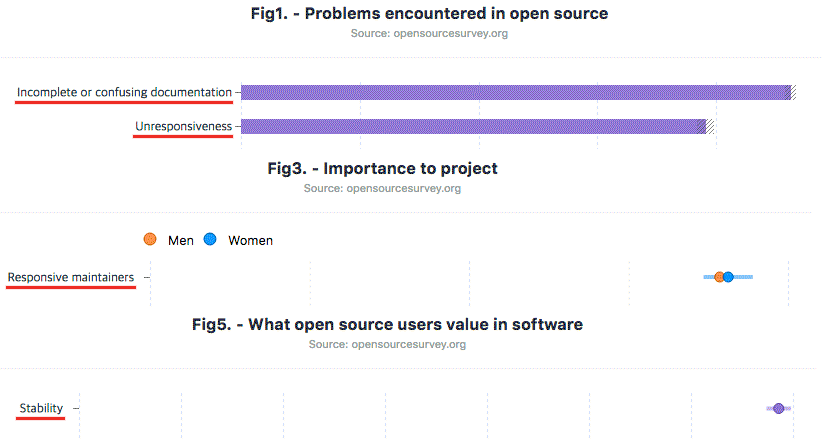

<!-- .slide:class="title" -->

    
<h2>네이버의 FE 오픈소스</h2>

    

Front-End open source

----------

 
 
 

----------

<!-- .slide: id="history" -->
## History (2007 ~ 2017)

| | |
| --- | --- |
| 2007.03 | Jindo 개발 |
| 2008.12.31 | [SmartEditor v1.0 공개](http://naradesign.net/wp/2009/01/01/474/) |
| 2010 | Jindo 외부 공개 (네이버 개발자센터) |
| 2010.12.15 | [SmartEditor v2.0](http://blog.naver.com/PostView.nhn?blogId=tmfdk43&logNo=70099797144) ([Repo](https://github.com/naver/smarteditor2)) |
| 2010.12.29 | Jindo Component(JC) 공개 |
| 2011.08.16 | [Jindo Mobile Component(JMC) 공개](https://www.slideshare.net/deview/c5-ui) |
| 2012.04 | Jindo v2.0 |
| 2014.12.23 | JindoJS - [Jindo](https://github.com/naver/jindojs-jindo) / [JMC](https://github.com/naver/jindojs-jmc) / [JC](https://github.com/naver/jindojs-jc) (GitHub 공개) |
| 2015.12.24 | [egjs 발표](https://github.com/naver/egjs/releases/tag/1.0.0) - jQuery 기반의 UI 컴포넌트 |
| 2016.10.24 | [JindoJS 개발 중단 발표](http://netil.github.io/slides/egjs/#/16) |
| 2017.06.08 | [billboard.js 공개](https://github.com/naver/billboard.js/releases/tag/1.0.0) - 차트 라이브러리 |
| 2017.08.17 | egjs v2.0 - jQuery 의존성 제거 |

----------

## 초기의 개발은
<h3>실무적인 고민의 결과물로,</h3>

#### 오픈소스로 공개를 위한
## 목적의 개발은 아니었다.

----------

#### 오늘 발표는 과거 경험을 공유해
<h2>성공적인 오픈소스 등장에</h2>
### 도움을 주고 싶기 때문

----------

#### 네이버에서의 시행착오는
### 다른 미래의 오픈소스 성공을 위한
<h2>도움이 될수 있지 않을까?</h2>

----------

<!-- .slide:data-background-image="./img/js-solar.png" data-background-size="cover" -->
## '역사'를 아는 것은
### 현재를 더 잘 이해하고,
### 더 나은 미래를 위해
## 중요하기 때문 <!-- .element: style="color:cyan" -->

    A Brief History of JavaScript: [#1](https://brendaneich.com/2010/07/a-brief-history-of-javascript/), [#2](https://auth0.com/blog/a-brief-history-of-javascript/) 
    [A brief history of CSS until 2016](https://www.w3.org/Style/CSS20/history.html) 
    [A history of HTML](https://www.w3.org/People/Raggett/book4/ch02.html) 
    [Solar System of JS](http://shaunlebron.github.io/solar-system-of-js/)

----------

### FE가 전문 영역으로 인정된 것은
## 불과 최근 몇년 전에 불과

#### 우리는 주로 '소비'하는 입장

다른 영역에서 성공한 국내 오픈소스들도 있지만...

> FE 기술영역에서는 두드러진  <!-- .element: class="fragment" -->
> 결과를 얻고 있지는 못하다.

----------

## 혹시, 기억하시나요?

    <video src="./img/naver-cafe-2004.mp4" controls style="width:500px;"></video> 
    https://www.youtube.com/watch?v=vZwbdgzg3Tc

기억하고 계시다면... '아ㅈ' 아, 아닙니다. <!-- .element: class="fragment" -->

----------

#### 수많은 자체 개발 FE 라이브러리들이
## 이전에도 그리고 지금도
#### 네이버 서비스의 곳곳에서 '여러분'들을 만나고 있습니다.

----------

<!-- .slide:class="title" -->

    
<h1>지난 10년의 기록</h1>

    

2007 ~ 2017

----------

 
2007 ~ 2016

AJAX 프레임워크

- 당시 라이브러리들에 대한 아쉬움 <!-- .element: class="fragment" -->
- 네이버 서비스들에서의 빠른 이슈대응 필요성 <!-- .element: class="fragment" -->

    
    
    

        [자바스크립트 UI 개발과 Jindo 프레임워크](http://book.naver.com/bookdb/book_detail.nhn?bid=6749231) ([무료 eBook](http://www.yes24.com/24/Goods/16853792?Acode=101)) 
        [NHN DeView 2008: Jindo & SmartEditor](http://blog.naver.com/deview_con/40057950382)
    

----------

#### 2013년 무렵까지 네이버 서비스의
## 기본 라이브러리로 사용

 최초 버전은 Native 객체를 확장 <!-- .element: class="fragment" -->
<pre class="fragment"><code class="javascript" style="font-size:1.1em">["apple", "banana", "orange"].has("orange"); // Jindo classic</code></pre>
 
Jindo2 - wrapper 클래스를 사용 <!-- .element: class="fragment" -->
<pre class="fragment"><code class="javascript" style="font-size:1.1em">$A(["apple", "banana", "orange"]).has("orange"); // Jindo2</code></pre>

----------

##  Architecture

    [NHN의 안과 밖: Jindo와 jQuery](http://d2.naver.com/helloworld/43939)

----------

 
2008 ~ present ([v3.0](http://blogpeople.blog.me/220537903374)은 미공개)

- WYSIWYG 웹에디터 <!-- .element: class="fragment" -->
- 카페/블로그 등 UGC 서비스를 위한 필요성 <!-- .element: class="fragment" -->
- 공통 에디터가 없었음 <!-- .element: class="fragment" -->
- 당시 기존 에디터들의 기능 미약 <!-- .element: class="fragment" -->
- 외부 사용자들의 요구는 점점 커지고 다양해짐 <!-- .element: class="fragment" -->

> 최초 버전은 5명이 6개월간 개발 <!-- .element: class="fragment" -->

    [NAVER Inside: SmartEditor](http://inside.naver.com/smarteditor/review) 
    [그 이름은 '스마트 에디터™' 입니다.](http://blog.naver.com/blo9/30020337897) 
    [네이버 스마트에디터가 나오기까지](https://m.blog.naver.com/naver_diary/150045392658)

----------

는 
네이버의 다양한 UGC 플랫폼에서 기본 에디터로 사용

    [GitHub](https://github.com/naver/smarteditor2) / [Online Demo](http://naver.github.io/smarteditor2/demo/)

----------

 
### Mobile Component (JMC)
2011 ~ 2016

[2009/11월 iPhone 3GS 국내출시](https://ko.wikipedia.org/wiki/%EB%8C%80%ED%95%9C%EB%AF%BC%EA%B5%AD%EC%9D%98_%EC%95%84%EC%9D%B4%ED%8F%B0_%EC%B6%9C%EC%8B%9C) 후, 
- 모바일의 폭발적인 성장으로 인한 필요성 <!-- .element: class="fragment" -->
- 크로스 플랫폼과 앱스러운 UI/UX 개발 위해 <!-- .element: class="fragment" -->

    [DEVIEW 2011: 모바일 웹 UI 개발 아직도 맨땅에 삽질부터 하십니까?](https://www.slideshare.net/deview/c5-ui) 
    [쉽고 빠른 모바일 웹 UI 개발](http://book.naver.com/bookdb/book_detail.nhn?bid=7434247)
    [Jindo 기반 모바일 전용 컴포넌트, JMC](http://d2.naver.com/helloworld/74717)

----------

### 40여개 이상의
## 모바일 UI 컴포넌트

다양한 모바일 환경 지원 강점

    [JMC API](http://jindo.dev.naver.com/docs/jindo-mobile/archive/1.17.1/doc/external/index.html)

----------

# Behind Story
### 당시 코드네임은 개 품종에서 차용 관례

- Jindo
- Husky
- Sharpei
- Beagle
- Pekingese
- Collie

    http://www.akc.org/dog-breeds/

----------

 
2015 ~ present

개발 당시는 웹 프레임워크들 등장 초기 시점

- jQuery &rarr; 업계의 de facto standard <!-- .element: class="fragment" -->
- jQuery에서 사용 가능한 모바일 컴포넌트 필요 <!-- .element: class="fragment" -->
- 기존 JMC의 대체 라이브러리 역할도 포함 <!-- .element: class="fragment" -->

    [네이버의 모던 웹 라이브러리](https://deview.kr/2016/schedule#session/165)

----------

## 10종의 모바일/데스크탑 UI/UX 컴포넌트들

| Component | Description |
| --- | --- |
| [Axes](https://naver.github.io/egjs-axes/) | 사용자 입력 반응 응용 |
| [Flicking](https://naver.github.io/egjs-flicking/) | 캐로셀 UI 구성 |
| [InfiniteGrid](https://naver.github.io/egjs-infinitegrid/) | 무한 카드 UI 스크롤 |
| [View360](https://github.com/naver/egjs-view360) | 360도 뷰어 |
| [Visible](https://naver.github.io/egjs-visible/) | 요소의 뷰포트 노출 확인 |
| [Agent](https://naver.github.io/egjs-agent/) | 브라우저 정보 |
| [Rotate](https://naver.github.io/egjs-rotate/) | 화면 회전 이벤트 |
| [Persist](https://naver.github.io/egjs-persist/) | 페이지 상태 저장 (BFCache) |
| [$PauseResume](https://naver.github.io/egjs-jquery-pauseresume/) | jQuery 애니메이션 진행 제어 |
| [$Transform](https://naver.github.io/egjs-jquery-transform/) | jQuery animate 확장 |

----------

### egjs-flicking <!-- .element: style="text-transform:none" -->

<iframe src="demo/demo01.html" style="width:300px;max-width:300px;height:300px" frameborder="0" marginwidth="0" marginheight="0" scrolling="no"></iframe>

----

### egjs-axes <!-- .element: style="text-transform:none" -->

<iframe src="demo/demo02.html" style="width:550px;height:172px" scrolling="no"></iframe>

----------

 
2017.06.08 ~ present

재사용 가능한 쉬운 인터페이스 차트 라이브러리

C3.js fork 프로젝트 <!-- .element: class="fragment" -->
- 네이버 블로그/포스트 통계 개선으로 시작 <!-- .element: class="fragment" -->
- 라이브러리 사용의 공통화 <!-- .element: class="fragment" -->

    [[네이버 블로그] 블로그 통계가 새로워졌습니다!](http://blogpeople.blog.me/220730678589) 
    [[네이버 포스트] 훨씬 좋아진 통계, 지금 제공합니다!](http://post.naver.com/viewer/postView.nhn?volumeNo=4423938)

----------

# Declarative API

Readable & Understandable: 쉬운 인터페이스

<pre><code class="javascript" style="font-size:1em;line-height:1.2;">bb.generate({
    bindto: "#chart",
    data: {
        columns: [
            ["data1", 30, 200, 100, 400, 150, 250],
            ["data2", 100, 80, 130, 240, 350, 90],
            ["data3", 150, 120, 58, 135, 258, 159]
        ],
        type: "bar",
        colors: {
            data1: "#2acefd",
            data2: "#f87070",
            data3: "#1f77b4"
        },
        labels: true
    }
});</code></pre>

    [billboard.js API](http://naver.github.io/billboard.js/release/latest/doc/)

----------

# Let's play chart!

<iframe src="demo/demo03.html" style="marign-top:40px;width:80%;min-height:600px" scrolling="no"></iframe>

----------

초기 웹개발 환경에선
### '네이버'가 만든 것에 대한 신뢰가 존재

## 그러나,
점점 '네이버'만의 것은 범용성과 
<h3 class="fragment">글로벌한 '성장'은 한계성 존재</h3>

----------

# 반성

#### 각각의 product 들은 목적이 분명했다.

그러나 그 목적이 '오픈소스'와 
완전히 부합 했다고 보기는 힘들었던 것 같다.

    <h2 style="display:inline-block;margin-top:30px;text-decoration:underline;color:cyan">형식적 '오픈소스'</h2> 였던 것은 아닐까?

----------

# 관점의 변화

    <h2 style="color:#f100ff;background-color:#403f3f;border-radius:15px;">Phase 1: 2007 ~ 2014</h2>
    내부 경쟁력과 빠른 대응을 위해

    <h2 style="color:#fff900;background-color:#403f3f;border-radius:15px">Phase 2: 2015 ~ 현재</h2>
    오픈소스를 바라보는 '관점'과 '원칙'의 변화

----------

# 기본 원칙 1

###  오픈소스의 활용
<ul class="size40" style="line-height:1.8">
    <li class="fragment">좋은 오픈소스가 있다면, 사용한다.</li>
    <li class="fragment">필요한 경우, 커스터마이징 한다.</li>
</ul class="fragment">

----------

# 기본 원칙 2

### 직접 개발하는 경우
<ul class="size40" style="line-height:1.8">
    <li class="fragment">기능/성능이 아쉬운 경우</li>
    <li class="fragment">전략적 기술확보 필요성</li>
    <li class="fragment">필요한 기능을 가진 라이브러리가 없는 경우</li>
</ul>

----------

### 새로운 원칙에 따른
###  개발 중단
## 무엇이 부족했나?

- 외부 레퍼런스, 교육비용, 호환성 <!-- .element: class="fragment" -->

- 빠른 변화, 환경의 민첩한 대응 <!-- .element: class="fragment" -->

- 개발자들의 long term 커리어 및 발전 기여  <!-- .element: class="fragment" -->

----------

<!-- .slide:class="title" -->

    
<h1>기술적 고찰</h1>

    

오픈소스의 중요 요소들

----------

## 오픈소스의 중요 요소들

안정성, 충분한 문서 그리고 책임감

    http://opensourcesurvey.org/2017/

----------

## 안정성 확보 방안들

각 단계별 품질 유지를 위한 자동화 검사

<ul style="font-size:28px;width:550px">
    <li>커밋 관리를 위한 일관된 [커밋 로그 룰](https://github.com/naver/billboard.js/blob/master/CONTRIBUTING.md#commit-log-guidelines) 적용</li>
    <li>정적 검사(linting): [eslint-config-naver](https://github.com/naver/eslint-config-naver)</li>
    <li>[commit/push hook](https://github.com/typicode/husky)을 통한 자동 검사 수행</li>
    <li>[CI](travis-ci.org)를 통한 품질 자동화 검사</li>
</ul>

----------

# 테스트 코드

- 다양한 도구 활용: [Mocha](https://mochajs.org/), [Chai](http://chaijs.com/), [Sinon](http://sinonjs.org/), [Karma](http://sinonjs.org/)
- [Headless browser](https://developers.google.com/web/updates/2017/04/headless-chrome)를 활용한 TC 수행
- 커밋에는 TC가 포함 되어야 함 

----------

# 도구의 활용

품질 향상을 위한 많은 도구들이 상용인 경우라도 
오픈소스에는 무료로 제공된다.

    [Tools for Open Source](https://github.com/collections/tools-for-open-source) 
    [GitHub Marketplace](https://github.com/marketplace)

----------

# 기웃거리기

유명한 오픈소스 프로젝트들의 사례를 참고

- commit log rule & hook (AngularJS, jQuery)

- 환경구성 (linting, test, build, etc.)

> 다른 프로젝트들의 package.json은  <!-- .element: class="fragment" style="color:cyan" -->
> 많은 것을 알려줄 수 있다.

----------

# 집중과 선택

JMC에서 경쟁력 있다고 판단된 것들만 
egjs 컴포넌트로 재개발

&lt;JMC &rarr; egjs 전환비율>

<iframe src="demo/jmc-transition.html" style="width:80%;min-height:550px" scrolling="no"></iframe>

----------

# 능동적 변화

- 전통적인 DOM 직접 핸들링(like jQuery) 
   &rarr; Framework 개발 패러다임 전환 <!-- .element: class="fragment" -->

- 의존성을 갖지 않는 컴포넌트 요구 증가 <!-- .element: class="fragment" -->

     v2.0은? 
    1개의 공통 라이브러리에서, 
    10개의 [독립된 컴포넌트로의 전환](https://www.npmjs.com/search?q=@egjs)

----------

# 흐름에 맡기다.

의 경우, 
프로젝트 지속성 의문에 따른 fork 

    <h3 style="border:dotted 1px #fff;padding: 15px 0;width: 800px;margin: 25px auto;">
        C3.js 기능 확장 개발로 시작 
        &rarr; Fork 후 외부공개
    </h3>

    

        [DEVIEW 2017: 14일 만에 GitHub 스타 1K 받은 차트 오픈소스 개발기](https://deview.kr/2017/schedule/191)
    

----------

## 적극적 참여 시도

2015, jQuery 재단 멤버십

    [Wayback Machine: jQuery Foundation Members](https://web.archive.org/web/20150905060653/https://jquery.org/members/)

----------

## 좋은 오픈소스 개발을 위한
### 더 깊은 이해를 위한 노력들

----------

# Internal 분석 시리즈

다른 라이브러리에 대한 이해

<iframe id="doc" src="//www.slideshare.net/slideshow/embed_code/45155720" width="400" height="400" frameborder="0" marginwidth="0" marginheight="0" scrolling="no" style="border:1px solid #CCC;border-width:1px;margin-bottom:5px;max-width:100%;float:left"> </iframe>

<ul style="float:left;width: 450px;margin: 90px 0 0 70px;">
    <li>[AngularJS 도입 선택 가이드](http://d2.naver.com/helloworld/1172239)</li>
    <li>[jQuery 세부 분석 시리즈](http://d2.naver.com/helloworld/1855209)</li>
    <li>[React 적용 가이드 시리즈](http://d2.naver.com/helloworld/1848131)</li>
    <li>[AMP는 어떻게 웹 페이지의 성능을 높일 수 있나](http://d2.naver.com/helloworld/6856597)</li>
</ul>

----------

### JavaScript/FE 개발 동향 & 기술분석

생태계와 기술에 대한 이해 & 분석

- [2017년과 이후 JavaScript의 동향](http://d2.naver.com/helloworld/7229119)
- [2016년과 이후 JavaScript의 동향](http://d2.naver.com/helloworld/3618177)
- [하드웨어 가속에 대한 이해와 적용](http://d2.naver.com/helloworld/2061385)
- [웹 컴포넌트](http://d2.naver.com/helloworld/188655)
- [터치 이벤트를 이용한 사용자 제스처 분석](http://d2.naver.com/helloworld/80243)
- [JavaScript 표준을 위한 움직임: CommonJS와 AMD](http://d2.naver.com/helloworld/12864)

----------

<!-- .slide:class="title" -->

    
<h1>홍보전략</h1>

    

오픈소스의 성장

----------

    

특정 tag 들에 대한 답변시도 ([carousel](https://stackoverflow.com/questions/tagged/carousel), [jquery](https://stackoverflow.com/questions/tagged/jquery), etc.)</a>

    Reputation(평판/활동 점수)?  
    신규 tag 생성과 신뢰도 등, 활동을 위한 기본적 조건을 위해 필요 

<blockquote class="fragment yellow" style="width:85%">라이브러리 자체 인지도가 낮아 큰 반응 얻지 못함</blockquote>

----------

# 직접 발로 뛰어 보기

### 다수의 'echo' 사이트에 등록하기

 

    많은 곳에서 해당 사이트에 등록된 정보를 활용, 재전파 한다.

----------

# 뉴스레터 소개 요청하기

[JavaScript Weekly](http://javascriptweekly.com/) 

    FE 관련 뉴스레터는 사실, 한 곳에서 발행 
    https://cooperpress.com/

----------

## JavaScript Weekly 소개

<ul style="font-size:20px">
    <li>Issues 308 (16.11.03): [egjs: jQuery-Based UI Interactions, Effects, and Utilities Library](http://javascriptweekly.com/issues/308)</li>
    <li>Issues 338 (17.06.09): [billboard.js: A Chart Library, based on D3 v4+](http://javascriptweekly.com/issues/338)</li>
    <li>Issues 353 (17.09.22): [billboard.js: A Simple Chart Library Based on D3 V4](http://javascriptweekly.com/issues/353)</li>
</ul>

----------

##  Trending!

: JavaScript 언어부문 3위 기록

    https://github.com/trending/javascript

----------

<!-- .slide:class="title" -->

    
<h1>오픈소스</h1>

    

어떤 의미와 가치일까?

----------

# 오픈소스
## 성공을 위한 조건들

공개는 완성이 아니라, 이제 시작일 뿐

- 빠른 피드백과 대응 <!-- .element: class="green fragment" -->

- 충실한 문서와 데모 <!-- .element: class="yellow fragment" -->

- 지속적 기능 추가/bug fix 및 정기적 릴리즈 <!-- .element: class="cyan fragment" -->

----------

## Corporate Open Source?

패러다임의 전환  <!-- .element: class="yellow fragment" -->

    개인의 노력을 통한 발전에서 기업의 후원을 받는 개발로의 전환 
    Angular(Google) / React(Facebook)

> 다른 이들에게 좋지만, 우리(기업)에게 더 좋을 수 있는 <!-- .element: class="fragment" -->

- 내부 이슈의 빠른 대응성 <!-- .element: class="fragment" -->
- 신규 기능 구현 가능성 상승 <!-- .element: class="fragment" -->
- 대외적 이미지 향상 ... <!-- .element: class="fragment" -->

----------

## Why do
# open source?

> 세상에서 내가 도움 받은 것에 대해  <!-- .element: class="fragment" -->
> 다시 기여하는 의미있고 가치있는 행동

    [네이버 오픈소스 가이드](https://naver.github.io/OpenSourceGuide/book/index.html) 
    [GitHub Open Source Guides](https://opensource.guide/)

----------

# The Bad

    [Equifax blames open-source software for its record-breaking security breach: Report](http://www.zdnet.com/article/equifax-blames-open-source-software-for-its-record-breaking-security-breach/)

----------

# The Good

    https://twitter.com/s0yuka/status/874530243595436032

----------

### 지난 10년간의
## 시간과 도전을 통해

- 우리만의 것이 아닌 모두를 위한 개발 <!-- .element: class="fragment" -->

- 시도할 수록 더 나은 결과 <!-- .element: class="fragment" -->

- 글로벌한 오픈소스 개발의 자신감 <!-- .element: class="fragment" -->

- 오픈소스는 어렵지만, 큰 가치 존재 <!-- .element: class="fragment" -->
