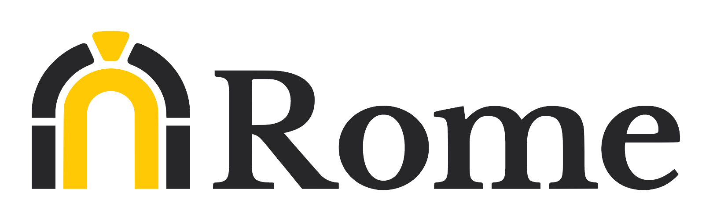

# 오픈소스는
# OOO 다.

각자의 정의를 마음속에 한번 떠올려 보세요.

----------

### 여러분에게 오픈소스란 <!-- .element: class="m-0" -->
## 어떤 의미를 갖고 있나요?

- 프로젝트 개발에 도움되는 무료 SW
- 채용/이직에 도움될것 같아서
- 능력/역량을 보여주기 위해
- 개인 성장, 취미/재미/호기심을 위해

## 무엇이 되었던, <!-- .element: class="m-0" style="margin-top:50px" -->
### 오픈소스는 중요하다고 생각하시죠?

> 그러나, 실제 참여는 중요함에 비례해 보면 매우 제한적 <!-- .element: class="red" -->

----------

개발자라면 오픈소스를 남겨야(참여해야) 하는 이유는
# 무엇일까요?

----------

## 결론부터 말하자면,

오늘날 누구도 오픈소스를 사용하지 않고 개발할 수 없으며, 
미래에는 더더욱 가속화될 것이라는 사실

어떤식으로든 여러분들은 오픈소스를 통해 혜택을 보게 된다는 사실 
받았던 혜택들을 돌려주는 거의 유일한 방법은 

### 오픈소스 참여를 통해 그 비용을 <!-- .element: class="m-0" -->
<h1 style="color:cyan">지불(기여)하는 것!</h1>

----------

<!-- .slide: data-background-image="./img/bg00.png" -->

<h1 class="index">1</h1>

### 잘 보이지 않는 <!-- .element: class="m-0" -->
## 문제들

----------

## 현재의 지속성 모델

오픈소스를 유지하기 위해선 비용이 필요

기업 주도적 또는 비즈니스 수행 모델을 통한 발전 이외, 
지속 가능한 비용을 얻을 수 있는 뚜렷한 방법은 없다.

모델 | 설명 | 예시
--- | --- | ---
기업 주도적 | 기업 소속으로 기업 주도적 오픈소스 개발 | React(Facebook), Angular(Google) 등
[Sponsors](https://github.com/sponsors) | 개인 또는 기업 등 외부의 기부, 펀딩 | Babel, Vue.js 등
[Open Core](https://en.wikipedia.org/wiki/Open-core_model) | 기능 제한적인 'core'를 무료/오픈소스로, '상업용' 또는 애드온을 독점 SW로 제공 | Redis, Elastic, MongoDB 등
[비즈니스](https://en.wikipedia.org/wiki/Business_models_for_open-source_software) | 유료 서비스(호스팅) 제공, SaaS, 기술지원, 컨설팅 등 | [npm](https://www.npmjs.com/products) 등

  지속 가능한 비용은 경제적인 것이 제일 중요하지만, 
  꼭 그것만을 의미하는 것이 아님

----------

## The Bad

Open Source has a "Begging Problem"

  OSS developers write the software that keeps the entire technical world 
  running, but OSS developers are supplicants.  
  They have to beg.

> OSS 개발자는 전체 기술 세계를 구동시키는 SW를 
> 개발하지만 요청자 입장으로, 구걸해야 한다. 
> &dash; [Bruce Perens](https://en.wikipedia.org/wiki/Bruce_Perens) ([Open Source Initiative](https://opensource.org/) 공동 설립자)

  <a href="https://youtu.be/vTsc1m78BUk?list=WL&t=308">What Comes After Open Source</a>

----------

기업들의 오픈소스를 취해 자신들의 비즈니스에 활용 
그러나, 얻는 이익대비 기여는 매우 낮다.

  

     
    <a href="https://www.slideshare.net/slidarko/mmadt-a-virtual-machinean-economic-machine#16" style="font-size:0.5em" class="reference">mm-ADT: A Virtual Machine/An Economic Machine</a>
  

  클라우드 업체들은 비용 지불/기여 없이  
  `as a service` 로 제공해 이익을 취함

  <a href="https://www.oreilly.com/radar/the-business-of-open-source/">The Business of Open Source</a> 
  <a href="https://www.elastic.co/kr/blog/why-license-change-AWS">Amazon: NOT OK - Elastic 라이선스를 변경해야 했던 이유</a> 

----------

##  GL JS

웹에서 손쉽게 지도를 만들어 주는 라이브러리 
20/12월, [v2.0 릴리스]("https://github.com/mapbox/mapbox-gl-js/blob/main/CHANGELOG.md#200)하면서, 기존 [`3-Clause BSD`](https://opensource.org/licenses/BSD-3-Clause) 라이센스를 제거

2019년, MS는 Mapbox GL JS의 20여개 라이브러리를 
활용한 ['Azure Maps' 클라우드 서비스 공개](https://blog.mapbox.com/1azure-maps-adds-data-driven-styling-powered-by-mapbox-gl-f14d062b79f9)

한 클라우드 제공자가 서비스를 시작하면, 
뒤이어 다른 업체들도 따라할 것이므로 
클라우드 업체들의 사용을 제한하기 위한 조치

> <!-- .element: class="red fragment fade-right" -->
> 결국, 클라우드로 인해 Open core 모델, 오픈소스가 죽었다.

  <a href="https://joemorrison.medium.com/death-of-an-open-source-business-model-62bc227a7e9b">Death of an Open Source Business Model</a>

----------

최신 문법 사용 코드를 더 낮은 버전(ES6+ &rarr; ES5)으로 변환해 
호환성 문제를 해결해 주는 트랜스파일러로, 월간 1.1억회 다운로드 발생

Front-end 기술 스택에서 기본으로 사용되지만, 
메인터넌스를 위한 비용 문제에 직면

 
<a href="https://opencollective.com/babel#category-BUDGET" style="font-size:0.5em" class="reference">open collective: Babel</a>

2018년 펀딩받기 시작했으나, 2020년 펀딩 감소로 
개발에 참여하는 풀타임 개발자들(현재 3명) 비용 등이 부족한 상황

  <a href="https://babeljs.io/blog/2021/05/10/funding-update.html">Babel is used by millions, so why are we running out of money?</a> 

----------

## 2021년은

- [Free Software 등장](https://www.gnu.org/) (1985), 38년째
- [Open Source 용어 정의](https://opensource.com/article/18/2/coining-term-open-source-software) (1988), 23년째

> <!-- .element: class="red fragment fade-up" -->
> 그러나, 아직도 OSS 프로젝트 지속성에 대한 
> 문제를 해결하는 명확한 모델이 없는 상태

더 나은 사회, 누군가를 도울수 있다는
이타적인 생각의 접근이 필요하며, 

오픈소스를 바라보는 기본적 시각이 되었으면 함

[오픈소스는 어디에서 왔나?](https://netil.github.io/slides/oss-behind/#/4) <!-- .element: class="reference" -->

----------

<!-- .slide: data-background-image="./img/bg00.png" -->

<h1 class="index">2</h1>

### 오픈소스를 통한 기회

----------

## How came to 

[호주 Wodonga](https://en.wikipedia.org/wiki/Wodonga) 출신의 Sebastian McKenzie(당시 17세)가 
학교 시험 공부 도중, '6to5'(ES6 to ES5)라는 이름으로 
2014년 9월28일 [첫 커밋](https://github.com/babel/babel/commit/c97696c224d718d96848df9e1577f337b45464be)하며 시작

    <a href="https://medium.com/@sebmck/2015-in-review-51ac7035e272">2015-in-review</a>

----------

### 를 통한 기회  

   

  

      Thinkmill &rarr; CloudFlare 
      &rarr; Facebook &rarr; <a href="https://rome.tools/blog/announcing-rome-tools-inc/">Rome Tools, Inc.</a> 창업  
	   
	  모던 웹 애플리케이션 개발에 필요한 
      툴 체인들을 단일 도구로 대체하기 위한 목적의 도구
  

  

----------

 
 <a href="https://github.com/swc-project/swc">swc-project/swc</a> 

[강동윤](https://kdy1.github.io/)님이 [2017년 첫 커밋](https://github.com/swc-project/swc/commit/0f9532dd5d379292cc2d67777a108d88803bad91)을 통해 시작

[Rust](https://www.rust-lang.org/)로 개발한 JavaScript 컴파일러(트랜스파일러)로 
GitHub 16K Stars 기록 중.

주요 Front-end 생태계 도구들이 채택하고 있는 
글로벌 인기 프로젝트로 성장

> [Deno &rarr; Vercel (Next.js) 이직](https://kdy1.github.io/post/jobs/vercel/deno-vercel/)

----------

<!-- .slide: data-background-image="./img/bg00.png" -->

<h1 class="index">3</h1>

## 오픈소스 <!-- .element: class="m-0" -->
#### 메인테이너로의 여정

오픈소스와 생태계에 비용 지불(기여)하기

----------

## 첫 기여 경험

2015년, jQuery에 문서에서 중복 단어 제거 PR

https://github.com/jquery/jquery/pull/2751 <!-- .element: class="reference" -->

----------

 
 <a href="https://github.com/naver/billboard.js">naver/billboard.js</a> 

2017년, 내부 프로젝트를 위해 사용했던 프로젝트([C3.js](https://github.com/c3js/c3))의 불확실한 
지속성을 제거하기 위한 fork로 시작한 웹 시각화 라이브러리

[14일 만에 GitHub 스타 천 개 받은 차트 오픈소스 개발기](https://deview.kr/2017/schedule/191) <!-- .element: class="reference" -->

----------

오픈소스로 공개 한다고 해서 바로 사용자와 참여자들이 오진 않는다.

## 성장하기 위한 <!-- .element: class="m-0" -->
### 매력적인 프로젝트로 만들기

활발한 프로젝트 활동 필요 
잠재적 사용자/기여자 들의 참여여부 결정에 영향

- 총 111번의 릴리스
  - 메이저/마이너 릴리스 마다 세심한 릴리스 노트 작성 
  <a href="https://netil.medium.com/billboard-js-3-2-release-sparkline-tableview-plugins-more-32217ddc869a" class="reference" style="font-size:0.6em">billboard.js 3.2 release: Sparkline, TableView Plugins & more!</a>
- 빠른 이슈 대응/응답 노력
  - 평균 2~3일내, 아니면 레이블링이라도 뻐르게
- 높은 코드 push 빈도수
  - 평균 2~3일내 1커밋 이상

----------

## 그 후, 4.5년 뒤

2021/10 기준, 공개 첫해보다 8,941 &rarr; 318,193 (3,458% 성장) 
4.5년 개발기간 동안 GitHub Stars 5K 🎉 도달

처음 시작은 미약했지만, 꾸준하게 성장 중
<!-- 그러나 기업의 비즈니스(방향성) 필요성에 의해 유지되는 것은 사실 -->

[npm downloads](https://npm-stat.com/charts.html?package=billboard.js&from=2017-06-08) <!-- .element: class="reference" -->

----------

## 현재 fork 프로젝트는...

2020/8 마지막 릴리스 이후, 휴면(중단?) 상태 
billboard.js로 노력의 일원화를 제안했으나, 답은 얻지 못함

현재 시점으로 보면, 결과적으로 fork가 옳았다는 생각

[Open Letter: Dear C3.js & the community from billboard.js](https://github.com/c3js/c3/issues/2831) <!-- .element: class="reference" -->

----------

<!-- .slide: data-background-image="./img/bg00.png" -->

<h1 class="index">4</h1>

## 오픈소스 <!-- .element: class="m-0" -->
#### 참여하기

사용자/컨트리뷰터/커미터/메인테이너 등 
모두를 위해

----------

## 만약 OSS 프로젝트 시작하고 싶다면,

국내보다 글로벌을 타겟으로 
자신의 성장과 더 많은 사용자를 확보할 수 있는 가능성이 높음

그리고, 아주 단순한 진리
> <!-- .element: class="cyan fragment fade-right" -->
> 내가 만든것이 더 많은 사람에게 도움이 될수 있기 위해

----------

## 글로벌 사용자

지난 1년(20/10 ~ 21/10)간 billboard.js API 문서 방문자들

API 문서는 실 사용자들이 주로 방문한다는 사실로 볼때, 
전세계 개발자들이 사용하고 있다는 사실은 큰 동기부여! 💪

----------

그러나, 처음의 열정은 시간이 지남에 따라 서서히 사라질 수 있으며, 
프로젝트가 아주 성공적인 경우라 해도, 그렇다.

[Lyft](https://www.lyft.com/) 엔지니어인 Matt Klein이 개발한 
클라우드 네이티브 애플리케이션을 위한 엣지, 서비스 프록시

> <!-- .element: style="font-size:0.7em" -->
> Passion can fade with time...  
> [Envoy](https://github.com/envoyproxy/envoy) is the sort of thing that many engineers dream of building, 
> It's really a once in a lifetime sort of project. 
> &dash; [Matt Klein](https://github.com/mattklein123)

메인테이너는 때론 심리적, 감정적 측면에서의 도움도 필요하다.

  <a href="https://github.com/readme/featured/octoverse-balance">How open source maintainers can maintain balance in turbulent times</a> 

----------

## say 'Thank You!' 👍👏

사용하고 있는 오픈소스가 있으신가요? 

메인테이너 및 참여자들에게 고마움을 표현하는 것도 
오픈소스 지속에 기여하는 방법 중 하나.

 > A `thank you` tweet usually 
 > makes my whole day 
 > if not my week. 
 > &dash; Gina Häußge ([OctoPrint](https://github.com/OctoPrint/OctoPrint))

감사 트윗은 한주는 아니더라도 하루를 온전하게 만들어준다.

  <a href="https://github.com/readme/stories/gina-haeussge">It’s a 3D world, and we all belong</a> 
  <a href="https://www.youtube.com/playlist?list=PL0lo9MOBetEEkOyAtPqiupGm91cu8QB0I">Global Maintainer Summit 2021</a>

----------

버그 해결에 비용을 걸고 요청하는 
[Bug Bounty](https://www.bountysource.com/issues/99929830-order-ignoring-data-order)도 프로젝트를 돕는 한가지 기여 방법

비용을 들일만큼 '필요성과 가치'가 있다는 의미로 느껴졌던 경험

https://github.com/naver/billboard.js/issues/2187#issuecomment-884236250 <!-- .element: class="reference" -->

----------

## 아마도, <!-- .element: class="m-0" -->
### 여러분의 OSS 참여는

당장은 결과가 보이지 않을 수도. 
그러나, 미래에 사회를 더 낫게 만들고 만드는 밑거름이 될것.

> <!-- .element: style="font-size:0.7em" -->
> 몽골 수도 울란바토르에서 서쪽으로 130km를 달리면 '룬솜' 지역... 
> 15년 전만 해도 이곳은 사막화가 급속히 진행...엄청난 양의 모래가 떠올라 
> 황사로 변해 한반도까지 날아오기도 했습니다.  
> 15년이 지난 지금 이 나무들은 10m가 넘는 키로 자라나 
> 사막이 확대하는 것을 막는 방어선이 됐습니다. 
> [한국이 몽골에 심은 나무...15년 지나자 '놀라운 변화'](https://news.naver.com/main/read.naver?mode=LSD&mid=sec&sid1=103&oid=052&aid=0001647656) <!-- .element: class="reference" -->

----------

오픈소스에 언젠가 참여를 생각해 보고 있었다면, 뒤로 미루지 말고

  

     
    <a href="https://www.flickr.com/photos/thenext28days/9574829995">https://www.flickr.com/photos/thenext28days/9574829995</a>
  

  <h2 style="font-size:70px">지금, 당장 오픈소스 참여를 시작해 보세요.</h2>

그리고, 여러분의 흔적을 오픈소스에 남겨 주세요. <!-- .element: class="fragment cyan fade-right" -->
