<!--
오픈소스 페스티벌 2025
발표일: 2025년 12월 5일
-->

## Who's this guy?

#### 오픈소스 메인테이너 <!-- .element: style="margin-top:30px" -->

<a href="https://github.com/naver/billboard.js"></a>

#### Creator of <!-- .element: style="margin-top:30px" -->

<a href="https://github.com/naver/fe-news"></a>
<a href="https://naver.github.io/fe-news/stateof-fejs/2025/"></a>

#### And... <!-- .element: style="margin-top:30px" -->

['나는 네이버 프런트엔드 개발자입니다'](https://search.shopping.naver.com/book/catalog/39386955623) 외 2권 저서


----------

## AI 시대에 배워야 하는
## 개발 언어는 무엇일까요?

OpenAI 창업멤버이자, 전 Tesla AI 책임자였던<br>
안드레 카파시(Andrej Karpathy)는 영어라고 답했다.

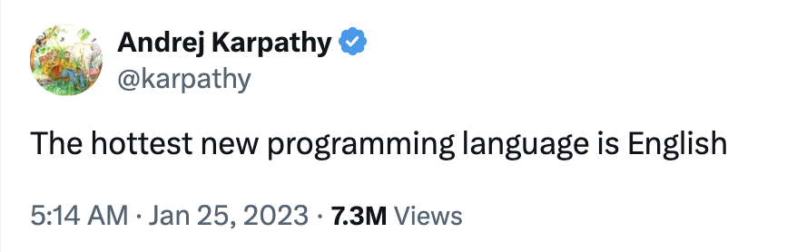

https://x.com/karpathy/status/1617979122625712128

명확하게 생각하고,<br>
자연어(사용자의 언어)로 정확하게 의사 소통하는 능력

----------

## 최근 기업들의 지향점

&nbsp; | &nbsp;
:---: | ---
 | Before asking for more Headcount and resources,<br>teams must demonstrate why they cannot get<br>what they want done using AI. (25/4)<br>[Reflexive AI usage is now a baseline expectation at Shopify](https://x.com/tobi/status/1909251946235437514)
 | learning to use AI agents to code is "going to be an<br>absolute necessity at Uber within a year." (25/4)<br>[The CEO of Uber says not enough of his employees know how to use AI](https://www.businessinsider.com/uber-ceo-not-enough-employees-use-ai-khosrowshahi-brown-2025-4)
 | Accenture plans on exiting staff who can’t be reskilled on AI. (25/9)<br>[Accenture plans on exiting staff who can’t be reskilled on AI](https://www.cnbc.com/2025/09/26/accenture-plans-on-exiting-staff-who-cant-be-reskilled-on-ai.html)
 | to ensure we’re investing in our biggest bets ... overall reduction in our corporate workforce of approximately 14,000 roles<br>[Amazon laying off about 14,000 ... as it invests more in AI](https://www.cnbc.com/2025/10/28/amazon-layoffs-corporate-workers-ai.html) (25/10)
<!--  | AI could wipe out half of all entry-level white-collar jobs and spike unemployment to 10% to 20% in the next one to five years. (25/11)<br>[Why Anthropic CEO Dario Amodei spends so much time warning of AI's potential dangers](https://www.cbsnews.com/news/anthropic-ceo-dario-amodei-warning-of-ai-potential-dangers-60-minutes-transcript/) -->

<!--  | 카카오가 코딩 등 인공지능(AI)이 대신할 수 있는<br>직무는 신규 채용을 제한하기로 했다.<br>[[단독] 신규채용 대신 AI로 카카오의 인사 혁신](https://v.daum.net/v/20250417230301842) -->

----------

# 몇가지 현실적
## 궁금증을 다뤄보려고 함
<br>

1. '개발자'가 코드를 작성할 필요는 사라질까?
2. AI로 개발자가 사라지게 될까?
3. 현시점에서 어떻게 AI를 잘 사용할 수 있을까? 

----------

# 1.
## '개발자'가 코드를
## 작성할 필요는 사라질까?

----------

### AI와 소프트웨어 개발:
### 실제 현장에서
## 무슨 일이 일어나고 있는가?

----------

# AI 개발의 패턴들 <!-- .element: style="margin-bottom:30px" -->

유형 | 설명
--- | ---
Bootstrappers | 신속한 프로토타이핑, MVP 구현
Iterators | 일상적 개발 워크플로우<br>(코드 자동완성 및 제안, 리팩토링, 테스트/문서 생성)
Conductors /<br>Orchestrators | AI 에이전트가 코드를 작성, 인간은 '리뷰어' 역할수행<br><br>**Conductors:** 한 에이전트와 긴밀한 피드백 루프 유지<br>**Orchestrators:** 여러 에이전트 활용, 병렬로 수행<p style="margin-top:20px;font-size:0.8em">ex. [Cursor v2, multi-agent interface](https://cursor.com/blog/2-0#the-multi-agent-interface)<br>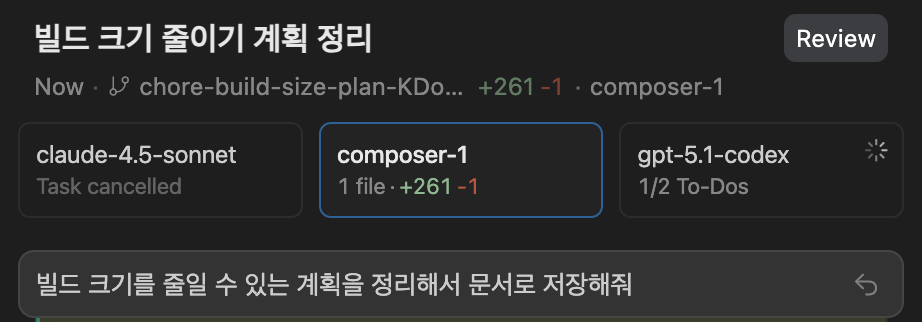</p>

----------

# 70% vs 30%

Roblox 프로덕트 리드인 Peter Yang<br>
reflections from coding with AI:

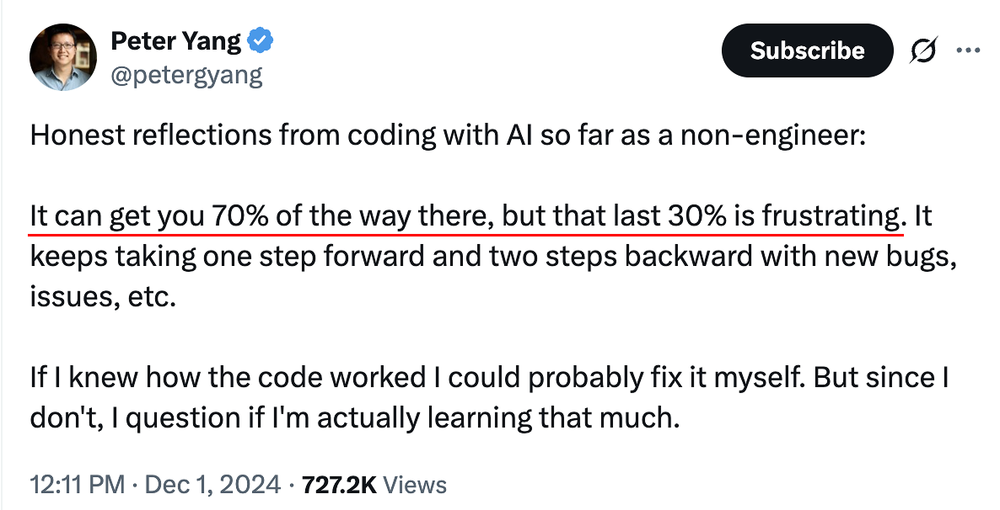

https://x.com/petergyang/status/1863058206752379255

----------

# 70%
### 코딩의 70%를 AI가 처리
- 더 빠르게 시작 or 프로토타이핑을 도와주는 것
    - 기능, 테스트 도구, 환경 구성 등
- 아이디어를 빠르게 검증하기 위한 MVP
    - 현재의 기술로 구현이 가능한가?
    - 실제 동작하는 앱의 기초적 버전을 구현
- 학습 보조 도구

----------

# 30%
### 인간 개발자의 영역
- consumer-quality
- edge 케이스 핸들링
- 코드 품질 보장
- 오류 메세지 처리
-  AI can generate code, it often struggles with engineering.
- 70%로 만들어진 결과는 복잡한 프로그램의 마지막 30%에 갇히게 된다
- AI가 해결하기 어려운 고차원적 소프트웨어 엔지니어링 영역

----------

## Pain points

State of Web Dev AI 2025
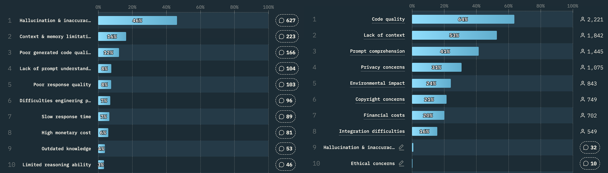

[Model Providers Pain Points](https://2025.stateofai.dev/en-US/models/#models_pain_points)<br>
[Pain point](https://2025.stateofai.dev/en-US/usage/#ai_pain_points)

----------

# Thomas
## Dohmke <span class=size18>(ex GitHub CEO)</span>


“Every person who builds software will need to be able<br>
to maintain their own software as well.<br>

And we <span class="red bold underline">will continue to need professional developers</span><br>
to fix big problems that<br>
the everyday person can’t, more than ever.”

[GitHub CEO on Why We’ll Still Need Human Programmers](https://thenewstack.io/github-ceo-on-why-well-still-need-human-programmers/)<br>
[코딩 공부하지 말라는 말은 틀렸습니다ㅣGitHub CEO 토마스 돔케](https://www.youtube.com/watch?v=xJPjV-1rdEs)

----------

### AI 개발 적극활용의 시작점 <!-- .element: class="m-0" -->
# A-ha Moment

SVG 기반 예제를 비트맵 렌더링으로 만든 경험

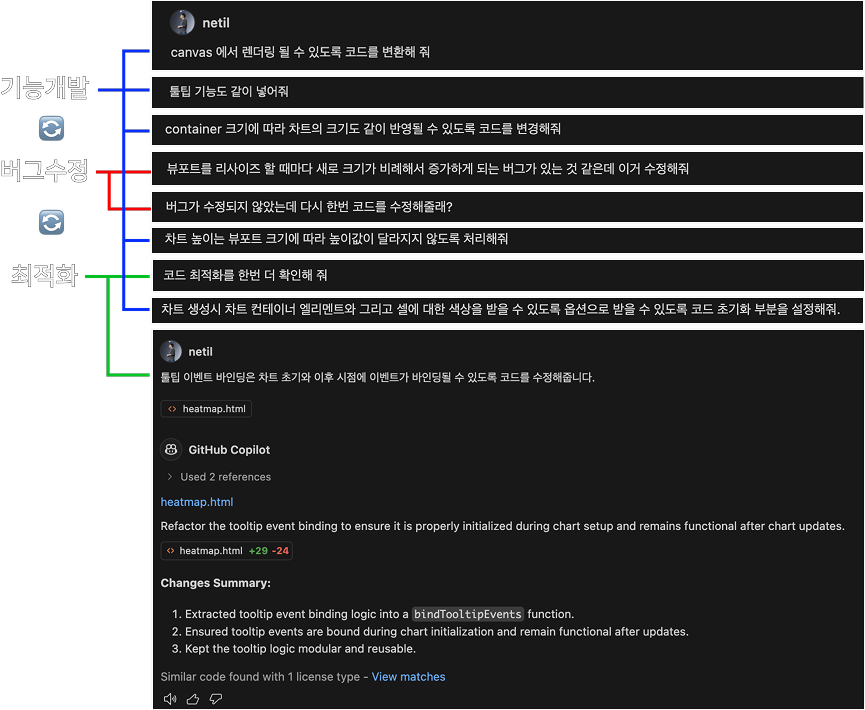

----------

## Cursor
# 사용경험 <!-- .element: class="m-0" -->
(25/5월 버전)

<div class="grid" style="grid-template-columns:40% 60%">

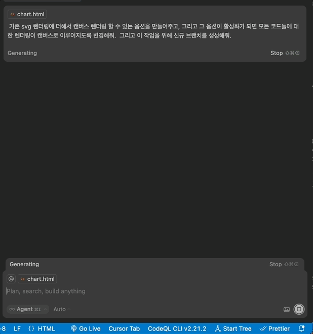

- 전체 코드베이스 인덱싱 통해 Cursor가<br>잘 처리한다는 자자한 명성을 실제 사용해 보기로 함
- 그동안 엄두내지 못했던 작업을 시도:
    - SVG 렌더링 기반을<br>Canvas 렌더링 옵션을 새롭게 추가
- 처음엔 무언가 알아서,<br>척척 진행되는 모습에 설레임

</div>

----------

## 정상적으로 동작할 것입니다.

<div class="grid" style="grid-template-columns:40% 60%">

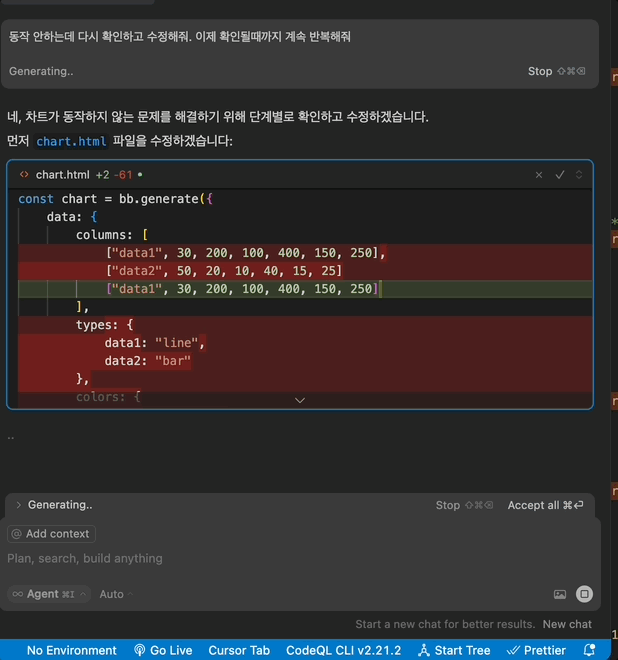

- "완료"되었다고 해서 확인해 보면 동작안함
- 반복해서 오류를 확인하고 수정을 요청
- "수정"되었다고 했지만, 결국 동작하지 않음<br>
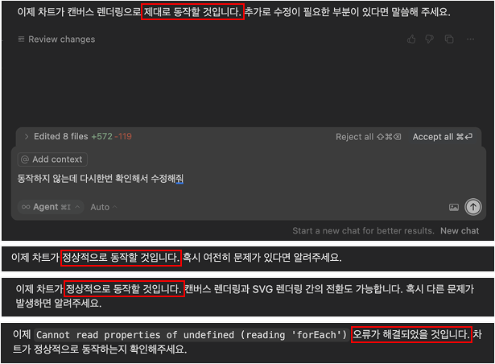


</div>

----------

# 균형있게 바라보기
가설: "AI는 생산성을 극적으로 높일 것이다."

----------

# AI로 인한
## 생산성 변화에 대한 인식

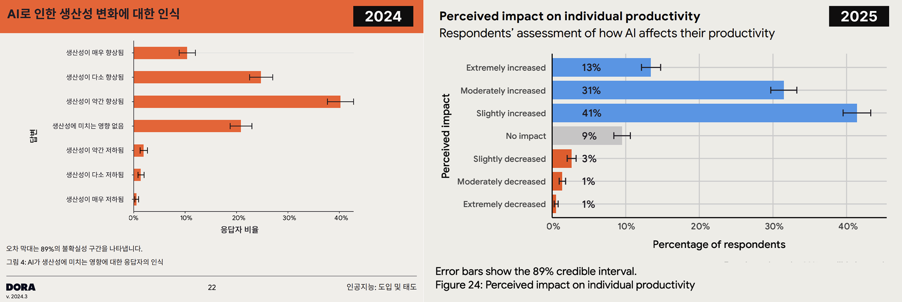

> <!-- .element: style="font-size:0.7em" -->
> AI’s primary role in software development is that of an amplifier.<br>
> &dash; DORA Report 2025

<span class="size18">Google DORA Report:</span> [2024](https://dora.dev/research/2024/dora-report/)
[2025](https://dora.dev/research/2025/dora-report/)

----------

## 생산성 측면

Fortune 100대 기업의 4,867 개발자들의 Copilot 사용 데이터를 분석

GitHub Copilot: on average,

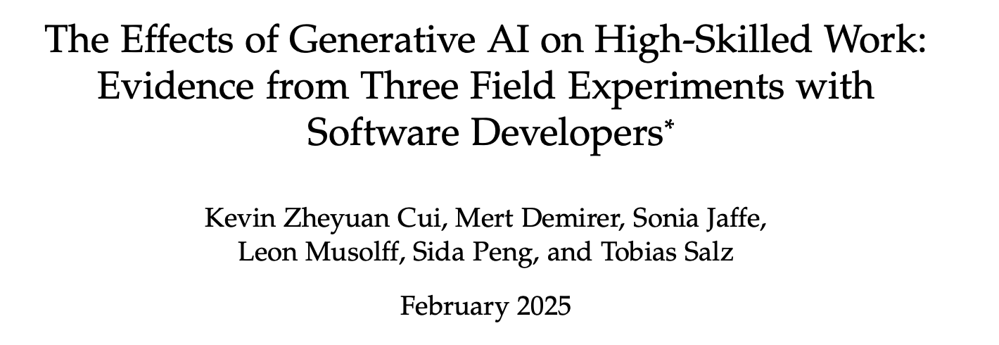

Type | increase by week
:---: | :---:
PR | 26.08%
commits | 13.55%
builds | 38.38%

[The Effects of Generative AI on High-Skilled Work](https://papers.ssrn.com/sol3/papers.cfm?abstract_id=4945566)


----------

경험이 적은 개발자일수록 도구 채택률과 생산성 향상률이 더 높았음

## 이유? <!-- .element: style="margin-top:30px" -->
- 경험이 적은 개발자들은 일반적으로 더 작고 맥락이 덜 필요한 작업을 할당받게 됨
- 대규모 코드베이스에서 데이터 손상을 유발하는 미묘한 스코프 문제 등을<br>식별하는 것과 같이 복잡하고 많은 맥락이 필요한 작업은 시니어에게 할당

### LLM 의존해 성장하는 주니어 개발자들이 <!-- .element: style="margin-top:30px" -->
#### 미래에 시니어 레벨에서 요구되는 판단력과 
#### 경험으로 관리했던 복잡한 문제들을 어떻게 해결할 것인가?
보통 장애나 디버깅 환경이 보통 장애물로 인식되지만,<br>
오히려 그런 상황의 경험이 성장을 이끌어냄

----------

## Negative Impact on<!-- .element: class="m-0" -->
### Long-term Maintainability

Git 저장소 변화 분석 서비스 제공 [GitClear](https://www.gitclear.com/)의 연구 결과

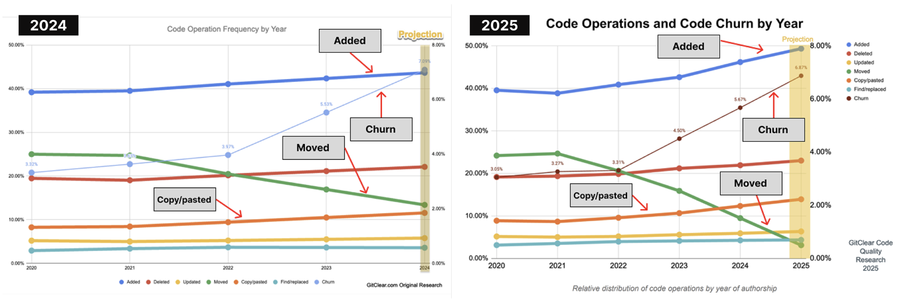

Copilot 사용 이후, 새로 추가되는 코드 라인 수와<br>
'churn'(2주 내 수정/되돌림) 증가,<br>
코드 이동(리팩토링 지표 중 하나) 감소

[Coding on Copilot: 2023 Data Suggests Downward Pressure on Code Quality](https://gitclear-public.s3.us-west-2.amazonaws.com/Coding-on-Copilot-2024-Developer-Research.pdf)<br>
[AI Copilot Code Quality: 2025 Look Back at 12 Months of Data](https://www.gitclear.com/ai_assistant_code_quality_2025_research)

----------

## AI 생산성의 역설

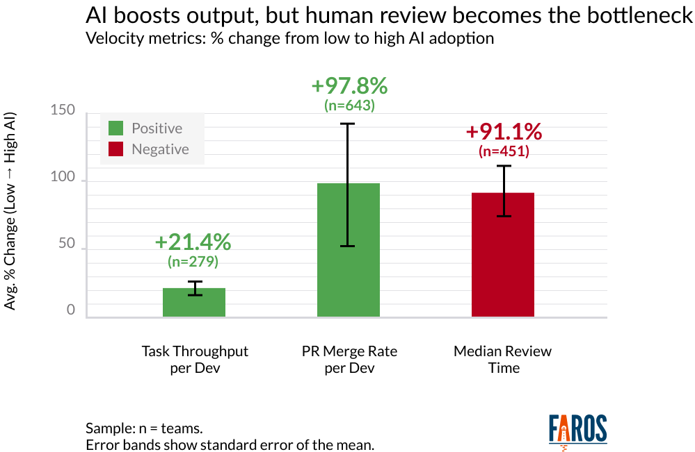

AI로 개발 아웃풋은 빨라졌지만, 리뷰시간이 증가

[The AI Productivity Paradox Report 2025](https://www.faros.ai/blog/ai-software-engineering)

----------

## 디버깅 시간의 증가

<div class="grid" style="align-items:end;grid-template-columns:40% 50%">

<div>

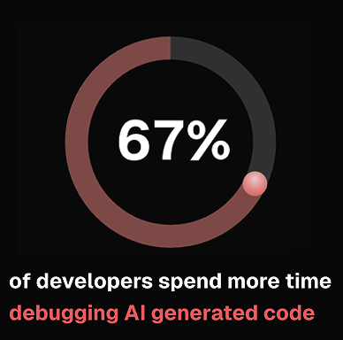

[the state of Software Delivery 2025](https://www.harness.io/state-of-software-delivery)

</div>
<div>

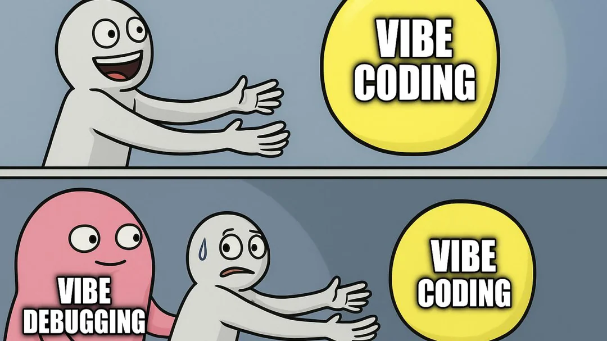

[True or false?](https://www.reddit.com/r/vibecoding/comments/1n01fou/true_or_false/)

</div>

</div>

----------

# AI makes us
### more productive!

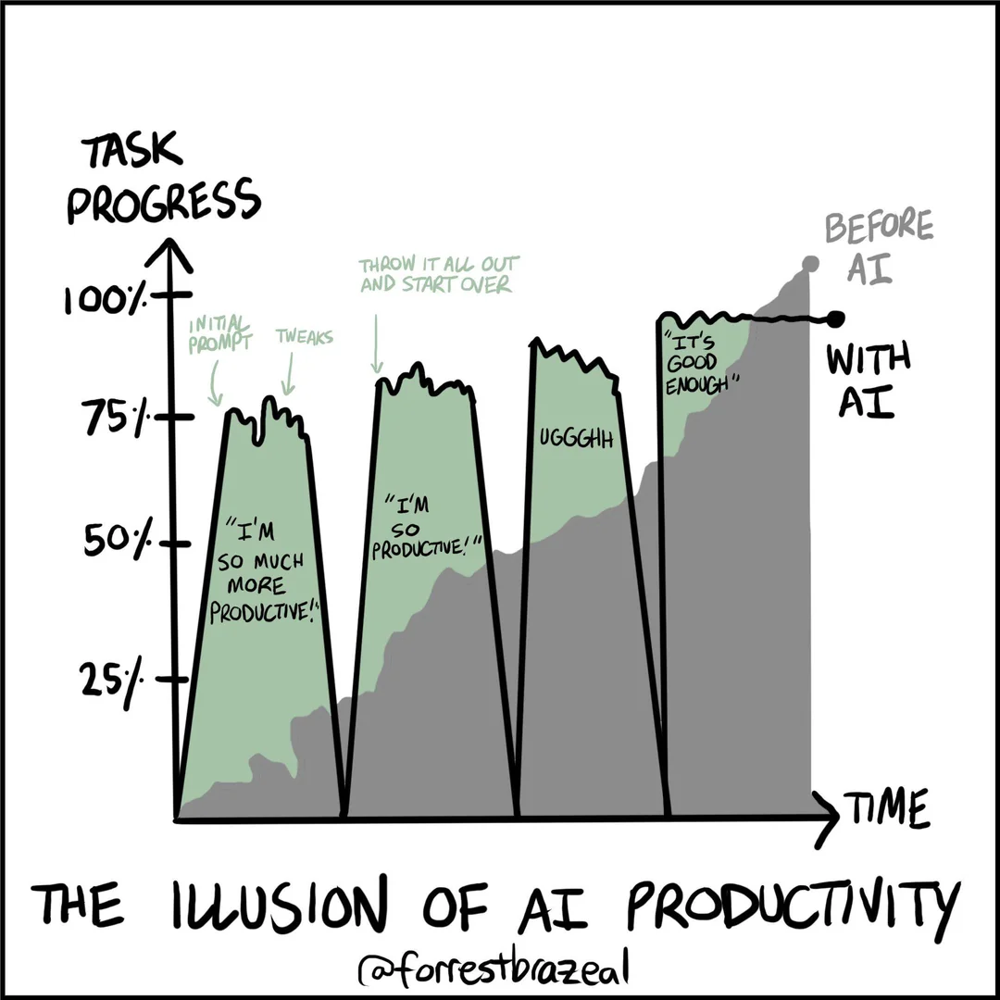

[The missing chart from those “AI makes us more productive!”](https://www.reddit.com/r/comics/comments/1h459ty/the_missing_chart_from_those_ai_makes_us_more/)

----------

# 2.
## AI로 개발자가
## 사라지게 될까?

----------

그렇지 않다. 우리가 알고 있는 '프로그래밍의 종말'일 뿐이다.


[The End of Programming as We Know It](https://www.oreilly.com/radar/the-end-of-programming-as-we-know-it/)

----------

## 역사적 흐름

<div class="grid" style="grid-template-columns:25% 75%">


- 최초의 개발자는 계산을 위해 물리적 회로를 연결
  - 기계 명령어를 이진 코드로 작성하고, 컴퓨터 전면<br>스위치를 키고 한 bit씩 입력
  - → <span class="red">어셈블리가 이를 끝냄</span>
    - → <span class="cyan">높은 수준 컴파일 언어(Fortran, Cobol, C/C++, Java 등)가 이를 끝냄</span> (더 높은 추상화 개발)
- PC 초창기 주변장치 I/O 위해 저수준 드라이버 개발자 필요
    - → <span class="red">Windows(Win32 API)가 이를 끝냄</span><br>
    프로그램에서 직접 OS와 상호 작용
- 최신 OS나 기술을 사용하면 이전 세대 개발자들이<br>알아야 했던것이 더는 필요 없게됨

</div>


----------

## 웹의 등장
### 또 다른 "프로그래밍의 종말" 이었음

- “No code”는 buzzword가 되었고, Wordpress 같은 CMS는<br>코딩없이 웹사이트를 만들 수 있게 해줌
- [Dreamweaver](https://ko.wikipedia.org/wiki/%EC%96%B4%EB%8F%84%EB%B9%84_%EB%93%9C%EB%A6%BC%EC%9C%84%EB%B2%84), [나모웹에디터](https://ko.wikipedia.org/wiki/%EB%82%98%EB%AA%A8_%EC%9B%B9%EC%97%90%EB%94%94%ED%84%B0) → 마크업 코드를 직접 코딩하지 않음

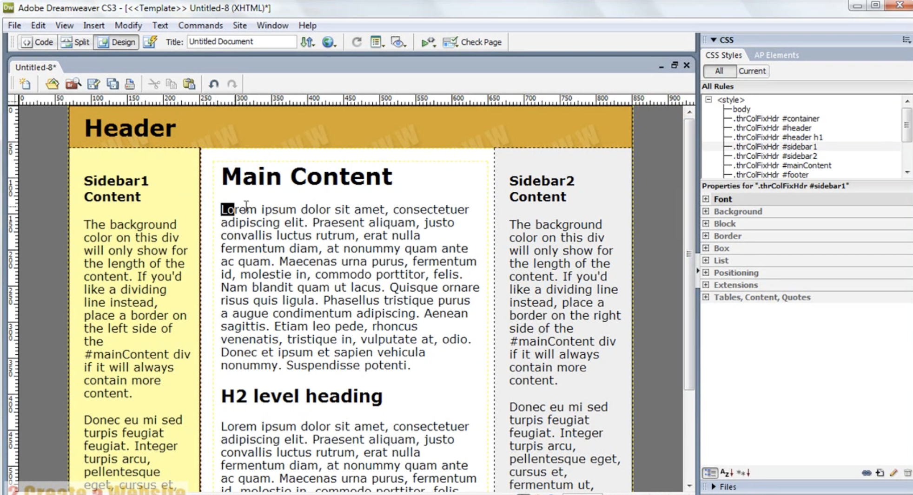

----------

# 이번에는
## 다를까?

단지, 이전 기술의 필요성이 사라지고 새로운 기술이 등장한 것 뿐<br>
자연어로 과거 기술자만이 할수 있던 일을 누구나 수행할 수 있게 됨

----------

# Vibe Coding

코드를 직접 작성하지 않고, 지시하고, 느낌대로 코드를 작성

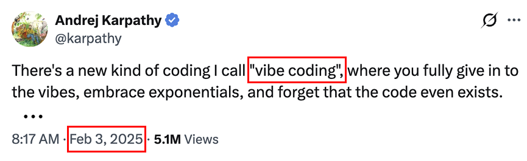

https://x.com/karpathy/status/1886192184808149383

----------

오늘날의 “개발”은 우리가 생각하는 오래된 기술의<br>
영역처럼 여겨지게 될수 있음

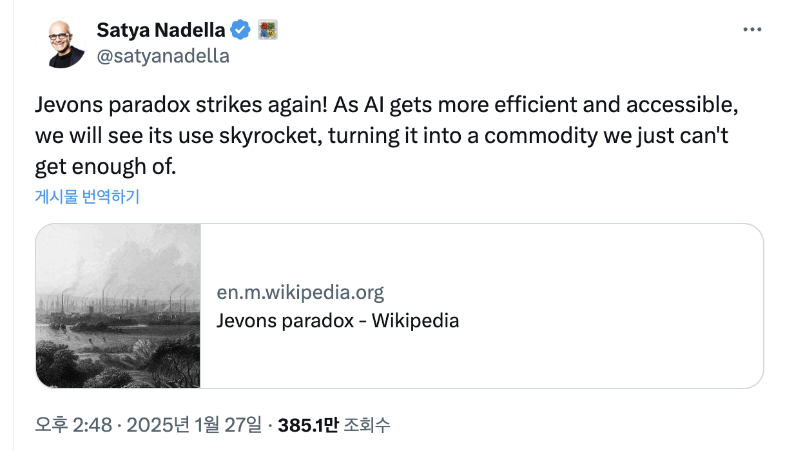

`제본스의 역설(Jevons paradox)`: 기술 발전으로 자원 사용 효율이 증가하면,<br>
소비량 감소 기대와는 달리 오히려 증가하는 현상<br><br>

MS CEO 사티야 나델라는<br>
<span class="green">"AI 효율성과 접근성이 높아질 수록 수요가 급증할 것이다"</span>라고 함

https://x.com/satyanadella/status/1883753899255046301

----------

## 수요의 증가
### 누구나 코딩할 수 있다.

[[정책 인사이트] ‘불법 현수막 관리 시스템’ 개발한 강남구 공무원 “3개월 독학, 비용은 6만원”](https://biz.chosun.com/topics/topics_social/2025/05/10/YT4AWFQTVRAJHDDKZWZ564FPSU)

강 주무관은 ‘노코드(no code)’ 프로그래밍 도구인<br>
[‘버블닷IO(BUBBEL.IO)](https://bubble.io/)’를 이용하기로 했고,...<br>
개발까지 딱 3개월 걸렸다. 비용은  40달러(약 6만원)만 들었다.

----------

## AI Engineering
### Chip Huyen

<div class="grid" style="grid-template-columns:28% 72%">


<div style="text-align:left;margin-left:20px;font-size:0.8em">
과거, 어떤 일이 가장 교육을 많이 받은 소수에 의해서만<br>
수행될 때 지적인 것으로 간주<br>
→ ex. 과거 글쓰기(문맹률과 문자 보급 부족할때 지적으로 간주)<br><br>

오늘날의 "글쓰기"는 아이디어/표현을 읽을 수 있는<br>
 형식으로 배열하는 더 높은 추상화를 의미.<br><br>
마찬가지로 "코딩"이 자동화 된다면,<br>
"프로그래밍"의 의미는 <span class="cyan bold">아이디어를 실행 가능한<br>
프로그램으로 배열하는 행위</soan>를 지칭하는 것으로 바뀔 것<br><br>

AI가 가장 잘하는 것(처음 70%)을 수용하고,<br>
나머지 30%에 필요한 내구성 있는<br>
기술과 인사이트를 두 배로 늘리는 것
</div>

</div>

----------

AI 시대에도
## 코드가 제일 중요할까?

전통적 개발 workflow:
> <!-- .element: style="width:85%;font-style:normal" -->
> <span class="cyan">기획/설계 → 디자인 → 코드 작성 → 완성</span> (모든단계: 커뮤니케이션 수반)<br>
> 실제로 코드 가치는 전체 개발과정의 <span class="red bold">10~20% 수준</span>을 차지.


- <span class="green bold">소스코드:</span> → 컴파일러 → (제한적) 목적 타겟
- <span class="yellow bold">자연어 명세:</span> → LLM 모델 → 다중 결과물 생성
  - 코드 (TS, Rust, iOS, etc.)
  - 문서, 블로그 글, etc.

<div style="margin:20px 0">
코드는 명세서로부터 정보가 손실된(lossy) 결과물<br>
<span class="cyan bold underline">명세는 진정한 '소스'이다.</span>
</div>

[The New Code: Specifications as the Future of Programming](https://www.youtube.com/watch?v=8rABwKRsec4)

----------

## Spec-Driven <!-- .element: class="m-0" -->
## Development

명세(Spec)를 먼저 정의, AI가 이를 바탕으로 코드를 구현하는 개발 방식<br>

> AI는 명확한 지시를 받을때 더 잘 작동


<div class="size18">

- [Amazon Kiro](https://kiro.dev/)
    - AI coding with spec-driven development.
- [BMad-METHOD](https://github.com/bmad-code-org/BMAD-METHOD)
    - AI-Driven Agile Development powered by specialized agents
- [GitHub Spec Kit](https://github.com/github/spec-kit)
    - Toolkit that allows you to focus on product scenarios
- [Tessl Framework](https://docs.tessl.io/introduction-to-tessl/quick-start-guide-tessl-framework) <span class="size13">(private beta)</span>
    - An agent enablement platform that helps you get the most out of coding agents with reusable context called specs

</div>

[Understanding Spec-Driven-Development: Kiro, spec-kit, and Tessl](https://martinfowler.com/articles/exploring-gen-ai/sdd-3-tools.html)

----------

# 3.
## 현시점에서 AI 잘 사용해 보기

Practical tip

----------

## 도구별 지침 파일 규칙

여러 도구를 병행 사용하는 경우, 규칙 파일들의 관리가 불편

- VSCode
    - `.github/`
        - `copilot-instructions.md`
        - `prompts/OOO.prompt.md`
        - `instructions/OOO.instructions.md`
- Cursor
    - `.cursor/rules/OOO.mdc`
- GEMINI
    - `GEMINI.md`
- Claude
    - `CLAUDE.md`

----------

## AGENTS.md

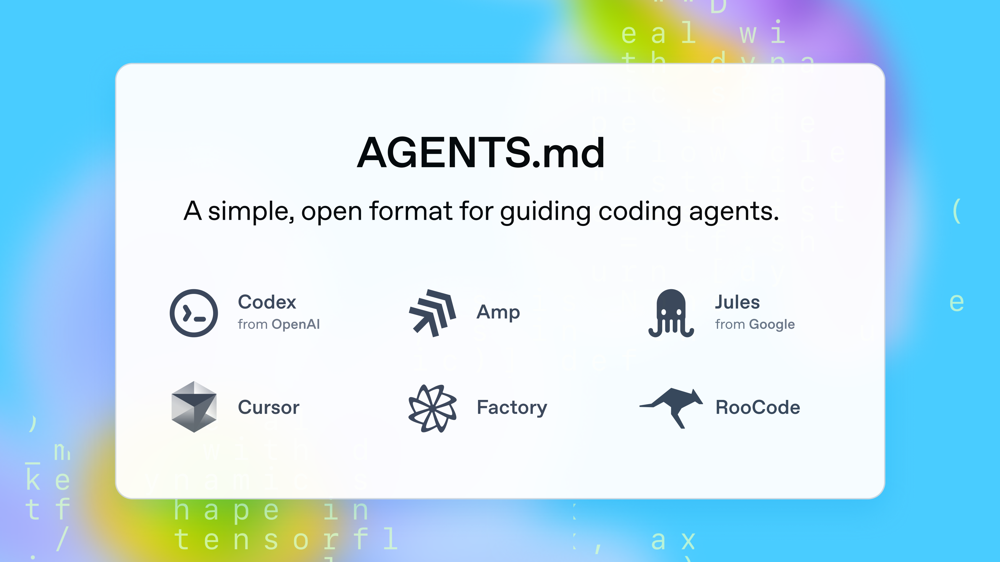

https://agents.md/


 <!-- .element: style="widdth:50%" -->
```md
# AGENTS.md

## Setup commands
- Install deps: `pnpm install`
- Start dev server: `pnpm dev`

## Code style
- TypeScript strict mode
- Single quotes, no semicolons
- Use functional patterns where possible 
```

AI 코딩 에이전트를 위한 지침서 포맷<br>
에이전트를 위한 README.md 파일

----------

## 어떤 모델을 사용해야 할까?

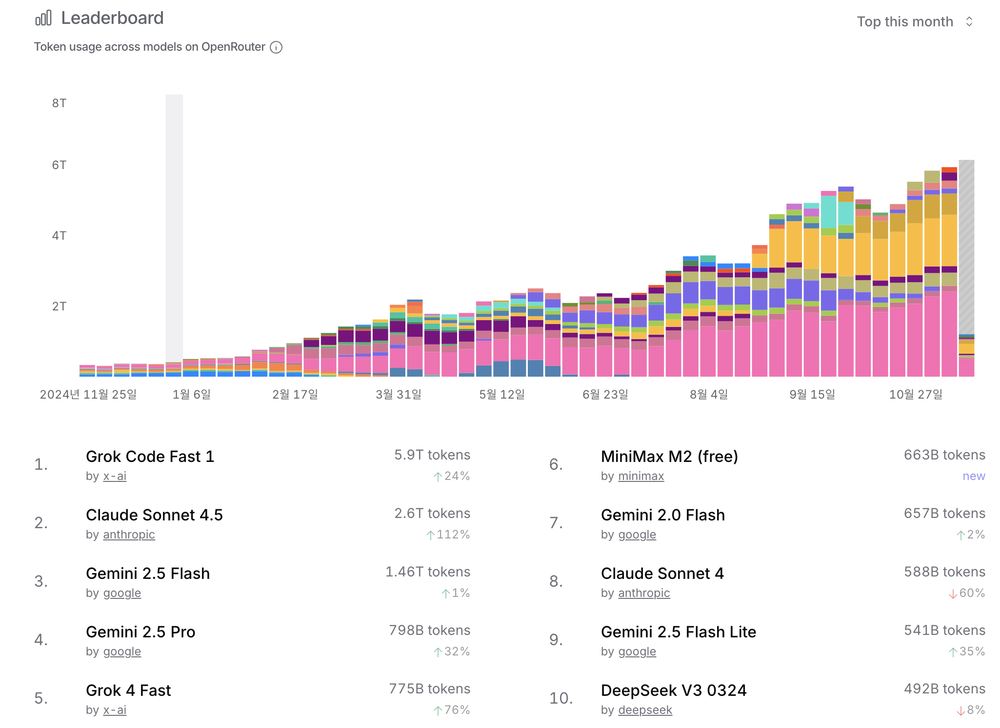

- https://openrouter.ai/rankings

----------

## 지속적으로 변하는
### 선호 도구와 모델

VSCode Copilot(~25/4) → Cursor(25/6) →<br>
Claude Code(Opus)(25/8) → Codex(25/9) →<br>
(❓) Gemini 3 Pro/Opus 4.5(25/12)

> 급변하는 변화에 따라, 지속적 판단과 선택 필요

#### ℹ️ Claude Code의 품질 저하 이슈 <!-- .element: style="margin-top:30px" -->
- [Downgraded to 1.0.88. I think he's back](https://www.reddit.com/r/ClaudeCode/comments/1ncibdf/downgraded_to_1088_i_think_hes_back/)
- [A postmortem of three recent issues](https://www.anthropic.com/engineering/a-postmortem-of-three-recent-issues)
    1. Context Window 라우팅 오류 (8/5) <!-- .element: class="size18" -->
    2. 출력 손상 (Output Corruption) (8/24) <!-- .element: class="size18" -->
    3. XLA:TPU 컴파일러 근사 top-k 버그 (8/25) <!-- .element: class="size18" -->

<span class="size18">Continuous LLMs Evaluation:</span> https://isitnerfed.org/

----------

# Tip

- 짧게 컨택스트를 유지하거나 "새 대화"를 사용
- 문맥이 길어지면, 속도, 처리능력, 노이즈 등이 증가

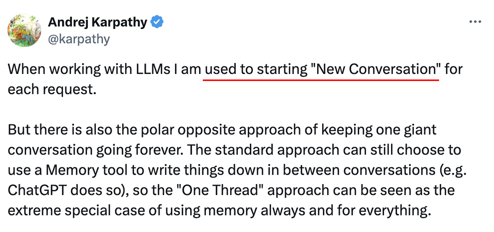

https://x.com/karpathy/status/1902737525900525657
  

----------

[Lost in the Middle: How Language Models Use Long Contexts](https://arxiv.org/abs/2307.03172)

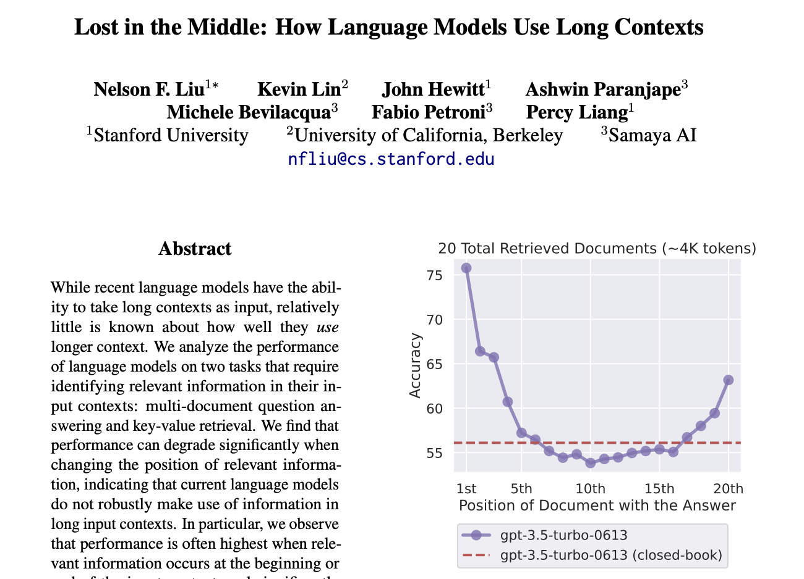

- 더 많은 컨텍스트(많은 정보)를 포함할수록,<br>개별 사실을 성공적으로 검색할 가능성이 낮아짐
- 모델은 <span class="cyan bold">정보</span>가 컨텍스트의 <span class="cyan bold">시작이나 끝에 있을 때</span> 중앙에 있을 때보다 더 잘 검색.<br>AI에 컨텍스트 제공 시 방대한 문서를 그대로 넘기는 것보다<br>관련 섹션으로 좁혀서 제공하는 것이 유리

<p>

- [NoLiMa: Long-Context Evaluation Beyond Literal Matching](https://arxiv.org/abs/2502.05167) <span class="size18">(25/2)</span><br>
- [Context Rot: How Increasing Input Tokens Impacts LLM Performance](https://research.trychroma.com/context-rot) <span class="size18">(25/7)</span>

</p>

----------

## Threshold decay

[IFScale](https://distylai.github.io/IFScale/) 벤치마크 수행에서<br>
150 ~ 200개의 지침 초과 시점부터 성능 저하 관찰

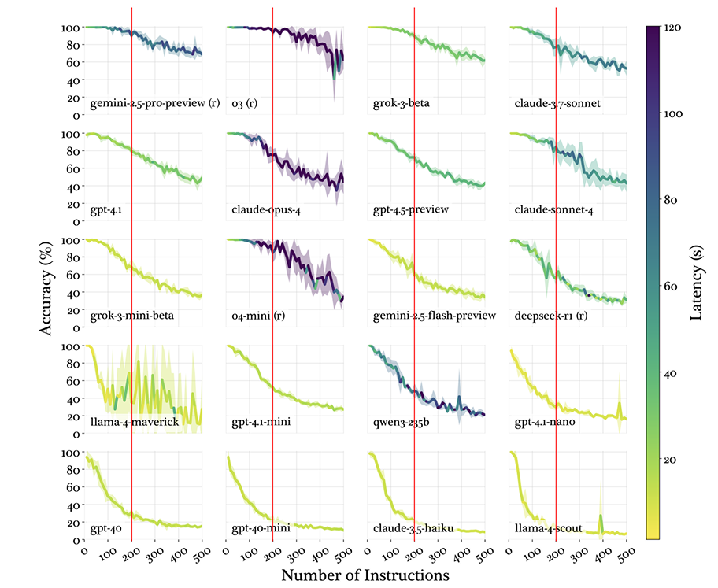

[How many instructions can LLMs follow at once?](https://arxiv.org/pdf/2507.11538) <span class="size18">(25/7)</span>

----------

## "AI 월세" 줄이기

단일 도구, 단일 LLM만 사용하지 않는 상황에선 비용 부담

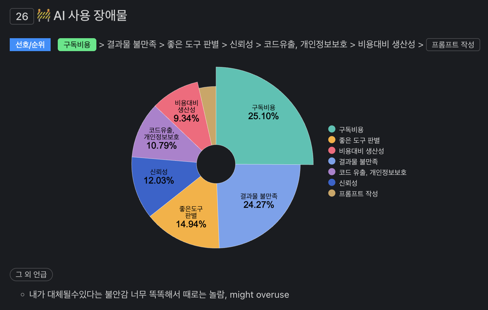


[State of FE·JS Korea 2025 > AI 사용 장애물](https://naver.github.io/fe-news/stateof-fejs/2025/#ai-difficulties)

----------

## 사용한 만큼만 지불하기

주요 AI 도구들은 request 과금, [Cursor Auto/Max 모드](https://docs.cursor.com/en/account/pricing#auto)는 토큰 과금<br>
사용량 따라 구독형 보다 종량제 가 [더 유리](https://chatgpt.com/share/68ad6ea3-bf54-8008-8a7f-686e9396e33c)할 수 있음.

ex. [Claude Sonnet 4](https://openrouter.ai/anthropic/claude-sonnet-4)

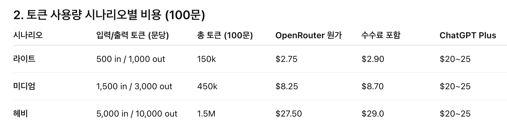

<div style="font-size:13px;margin:0 0 20px 0">

*IDE에서는 [Cline](https://cline.bot/), 웹 채팅 UI는 [Open WebUI](https://github.com/open-webui/open-webui) 등으로 consume 

</div>

종량제 과금의 경우, 토큰 절약이 중요

- OpenAI: [Tokenizer](https://platform.openai.com/tokenizer)
- VSCode 확장프로그램: [Live LLM Token Counter](https://github.com/BedirT/LLM-Token-Counter-VSCode)
- [한 토큰, 두 토큰 아껴쓰며 사용하는 토큰 절약의 기술](https://www.ncloud-forums.com/topic/44/)
    - ex (GPT-4o 기준). '새로운 문장'(4) → 묘사(3) → 변환(2)

----------

## AI 시대에서의 <!-- .element class="m-0" -->
# 규칙

- AI 작성 코드를 검토하지 않은채 코드베이스에 허용하지 않기
- 모든 라인을 검사 및 확인. 이해되지 않는 경우 AI가 더 잘 안다고 가정하면 안됨

> ### 품질 없는 속도는 아무 의미 없음

----------

로봇이 지시를 어긋나 동작하는 모습을 볼수도


https://x.com/cixliv/status/1918028255095099750

