### the 'why?'
# 오픈소스

왜 관심을 갖고 있나?

- 내 실력을 과시하기 위해 <!-- .element: class="fragment" --> 
- 좋은 이직/취업 기회를 얻기 위해 <!-- .element: class="fragment" --> 
- 멋져 보이기 때문 <!-- .element: class="fragment" --> 
- 요새 다들 한 두개씩 컨트리뷰션 하더라... <!-- .element: class="fragment" --> 

----------

## 오픈소스는...

<p class="size25 fragment">
    물위에서 헤엄치기 위해 쉴새없이 움직여야 하는 오리발과 같다.

    <br>
    
    <span style="font-size:14px">
        [Image Source] http://webneel.com/daily/duck-swimming-photography
    <span>
</p>

----------

<!-- .slide: data-background-image="./img/bg3.png" -->
<h1 style="text-shadow:none;color:#000">오픈소스의 시작</h1>

----------

## 오픈소스는 어디에서 왔나?

<p style="margin-bottom:0">
    [Richard Matthew Stallman](https://en.wikipedia.org/wiki/Richard_Stallman)
     
</p>

<p class="fragment" style="margin:0">
    [ GNU project](https://www.gnu.org/) (1983)<br>
    [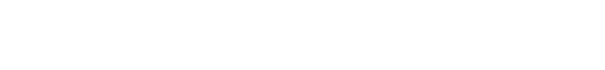](https://www.fsf.org/) (1985)
</p>

----------

# Open Source

"Open Source"라는 정의는<br>
Netscape의 코드를 공개하기 위한 전략회의에서 처음 사용<br>

기존의 "free software"는 비용을 연관시키는 문제로 인해<br>
명확한 새로운 정의가 필요했기 때문

[](https://foresight.org/about/Peterson.php)

<p style="margin-top:80px">
    [Foresight Institute](https://foresight.org/)의<br>
    Christine Peterson이 1998년 2월 제안
</p>

<p class="reference">
    [How I coined the term 'open source'](https://opensource.com/article/18/2/coining-term-open-source-software)
</p>

----------

## Free Software vs
## Open Source
(Ethics vs Pragmatism)

<blockquote class="fragment">
 Open source is a<br> <span class="green underline">development methodology;</span><br> 
 free software is a <span class="yellow underline">social movement</span>.<br>
 &dash; Richard Stallman
</blockquote>

<p class="reference">
    [Why Open Source misses the point of Free Software](ttps://www.gnu.org/philosophy/open-source-misses-the-point.html)
</p>

----------

<!-- .slide: data-background-image="./img/bg3.png" -->
<h3 style="text-shadow:none;color:#000">오픈소스는</h3>
<h1 style="text-shadow:none;color:#000">어떻게 시작되나?</h1>

----------

## 1) 기업 내부로부터

기업의 내부적 프로젝트 결과를 오픈소스화

[ React](https://reactjs.org/)
[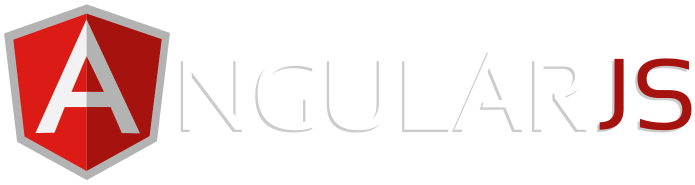](https://angularjs.org/)<br>
<!-- [ Chromium](http://www.chromium.org/Home) -->

기업의 성과를 공개해<br>
해당 프로젝트를 통한 영향력 확대를 기대

----------

## 2) 새로운 비즈니스
### 기회로 부터

기본 프로젝트는 오픈소스로 공개<br>
기업 전용 플랜&서비스 등을 과금


 <br>

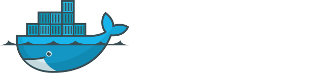

----------

## 3) 개인 또는
## 그룹(커뮤니티)으로 부터

 - 개인적 호기심
 - 다른 오픈소스 프로젝트 참가를 시작으로
 - 자신의 니즈를 해결하기 위한
 
<p class="reference">
    [Awesome Maintainers](https://github.com/nayafia/awesome-maintainers)
</p>

----------

## 4) Fork를 통해

프로젝트가 중단되거나 또는 기타 이유 등으로<br>
fork되어 새로운 프로젝트로 시작

- b2(cafelog) 0.6 &rarr; WordPress (2003)<br>
  <span class="size25">([Les origines de WordPress – la naissance de b2/cafelog](https://wordpress.tv/2012/02/27/les-origines-de-wordpress-la-naissance-de-b2cafelog/))</span>
- Postgres &rarr; [PostgreSQL](https://www.slideshare.net/pgconf/elephant-roads-a-tour-of-postgres-forks#9)
- Netscape &rarr; Firefox <span class="size25">([History of the Mozilla Project](https://www.mozilla.org/en-US/about/history/details/))</span>
- [KHTML](https://en.wikipedia.org/wiki/KHTML) &rarr; [Webkit](https://en.wikipedia.org/wiki/WebKit#Origins) &rarr; [Blink](https://blog.chromium.org/2013/04/blink-rendering-engine-for-chromium.html)

----------

<!-- .slide: data-background-image="./img/bg3.png" -->
<h1 style="text-shadow:none;color:#000">생각해보지</h1>
<h2 style="text-shadow:none;color:#000">않았던 사실들</h2>

----------

## 사용자로서 오픈소스는
### 무엇이라 생각하나요?

- 당연히 공짜로 사용하는 SW <!-- .element: class="fragment" --> 
- 누군가 '과시'하기 위해 만든 것이다. <!-- .element: class="fragment" --> 
- 사용해 주는 것을 오히려 '감사'하게 생각해야 한다. <!-- .element: class="fragment" --> 
- 이슈 해결은 당연히 빨리 해줘야 하는 것 <!-- .element: class="fragment" --> 
- '오픈소스'는 당신 것 아니어도 많이 있다. <!-- .element: class="fragment" --> 

----------

# 숨겨진 비용과 책임

오픈소스 개발자가 된다면, 그리고 그 프로젝트가<br>
어느 정도 '성공'한다면, 자연스레 '보상'이 따라올까?

프로젝트 유지 '비용'과 '책임'에 대해서 생각해 본적 있나요?

> <h2 class="fragment" style="margin:0"><span class="red">'free'</span> isn't free</h2> 

좋은 메인터너가 되는 것은, 개발 계약을 따내거나<br> <!-- .element: class="fragment" -->
컨설턴트가 되는 것을 가르치진 않는다. 

----------

# 무한한 '책임'

<p>
    한번이라도 자신이 사용하는<br>
    오픈소스에 '비용'을 지불한 경험이 있나요?
</p>
<p>
    '돈'이던, 또는 '기여'를 통해?<br>
    그렇지 않다면 '왜' 그렇게 하지 않았나요?
</p>

> 여러분이 오픈소스 개발자가 된다면,<br> <!-- .element: class="fragment" --> 
> 동일한 위치에 서게 됩니다.

----------

<!-- .slide: data-background-image="./img/bg3.png" -->
<h1 style="text-shadow:none;color:#000">몇가지 사례들</h1>

----------

## Case #1

<span class="size25">https://naver.github.io/billboard.js/</span>

----------

벡터 그래픽(SVG) 기반의 차트 라이브러리<br>
15개 유형 차트 제공

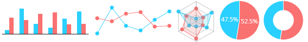

<p class="size25" style="background-color:rgba(66,65,65,0.5);color:cyan;padding:20px;border-radius:10px;">
    사용하던 [C3.js](https://github.com/c3js/c3) 메인터넌스 불확실성으로 인해 Fork
</p>

- 2017.6 첫 릴리스
- 2018.10 기준,
  - [13번의 릴리스](https://github.com/naver/billboard.js/releases)
  - GitHub 3.1K stars
  - 월간 6천 다운로드

<p class="reference">
    [DEVIEW 2017: 14일 만에 GitHub 스타 1K 받은 차트 오픈소스 개발기](https://deview.kr/2017/schedule/191)
</p>

----------

### Let's play chart!

<iframe src="demo/demo03.html" style="marign-top:40px;width:85%;min-height:700px" scrolling="no"></iframe>

----------

# 지속성의 유지

- 3개월마다 정기 릴리스 진행 <!-- .element: class="fragment" -->
- 커밋 또는 activity는 매일 발생시키려 노력<br> <!-- .element: class="fragment" -->
  &rarr; 프로젝트가 활발함을 알려야 하기 때문
- 신규 이슈 등록시, 가급적 빠른 답변<br> <!-- .element: class="fragment" -->
  &rarr; 집에서도, 주말에도, 여행가서도...

----------

## 지난 1년간 유형별 이슈

총 308개 이슈 <span class="size25">(2017.6 ~ 2017.10)</span>

<iframe src="demo/demo01.html" style="marign-top:40px;width:600px;height:320px;min-height:320px" scrolling="no"></iframe>

> 개발 작업이 대부분일거라 생각했지만,<br>
> 단순 문의 대응이 <span class="cyan underline">39%</span>를 차지

----------

## 모두를 충족시킬 수 있나?

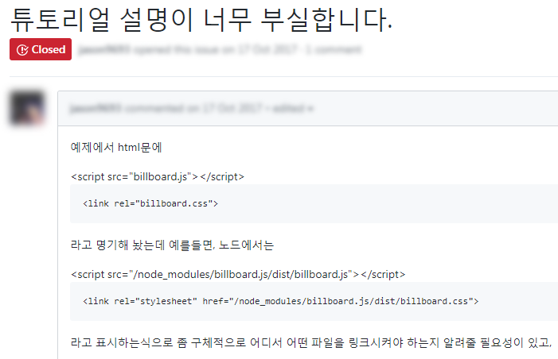

- API 찾아보면 되는데... <!-- .element: class="fragment" -->
- 이건 기본적으로 알것 같은데... <!-- .element: class="fragment" -->

----------

## Case #2
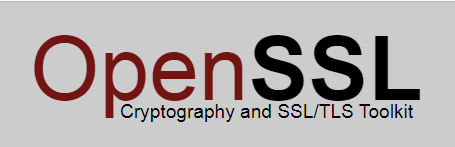
<span class="size25">https://www.openssl.org/</span>

----------

# OpenSSL?

<p>전세계의 웹사이트 보안을 담당</p>

네트워크를 통한 데이터 통신에 쓰이는<br>
프로토콜인 TLS/SSL 오픈소스 구현체

----------

## Heartbleed

2014년 4월에 발견된 보안 취약점<br>
<p class="size18">
    사용자가 서버간 연결 유지를 위한 "Hearbeat" 통신신호 방식을 이용<br>
    무작위 데이터 패킷과 크기를 서버에 전송, 서버는 같은 양의 데이터 반환해 연결 확인<br>
</p>


<p class="size18">
    거짓 데이터의 양을 전송하더라도 서버에서 메모리 저장된 데이터로 패킷을 채워 반환해 정보 누출 가능성
</p>

<p class="reference">
    [Heartbleed, The First Security Bug With A Cool Logo](https://techcrunch.com/2014/04/09/heartbleed-the-first-consumer-grade-exploit/)<br>
    [The Heartbleed Bug](http://heartbleed.com/)
</p>

----------

## 대가없이 사용하다가,
### 문제 생기면 비난 

<p class="size25">
2014년 4월 기준, 전세계 웹사이트들 중 [66%](https://news.netcraft.com/archives/2014/04/08/half-a-million-widely-trusted-websites-vulnerable-to-heartbleed-bug.html)가 OpenSSL 사용
</p>

> 고객님들 죄송합니다, 저희들이 망쳐놔서.<br> <!-- .element: class="fragment" --> 
> 돈이라도 돌려드릴까요?<br>
> 아, 그러고 보니<br>
> 저희가 돈을 아예 받은 적이 없네요.<br>
> &dash; Steve Marquess 

<p class="reference">
    [보이지 않는 전우 - OpenSSL](https://coolspeed.wordpress.com/2015/02/16/unseeable_comrade_in_arms/)
</p>

----------

## Case #3


<span class="size25">https://babeljs.io/</span>

----------

## ?

ES6+ 코드를 ES5(또는 실행환경에 적합한) 코드로<br>
변환해 주는 대표적인 자바스크립트 Transpiler

```js
 // ES6 arrow function code
 var sum = (num1, num2) => num1 + num2;

 // transpiled to ES5
 var sum = function(num1, num2) {
    return num1 + num2;
 }
```

<p class="reference">
    [Sebastian McKenzie: JavaScript Transformation | JSConf US 2015](https://www.youtube.com/watch?v=rKuNbEwoQfQ)
</p>

----------

## How came to Babel


[호주 Wodonga](https://en.wikipedia.org/wiki/Wodonga) 출신의 Sebastian McKenzie(당시 17세)가<br>
학교 시험 공부 도중, '6to5'(ES6 to ES5)라는 이름으로<br>
2014년 9월28일 [첫 커밋](https://github.com/babel/babel/commit/c97696c224d718d96848df9e1577f337b45464be)하며 시작


<p class="size25" style="margin:10px auto 30px auto;width:650px;background-color:rgba(66,65,65,0.5);color:cyan;padding:20px;border-radius:10px;">
    오픈소스인 [esprima](https://github.com/jquery/esprima), [estraverse](https://github.com/estools/estraverse) and [escodegen](https://github.com/estools/escodegen) 등을 활용
</p>

<p class="reference">
    [2015-in-review](https://medium.com/@sebmck/2015-in-review-51ac7035e272)
</p>

----------

### 를 통한 기회  

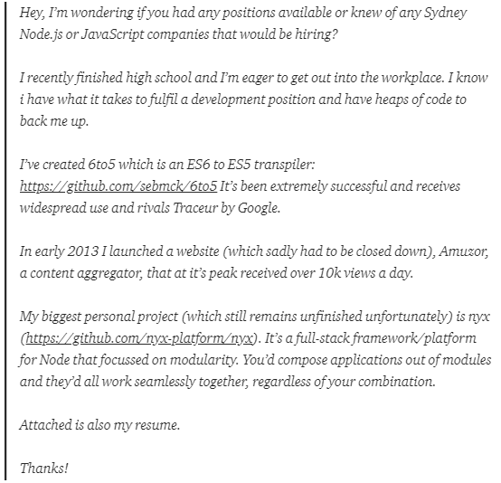

<p class="size25" style="margin:10px auto;width:650px;background-color:rgba(66,65,65,0.5);color:cyan;padding:20px;border-radius:10px;">
    Thinkmill &rarr; CloudFlare &rarr; Facebook
</p>

----------

## Burn out

<p class="size25" style="line-height:1">
    오픈소스 사용자들은 많은 것을 기대하며,<br>
    특히 필요한 것이 해결되지 않는 경우 강한 불만을 표출한다. 
    <!-- Open source users expect A LOT and are very vocal<br>
    when things aren’t exactly how they would have them... -->
</p>

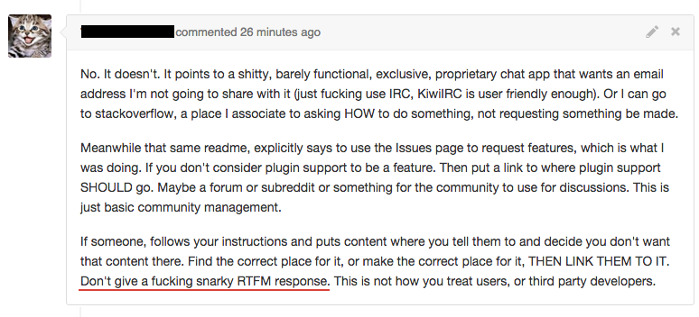

<blockquote class="fragment">
    Referring to someones work as <span class="red underline">"shit"</span> and calling open source maintainers <span class="yellow underline">idiots</span>
</blockquote>

----------

## Contributors

<p>
    보다 적은 이슈 해결과 낮은 책임감을 통해<br>
    스스로 프로젝트로부터 멀어지기 시작했다.  
    <!-- I started distancing myself from the project.<br>
    Fixing less issues. Being less responsive. -->
</p>

<p>
    프로젝트로부터 멀어지기로 하자,<br>
    이상한 일이 일어나기 시작했다.
    <!-- A weird thing happened though<br>
    as I pulled myself further away from the project. -->
</p>

> ### Contributors came in<br>and filled the gaps. <!-- .element: class="fragment" style="color:#07e207" -->

----------

## Henry Zhu 

Sebastian McKenzie 뒤이어, 현재 Babel 코어 개발자로 활동

<a href="https://twitter.com/left_pad/status/969793227862790144">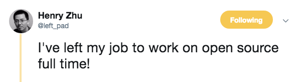</a>

> [JSCS](https://jscs-dev.github.io/)(ESLint) 컨트리뷰션 통해 [Adobe 취업](https://youtu.be/9sPDcVYX3g8?t=178)<br>&rarr; Babel 전념하기 위해 퇴사

<p class="reference">
    [I was not ready to become the maintainer of Babel](https://dev.to/hzoo/i-was-not-ready-to-become-the-maintainer-of-babel-2j6)
</p>

----------

<!-- .slide: data-background-image="./img/bg3.png" -->
<h1 style="text-shadow:none;color:#000">Digital</h1>
<h1 style="text-shadow:none;color:#000">Infrastructure</h1>

<p class="size25" style="color:#000;text-shadow:none">
    Fundamentally, digital infrastructure has a free rider problem.<br>
    Resources are offered for free, and everybody uses them,<br>
    so nobody is incentivized to contribute back.
</p>

----------

#### No one sees that the
### Roads and Bridges
## are falling down

사회 [기반시설](https://ko.wikipedia.org/wiki/%EA%B8%B0%EB%B0%98_%EC%8B%9C%EC%84%A4)은 우리 일상에서 아주 중요<br>

평소엔 중요성을 느끼지 못하며, 많은 이들은<br>
그것 들의 존재와 도움 등을 아주 '당연'한 것으로 인식

<p class="reference">
  [Roads and Bridges: The Unseen Labor Behind Our Digital Infrastructure](https://www.fordfoundation.org/about/library/reports-and-studies/roads-and-bridges-the-unseen-labor-behind-our-digital-infrastructure/)<br>
</p>

----------

## '무임승차'의 문제

<p class="fragment">
    항상, 문제가 '발생'되는 경우에만 관심과 인지
</p>

<p class="fragment">
    그러나, 그 관심도 대부분 '비난'과 '요구'<br>
    왜 잘 만들지 못했는지 또는 왜 빨리 고치지 않는지
</p>

<p class="fragment">
    문제 해결되면, 다시금 망각의 단계로 전환
</p>

> 누구나 무료로 사용하지만,<br>누군가는 그 비용을 지불해야만 한다. <!-- .element: class="fragment cyan" --> 

----------

#### 이들의 중요성은
## 문제가 발생될 때 드러난다.

<ul>
    <li class="fragment">OpenSSL - [Heartbleed](http://heartbleed.com/) (2014/4)</li>
    <li class="fragment">RubyGems.org [보안결함](https://gemfury.com/blog/2013/rubygems-vulnerability/) (2013/2)</li>
    <li class="fragment">Bash - [Shellshock](https://www.wired.com/2014/09/internet-braces-crazy-shellshock-worm/) (2014/9)</li>
</ul>

왜 사전에 예방될 수 없었을까?<br> <!-- .element: class="fragment cyan" --> 
왜 전엔 관심을 두지 않았나?


 > 당신은 무언가 잘못되기 전까지는<br>
 > 무시되거나 인정받지 못한다. <!-- .element: class="fragment underline yellow" --> 

<p class="reference">
  [Open source sustainability](https://techcrunch.com/2018/06/23/open-source-sustainability/)
</p>

----------

<!-- .slide: data-background-image="./img/bg3.png" -->
<h1 style="text-shadow:none;color:#000">The Fragility</h1>

----------

## 소수가 모두를
### 먹여 살린다.

아주 적은 수의 개발자가 유지하고, 아주 많은 곳에서 사용된다.

<ul>
    <li class="fragment">
        OpenSSL: <span class="size25">[The Internet Is Being Protected By Two Guys Named Steve](https://www.buzzfeed.com/chrisstokelwalker/the-internet-is-being-protected-by-two-guys-named-st)</span><br>
        <span class="size25">&rarr; [Steve Henson](https://www.openssl.org/blog/blog/2017/10/24/steve-henson/), [Steve Marquess](https://www.openssl.org/blog/blog/2017/10/27/steve-marquess/) leaved OpenSSL as of 2017.10</span>
    </li>
    <li class="fragment">Bash: [Chet Ramey](https://tiswww.case.edu/php/chet/bash/bashtop.html#Maintainer)</li>
    <li class="fragment">NW.js: [Roger Wang](https://github.com/nwjs/nw.js/commits/nw34)</li>
</ul>

<div class="fragment" style="margin-top:30px;background-color:rgba(92, 158, 4, 0.5);padding:10px;border-radius:10px;">
    2015년의 한 조사에서 133개의 깃헙 프로젝트를 확인결과,<br>
    <span class="size40 cyan" style="text-decoration:underline">64%(3/2)</span>가 <span class="size40 yellow" style="text-decoration:underline">1~2명</span>의 개발자가 주도적으로 운영해 생존 중
    
    <p class="reference" style="margin-top:10px">
        <a href="https://peerj.com/preprints/1233.pdf" style="color:#fff">What is the Truck Factor of Popular GitHub Applications? A First Assessment</a>
    </p>
</div>

----------

## [left-pad](https://www.npmjs.com/package/left-pad)'s case

```js
const leftPad = require("left-pad");

leftPad("foo", 5); // => "  foo"
leftPad(17, 5, 0); // => "00017"
```

<p class="size25 fragment">
    개발자인 Azer는 npm과 자신의 프로젝트<br>
    'Kik'의 상표권 문제를 겪은 후,<br>
    실망해 자신의 모든 프로젝트를 npm에서 제거
</p>

<p class="size25 fragment">
    많은 프로젝트들이 의존성을 갖고 있었고,<br>
    제거에 따른 사이드 이펙트가 발생
</p>

<p class="reference">
    [How one developer just broke Node, Babel and thousands of projects in 11 lines of JavaScript](http://www.theregister.co.uk/2016/03/23/npm_left_pad_chaos/)<br>
    [11줄의 코드, 인터넷을 패닉에 빠뜨리다](http://www.bloter.net/archives/253447)<br>
    [kik, left-pad, and npm](http://blog.npmjs.org/post/141577284765/kik-leftpad-and-npm)
</p>

----------

# 밸런스의 불균형

오픈소스는 하늘에서 무한정 공짜로
떨어지는 ['만나'](https://ko.wikipedia.org/wiki/%EB%A7%8C%EB%82%98)가 아니다.

> 오픈소스 컨트리뷰터보다<br>단순히 취하는 쪽이 압도적 <!-- .element: class="fragment" --> 

오픈소스의 인기(다운로드)는<br>
경제적 '성공'과 연결된다고 할수 없다.

----------

### 그럼에도 불구하고,
## 왜 아무 대가없이 할까?

<ul>
    <li class="fragment">1) 평판 또는 명성 때문에</li>
    <li class="fragment">2) 예상외의 인기를 얻고, 메인터넌스 '의무'를 느끼게 되는 경우</li>
    <li class="fragment">3) "Labor of Love" - [Read the docs](https://readthedocs.org/)(Eric Holscher)</li>
    <li class="fragment">4) 장인의 자부심과 그들이 믿는 것에 대한 책임감 - OpenSSL</li>
</ul>

----------

### 어쩌면 여러분들의
## 오픈소스 개발의 시작은 

- 단순히 '개발'이 재밌어서 시작/참여 <!-- .element: class="fragment" --> 
- 개발자는 학교/학원 등에서 소위 연봉 높고 좋은 직업으로 소개 <!-- .element: class="fragment" --> 

> 일단, 커밋하고 본다. (POSS) <!-- .element: class="fragment" --> 

<p class="fragment">
    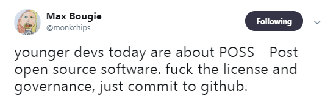<br>
    <span class="reference">https://twitter.com/monkchips/status/247584170967175169</span>
<p>

----------

<!-- .slide: data-background-image="./img/bg3.png" -->

<p>
    <br>
    <span class="size18" style="text-shadow:none;color:#000">[Source] https://flic.kr/p/4qAheL</span>
</p>
<h1 style="text-shadow:none;color:#000">How to monetize?</h1>

<p class="reference" style="text-shadow:none;color:#000">
  [A handy guide to financial support for open source](https://github.com/nayafia/lemonade-stand)<br>
  [The Money In Open-Source Software](https://techcrunch.com/2016/02/09/the-money-in-open-source-software/)
</p>

----------

### 왜 '돈'을 얘기하는 것은 어려운가?

세상의 모든 것은 '비용'이 발생<br>
오픈소스 프로젝트도 마찬가지

- 그들은 '비용'을 어디서 지급받나? <!-- .element: class="fragment" --> 
- 개발자의 '선의'에만 맡기는 것은 올바른가? <!-- .element: class="fragment" --> 

> 우리는 '오픈소스'에 대해<br> <!-- .element: class="fragment" -->
> 어떤 생각을 가져야 할까? 

<p class="reference">
    [The Money In Open-Source Software](https://techcrunch.com/2016/02/09/the-money-in-open-source-software/)
</p>

----------

## [Sindre Sorhus](https://github.com/sindresorhus)


<p>
노르웨이 출신 개발자, npm에 [1,114 패키지 등록](https://www.npmjs.com/~sindresorhus)<br>
[jQuery TodoMVC 버전 PR](https://github.com/tastejs/todomvc/commit/67233f91740bc07f0eb0c13a735f7653825310b6)을 통해 오픈소스 개발 시작<br>
</p>

> Test runner <a href="https://github.com/avajs/ava">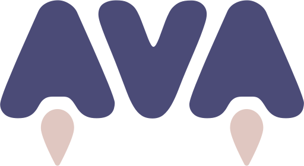</a> 개발

----------

# ?

currently living in Thailand and I think<br>
I would be fine with less than [1,500 dollars](https://github.com/sindresorhus/ama/issues/414#issuecomment-243228822).
 
> 유명 프로젝트를 다수 개발했더라도<br> <!-- .element: class="fragment" -->
> 유지에 대한 물음표

<p class="fragment">
    Ideally, I would like to do open source in a financially<br>
    sustainable way but that’s difficult,<br>
    so <span class="cyan" style="text-decoration:underline">I will probably do some contracting next year</span>.
</p>

<p class="reference">
    [Between the Wires: An interview with open source developer Sindre Sorhus](https://medium.freecodecamp.org/sindre-sorhus-8426c0ed785d)
</p>

----------

## by Coorporate 

<p class="fragment">
    기업에 소속되어 '개발'<br>
    React(Facebook), Angular(Google), NW.js(Intel), etc.
</p>

<hr style="width:150px">

<div class="fragment"> 
    비즈니스에 도움되는 프로젝트 메인터너를 고용

    <ul>
        <li>[Mozilla: John Resig](https://johnresig.com/blog/mozilla/) (as Evangelist)</li>
        <li>[HPE](https://www.hpe.com/): Python library '[Request](https://github.com/requests)' - [Cory Benfiled](https://github.com/Lukasa)</li>
    </ul> 
</div>

<hr style="width:150px">

<div class="fragment">
    80%의 리눅스 커널 개발은 소속된 회사에서<br>
    비용을 지급받으며 개발된다.
    
    <p class="reference">
        [2015, Linux Development Report](https://www.linuxfoundation.org/press-release/2015/02/the-linux-foundation-releases-linux-development-report/)
    </p>
</div>

----------

### by Funding/Donation

<ul>
    <li class="fragment">[](https://www.kickstarter.com/) &rarr; 크라우드펀딩 <span class="size25">(ex. [Django REST framework 3](https://www.kickstarter.com/projects/tomchristie/django-rest-framework-3))</span></li>
    <li class="fragment">[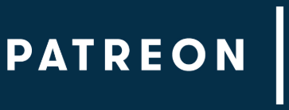](https://www.patreon.com/) &rarr; 창작자를 후원</li>
    <li class="fragment">[ ](https://opencollective.com/) &rarr; 모금된 돈의 사용을 투명하게 공개</li>
    <li class="fragment">
        [](https://tidelift.com/) <span class="size25">(commercialization and software guarantees)</span><br>
        <span class="size25">&rarr; [메인터넌스 지속을 위한 서브스크립션 모델](https://www.wired.com/story/netflix-open-source-wants-developers-get-paid/)</span>
    </li>
    <li class="fragment">[ Liberapay](https://liberapay.com/) &rarr; 기부 플랫폼</li>
    <li class="fragment">[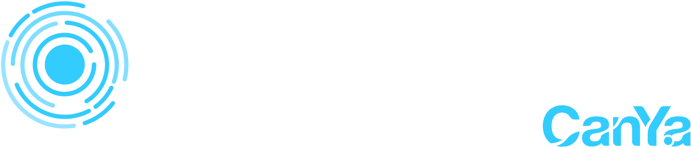](https://www.bountysource.com/) &rarr; 특정 작업에 대한 '포상'을 내거는 형태</li>
</ul>

----------

# 펀딩사례

<div class="fragment">
    <br>
    
    매해 $6만 달러정도의 기부를 받는다.<br>
    [$56K](https://www.djangoproject.com/foundation/reports/2013/#finances) (2013) / [$53K](https://www.djangoproject.com/fundraising/) (2018/10 기준)
</div>

<div class="fragment">
    <br>
    
  Heartbleed 이후, 중국 스마트폰 제조사인<br>
  [Smartisan으로 부터 $160K를 기부 받음](https://blogs.wsj.com/cio/2014/08/20/openssl-seeing-more-support-post-heartbleed/)
</p>

----------

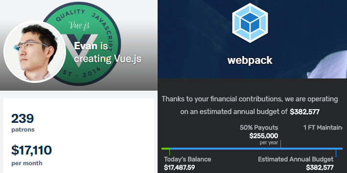

<ul>
    <li class="fragment">[Evan You](https://www.patreon.com/evanyou) (Vue.js) - $17K/month</li>
    <li class="fragment">[Henry Zhu](https://www.patreon.com/henryzhu) (Babel) - $2.2K/month</li>
    <li class="fragment">[Sindre Sorhus](https://www.patreon.com/sindresorhus) (AVA) - $3.6K/month</li>
    <li class="fragment">[Webpack](https://opencollective.com/webpack) - [$400K/year](https://medium.com/open-collective/funding-open-source-how-webpack-reached-400k-year-dfb6d8384e19)</li>
</ul>

----------

# by Business

- npm: [npm Enterprise](https://www.npm-enterprise.com/) <span class="size25">- 기업용 private 레지스트리 제공 서비스</span>
- WordPress <span class="size25">- 워드프레스 호스팅, 이커머스 서비스 등</span>

- Cloud Platform/PaaS
  - Meteor: [Galaxy](https://blog.meteor.com/announcing-meteor-galaxy-39c652c9ae69) <span class="size25">(Meteor 클라우드 플랫폼 호스팅)</span>
  - [Heroku](https://www.heroku.com/pricing)

그 외로는
- Consulting 작업 등을 수행
- Paid License를 적용

----------

# by License

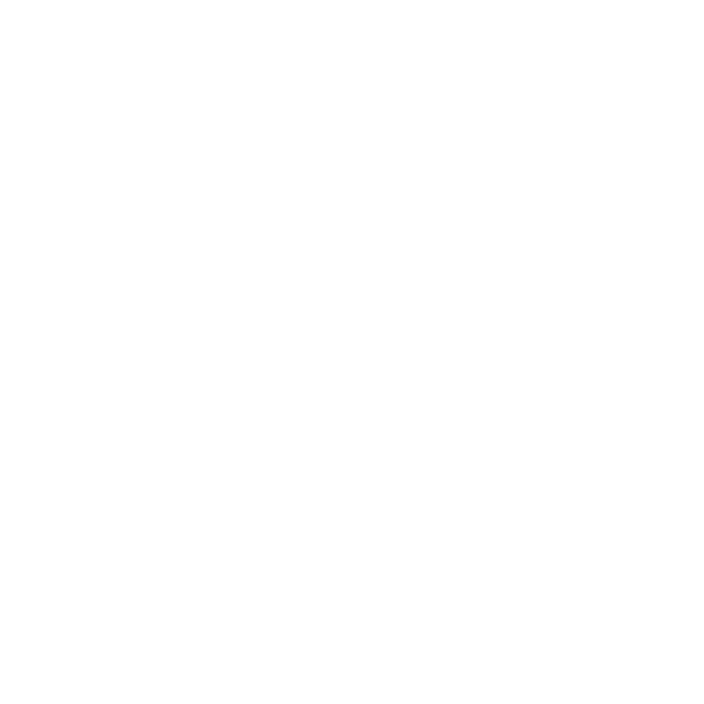
[License Zero](https://licensezero.com/) <span class="size25 cyan">new way to support open software developers</span><br>

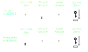

<p class="size25">
Dual license([Parity](https://licensezero.com/licenses/parity)/[Prosperity](https://licensezero.com/licenses/prosperity)): based on the two-clause BSD license
</p>

상업 사용자(Prosperity)에게는 사용 시작 32일 뒤,<br>
상업적 라이선스 요구

----------

## by Foundation

<div>
    [](https://www.coreinfrastructure.org/)
    <p class="size25" style="padding-top:10px">
        Heartbleed 사태 이후, 이의 예방을 위해<br>
        2014/4월 30개 기업으로 부터<br>
        $4백만 달러를 기부받아 설립
    </p>
    
    <p class="size25" style="clear:left;margin:15px auto;width:650px;background-color:rgba(66,65,65,0.5);color:cyan;padding:10px;border-radius:10px;">
        [OpenSSL](https://www.openssl.org/), [NTP](http://www.ntp.org/), [GnuPG](https://gnupg.org/), [OpenSSH](https://www.openssh.com/) 등을 지원
    </p>
    
    <p class="reference" style="margin-top:10px">
        [Tech titans join forces to stop the next Heartbleed](https://www.cnet.com/news/tech-titans-join-forces-to-stop-the-next-heartbleed/)
     </p>
</div>

<hr style="margin:15px auto;border:dotted 1px" />

<div>
    [](https://www.coreinfrastructure.org/)
    <span class="size25" style="display:inline-block;margin-top:30px">
        2015/10월 모질라 재단은 MOSS Award를 통해<br>
        1백만달러 규모의 상금 규모를 설정
    </span><br><br>
    
    <p class="size25" style="margin:0 auto;width:650px;background-color:rgba(66,65,65,0.5);color:cyan;padding:10px;border-radius:10px;">
        [Tor Browser](https://www.torproject.org/), [Tails](https://tails.boum.org/), [Caddy](https://caddyserver.com/) 등을 지원
    </p>
</div>

----------

<!-- .slide: data-background-image="./img/bg3.png" -->
<h1 style="text-shadow:none;color:#000">오픈소스,</h1>
<h1 style="text-shadow:none;color:#000">가치있는 일</h1>

----------

# Learn from

오픈소스를 통해
- 다른이의 코드를 통해 배우게 된다.
- 다른 세계의 개발자와 협업을 경험할 수 있게된다.

----------

## Open Source is mainstream

전통적인 SW 기업이 아닌 곳에서도 오픈소스를 개발

[](https://github.com/nasa) 
[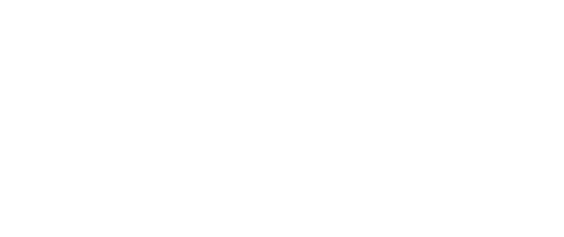](http://disney.github.io/)
[ GE](https://github.com/GeneralElectric)<br>
[ Ford Motor](https://github.com/FordDev)
[ Walmart Labs](https://github.com/walmartlabs)


<p class="reference">
    [Wal-Mart Proves Open Source Is Big Business](https://www.forbes.com/sites/moorinsights/2016/07/26/wal-mart-proves-open-source-is-big-business/)
</p>

----------

### 기업이 오픈소스로부터 얻는것

[](https://todogroup.org/) <span class="size25">talk openly, develop openly</span>

<p class="size25" style="margin:10px auto;background-color:rgba(66,65,65,0.5);color:cyan;padding:20px;border-radius:10px;">
    다양한 [테크 기업들](https://todogroup.org/members/)이 참여하는 오픈소스 프로젝트와 커뮤니티 지원을 위한 그룹
</p>

- 기업 문화개선
- 리크루팅 효과
- 비즈니스 기회
- 사회적 책임 - CSR (Coorporate Social Response)

<p class="reference">
    [Your First PR](https://twitter.com/yourfirstpr) / 
    [FIRST TIMERS ONLY](https://www.firsttimersonly.com/) / 
    [Make a Pull Request](http://makeapullrequest.com/)
</p>

----------

### Magpie  Developer
### syndrome

대체로 개발자들은<br>
기존에 문제없이 사용하던 기술들을 뒤로하고,<br>

<h2 class="fragment">'새롭고 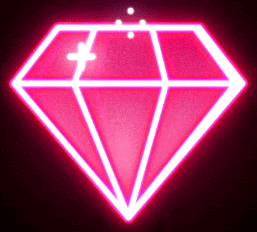 반짝'</h2>

이는 것들에 너무 쉽게 관심을 빼앗긴다.

<p class="reference">
    [The Magpie Developer](https://blog.codinghorror.com/the-magpie-developer/)<br>
    Magpie logo from, [Magpie Brewing Co.](http://www.magpiebrewing.com/)
</p>

----------

### Consumer가 아닌
# Contributor

다른 무엇보다도, 더 나은 세상을 만들 수 있고,<br>
다른 이들을 도울 수 있다는 점에서<br>
오픈소스는 커다란 '가치'가 존재

<p class="reference">
    [The Social Coding Contract](https://academy.realm.io/posts/altconf-justin-searls-open-source-social-contract/)
</p>

----------

## 오픈소스 어떻게 참여할까?

- 쉬운것 부터 (ex.문서, 코드 스타일) <!-- .element: class="fragment" -->
- 버그 리포팅 <!-- .element: class="fragment" -->
- 문제를 해결할 수 있는 PR <!-- .element: class="fragment" -->
- 영어가 중요하지만, 못해도 괜찮다. <!-- .element: class="fragment" -->
- 너무 유명한 프로젝트는 당장 어려울 수 있다. <!-- .element: class="fragment" -->

<div class="fragment" style="margin:20px">
    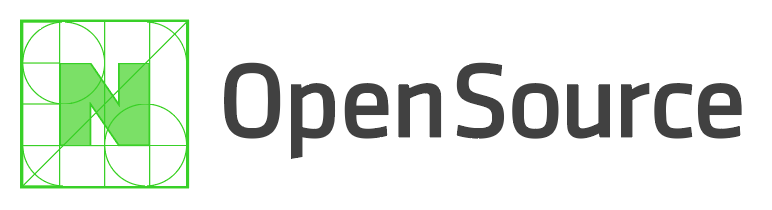<br>
   
    <ul style="font-size:25px">
        <li>오픈소스 바르게 사용하기</li>
        <li>컨트리뷰션 시작하기</li>
        <li>오픈소스 프로젝트 공개하기</li>
    </ul>

    <p class="reference">
        [네이버: 오픈소스 가이드](https://naver.github.io/OpenSourceGuide/book/index.html)
    </p>
</div>

----------

## 우리는 우리의 '몫'을
### 다하고 있는가?

> 오픈소스의 지속성을 위해<br> <!-- .element: class="fragment green" -->
> 우리는 모두 책임을 가져야 한다.

<p class="fragment">
    공원은 누구나 사용하지만, 유지되지 않으면<br>
    누구도 사용하지 않게 되기 때문이다.
</p> 

<p class="reference">
  [What it feels like to be an open-source maintainer](https://nolanlawson.com/2017/03/05/what-it-feels-like-to-be-an-open-source-maintainer/)<br>

  [Through the Open Source Looking Glass](https://www.youtube.com/watch?v=h0sfFX7WH1c)
</p>