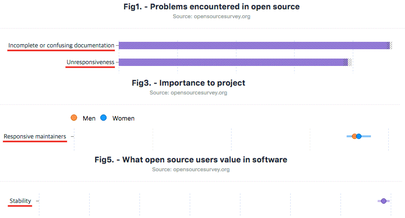
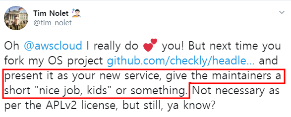
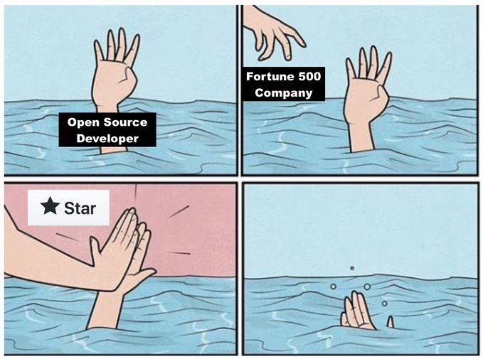
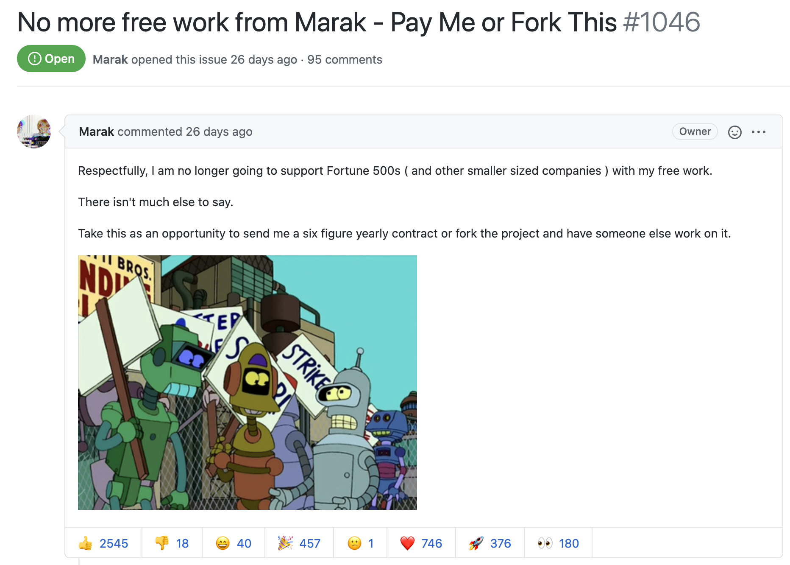

### 그간 참여 OSS 프로젝트

 
 

----------

## ?

누구나 빠르고 쉽게 웹에서 데이터 시각화를 제공할 수 있게 한다.
https://github.com/naver/billboard.js <!-- .element: class="size18" -->

- 2017/6 첫 공개된 D3.js 기반 SVG 웹 차트 라이브러리
- 2020 12월 기준, GitHub 4.5K stars
- 누적 npm 다운로드 수: 48만건 (2020/12 기준)
- 선언적 인터페이스 - 총 226개의 옵션과 API를 제공
- 코드 베이스: 13,700 LOC
- 코어 메인테이너: 1명

  <a href="https://deview.kr/2017/schedule/191">14일 만에 GitHub 스타 천 개 받은 차트 오픈소스 개발기</a> (2017)

----------

## Examples

<iframe src="https://naver.github.io/billboard.js/demo/" frameborder='no' allowtransparency='true' allowfullscreen='true'>
</iframe>

  <a href="https://naver.github.io/billboard.js/demo/">https://naver.github.io/billboard.js/demo/</a>

----------

## 오픈소스 공개는?
끝이 아닌 새로운 시작에 불과

> 공개 자체도 큰 발걸음이나, 지속되지 않으면 아무도 사용하지 않는다.

공개의 목표가 무엇인가?
- 자신의 실력과시?
- 좀더 나은 이직을 위해?
- 단순한 재미?
- 기술적 성장을 위해?

----------

## OSS 중요 요소들

사용자들은 안정성, 충분한 문서 그리고 책임감의 중요성을 말한다.

메인터넌스의 지속성에는 이들이 포함된다.

    <a href="http://opensourcesurvey.org/2017/">http://opensourcesurvey.org/2017/</a>

----------

## 어떻게 프로젝트를 홍보할까?

- 해당 기술 생태계 커뮤니티/뉴스레터 등
  - ex. https://www.reddit.com/r/javascript/
- 프로젝트 Activity == 운영자의 노력과 시간
  - 커밋 주기
  - 릴리스 주기
  - 이슈 답변
- 잘 작성된 문서화

----------

## 오픈소스 운영의 현실
시간과 노력은 비용 지불을 의미하지 않는다.

- OSS 성공(?)은 미래를 보장하는 것이 아님.
- 사용자들은 언제든 다른 경쟁자로 쉽게 이동할 수 있다.
- 사용자들은 마치 상용 제품과 같은 지원을 기대한다.
  - 때로는 많은 비난
- 탑티어 OSS가 아닌 이상, 외부 컨트리뷰션 기대가 힘들다.
- 처음의 열정이 아무 댓가 없이 지속되기는 힘들다.

----------

## 사례 #1

Amazon에서 OSS를 포크 후, 자사 서비스인 
[CloudWatch Synthetics Recorder](https://aws.amazon.com/about-aws/whats-new/2020/10/amazon-cloudwatch-synthetics-launches-recorder-to-generate-user-flow-scripts-for-canaries/)로 공개 

https://twitter.com/tim_nolet/status/1317061818574082050 <!-- .element: class="size18" -->

하지만, 아무런 대가나 포크에 대한 아무런 언급하지 않음 
트윗 후, credit으로 언급

----------

----------

### 사례 #2: faker.js
GitHub Star 28.7K 
generate massive amounts of realistic fake data

높은 인기도와는 상관없이 메인터넌스 어려움으로 인해, 
기업들은 비용을 지불하거나 포크 하라고 선언

    <a href="https://github.com/Marak/faker.js/issues/1046">No more free work from Marak - Pay Me or Fork This</a>

----------

## Salvatore Sanfilippo

NoSQL in memory 데이터베이스인 [Redis](https://redis.io/) 개발

  Maintaining an open source project is also a lot of joy and fun... 
  before of the Redis experience I never worked every week day of my life  
  Certain people are total assholes...
  in one way or the other you’ll have to confront with these people.

  <a href="http://antirez.com/news/129">The struggles of an open source maintainer</a>

----------

## TJ Holowaychuk

Node.js 버전 관리자인 [n](https://github.com/tj/n), [Express.js](https://github.com/expressjs/express/releases/tag/0.0.1)를 개발

  In the end open-source doesn’t pay the bills 
  so it’s best to focus on other things if you can.

    <a href="https://qr.ae/pNCP1m">Has TJ Holowaychuk been as prolific in the Golang community as he was in the Node.js community?</a>

----------

#### 그럼에도
## 오픈소스 운영하는 이유?

- 의도치 않았던 관심으로 인한 책임감
- 성장과 동기부여를 제공하는 채널
- OSS로부터 받은 혜택을, 되돌려 준다는 생각
- 기업의 비즈니스적 필요성이 어느 정도는 존재하기 때문
