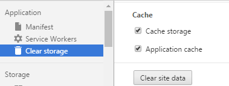

# PWA?

> "Progressive Web Applications take advantage of new technologies to bring the best of mobile sites and native applications to users"<br>
> \- [Progressive Web Apps](https://developers.google.com/web/progressive-web-apps?hl=en)

- Instant Loading:<br>
  <span style="font-size:20px">[Service Workers](https://www.w3.org/TR/service-workers/), [Background Sync API](https://wicg.github.io/BackgroundSync/spec/), [Cache API](https://slightlyoff.github.io/ServiceWorker/spec/service_worker/#cache-objects)</span>
- Add to Home Screen:<br>
  <span style="font-size:20px">[Web App Manifest](https://www.w3.org/TR/appmanifest/)</span>
- Push-notifications:<br>
  <span style="font-size:20px">[Push API](https://w3c.github.io/push-api/), [Notifications API](https://notifications.spec.whatwg.org/)</span>

----------

## The challenges of PWA

- iOS 미지원
  - [Service Workers](https://webkit.org/status/#specification-service-workers): Under Consideration
  - Web App Manifest?
  - Push & Notification API?

----------

## Performance matters

PWA 기술들 중, 가장 중요한 요소는 바로 <span class="underline bold green">offline caching!</span>


----------

## 그런데... 잠깐.
## 브라우저는 이미 캐싱하고 있지 않나?

사용자가 방문하는 웹사이트의 모든 리소스들에 대해 브라우저는<br>
로컬 캐시해 다음 방문시 로컬 캐시된 리소스를 활용하도록 처리된다.

그러나 많은 경우 로컬 캐시된 리소스를<br>
활용하지 못하는 경우가 발생하기도 한다.

물론, <span class="underline">오프라인인 경우에는 로컬 캐싱은 사용불가</span>

----------

## 캐시의 상태

|Status|Description|
|----|----|
| cfirst visit</span> | 첫 방문인 경우, 당연히 캐싱되어 있는 리소스는 존재하지 않음 |
| <span class="red bold">cleared</span> | 캐싱되어 있는 경우라도, 사용자가 직접 캐시를 비우거나, 백신으로 인해 지워지거나 또는 브라우저의 버그로 제거되기도 한다. (약 19%의 Chrome 사용자들의 경우, 최소 1주일에 한번 이상 버그로 인해 캐시가 지워진다. - [참고](https://plus.google.com/+WilliamChanPanda/posts/hsfVHq6wKxG)) |
| <span class="red bold">purged</span> | 로컬 캐시의 공간은 모든 웹사이트가 공유해 사용하기 때문에 한정된 공간으로 인해 이전에 캐시된 내용은 새로운 캐시 저장을 위해 지워지게 된다. |
| <span class="red bold">expired</span> | 약 69%의 리소스들은 캐싱에 대한 헤더가 없거나 또는 1일 미만의 값으로 설정되어 있다. 캐싱 기간이 만료되면, 로컬에 저장된 캐시의 내용이 유효하더라도 새롭게 요청되어 진다. ([참고](http://httparchive.org/interesting.php#caching)) |
| <span class="red bold">revved</span> | 이전 방문으로 인해 캐싱이 되어 있는 상태라고 해도, 사이트의 내용이 변경되어 사용자의 로컬 캐시된 리소스와 달라 사용되지 못할 수도 있다. |

----------

# 페이스북 사례

페이스북에 접속하는 사용자들 중 로컬 캐시가 없는<br>
상태의 요청 비율은 <span class="red underline bold">25.5%</span> 라고 한다. (2015/04 기준)

|  Type | Request rate of<br>missing cache |
| --- | --- |
| Desktop | 24.8% |
| Mobile | 26.9% |

<p style="margin-top:35px;font-size:20px">
[참고]: [Web performance: Cache efficiency exercise](https://code.facebook.com/posts/964122680272229/web-performance-cache-efficiency-exercise/)
</p>

----------

## 모바일 브라우저의 캐시

로컬 캐싱은 성능에 큰 영향을 주는 요소 중 한 가지.<br>
그러나 모바일 환경에서의 캐싱은 데스크탑 브라우저에 비해 적은 공간을 사용

브라우저에 따라 최대 사용공간은 다르며,<br>
잘 문서화 되어 있지 않아 정확한 limit을 확인하기는 어렵다.

| 종류 | 크기 |
| --- | --- |
| 데스크탑 | 3자리 수 이상 (또는 사용 디스크 전체 크기의 일부)<br> ex. IE9의 경우는 디스크 크기의 1/256 |
| 모바일 | 2자리 수 정도의 공간을 활용하는 것으로 알려져 있음<br> ex. Android 2.x의 경우는 최대 캐시 크기는 5.7MB에 불과<br> (iOS의 경우는 50MB 이상) |

<p style="margin-top:35px;font-size:20px">
[참고]: [Early findings: Mobile browser cache persistence and behaviour](http://www.webperformancetoday.com/2012/07/12/early-findings-mobile-browser-cache-persistence-and-behaviour/)
</p>

----------

<!-- .slide: data-background="#e74c3c" -->
<div class="title-animate">
    <div><h1>Service Workers</h1></div>
    <div><p>손쉽게 사용할 수 있는 도구들</p></div>
</div>

----------

## [sw-precache](https://github.com/GoogleChrome/sw-precache)
빌드 기반의 리소스의 프리캐싱

- 캐싱 리소스 파일의 컨텐츠에 기반해 해쉬를 통한 자동 버저닝
- 변경이 감지되면, 이전 버전을 만료시키고,<br>새로운 버전을 fetch 하도록 SW를 생성
- 변경되지 않은 캐시 요소에 대해선 그대로 유지

----------


## sw-precache

ex. Gulp task:
```js
gulp.task('generate-service-worker', function(callback) {
  var path = require('path');
  var swPrecache = require('sw-precache');
  var rootDir = 'app';

  swPrecache.write(path.join(rootDir, 'service-worker.js'), {
    staticFileGlobs: [rootDir + '/**/*.{js,html,css,png,jpg,gif}'],
    stripPrefix: rootDir
  }, callback);
});
```

<p style="margin-top:35px;font-size:20px">
[코드랩]: [Adding a Service Worker with sw-precache](https://codelabs.developers.google.com/codelabs/sw-precache/)
</p>

----------

## [sw-toolbox](https://github.com/GoogleChrome/sw-toolbox)
런타임 요청에 대한 공통의 캐싱 패턴을 제공

다음의 3가지 패턴(전략)을 제공
- cacheFirst
- networkFirst
- fastest

```js
toolbox.router.get("/images", toolbox.cacheFirst);
```

----------

## sw-toolbox

```js
(global => {
  'use strict';

  // Load the sw-tookbox library.
  importScripts('./js/sw-toolbox/sw-toolbox.js');

  // Turn on debug logging, visible in the Developer Tools' console.
  global.toolbox.options.debug = true;

  // The route for the images
  toolbox.router.get('/images/(.*)', global.toolbox.cacheFirst, {
    cache: {
          name: 'svg',
          maxEntries: 10,
          maxAgeSeconds: 86400 // cache for a day
        }
  });

  // The route for any requests from the googleapis origin
  toolbox.router.get('/(.*)', global.toolbox.cacheFirst, {
    cache: {
      name: 'googleapis',
      maxEntries: 10,
      maxAgeSeconds: 86400 // cache for a day
    },
    origin: /\.googleapis\.com$/,
    // Set a timeout threshold of 2 seconds
    networkTimeoutSeconds: 2
  });

  // By default, all requests that don't match our custom handler will use the toolbox.networkFirst
  // cache strategy, and their responses will be stored in the default cache.
  global.toolbox.router.default = global.toolbox.networkFirst;

  // Boilerplate to ensure our service worker takes control of the page as soon as possible.
  global.addEventListener('install', event => event.waitUntil(global.skipWaiting()));
  global.addEventListener('activate', event => event.waitUntil(global.clients.claim()));
})(self);
```

<p style="margin-top:35px;font-size:20px">
https://www.youtube.com/watch?v=jCKZDTtUA2A&t=16m58s    
https://youtu.be/gfHXekzD7p0?list=PLNYkxOF6rcIB3ci6nwNyLYNU6RDOU3YyL
http://deanhume.com/home/blogpost/getting-started-with-the-service-worker-toolbox/10134

[Basic Routes](https://github.com/GoogleChrome/sw-toolbox/blob/master/doc-pages/usage.md)<br>
view-source:https://deanhume.github.io/Service-Worker-Toolbox/sw.js
</p>

----------

### [offline-plugin for webpack](https://github.com/NekR/offline-plugin)
webpack 프로젝트에서 사용할 수 있는 플러그인

1) webpack.config

```js
var OfflinePlugin = require('offline-plugin');

module.exports = {
  plugins: [
    // ... other plugins
    // 플러그인들 중, 가장 마지막에 추가
    new OfflinePlugin({
      caches: {
        main: ['external.js', ':rest:']
      },
      externals: ['external.js'],
      excludes: ['main.js']
    })
  ]
  // ...
}
```

2) in your client script

```js
require('offline-plugin/runtime').install();
```

----------

# SW가 지원되지 않는<br>환경에선 어떻게?

- 스토리지를 활용한 캐싱:<br>
  Web Storage, IndexedDB, File API, etc.

<p style="margin-top:35px;font-size:20px">
[참고]: [Offline Storage for Progressive Web Apps](https://medium.com/@addyosmani/offline-storage-for-progressive-web-apps-70d52695513c)
</p>

----------

## 웹 스토리지를 활용한 캐싱 방법

캐시의 상태에 따라 항상 모든 static 파일들이 사용자의 로컬 영역에<br>
존재한다는 보장은 없기 때문에, 자주 변경이 되지 않는 파일에 대해서는<br>
localStorage를 이용해 확실하게 캐싱되도록 처리하는 방법도 고려할 수 있다.

### 몇가지 고려사항 : <!-- .element: class="underline" -->
- 자주 변경을 필요로 하지 않는 기본 라이브러리들로 대상을 한정
- 자주 변경되지 않더라도, 업데이트가 필요할 수 있기 때문에 '버전관리' 필요
- localStorage는 브라우저에 따라 최대 저장용량이 다를 수 있다.<br>
  대체로 5MB 까지 저장할 수 있지만, 보다 정확한 최대치 확인필요 
  
  
[데모]: [네이버 검색 활용 예](https://m.search.naver.com/search.naver?sm=mtb_hty.top&where=m&query=%EB%B8%94%EB%9E%99%ED%95%91%ED%81%AC)

----------

## 로딩 전략

initializer: 스토리지 버전과 비교<br>
> storage.VER != file.VER ?<br>
>   load from File :
>   load from Storage


```js
let load = code => {
    var s = document.createElement("script");
    s.charset = "utf-8";
    s.text = code;
    (document.head || document.getElementsByTagName("head")[0]).appendChild(s);
};
```

조건과 상황에 따라 다르지만, 기존 대비 <span class="red underline bold">25%</span> 성능향상 경험

----------

## Application Shell architecture

[Instant Loading Web Apps With An Application Shell Architecture](https://medium.com/google-developers/instant-loading-web-apps-with-an-application-shell-architecture-7c0c2f10c73)


----------

## How much can be stored?

- 크롬의 경우 : <!-- .element: style="text-decoration:underline;list-style: none;text-indent:-20px" -->
- [temporary](https://developer.chrome.com/apps/offline_storage#temporary) 영역을 사용
- Per origin (not per API)
- Web Storage, App Cache, File System,<br>IndexedDB, WebSQL가 공유
- 그러나 Web Storage는 5MB로 고정<br><br>

| Browser | Limits |
| --- | --- |
| Firefox | No limits (prompt after 50MB) |
| Mobile Safari | 50MB max |
| Desktop Safari | unlimited (prompts after 5MB) |
| IE10+ | 250MB max (prompts at 10MB) |

----------

## [Chrome Quota Size](https://docs.google.com/presentation/d/11CJnf77N45qPFAhASwnfRNeEMJfR-E_x05v1Z6Rh5HA/edit#slide=id.g1468a77557_0_15)
```js
navigator.webkitTemporaryStorage.queryUsageAndQuota ( 
    (usedBytes, grantedBytes) =>
        console.log('Using ', usedBytes, ' of ', grantedBytes, 'bytes'), 
    e => console.log('Error', e)
);
```

| Type | Previous | Current Work |
| --- | --- |
| <span class="green bold">Pool</span> | (free space –<br> chrome's current usage) / 3 | fixed % of total disk space:<br>(drive size - OS size) * P |
| <span class="green bold">Origin quota</span> | pool size / 5 | pool size / N |


PWA gets at most 6% of free space on device

<p style="margin-top:35px;font-size:20px">
[참고]: [Browser Storage Abuser](http://demo.agektmr.com/storage/),
[Offline Storage for Progressive Web Apps](https://medium.com/@addyosmani/offline-storage-for-progressive-web-apps-70d52695513c)
</p>

----------

## PWA 디버깅

SW는 'https' 에서만 동작한다.<br>
그러나 디버깅 용도를 위해 http://localhost 에서도 동작

Chrome DevTools > Application Tab:
- Manifest
- Service Workers
- Cache

[Debug Progressive Web Apps](https://web-central.appspot.com/web/tools/chrome-devtools/debug/progressive-web-apps/?hl=en)<br>
chrome://serviceworker-internals/

----------

## Manifest

- 전체 outline 확인
- homescreen 이벤트 에뮬레이션


----------

## Service Workers

- 네트워크 핸들링
- 이벤트 에뮬레이션: Update, Push, Sync, Unregister
- 실행 및 중지


----------

## Cache

캐시된 리소스의 확인<br>


모든 캐시의 삭제는 Application > Clear storage


----------

## Case Studies

Service Workers in Production
https://developers.google.com/web/showcase/2015/service-workers-iowa
https://developers.google.com/web/showcase/2016/iowa2016
https://pwa.rocks/


----------

## Reference

- [Service Workers 101](https://github.com/delapuente/service-workers-101/)
- [The Service Worker Lifecycle](https://bitsofco.de/the-service-worker-lifecycle/)
- [Awesome Progressive Web Apps](https://github.com/TalAter/awesome-progressive-web-apps)
- [Progressive Web App Dev Summit 2016](https://events.withgoogle.com/progressive-web-app-dev-summit/)

----------

Progressive Web Apps
https://developers.google.com/web/progressive-web-apps/

Service Worker related libraries, sw-precache and sw-toolbox
https://developers.google.com/web/tools/service-worker-libraries/

The offline cookbook
https://jakearchibald.com/2014/offline-cookbook/

Demo
https://www.pokedex.org/
https://www.washingtonpost.com/pwa/
https://pwa.rocks/
https://weather-pwa-sample.firebaseapp.com/


2번 이상 방문(최소 5분 이상의 간격)하는 경우, 홈스크린에 추가