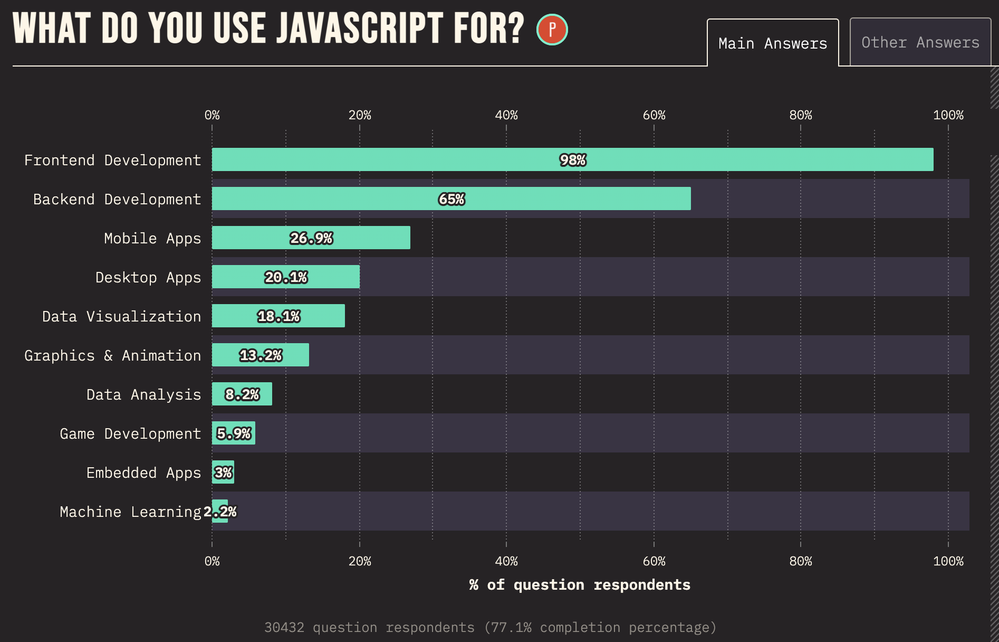
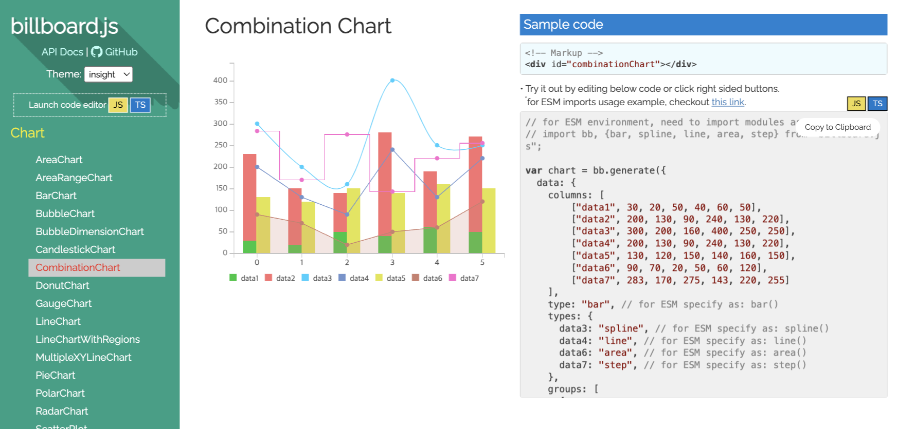
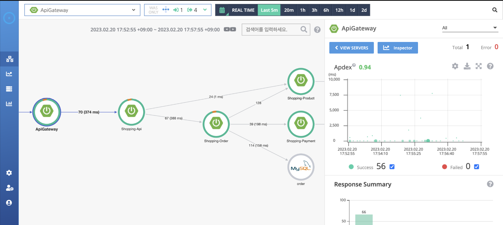
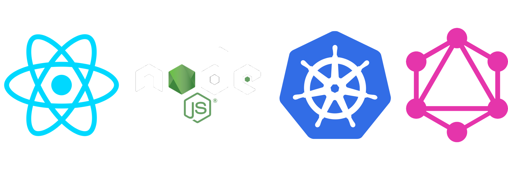
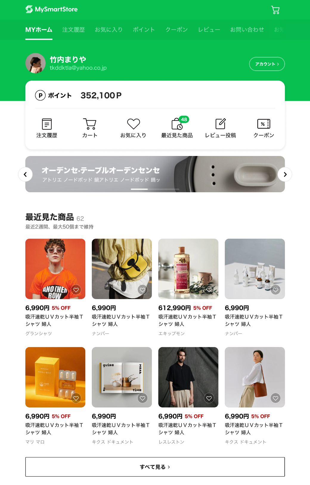
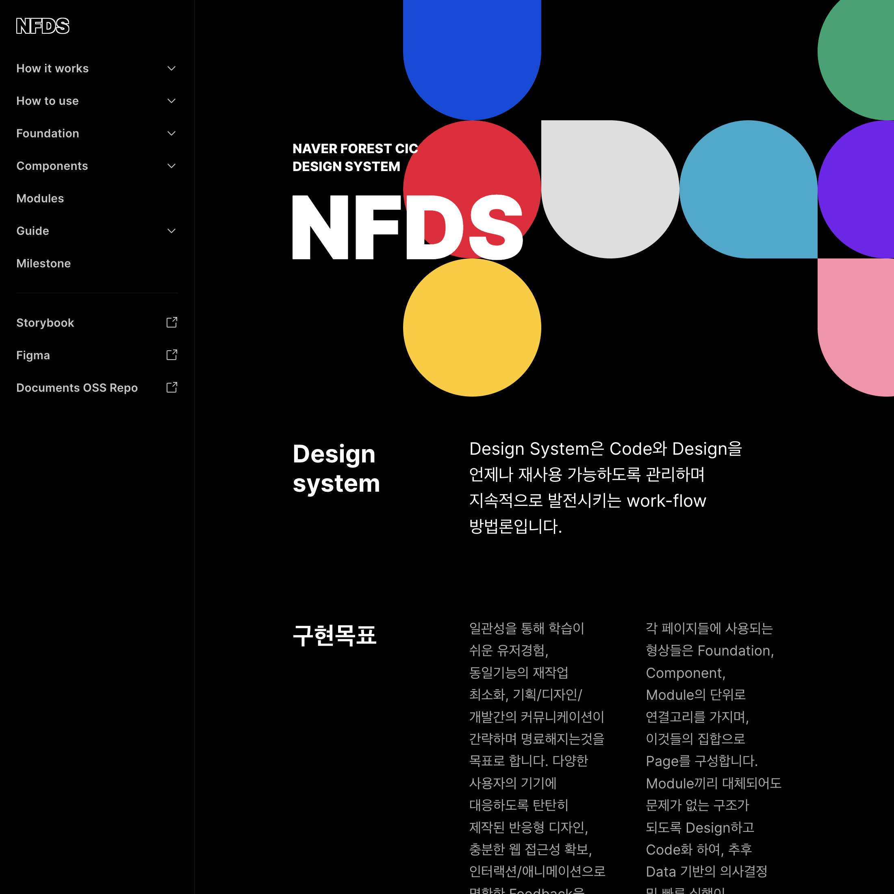
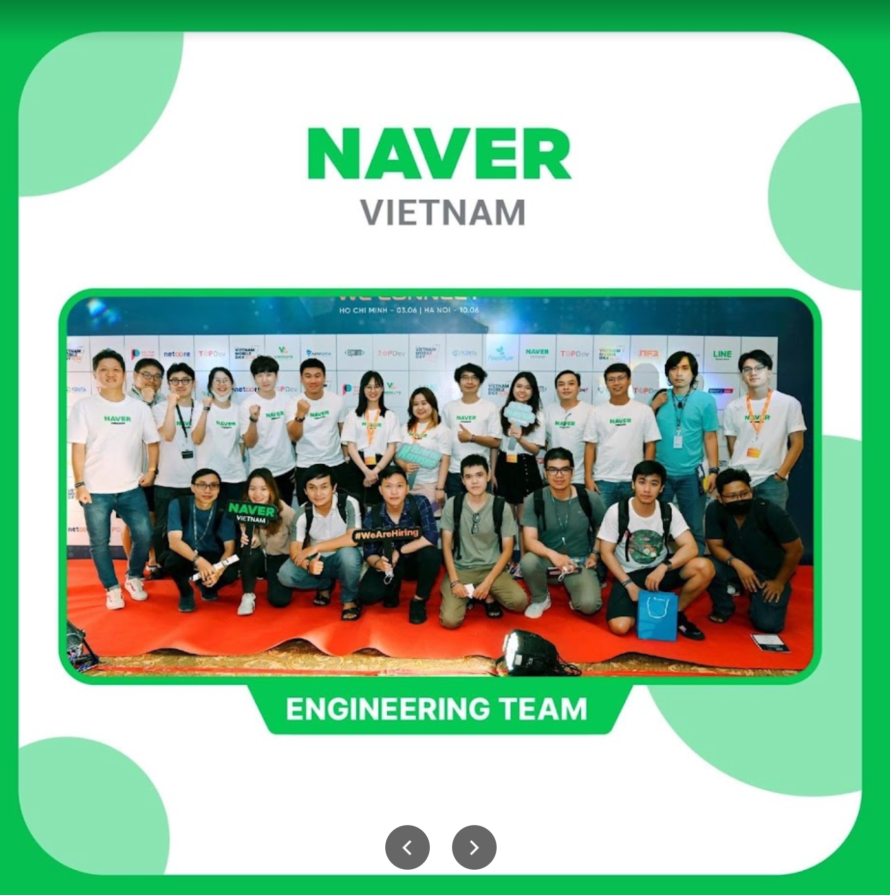

먼저, 반갑습니다.

# 👏 😍 👋 😁 

     
    네이버는 Front-end를 사랑합니다.

    click 👉 🎉

----------

## I think Front-end is...

여러분은 Front-end 영역에 대해 어떤 생각을 갖고 계신가요?

- 상대적으로 쉽게 뛰어들 수 있는 영역이다. <!-- .element: class="fragment fade-up" -->
- 깊이 없는 기술적 난이도/성숙도 <!-- .element: class="fragment fade-up" -->
- 전망이 밝지 않다. <!-- .element: class="fragment fade-up" -->
- 보상이 다른 기술 영역에 비해 낮아 보인다. <!-- .element: class="fragment fade-up" -->

----------

## 트렌드는 너무 빠르게 변한다.

지금의 'Hot'한것 같아 보이는 것들이 
정말(앞으로도) 그러한지 냉철한 접근이 필요하다.

    <a href="https://www.thisisgame.com/webzine/nboard/12/?n=167430">[칼럼] '메타버스'는 '헛소리'가 맞았던 걸까?</a>

----------

<!-- .slide: data-background="rgb(231, 76, 60)" -->
## Why?
# Front-end

----------

## 주요 설문조사

    JavaScript는 전세계 주요 설문 조사에서 1위🏆 언어 
    긴 시간동안 상위권을 유지하는 것엔 이유가 있다.

    <a href="https://octoverse.github.com/#top-languages">2022 GitHub Octoverse</a> 
    <a href="https://insights.stackoverflow.com/survey/2021#technology-most-popular-technologies">2021 Developer Survey, StackOverflow</a>

----------

<!-- .slide: data-background="rgb(218, 166, 85)" -->
# FE 개발의 매력

하나의 코드베이스로 모든 영역을 다룰수 있다.

----------

## 다중 플랫폼 지원?

개발한 서비스는 사용자 층에 따라, 다양한 타겟으로 개발이 되어야 합니다.
- Web
- Mobile (iOS, Android)
- Desktop (Mac, Windows, Linux ...)    

모두 지원하기 위해 따로 따로 개발하실 건가요?

# 그게 가능할까요? <!-- .element class="fragment fade-down" style="color:#ff4f4f" -->

----------

## 오해 😕❓되고 있는 것 <!-- .element class="m-0" -->

Front-end는 Front-end만을 다룬다?

### Myth #1: 교육 과정에서 비중있게 다루지 않으므로 덜 중요
- 다루지 않기 때문에 덜 중요한 영역이 결코 아니다.
- [마틴 파울러의 "리팩토링 - 2판"](https://martinfowler.com/articles/refactoring-2nd-ed.html), 예제 코드는 Java 에서 JavaScript 로 변경.

    One was Java, still widely used and easy to understand. 
    But I went for the alternative: JavaScript.

### Myth #2: Front-end는 UI에 국한 <!-- .element: style="margin-top:30px" -->
빠른 발전으로 인해, 과거는 "Front"였지만 오늘날은 그렇지 않다.

----------

## FE는 이제 FE가 아니다.

단일 코드베이스로 모바일, 데스크톱, 웹, 
Back-end 등을 개발할 수 있습니다.

- 프로그레시브 웹앱: [PWA](https://developers.google.com/web/fundamentals/codelabs/your-first-pwapp/?hl=ko) (Progressive Web App) 
  &rarr; 하나의 웹앱으로 웹, 모바일 그리고 데스크탑 모두를 지원하는 앱을 만드는 기술
- 모바일앱: [React Native](https://facebook.github.io/react-native/), [Tauri](https://tauri.app/), [NativeScript](https://www.nativescript.org/)
- 데스크탑: [Electron](https://electronjs.org/), [NW.js](https://nwjs.io/)
- Back-end(서버) - JS/TS Runtime: [Node.js](https://nodejs.org/), [Deno](https://deno.land/), [Bun](https://bun.sh/)

----------

### FE 기술로 개발된 <!-- .element: style="margin:0" -->
## 대표적 애플리케이션들 <!-- .element: style="margin:0" -->

   VSCode 
  
 Photoshop / AutoCad

    <a href="https://web.dev/ps-on-the-web/">Photoshop's journey to the web
</a> 
    <a href="https://electronjs.org/apps">Electron > Apps</a> 
    <a href="https://www.youtube.com/watch?time_continue=1327&v=BnYq7JapeDA">Build the future of the web with WebAssembly and more (Google I/O '18)</a>

----------

## FE는 JavaScript 만을 <!-- .element: class="m-0" -->
### 다루는 것을 의미하지 않는다.

    
    
    
    

- 비 JavaScript 언어로 개발된 Front-end 툴링
  - Rust: [Deno](https://deno.land/), [swc](https://github.com/swc-project/swc), [Rome](https://github.com/rome/tools), [dprint](https://github.com/dprint/dprint), [Volta](https://github.com/volta-cli/volta), [fnm](https://github.com/Schniz/fnm)
  - Go: [esbuld](https://github.com/evanw/esbuild)
  - OCaml: [Flow](https://github.com/facebook/flow)
  - Zig (C++): [Bun](https://bun.sh/)
- WebAssembly
    - 친숙한 도구와 언어로 개발하고 wasm으로 컴파일 
       [C/C++, Rust, C#, Go, Kotrlin, Swift, etc.](https://webassembly.org/getting-started/developers-guide/)

----------

### 웹에서 경험하는 Windows 11

<iframe src="https://win11.blueedge.me/" style="border:0;width:100%;height:500px"></iframe>

<a href="https://win11.blueedge.me/">https://win11.blueedge.me/</a>

----------

## 한줄로 만드는 웹서버

    웹서버는 아주 간단하게, JavaScript 한줄로 만들수 있습니다. 직접 확인해 보세요.

- 1) Node.js를 설치 (https://nodejs.org/ 다운로드)
- 2) Command line에서 아래를 입력

    node -e "require('http').createServer((req, res) => res.end('Hello World!')).listen(3000)"

- 3) 브라우저에서 "localhost:3000"에 접속

----------

## Use JavaScript for...

- 65%가 BE 개발을 위해 사용한다고 응답

    <a href="https://2022.stateofjs.com/en-US/usage/#what_do_you_use_js_for">2022 State of JS: What do you use JavaScript for?</a>

----------

### 요새 핫한 기술들? <!-- .element: style="margin:0;color:yellow" -->
## 모두 FE 기술로 가능합니다. <!-- .element: style="margin:0 0 10px" -->

### AI
- 머신러닝: [TensorFlow.js](https://www.tensorflow.org/js)
- 딥러닝(Neural Network): [Brain.js](https://github.com/BrainJS/brain.js), [ConvNetJS](https://github.com/karpathy/convnetjs)

### 그래픽스/화상통신 <!-- .element: style="margin-top:30px" -->
[WebGL](https://webglsamples.org/), [Canvas](https://developer.mozilla.org/ko/docs/Web/Demos_of_open_web_technologies), [WebRTC](https://webrtc.org/)

### 증강/가상현실 <!-- .element: style="margin-top:30px" -->
[WebXR](https://developer.mozilla.org/en-US/docs/Web/API/WebXR_Device_API)

----------

## FE 처럼 폭넓은 영역을 다루는 <!-- .element: style="margin:0;color:#ff7e7e" -->
# 기술영역이 또 있나요?

----------

## Atwood's Law

JavaScript로 작성될 수 있는 애플리케이션은 
결국 모두 JavaScript로 작성될 것이다.

    Any application that can be written in JavaScript, 
    will eventually be written in JavaScript. 
    - Jeff Atwood (StackOverflow 공동창업자)

    위 법칙은 2007/07 발표 되었지만, 
    현재 상황을 보면 점점 더 그렇다고 생각되지 않나요?
</o>

    <a href="https://blog.codinghorror.com/the-principle-of-least-power/">The Principle of Least Power</a>

----------

<!-- .slide: data-background="#2db400" -->

## Why❓ FE dev at
# 

----------

## Let's  <!-- .element: style="margin:0 0 -40px;color:yellow" -->
# Grow <!-- .element: class="m-0" style="color:mediumpurple" -->
## Together!  <!-- .element: style="margin:-35px 0 20px 0" -->

우리는 '성장'하는 것에 관심이 매우 많습니다.

> [What got you here won't get you there.](https://www.amazon.com/What-Got-Here-Wont-There-ebook/dp/B000Q9J128) 
> &dash; Marshall Goldsmith

- 열려있는 대외 활동 
  

    &rarr; [DEVIEW](https://deview.kr/2019/schedule), [D2 HelloWorld](https://d2.naver.com/search/tag?keyword=JavaScript)
      
  

- 다양한 FE 전문 사내 기술행사 
  &rarr; TechTalk, 밋업, FE devtalk, 주간 FE 라운지(like Clubhouse)

----------

# FE News

FE 관련 월간 기술 뉴스레터

https://github.com/naver/fe-news

2020년 시작한 프로젝트로 국내 주요 개발자들의 FE 기술소식 매체로 활용

----------

# 글로벌 개발자 <!-- .element class="m-0" -->
## 생태계 기여

   

    
   

<a href="https://github.com/naver?q=&type=&language=&sort=stargazers" style="font-size:45px;color:cyan">github.com/naver stars TOP3</a> 
모두 Front-end 프로젝트❗ 

----------

## Always bet on JS

    사람들은 항상 JS의 중요성을 간과하고 낮게 평가했지만, 
    항상 더 크게 발전하고 중요한 위치에 올라섰고 미래에도 그럴 것이다.

    <a href="http://brendaneich.github.io/ModernWeb.tw-2015/#74">JavaScript at 20</a> - Brendan Eich (2015)

----------

### FE 기술은 폭넓은, 그리고 <!-- .element: class="m-0" -->
## 계속해서 빠르게 성장하는 영역

FE 기술 경험은 다른 기술 영역으로의 전환 시, 
걸림돌을 제거해 빠르게 스위칭할 수도 있다.

## FE의 유일한 단점?

<h1 class="fragment fade-up" style="color:#f5ed02;text-decoration:underline">빠른 변화 속도에 발맞춰 성장해 나가는 것!</h1>

----------

<!-- .slide: data-background="#732182" -->

# FE 기술조직 소개

네이버 FE 기술조직들에선 어떤 일을 할까?

[네이버 Front-end 소개](https://github.com/naver/fe-news/tree/fe-org)

- Platofm Labs > Platform FE / 박재성
- Glace > 플레이스서비스개발 / 윤영제
- 커머스플랫폼 > 글로벌배송트래킹 / 장기효

----------

# Platform Labs <!-- .element style="font-family:ELAND_Nice;color:#ffc000;margin:0 0 -20px 0" -->
## Platform FE <!-- .element style="font-family:ELAND_Nice;;color:#ffc000;margin:-15px 0 15px 0" -->

## 박재성 <!-- .element style="font-family:ELAND_Nice;color:#fff" -->

----------

# Platform FE

Platform FE 조직은 네이버의 다양한 서비스들이 운용하는 
서버 상태에 대한 실시간 모니터링(APM)과 로그, 데이터 시각화 영역에 대한 
Observability 플랫폼 도구/서비스들의 Front-end 개발을 담당

 

    <a href="https://github.com/naver/fe-news/blob/fe-org/org/Platform-Labs.md">Platform Labs > Platform FE</a>

----------

웹 시각화 라이브러리 오픈소스: GH 5.5 Stars, <a href="https://awesome.cube.dev/?tools=charts">글로벌 차트 16위</a>

<iframe src="https://naver.github.io/billboard.js/demo/" style="transform:scale(0.7);border:0;width:130%;padding:0;max-width:130%;height:600px;overflow:scroll;margin: -80px 0 -80px -160px;"></iframe>

<!--  -->

    <a href="https://naver.github.io/billboard.js/demo/">https://naver.github.io/billboard.js/demo/</a>

----------

APM(Application Performance Management) 
for large-scale distributed systems

<iframe src="http://125.209.240.10:10123/main/ApiGateway@SPRING_BOOT/5m/2023-02-20-17-57-55?inbound=1&outbound=4&wasOnly=false&bidirectional=false" style="transform:scale(0.7);border:0;width:140%;padding:0;max-width:140%;height:600px;overflow:scroll;margin: -70px 0 -80px -190px;"></iframe>

<!--  -->

    <a href="https://github.com/pinpoint-apm/pinpoint">https://github.com/pinpoint-apm/pinpoint</a>

----------

# Glace <!-- .element style="font-family:ELAND_Nice;color:#ffc000;margin:0 0 -20px 0" -->
## 플레이스서비스개발 <!-- .element style="font-family:ELAND_Nice;;color:#ffc000;margin:-15px 0 15px 0" -->

## 윤영제 <!-- .element style="font-family:ELAND_Nice;color:#fff" -->

----------

## 네이버 장소 검색 및 노출의 모든 것

    

    

----------

## Web 개발 전부를 경험

 

- Front-end(with React)
- Back-end for Front-end(BFF layer)
- kubernetes 통한 cloud 환경 배포 관리

네이버 검색 트래픽을 모두 받을 수 있는 경험

----------

# Forest <!-- .element style="font-family:ELAND_Nice;color:#ffc000;margin:0 0 -20px 0" -->
## 글로벌배송트래킹 <!-- .element style="font-family:ELAND_Nice;;color:#ffc000;margin:-15px 0 15px 0" -->
## 장기효 <!-- .element style="font-family:ELAND_Nice;color:#fff" -->

----------

## 글로벌배송트래킹

<!--  -->

일본 스마트스토어 쇼핑 홈과 
Forest CIC를 위한 디자인 시스템 제작   
Forest CIC -> 글로벌배송트래킹

 <!-- .element: class="m-0" -->

----------

## 글로벌 협업 경험

네이버 베트남 개발자 센터와 글로벌 협업 경험 <!-- .element: class="m-0" -->

----------

# Q&A <!-- .element class="m-0" -->
## Ask Me Anything

### 박재성 윤영제 장기효 <!-- .element style="font-family:ELAND_Nice;color:#fff" -->
